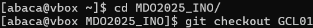

# Sprawozdanie 1

# Pierwsze zajęcia - Wprowadzenie, Git, Gałęzie, SSH

## Logowanie do serwera


## Klonowanie repozytorium za pomocą HTTPS


## Generowanie dwóch kluczy SSH


## Klonowanie repozytorium z wykorzystaniem SSH


## Aktywacja weryfikacji dwuetapowej (2FA)


## Ustawienie klucza SSH jako metody autoryzacji w GitHub


## Utworzenie gałęzi „AB414799” na podstawie „GCL01”



## Tworzenie skryptu, nadawanie uprawnień i umieszczanie go w katalogu hooków Git


## Konfiguracja Git Hooka do sprawdzania wiadomości commitów
```bash
    #!/bin/bash
    REQUIRED_PREFIX="AB414799"
    MESSAGE=$(cat "$1")

    if [[ ! "$MESSAGE" =~ ^$REQUIRED_PREFIX ]]; then
        echo "❌ Commit message musi zaczynać się od: $REQUIRED_PREFIX"
        exit 1
    fi
```
## Dodawanie plików do kontroli wersji w Git


## Tworzenie commita w repozytorium


## Wysyłanie zmian do GitHub


## Scalanie gałęzi „AB414799” z „GCL01”


# Drugie zajęcia - Git, Docker
## Instalacja Dockera `sudo dnf install -y docker`


## Pobieranie obrazów „hello-world”, „busybox”, „ubuntu” i „mysql”

## Uruchamianie kontenera na bazie „busybox”

## Interaktywne podłączenie do kontenera i sprawdzenie wersji


## Start systemu „ubuntu” i analiza procesów Dockera


## Aktualizacja pakietów `ubuntu`:


## Tworzenie pliku `Dockerfile`:
```Dockerfile
FROM ubuntu:latest
RUN apt update && apt install -y git
WORKDIR /repo
RUN git clone https://github.com/InzynieriaOprogramowaniaAGH/MDO2025_INO.git /repo
CMD ["bash"]
```
## Budowanie obrazu z pliku `Dockerfile`
```bash
docker build -t new_image .
```


## Uruchamianie kontenera na podstawie nowego obrazu
```bash
docker run -it new_image
```

#### Repozytorium przedmiotowe zostało pomyślnie sklonowane.
#
## Sprawdzenie uruchomionych kontenerów i ich usuwanie


## Wyświetlanie dostępnych obrazów i ich usuwanie


## Umieszczenie pliku „Dockerfile” w katalogu „Sprawozdanie1”


# Trzecie zajęcia - Dockerfiles, kontener jako definicja etapu

## Oprogramowanie: cJSON

## Klonowanie repozytorium


## Instalacja zależności


## Budowa projektu


## Testowanie projektu


## Uruchomienie kontenera Ubuntu i instalacja wymaganych zależności


## Powtórzenie całego poprzedniego procesu na tym kontenerze


## Tworzenie Dockerfile.build
```Dockerfile.build
FROM ubuntu:latest
RUN apt update && apt install -y git cmake gcc g++ make
WORKDIR /app
RUN git clone https://github.com/DaveGamble/cJSON.git .
RUN mkdir build && cd build && cmake .. && make
```
## Budowa tego obrazu


## Tworzenie Dockerfile.test
```Dockerfile.test
FROM cjson_builder

WORKDIR /app/build
CMD ["ctest"]
```
## Budowa tego obrazu


## Uruchomienie testów


## Działające obrazy


