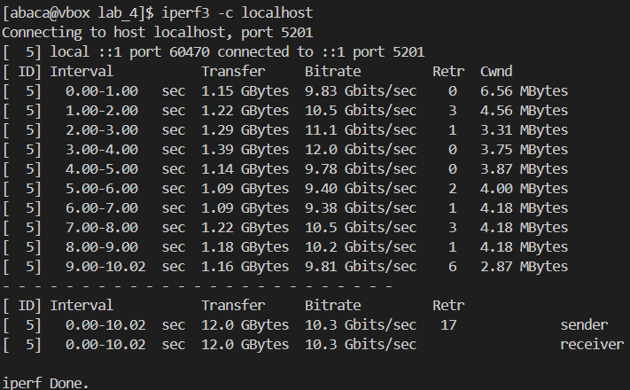

# Sprawozdanie 1

# Pierwsze zajęcia - Wprowadzenie, Git, Gałęzie, SSH

## Logowanie do serwera


## Klonowanie repozytorium za pomocą HTTPS


## Generowanie dwóch kluczy SSH za pomocą komend poniżej
Inne niż RSA i jeden z nich został zabezpieczony hasłem


## Klonowanie repozytorium z wykorzystaniem SSH
Po ustawieniu klucza SSH repozytorium zostało sklonowane za pomocą protokołu SSH.


## Aktywacja weryfikacji dwuetapowej (2FA)


## Ustawienie klucza SSH jako metody autoryzacji w GitHub


## Utworzenie gałęzi „AB414799” na podstawie „GCL01”


## Tworzenie skryptu, nadawanie uprawnień i umieszczanie go w katalogu hooków Git


## Konfiguracja Git Hooka do sprawdzania wiadomości commitów
```bash
    #!/bin/bash
    REQUIRED_PREFIX="AB414799"
    MESSAGE=$(cat "$1")

    if [[ ! "$MESSAGE" =~ ^$REQUIRED_PREFIX ]]; then
        echo "❌ Commit message musi zaczynać się od: $REQUIRED_PREFIX"
        exit 1
    fi
```
## Dodawanie plików do kontroli wersji w Git


## Tworzenie commita w repozytorium


## Wysyłanie zmian do GitHub


## Scalanie gałęzi „AB414799” z „GCL01”


# Drugie zajęcia - Git, Docker
## Instalacja Dockera `sudo dnf install -y docker`
Docker został zainstalowany zgodnie z oficjalnymi instrukcjami, wykorzystując repozytorium dystrybucji.


## Pobieranie obrazów „hello-world”, „busybox”, „ubuntu” i „mysql”

## Uruchamianie kontenera na bazie „busybox”

## Interaktywne podłączenie do kontenera i sprawdzenie wersji


## Start systemu „ubuntu” i analiza procesów Dockera
Weryfikacja procesu PID 1 w kontenerze:


## Aktualizacja pakietów `ubuntu` komendą `apt update && apt upgrade -y`:


### Po tej czynności należało wyjść z kontenera poprzez komendę `exit`


## Tworzenie pliku `Dockerfile`:
```Dockerfile
FROM ubuntu:latest
RUN apt update && apt install -y git
WORKDIR /repo
RUN git clone https://github.com/InzynieriaOprogramowaniaAGH/MDO2025_INO.git /repo
CMD ["bash"]
```
## Budowanie obrazu z pliku `Dockerfile`
```bash
docker build -t new_image .
```


## Uruchamianie kontenera na podstawie nowego obrazu
```bash
docker run -it new_image
```

#### Repozytorium przedmiotowe zostało pomyślnie sklonowane.
#
## Sprawdzenie uruchomionych kontenerów i ich usuwanie


## Wyświetlanie dostępnych obrazów i ich usuwanie


## Umieszczenie pliku „Dockerfile” w katalogu „Sprawozdanie1”


# Trzecie zajęcia - Dockerfiles, kontener jako definicja etapu

### Oprogramowanie: cJSON

## Klonowanie repozytorium


## Instalacja zależności poprzez komendę
### `sudo dnf install gcc cmake make`
   - `sudo` → Uruchamia polecenie z uprawnieniami administratora.  
   - `dnf install` → Używa menedżera pakietów `dnf` do instalacji oprogramowania.  
   - `gcc` → Kompilator języka C/C++.  
   - `cmake` → Narzędzie do zarządzania procesem budowania oprogramowania.  
   - `make` → Narzędzie do kompilacji kodu na podstawie plików makefile.  


## Budowa projektu
### Stworzenie specjalnego folderu o nazwie `build` w któym wykonujemy dalsze czynności

### `cmake ..`
   - Konfiguruje projekt CMake, generując pliki makefile w katalogu nadrzędnym (`..`).
   **Używane do przygotowania środowiska kompilacji na podstawie plików CMakeLists.txt.**
     


### `make`
   - Kompiluje kod źródłowy zgodnie z plikami makefile wygenerowanymi przez CMake.
   **Uruchamia proces budowania projektu.**
     


## Testowanie projektu
### `ctest`
   - Uruchamia testy jednostkowe zdefiniowane w konfiguracji CMake.
   **Służy do automatycznego testowania skompilowanego kodu.**
     


## Uruchomienie kontenera Ubuntu w sposób interaktywny dzięki parametrowi -it i instalacja wymaganych zależności


## Powtórzenie całego poprzedniego procesu budowy i testu na tym kontenerze


### Po wyjściu z kontenera ubuntu należało zautomatyzować proces poprzez utworzenie dwóch plików Dockerfile

## Tworzenie Dockerfile.build
```Dockerfile.build
FROM ubuntu:latest
RUN apt update && apt install -y git cmake gcc g++ make
WORKDIR /app
RUN git clone https://github.com/DaveGamble/cJSON.git .
RUN mkdir build && cd build && cmake .. && make
```
## Budowa tego obrazu
### `docker build -t cjson_tester -f Dockerfile.test`
   - `-t cjson_builder` → Nadaje nazwę i tag obrazowi Docker (np. `cjson_builder`).
   - `-f Dockerfile.build` → Określa konkretny plik Dockerfile do użycia zamiast domyślnego (`Dockerfile`).
   **Stosowane, aby zbudować obraz Dockera na podstawie niestandardowego pliku konfiguracji.**
     


## Tworzenie Dockerfile.test
```Dockerfile.test
FROM cjson_builder

WORKDIR /app/build
CMD ["ctest"]
```
## Budowa tego obrazu
### `docker build -t cjson_tester -f Dockerfile.test`
   - `-t cjson_tester` → Nadaje nazwę i tag obrazowi Docker (np. `cjson_tester`).
   - `-f Dockerfile.test` → Określa konkretny plik Dockerfile do użycia zamiast domyślnego (`Dockerfile`).
   **Stosowane, aby zbudować obraz Dockera na podstawie niestandardowego pliku konfiguracji.**
     


## Uruchomienie testów
### `docker run -t cjson_tester`


## Działające obrazy


# Czwarte zajęcia - Dodatkowa terminologia w konteneryzacji, instancja Jenkins

## Zachowywanie stanu

### Tworzenie woluminów zostało zrealizowane za pomocą polecenia `docker volume create`


### Uruchomienie kontenera z zamontowanymi woluminami
Komenda uruchamia kontener z obrazu ubuntu. Wolumin input_vol jest montowany do katalogu /input w kontenerze, a output_vol do katalogu /output, co pozwala na wymianę danych między kontenerem a hostem w tych lokalizacjach.


### Instalacja zależności poprzez `apt update && apt install -y cmake gcc g++ make` a także `apt update && apt install -y meson ninja-build`


### Aby sklonować repozytorium na hoście, zastosowałem polecenie docker volume inspect, które dostarcza szczegółowych informacji o woluminie, w tym wskazuje lokalizację jego danych na hoście


### Sklonowanie repozytorium do katalogu, który zawiera dane wejściowego woluminu


### Budowa programu w katalogu woluminu wejściowego
 Meson to system kompilacji o wysokiej wydajności, który używa pliku meson.build do efektywnego kompilowania kodu źródłowego.


### Przeniesienie plików wynikowych do katalogu wyjściowego, a także zobaczenie poprawności z poziomu hosta


### Powtórzenie powyższych kroków ale z użyciem gita


Klonowanie repozytorium


Reszta kroków bez zmian

### Aby zautomatyzować ten proces moglibyśmy tu użyć pliku Dockerfile, które wykorzystał by opcję RUN --mount

## Eksponowanie portu

### W celu uruchomienia serwera iperf wykorzystano publicznie dostępny na DockerHub obraz networkstatic/iperf3. Port na którym został utworzony serwer to 5201, na którym od razu nasłuchuje


### Sprawdzenie IP kontenera komendą `docker inspect iperf_server | grep IP`


### Utworzono nowy kontener i nawiązano połączenie z serwerem, wykorzystując adres IP kontenera, na którym serwer iperf nasłuchuje.


### Kolejnym krokiem było utworzenie sieci Docker za pomocą `docker network create`


### Zrobiłem nowy serwer w tej sieci 


### Nawiązanie połączenia z systemu Fedora


### Zatrzymanie i usunięcie serwera


### Po usunięciu utworzono nowy serwer


### Zainstalowanie narzędzia iperf3


### Połączenie z hosta



### Z systemu Windows nawiązałem połączenie z serwerem iperf, używając komendy `.\iperf3.exe -c 192.168.56.1` na porcie 5201 do tego najpierw musiałem przekierować porty na maszynie wirtualnej


Aby to wykonać, należało wcześniej pobrać iperf3. Ja to zrobiłem za pomocą tej instrukcji: https://medium.com/@OkoloPromise/how-to-install-iperf3-on-windows-10-837d2fefcd0e


### Za pomocą komendy `docker logs iperf_server` zostały sprawdzone logi serwera
Nie wystąpiły żadne problemy z połączeniem, jak pokazują logi. Transfer danych pomiędzy hostem a serwerem jest dużo szybszy niż pomiędzy serwerem a systemem Windows, co jest zrozumiałe, ponieważ host i serwer działają na tej samej maszynie wirtualnej.


---
## Instalacja Jenkinsa

### Zważając na to, że kończę to sprawozdanie po labach 5, instaluje jenkinsa tak jak jest w instrukcji do laboratoriów numer 5 korzystając z intrukcji instalacji pod tym linkiem:
### https://www.jenkins.io/doc/book/installing/docker/

### Sieć o nazwie jenkins została utworzona przed rozpoczęciem procesu instalacji.


### Kolejnym krokiem było utworzenie kontenera na podstawie obrazu `docker:dind`, wykorzystując do tego poniższe polecenie.


### W dalszej kolejności przygotowano plik Dockerfile, który generuje spersonalizowany obraz oparty na oficjalnym obrazie Jenkinsa. Jego zawartość została zaczerpnięta z dokumentacji Jenkinsa.

```
FROM jenkins/jenkins:2.492.2-jdk17
USER root
RUN apt-get update && apt-get install -y lsb-release ca-certificates curl && \
    install -m 0755 -d /etc/apt/keyrings && \
    curl -fsSL https://download.docker.com/linux/debian/gpg -o /etc/apt/keyrings/docker.asc && \
    chmod a+r /etc/apt/keyrings/docker.asc && \
    echo "deb [arch=$(dpkg --print-architecture) signed-by=/etc/apt/keyrings/docker.asc] \
    https://download.docker.com/linux/debian $(. /etc/os-release && echo \"$VERSION_CODENAME\") stable" \
    | tee /etc/apt/sources.list.d/docker.list > /dev/null && \
    apt-get update && apt-get install -y docker-ce-cli && \
    apt-get clean && rm -rf /var/lib/apt/lists/*
USER jenkins
RUN jenkins-plugin-cli --plugins "blueocean docker-workflow"
```

### W dalszej części procesu przystąpiono do budowy obrazu komendą `docker build -t myjenkins-blueocean:2.492.3-1 .`


### Na bazie przygotowanego obrazu uruchomiono kontener za pomocą poniższego polecenia.


### Po stronie hosta, na zakończenie możliwe było przejście do ekranu logowania dostępnego pod adresem localhost:8081, z wykorzystaniem portu 8081. Zostało skonfigurowane przekierowanie portów z lokalnego komputera na maszynę wirtualną.


### Pierwsze logowanie zostało zrobione ale nie zarejestrowane dlatego jestem już na ekranie logowania


