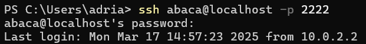
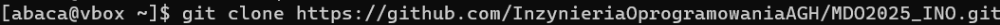
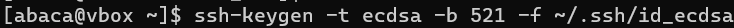
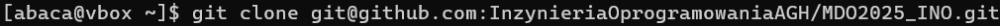
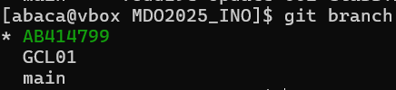
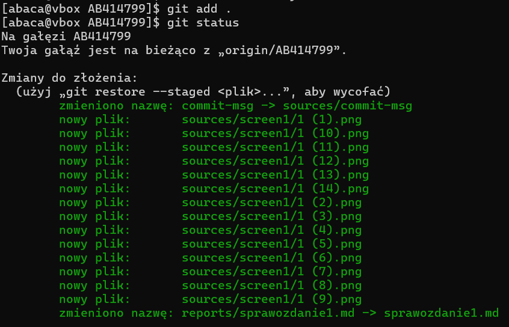
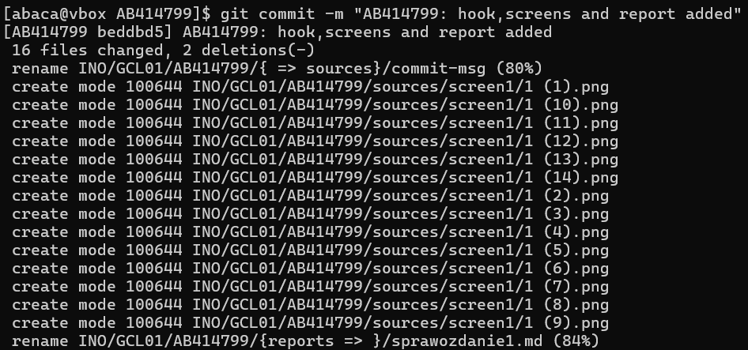

# Sprawozdanie - Zajęcia 01

## Zalogowanie się na serwerze


## Sklonowanie repozytorium przedmiotowego za pomocą HTTPS 


## Tworzenie dwóch kluczy SSH



## Sklonowanie repozytorium za pomocą protokołu SSH


## Konfiguracja weryfikacji dwuetapowej (2FA)


## Konfiguracja klucza SSH jako metody dostępdu do GitHub


## Utworzenie gałęzi 'AB414799' wychodzącej z gałęzi GCL01




## Pisanie skryptu, nadanie uprawnień do jego uruchamiania oraz umieszczenie go w katalogu ~/MDO2025_INO/.git/hooks/


## Git Hook
```bash
    #!/bin/bash
    REQUIRED_PREFIX="AB414799"
    MESSAGE=$(cat "$1")

    if [[ ! "$MESSAGE" =~ ^$REQUIRED_PREFIX ]]; then
        echo "❌ Commit message musi zaczynać się od: $REQUIRED_PREFIX"
        exit 1
    fi
```
## Dodanie plików do śledzenia przez Git'a


## Wykonanie commita


## Wysłanie zmian na GitHub'a


## Wciągnięcie gałęzi 'AB414799' do gałęzi grupowej GCL01


