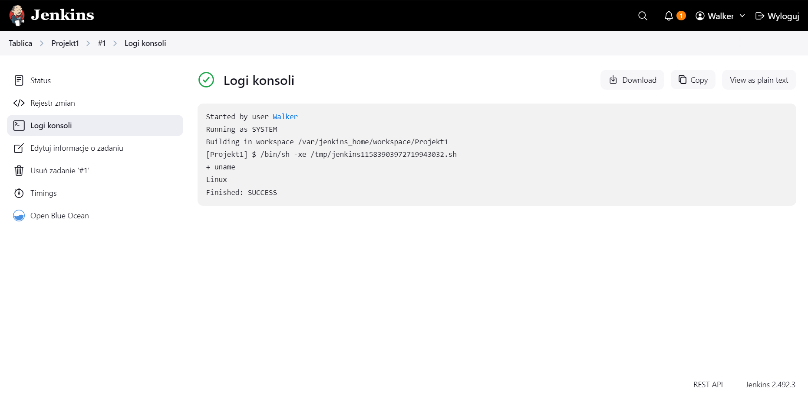
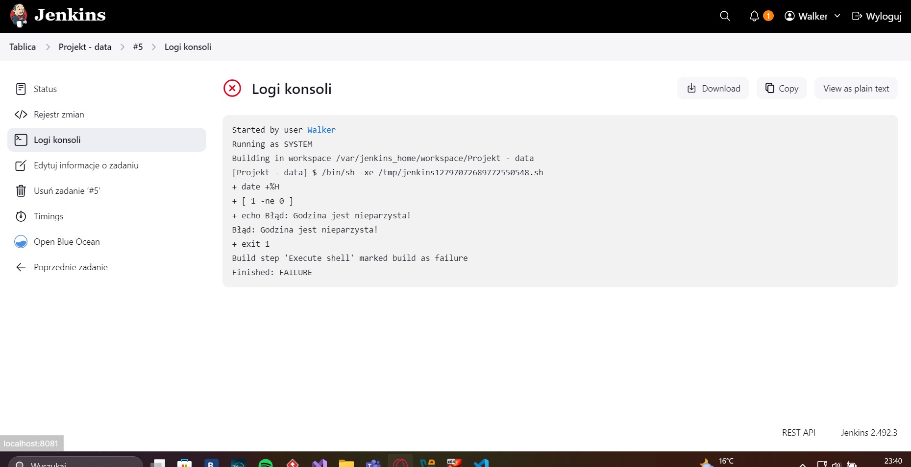
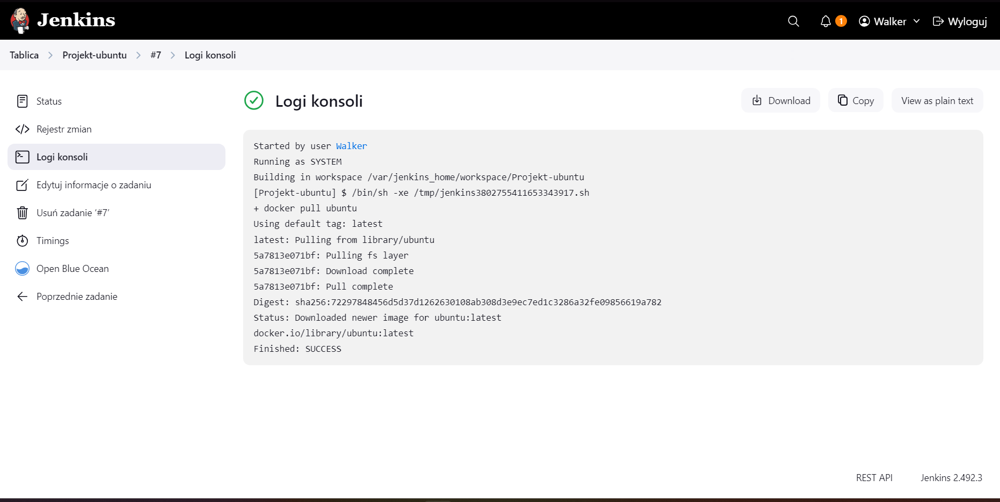

# Sprawozdanie 2

# Piąte zajęcia - Pipeline, Jenkins, izolacja etapów

## Przygotowanie instancji jenkinsa

### Do utworzenia instancji jenkinsa korzystałem z intrukcji instalacji pod tym linkiem: 
### https://www.jenkins.io/doc/book/installing/docker/
Kroki zostały już wykonane w ramach poprzeniego sprawozdania ale je tutaj przytoczę

### Sieć o nazwie jenkins została utworzona przed rozpoczęciem procesu instalacji.


### Kolejnym krokiem było utworzenie kontenera na podstawie obrazu `docker:dind`, wykorzystując do tego poniższe polecenie.


### W dalszej kolejności przygotowano plik Dockerfile, który generuje spersonalizowany obraz oparty na oficjalnym obrazie Jenkinsa. Jego zawartość została zaczerpnięta z dokumentacji Jenkinsa.

```
FROM jenkins/jenkins:2.492.2-jdk17
USER root
RUN apt-get update && apt-get install -y lsb-release ca-certificates curl && \
    install -m 0755 -d /etc/apt/keyrings && \
    curl -fsSL https://download.docker.com/linux/debian/gpg -o /etc/apt/keyrings/docker.asc && \
    chmod a+r /etc/apt/keyrings/docker.asc && \
    echo "deb [arch=$(dpkg --print-architecture) signed-by=/etc/apt/keyrings/docker.asc] \
    https://download.docker.com/linux/debian $(. /etc/os-release && echo \"$VERSION_CODENAME\") stable" \
    | tee /etc/apt/sources.list.d/docker.list > /dev/null && \
    apt-get update && apt-get install -y docker-ce-cli && \
    apt-get clean && rm -rf /var/lib/apt/lists/*
USER jenkins
RUN jenkins-plugin-cli --plugins "blueocean docker-workflow"
```

### W dalszej części procesu przystąpiono do budowy obrazu komendą `docker build -t myjenkins-blueocean:2.492.3-1 .`


### Na bazie przygotowanego obrazu uruchomiono kontener za pomocą poniższego polecenia.


### Po stronie hosta, na zakończenie możliwe było przejście do ekranu logowania dostępnego pod adresem localhost:8081, z wykorzystaniem portu 8081. Zostało skonfigurowane przekierowanie portów z lokalnego komputera na maszynę wirtualną.


### Pierwsze logowanie zostało zrobione ale nie zarejestrowane dlatego jestem już na ekranie logowania


## Zadanie wstępne: uruchomienie

### Aby utworzyć projekty, skorzystałem z opcji Nowy projekt, która znajduje się po lewej stronie ekranu.


### Po jej wybraniu wprowadziłem nazwę projektu i określiłem jego typ jako polecenie do wykonania w konsoli. Na początku należało wyświetlić informacje o systemie, co zrealizowałem za pomocą komendy `uname`.



### Następniew kolejnym zadaniu stworzyłem skrypt w Bashu, który sprawdza, czy godzina jest liczbą parzystą. W przypadku, gdy godzina jest nieparzysta, skrypt zgłasza błąd i kończy swoje działanie.



### Skrypt:
 ```
if [ $(( $(date +%H) % 2 )) -ne 0 ]; then
  echo "Błąd: Godzina jest nieparzysta!"
  exit 1
else
  echo "Godzina jest parzysta, wszystko OK."
fi
 ```

### Warto zaznaczyć, że skrypt sprawdza liczbę godzin, a nie minut.

### Trzecie zadanie testowe polegało na sprawdzeniu połączenia z internetem. Do tej czynności należało pobrać obraz ubuntu za pomocą komendy `docker pull ubuntu`.


## Zadanie wstępne: obiekt typu pipeline

### Pipeline to zautomatyzowany ciąg kroków (np. budowania, testowania i wdrażania), który umożliwia ciągłą integrację i dostarczanie oprogramowania (CI/CD).

### Po utworzeniu obiektu typu pipeline wpisałem do niego komendy, które zajmują się klonowaniem repozytorium przedmiotu i zmienia gałąź na moją. Po tej czynności następuje budowa obrazu Dockera dla repozytorium użytego podczas pracy w pierwszym sprawozdaniu. Do tego wykorzystałem plik `Dockerfile.build`, który został stworzony wcześniej. 

### Pipeline:
```
pipeline {
    agent any

    stages {
        stage('Klonowanie repo') { 
            steps {
                git branch: 'AB414799', url: 'https://github.com/InzynieriaOprogramowaniaAGH/MDO2025_INO.git'
            }
        }

        stage('Budowanie obrazu buildera') {
            steps {
                dir ("INO/GCL01/AB414799/Sprawozdanie2/cJSON-dockerfiles")
                {
                    script {
                        docker.build('cjson_builder', '-f Dockerfile.build .')
                    }
                }
            }
        }
    }
}
```
### A to są wyniki:


### Sam w sobie proces przechodził całkiem długo ze względu na to, że wszystkie pakiety i zależności musiały się pobrać

#### [Logi z konsoli pipeline](logs/test_pipeline_logs.txt)

### Drugie wystartowanie znacznie szybsze:


## Dołączenie etapu testów do pipeline

### Aby dołożyć etap z wykonywaniem testu użyłem `Dockerfile.test`, który również został stworzony w ramach poprzeniego sprawozdania. Wykorzystałem ten plik do tworzenia kontenera na podstawie obrazu `cjson_tester` i uruchomienia testów. Wyniki testów są zapisywane w pliku logi_z_testow.log, które są póżniej publikowane.

### Zmiany w skrypcie pipeline:
```
pipeline {
    agent any

    stages {
        stage('Klonowanie repozytorium') { 
            steps {
                git branch: 'AB414799', url: 'https://github.com/InzynieriaOprogramowaniaAGH/MDO2025_INO.git'
            }
        }

        stage('Budowanie obrazu buildera') {
            steps {
                dir ("INO/GCL01/AB414799/Sprawozdanie2/cJSON-dockerfiles")
                {
                    script {
                        docker.build('cjson_builder', '-f Dockerfile.build .')
                    }
                }
            }
        }

        stage('Budowanie obrazu testowego') {
            steps {
                dir ("INO/GCL01/AB414799/Sprawozdanie2/cJSON-dockerfiles")
                {
                    script {
                        docker.build('cjson_tester', '-f Dockerfile.test .')
                    }
                }
            }
        }

        stage('Test') {
            steps {
                dir ("INO/GCL01/AB414799/Sprawozdanie2")
                {
                    sh "mkdir -p artefakty"

                    sh """
                        docker run --rm cjson_tester | tee artefakty/logi_z_testow.log
                    """
                }    
            }
        }

        stage('Publikacja logów') {
            steps {
                archiveArtifacts artifacts: 'INO/GCL01/AB414799/Sprawozdanie2/artefakty/logi_z_testow.log', fingerprint: true
            }
        }
    }
}
```

### Opcja `fingerprint: true` pozwala Jenkinsowi śledzić artefakty między buildami dzięki unikalnemu identyfikatorowi (hashowi) pliku.


#### [Wyniki](logs/logi_z_testow.log)

## Kompletny pipeline

### Ostatnim krokiem było dołączenie dwóch etapów: `deploy` i `publish`, a także lekko przerobić aktualny pipeline. Po połączeniu wszystkiego powstanie gotowy `Jenkinsfile`.