# Sprawozdanie 3

# Ósme zajęcia - Automatyzacja i zdalne wykonywanie poleceń za pomocą Ansible

## Instalacja zarządcy Ansible

### Utworzenie maszyny `ansible-target`

### Stworzyłem nową maszynę wirtualną z identycznym systemem operacyjnym jak na głównym hoście. Przydzieliłem jej 20 GB przestrzeni dyskowej, co może być nieco na wyrost, ale dzięki dynamicznemu przydziałowi miejsca nie jest ona od razu w pełni zajmowana. W trakcie instalacji skonfigurowałem użytkownika o nazwie `ansible` i nadałem maszynie nazwę `ansible-target`.


### Na tej maszynie pobrałem wymagane oprogramowanie komendą:

```bash
sudo dnf install -y tar openssh-server
```

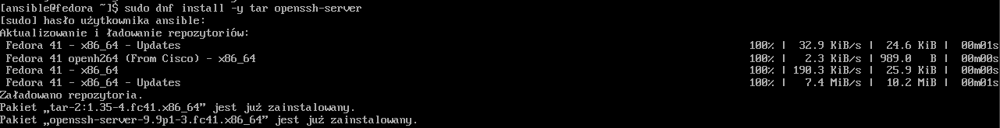

### Po tej części została wykonana migawka maszyny na Virtualboxie

## Ansible - instalacja

### Na maszynie głównej został zainstalowany Ansible komendą

```bash
sudo dnf install -y ansible
```


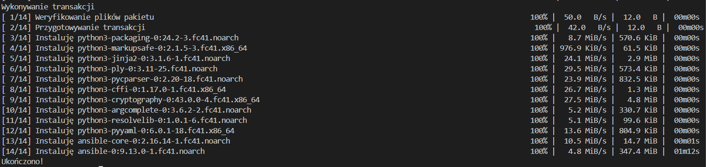

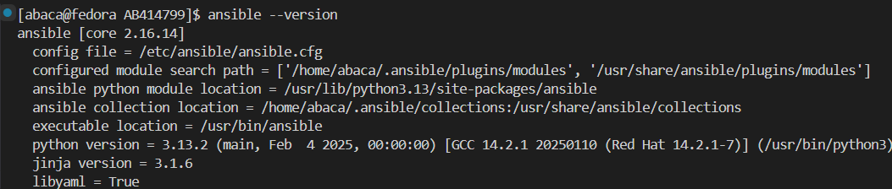

### W celu możliwości komunikacji między maszynami, zmodyfikowałem plik `/etc/hosts` na maszynach

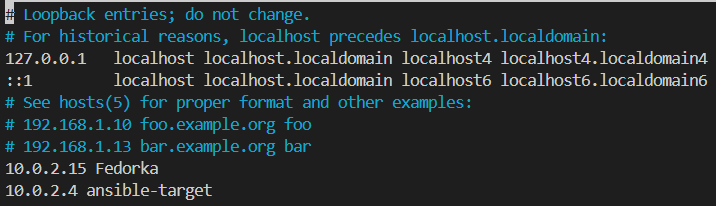

### Sygnał działa 

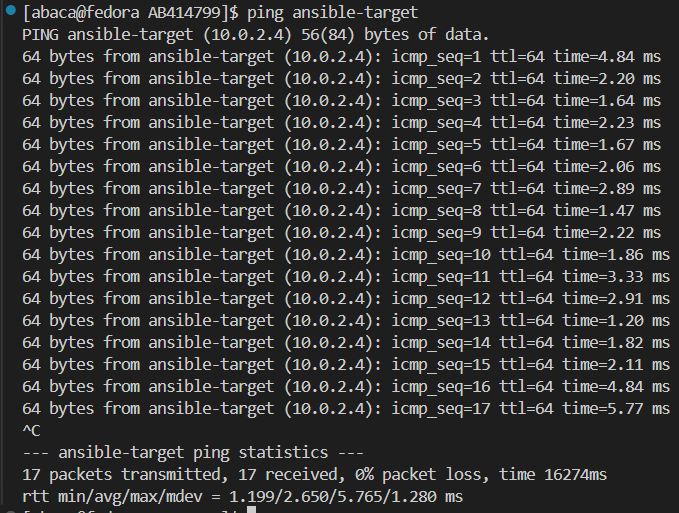

### Następnym krokiem było utworzenie kluczu SSH, specjalnie dla Ansible

```bash
ssh-keygen -t ed25519 -f ~/.ssh/id_ansible -C "ansible key"
```

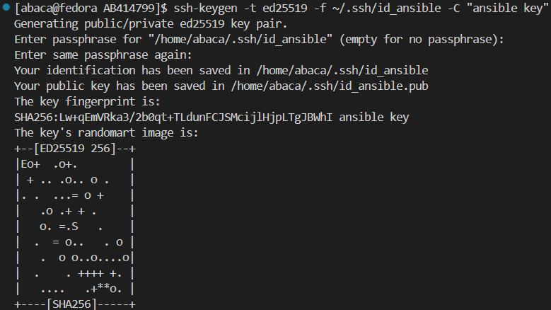

### I przy użyciu `ssh-copy-id` skopiowałem ten klucz na maszynę `ansible-target`

```bash
ssh-copy-id -i ~/.ssh/id_ansible.pub ansible@10.0.2.4
```

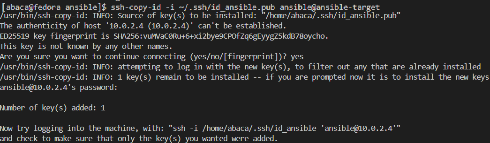

## Inwentaryzacja

### Stworzenie pliku inwentaryzacji

### Po upewnieniu się, że połączenie między maszynami działa prawidłowo, utworzyłem plik inwentaryzacji. W katalogu `ansible` stworzyłem plik inventory.ini, w którym — zgodnie z zaleceniami prowadzącego — zdefiniowałem dwie grupy: Orchestrators i Endpoints, przypisując do nich odpowiednie nazwy maszyn wirtualnych.

`inventory.ini`:

```
[Orchestrators]
Fedorka ansible_connection=local

[Endpoints]
ansible-target ansible_user=ansible ansible_ssh_private_key_file=~/.ssh/id_ansible ansible_become=yes ansible_become_method=sudo
```
Miałem jakiś problem z nim dlatego taka rozszerzona wersja.

### Testowe wykonanie zapytania `ping` do maszyn za pomocą komendy:

```bash
ansible all -i inventory.ini -m ping
```

### A tu jej wynik:

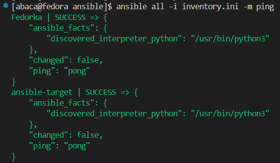

## Zdalne wykonanie procedur

### Mój pierwszy playbook testujący połączenie

`playbook.yaml`:

```yaml
- name: FirstPlaybook
  hosts: all
  become: true
  tasks:
   - name: Ping my hosts
     ansible.builtin.ping:

   - name: Print message
     ansible.builtin.debug:
       msg: HelloWorld
```

### Komenda wykonawcza

```bash
ansible-playbook -i inventory.ini playbook.yaml --ask-become-pass
```

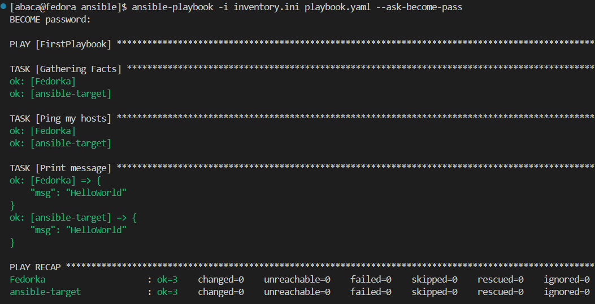

### Docelowy playbook zawierający wszystkie wymagane rzeczy

```yaml
- name: FirstPlaybook
  hosts: all
  become: true
  tasks:
   - name: Ping my hosts
     ansible.builtin.ping:

   - name: Copy inventory to Endpoint
     ansible.builtin.copy:
      src: inventory.ini
      dest: /home/ansible/inventory_copied
     when: "'ansible-target' in inventory_hostname"

   - name: Ping after copy
     ansible.builtin.ping:

   - name: Update system packages
     ansible.builtin.dnf:
      name: "*"
      state: latest
     when: "'ansible-target' in inventory_hostname"

   - name: Restart sshd
     ansible.builtin.service:
      name: sshd
      state: restarted
     when: "'ansible-target' in inventory_hostname"

   - name: Restart rngd
     ansible.builtin.service:
      name: rngd
      state: restarted
     ignore_errors: yes 
     when: "'ansible-target' in inventory_hostname"
```

### Analogiczne uruchomienie

```bash
ansible-playbook -i inventory.ini playbook.yaml --ask-become-pass
```
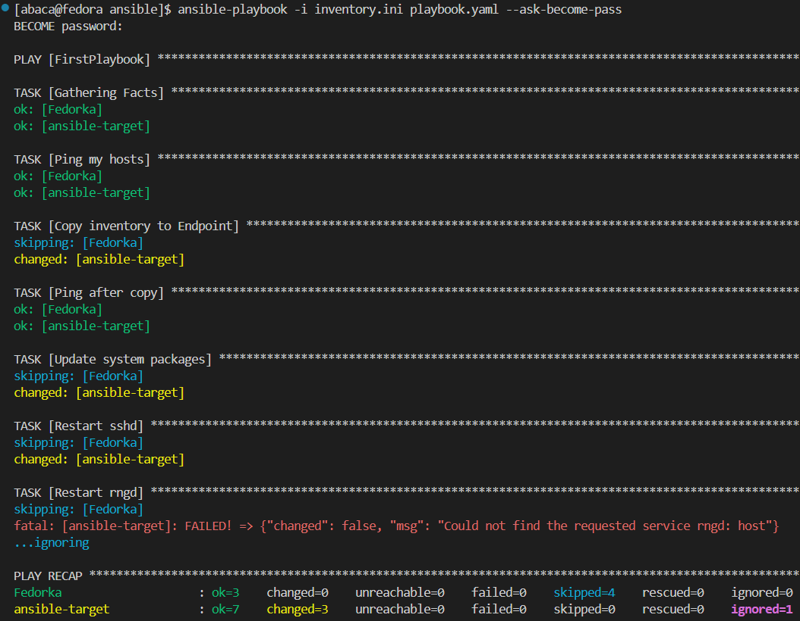

## Zarządzanie stworzonym artefaktem

### W tej części zadania zainstalowałem bibliotekę przygotowaną podczas wcześniejszych zajęć wewnątrz kontenera działającego na maszynie ansible-target. Cały proces został zautomatyzowany za pomocą playbooka Ansible oraz wykorzystania struktury opartej na rolach.


### Utworzenie roli, korzystając z narzędzia `ansible-galaxy`, o nazwie `cjson` w katalogu `ansible`

```bash
ansible-galaxy init cjson
```

### Po utworzeniu struktury roli, do katalogu cjson/files skopiowałem dwa pliki z wcześniejszych zajęć: cjson.rpm oraz main.c, zawierające odpowiednio przygotowaną bibliotekę oraz kod źródłowy programu w języku C.

### Następnie przystąpiłem do edycji pliku main.yaml, znajdującego się w katalogu cjson/tasks/. Jego zadaniem było zautomatyzowanie całego procesu, który obejmował:

#### -przesłanie przygotowanych artefaktów (cjson.rpm i main.c) na maszynę ansible-target,

#### -instalację Dockera wraz z wymaganymi zależnościami,

### -uruchomienie kontenera z systemem Fedora,

#### -zainstalowanie biblioteki cjson z pliku .rpm wewnątrz kontenera,

#### -kompilację programu napisanego w języku C z użyciem tej biblioteki,

#### -uruchomienie skompilowanego programu oraz pobranie jego wyniku w celu weryfikacji działania.


### Całość operacji została przeprowadzona w sposób zautomatyzowany dzięki wykorzystaniu mechanizmu ról w Ansible.

`cjson/tasks/main.yaml`:

```yaml
---
- name: Create artifacts directory
  become: yes
  file:
    path: /home/ansible/cjson
    state: directory
    owner: ansible
    group: ansible
    mode: '0755'

- name: Copy artifacts to target
  copy:
    src: "{{ item }}"
    dest: /home/ansible/cjson/
    mode: '0644'
  loop:
    - files/cjson.rpm
    - files/main.c

- name: Install python3-requests
  ansible.builtin.dnf:
    name: python3-requests
    state: present

- name: Install Docker
  become: yes
  dnf:
    name: docker
    state: present
  
- name: Ensure Docker is started
  become: yes
  service:
    name: docker
    state: started
    enabled: true

- name: Add ansible to docker group
  user:
    name: ansible
    groups: docker
    append: true

- name: Start fedora container
  community.docker.docker_container:
    name: cjson
    image: fedora:41
    state: started
    command: sleep infinity
    volumes:
      - /home/ansible/cjson:/tmp:z

- name: Install gcc, cjson and tools
  community.docker.docker_container_exec:
    container: cjson
    command: dnf install -y gcc make /tmp/cjson.rpm

- name: Compile source file
  community.docker.docker_container_exec:
    container: cjson
    command: gcc -o /tmp/example /tmp/main.c -lcjson

- name: Run program
  community.docker.docker_container_exec:
    container: cjson
    command: bash -c "LD_LIBRARY_PATH=/usr/local/lib64 /tmp/example"
  register: result

- name: Print the result of the program
  debug:
    var: result.stdout
```

### Uruchomienie roli za pomocą osobnego playbooka `playbook-cjson.yaml`:

```yaml
- name: Deploy CJSON in container
  hosts: ansible-target
  become: true
  roles:
    - cjson
```

### Uruchomienie playbooka

```bash
asnible-playbook -i inventory.ini playbook-cjson.yaml --ask-become-pass
```

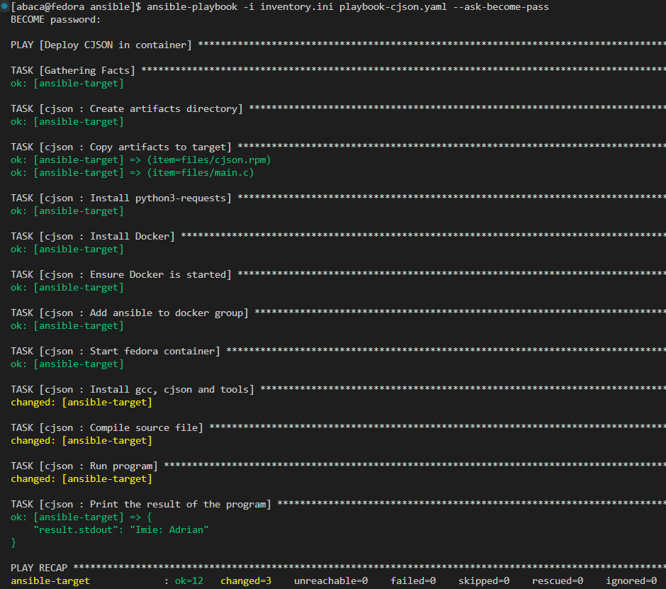

# Dziewiąte zajęcia - Pliki odpowiedzi dla wdrożeń nienadzorowanych

