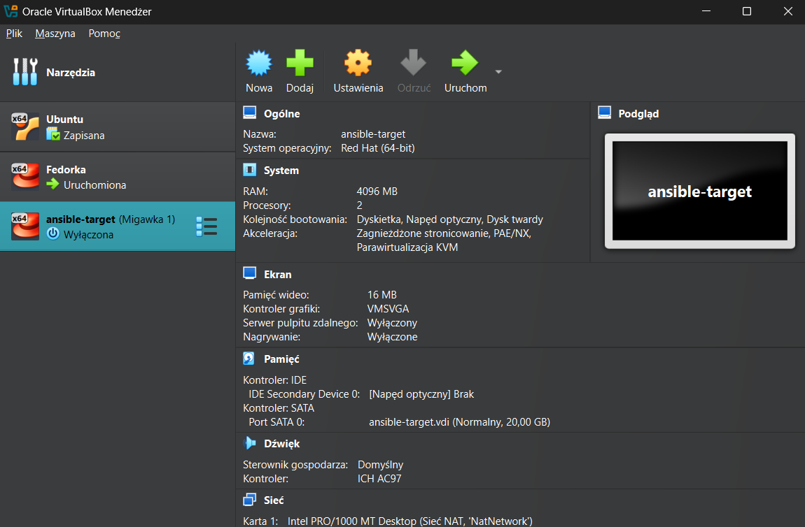
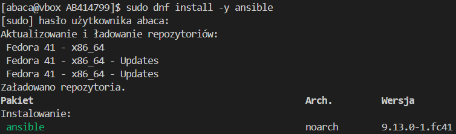
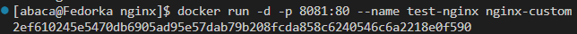
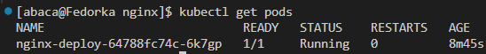

# Sprawozdanie 3

# Ósme zajęcia - Automatyzacja i zdalne wykonywanie poleceń za pomocą Ansible

## Instalacja zarządcy Ansible

### Utworzenie maszyny `ansible-target`

### Stworzyłem nową maszynę wirtualną z identycznym systemem operacyjnym jak na głównym hoście. Przydzieliłem jej 20 GB przestrzeni dyskowej, co może być nieco na wyrost, ale dzięki dynamicznemu przydziałowi miejsca nie jest ona od razu w pełni zajmowana. W trakcie instalacji skonfigurowałem użytkownika o nazwie `ansible` i nadałem maszynie nazwę `ansible-target`.



### Na tej maszynie pobrałem wymagane oprogramowanie komendą:

```bash
sudo dnf install -y tar openssh-server
```


### Po tej części została wykonana migawka maszyny na Virtualboxie

## Ansible - instalacja

### Na maszynie głównej został zainstalowany Ansible komendą

```bash
sudo dnf install -y ansible
```




### W celu możliwości komunikacji między maszynami, zmodyfikowałem plik `/etc/hosts` na maszynach


### Sygnał działa 


### Następnym krokiem było utworzenie kluczu SSH, specjalnie dla Ansible

```bash
ssh-keygen -t ed25519 -f ~/.ssh/id_ansible -C "ansible key"
```


### I przy użyciu `ssh-copy-id` skopiowałem ten klucz na maszynę `ansible-target`

```bash
ssh-copy-id -i ~/.ssh/id_ansible.pub ansible@10.0.2.4
```


## Inwentaryzacja

### Stworzenie pliku inwentaryzacji

### Po upewnieniu się, że połączenie między maszynami działa prawidłowo, utworzyłem plik inwentaryzacji. W katalogu `ansible` stworzyłem plik inventory.ini, w którym — zgodnie z zaleceniami prowadzącego — zdefiniowałem dwie grupy: Orchestrators i Endpoints, przypisując do nich odpowiednie nazwy maszyn wirtualnych.

`inventory.ini`:

```
[Orchestrators]
Fedorka ansible_connection=local

[Endpoints]
ansible-target ansible_user=ansible ansible_ssh_private_key_file=~/.ssh/id_ansible ansible_become=yes ansible_become_method=sudo
```
Miałem jakiś problem z nim dlatego taka rozszerzona wersja.

### Testowe wykonanie zapytania `ping` do maszyn za pomocą komendy:

```bash
ansible all -i inventory.ini -m ping
```

### A tu jej wynik:


## Zdalne wykonanie procedur

### Mój pierwszy playbook testujący połączenie

`playbook.yaml`:

```yaml
- name: FirstPlaybook
  hosts: all
  become: true
  tasks:
   - name: Ping my hosts
     ansible.builtin.ping:

   - name: Print message
     ansible.builtin.debug:
       msg: HelloWorld
```

### Komenda wykonawcza

```bash
ansible-playbook -i inventory.ini playbook.yaml --ask-become-pass
```


### Docelowy playbook zawierający wszystkie wymagane rzeczy

```yaml
- name: FirstPlaybook
  hosts: all
  become: true
  tasks:
   - name: Ping my hosts
     ansible.builtin.ping:

   - name: Copy inventory to Endpoint
     ansible.builtin.copy:
      src: inventory.ini
      dest: /home/ansible/inventory_copied
     when: "'ansible-target' in inventory_hostname"

   - name: Ping after copy
     ansible.builtin.ping:

   - name: Update system packages
     ansible.builtin.dnf:
      name: "*"
      state: latest
     when: "'ansible-target' in inventory_hostname"

   - name: Restart sshd
     ansible.builtin.service:
      name: sshd
      state: restarted
     when: "'ansible-target' in inventory_hostname"

   - name: Restart rngd
     ansible.builtin.service:
      name: rngd
      state: restarted
     ignore_errors: yes 
     when: "'ansible-target' in inventory_hostname"
```

### Analogiczne uruchomienie

```bash
ansible-playbook -i inventory.ini playbook.yaml --ask-become-pass
```


## Zarządzanie stworzonym artefaktem

### W tej części zadania zainstalowałem bibliotekę przygotowaną podczas wcześniejszych zajęć wewnątrz kontenera działającego na maszynie ansible-target. Cały proces został zautomatyzowany za pomocą playbooka Ansible oraz wykorzystania struktury opartej na rolach.


### Utworzenie roli, korzystając z narzędzia `ansible-galaxy`, o nazwie `cjson` w katalogu `ansible`

```bash
ansible-galaxy init cjson
```

### Po utworzeniu struktury roli, do katalogu cjson/files skopiowałem dwa pliki z wcześniejszych zajęć: cjson.rpm oraz main.c, zawierające odpowiednio przygotowaną bibliotekę oraz kod źródłowy programu w języku C.

### Następnie przystąpiłem do edycji pliku main.yaml, znajdującego się w katalogu cjson/tasks/. Jego zadaniem było zautomatyzowanie całego procesu, który obejmował:

#### -przesłanie przygotowanych artefaktów (cjson.rpm i main.c) na maszynę ansible-target,

#### -instalację Dockera wraz z wymaganymi zależnościami,

### -uruchomienie kontenera z systemem Fedora,

#### -zainstalowanie biblioteki cjson z pliku .rpm wewnątrz kontenera,

#### -kompilację programu napisanego w języku C z użyciem tej biblioteki,

#### -uruchomienie skompilowanego programu oraz pobranie jego wyniku w celu weryfikacji działania.


### Całość operacji została przeprowadzona w sposób zautomatyzowany dzięki wykorzystaniu mechanizmu ról w Ansible.

`cjson/tasks/main.yaml`:

```yaml
---
- name: Create artifacts directory
  become: yes
  file:
    path: /home/ansible/cjson
    state: directory
    owner: ansible
    group: ansible
    mode: '0755'

- name: Copy artifacts to target
  copy:
    src: "{{ item }}"
    dest: /home/ansible/cjson/
    mode: '0644'
  loop:
    - files/cjson.rpm
    - files/main.c

- name: Install python3-requests
  ansible.builtin.dnf:
    name: python3-requests
    state: present

- name: Install Docker
  become: yes
  dnf:
    name: docker
    state: present
  
- name: Ensure Docker is started
  become: yes
  service:
    name: docker
    state: started
    enabled: true

- name: Add ansible to docker group
  user:
    name: ansible
    groups: docker
    append: true

- name: Start fedora container
  community.docker.docker_container:
    name: cjson
    image: fedora:41
    state: started
    command: sleep infinity
    volumes:
      - /home/ansible/cjson:/tmp:z

- name: Install gcc, cjson and tools
  community.docker.docker_container_exec:
    container: cjson
    command: dnf install -y gcc make /tmp/cjson.rpm

- name: Compile source file
  community.docker.docker_container_exec:
    container: cjson
    command: gcc -o /tmp/example /tmp/main.c -lcjson

- name: Run program
  community.docker.docker_container_exec:
    container: cjson
    command: bash -c "LD_LIBRARY_PATH=/usr/local/lib64 /tmp/example"
  register: result

- name: Print the result of the program
  debug:
    var: result.stdout
```

### Uruchomienie roli za pomocą osobnego playbooka `playbook-cjson.yaml`:

```yaml
- name: Deploy CJSON in container
  hosts: ansible-target
  become: true
  roles:
    - cjson
```

### Uruchomienie playbooka

```bash
asnible-playbook -i inventory.ini playbook-cjson.yaml --ask-become-pass
```


# Dziewiąte zajęcia - Pliki odpowiedzi dla wdrożeń nienadzorowanych

## Kickstart

### Instalacja systemu

### Nie było potrzeby ponownej instalacji Fedory, ponieważ od początku semestru używałem jej jako głównego systemu operacyjnego na moim komputerze.

### Przygotowanie `anaconda-ks.cfg`

### Po zalogowaniu się na konto administratora skopiowałem plik odpowiedzi z lokalizacji /root/anaconda-ks.cfg do katalogu Sprawozdanie3, aby umożliwić jego wygodne udostępnienie na GitHubie. W dalszej kolejności wprowadziłem modyfikacje, uzupełniając go o niezbędne informacje dotyczące repozytoriów: 

```bash
url --mirrorlist=http://mirrors.fedoraproject.org/mirrorlist?repo=fedora-41&arch=x86_64
repo --name=update --mirrorlist=http://mirrors.fedoraproject.org/mirrorlist?repo=updates-released-f41&arch=x86_64
```

### Taki plik pomógł w pierwszej instalacji

## Instalacja fedory z kickstarta

### Tworząc nową maszynę wirtualną, w menu startowym instalatora wszedłem w tryb edycji GRUB, naciskając klawisz e, a następnie dodałem własny parametr instalacyjny do poleceń startowych:

```
inst.ks=http://raw.githubusercontent.com/InzynieriaOprogramowaniaAGH/MDO2025_INO/AB414799/INO/GCL01/AB414799/Sprawozdanie3/anaconda-ks.cfg
```


### Instalator kontynuował pracę w trybie graficznym, jednak większość opcji była nieaktywna — ich wartości zostały wcześniej zdefiniowane w pliku kickstart, dlatego nie było możliwości ich edycji.


### Po krótkiej chwili zaczęła się instalacja


### Po ponownym uruchomieniu systemu zalogowałem się, używając tych samych danych, co na pierwotnej instancji Fedory. 


### W kolejnym etapie rozbudowałem plik anaconda-ks.cfg, wprowadzając następujące elementy:

-reboot — by system automatycznie uruchamiał się ponownie po zakończeniu instalacji,

-network --hostname=fedora.local — w celu nadania maszynie własnej nazwy hosta,

-clearpart --all --initlabel — aby przed instalacją usunąć wszystkie istniejące partycje,

-autopart — by umożliwić automatyczne utworzenie nowego układu partycji.

### Sprawdzenie nazwy hosta


## Instalacja cJSON z wykorzystaniem pliku rpm

### Utworzenie repozytorium HTTP poprzez udostępnienie biblioteki w formie repozytorium YUM

### Do tego było potrzebny serwer Apache oraz narzędzie `createrepo`

```bash
sudo dnf install -y httpd createrepo
```


### Utworzenie katalogu

```bash
sudo mkdir -p /var/www/html/myrepo
sudo cp mycjson.rpm /var/www/html/myrepo/
cd /var/www/html/myrepo
createrepo .
```


### Reguły firewalla

```bash
sudo firewall-cmd --permanent --add-service=http
sudo firewall-cmd --reload
```


### Kolejnym krokiem była modyfikacja pliku /etc/httpd/conf/httpd.conf, w którym dostosowałem konfigurację serwera Apache, tak aby poprawnie obsługiwał linkowanie i udostępnianie zawartości lokalnego repozytorium.

```bash
<Directory"/var/www/html">
    Options +Indexes
    AllowOverride None
    Require all granted
<Directory>    
```

### Gdy już to zostało wykonane, repozytorium było już gotowe pod adresem:
```bash
http://localhost:8080/myrepo/
```


### Teraz trzeba było przerobić plik kickstart tak aby zawietał potrzebne nam rzeczy

### Własne repo:

```
repo --name=myrepo --baseurl=http://10.0.2.15:8080/myrepo/
```

### Pakiety:

```
%packages
@^custom-environment
gcc
curl
glibc
cjson
%end
```

### Dodatkowo utworzone sekcja `%post`, w której jest kompilacja i uruchomienie

```
%post --log=/tmp/postinstall.log --interpreter /bin/bash
exec > /dev/tty3 2>&1
chvt 3
echo "Start postinstall"
mkdir -p /opt/example

chown abaca:abaca /opt/example

#main.c z GitHuba
curl -o /opt/example/main.c https://raw.githubusercontent.com/InzynieriaOprogramowaniaAGH/MDO2025_INO/refs/heads/AB414799/INO/GCL01/AB414799/Sprawozdanie2/Complete_pipeline/main.c

# Skrypt po zalogowaniu
cat << 'EOF' > /etc/profile.d/run_example.sh
#!/bin/bash
if [ ! -f /opt/example/.compiled ]; then
    echo "Kompilacja main.c" >> /opt/example/autostart.log
    gcc /opt/example/main.c -o /opt/example/example -lcjson -I/usr/local/include/cjson -L/usr/local/lib64
    if [ -f /opt/example/example ]; then
        echo "Uruchamienie:" >> /opt/example/autostart.log
        LD_LIBRARY_PATH=/usr/local/lib64 /opt/example/example >> /opt/example/autostart.log 2>&1
    else
        echo "Brak powodzenia" >> /opt/example/autostart.log
    fi
    touch /opt/example/.compiled
fi
EOF

chmod +x /etc/profile.d/run_example.sh
%end
```

### Po zakończeniu instalacji zalogowałem się na utworzone konto użytkownika, a następnie przeanalizowałem log, aby upewnić się, że skrypt wykonał się poprawnie.


# Dziesiąte zajęcia - Wdrażanie na zarządzalne kontenery: Kubernetes (1)

## Instalacja klastra Kubernetes

### Instalacja minikube

### Minikube został zainstalowany zgodnie z wytycznymi zawartymi w oficjalnej dokumentacji dostępnej pod adresem: `https://minikube.sigs.k8s.io/docs/start/?arch=%2Fwindows%2Fx86-64%2Fstable%2F.exe+download`

### Wybrałem pakiet `.rpm` przeznaczony dla systemów Linux z architekturą x86-64.


### Instalacja kubectl

### Zgodnie z oficjalnymi wytycznymi dotyczącymi Minikube, przełączyłem się na dokumentację Kubernetes, aby zainstalować narzędzie kubectl, korzystając z instrukcji dostępnych pod adresem: https://kubernetes.io/docs/tasks/tools/install-kubectl-linux/

```
curl -LO "https://dl.k8s.io/release/$(curl -L -s https://dl.k8s.io/release/stable.txt)/bin/linux/amd64/kubectl"
```


### Następnie pobrałem plik, aby zweryfikować integralność pobranej binarki, i przeprowadziłem jej sprawdzenie pod kątem poprawności.


### Instalacja `kubectl`:

```
sudo install -o root -g root -m 0755 kubectl /usr/local/bin/kubectl
```


### Start minikube za pomocą komendy:

```
minikube start
```


### Dashboard

Do uruchomienia wykorzystałem komendę:

```
minikube dashboard
```
### W terminalu pojawił się adres URL w który wszedłem i ukazała się strona


### Kluczowe Obiekty Kubernetes

#### Pod – podstawowa jednostka uruchomieniowa w Kubernetes, zawierająca jeden lub więcej współdzielących zasoby kontenerów (takie jak sieć i system plików).

#### Deployment – kontroler odpowiadający za tworzenie, zarządzanie i utrzymywanie pożądanej liczby replik podów. Umożliwia łatwe wdrażanie zmian, skalowanie oraz cofanie aktualizacji.

#### Service – komponent zapewniający spójny sposób komunikacji z podami. Umożliwia stabilny dostęp za pomocą wirtualnego IP i DNS, obsługując zarówno ruch wewnątrz klastra, jak i połączenia z zewnątrz.

## Analiza posiadanego kontenera

### W poprzednich zadaniach pracowałem z biblioteką cJSON, którą kompilowałem i przygotowywałem jako pakiet `.rpm`. Tym razem, na potrzeby kolejnego etapu, postanowiłem wykorzystać serwer NGINX, wprowadzając do niego własne zmiany konfiguracyjne. W tym celu stworzyłem katalog nginx, w którym umieściłem pliki: `nginx.conf` i `Dockerfile`.

### `nginx.conf`:

```yaml
events {}

http {
    server {
        listen 80;
        location / {
            return 200 'Hello from my custom NGINX config!\n';
        }
    }
}
```

### `Dockerfile`:

```Dockerfile
FROM nginx:alpine
COPY nginx.conf /etc/nginx/nginx.conf
```


### Zbudowałem przygotowany obraz i uruchomiłem go lokalnie, przekierowując port 8081.



### Działanie mojej konfiguracji:


### Obraz w Docker Hubie

### Po testach lokalnych przeszedłem do etapu przygotowania obrazu do wdrożenia w Kubernetesie. W tym celu opublikowałem go w publicznym repozytorium Docker Hub, co umożliwia jego pobranie bezpośrednio z klastra.

```bash
docker tag my-nginx-custom walker70/nginx-custom
```

Następnie przesłałem obraz do Docker Hub za pomocą polecenia `docker push`:

```bash
docker push walker70/nginx-custom
```


### Obecność repozytorium, obrazu na Docker Hub, poprzez logowanie przez przeglądarkę:


## Uruchamianie oprogramowania

```bash
kubectl create deploymentnginx-deploy --image=walker70/nginex-custom
```

### Kolejnym krokiem było utworzenie zasobu Service o typie LoadBalancer, który zapewnia zewnętrzny punkt dostępu do aplikacji, przekierowując ruch sieciowy na port 80 bezpośrednio do odpowiednich podów.

```bash
kubectl expose deployment my-nginx-deploy --type=LoadBalancer --port=80
```


### Działanie poda



## Przekucie wdrożenia manualnego w plik wdrożenia (wprowadzenie)

### Konfiguracja dla aplikacji NGINX

### Plik `nginx-deployment.yaml`:
```yaml
apiVersion: apps/v1
kind: Deployment
metadata:
  name: nginx-deployment
  labels:
    app: nginx
spec:
  replicas: 4
  selector:
    matchLabels:
      app: nginx
  template:
    metadata:
      labels:
        app: nginx
    spec:
      containers:
      - name: nginx
        image: nginx:latest
        ports:
        - containerPort: 80
```

### Do wdrożenia konfiguracji wykorzystałem polecenie kubectl apply, które pozwala w sposób deklaratywny tworzyć lub aktualizować zasoby w klastrze Kubernetes, na podstawie przygotowanych plików YAML.

```bash
kubectl apply -f nginx-deployment.yaml
```

### Sprawdzenie stanu wdrożenia

```bash
kubectl rollout status deployment/nginx-deployment
```


### Widok dashboardu kubernetesa


### Wdrożenie service

### W podobny sposób jak we wcześniejszych krokach, przygotowałem plik `nginx-service.yaml`, definiujący zasób Service typu LoadBalancer. Usługa udostępnia aplikację na porcie 80 i korzysta z etykiety `app: nginx`.

### Plik `nginx-service.yaml`:

```yaml
apiVersion: v1
kind: Service
metadata:
  name: nginx-service
  labels:
    app: nginx
spec:
  type: LoadBalancer
  selector:
    app: nginx
  ports:
  - port: 80
    targetPort: 80
    nodePort: 30080
```

### Polecenie użyte do wdrożenia:

```bash
kubectl apply -f nginx-service.yaml
```


### Cała konfiguracja wdrożenia została ujęta w plikach YAML, a aplikacja została uruchomiona w klastrze Kubernetes w sposób wyjaśniający za pomocą komendy `kubectl apply`.

# Jedenaste zajęcia - Wdrażanie na zarządzalne kontenery: Kubernetes (2)

## Przygotowanie nowego obrazu

### Zadanie polegało na przygotowaniu obrazu w co najmniej trzech wariantach. Zdecydowałem się kontynuować pracę z obrazem NGINX, stopniowo go modyfikując.

### Kolejno Dockerfile.v1 Dcokerfile.v2 Dockerfile.v3

### V1 - `my-nginx:v1`: Bazowy obraz `nginx:alpine`.

```Dockerfile
FROM nginx:alpine
```

### V2 – `my-nginx:v2`: Obraz z własną konfiguracją NGINX - zmieniona strona startowa przez `nginx.conf`.

```Dockerfile
FROM nginx:alpine
COPY nginx.conf /etc/nginx/nginx.conf
```

### V3 – `my-nginx:v3`: Obraz, który po uruchomieniu natychmiast kończy działanie z błędem- komenda `false`.

```Dockerfile
FROM alpine
CMD ["false"]
```

### Wszystkie obrazy zostały zbudowane i wrzucone na Docker Hub

```bash
docker build -t walker70/nginx:v1 -f Dockerfile.v1 .
docker push walker70/nginx:v1

docker build -t walker70/nginx:v2 -f Dockerfile.v2 .
docker push walker70/nginx:v2

docker build -t walker70/nginx:v3 -f Dockerfile.v3 .
docker push walker70/nginx:v3
```


## Zmiany w deploymencie

### Modyfikacja liczby replik

#### W pierwszym kroku zmodyfikowałem istniejący deployment, wskazując jako obraz `walker70/nginx:v1`, który został zbudowany na bazie standardowego obrazu NGINX.


#### Zmiana liczby replik na 8, Kubernetes dopiero tworzy te pody.


#### Zmiana replik na 1, Kubernetes stopniowo usuwa pody.


#### Znowu 4 repliki.


#### Zmiana do 0 replik.


#### Ostateczny powrót do 4 replik


### Zmiana wersji obrazu

### Aktualizacja obrazu kontenera do wersji `walker70/nginx:v2`


### Następnie podmieniłem obraz na `walker70/nginx:v3` — celowo błędną wersję kontenera, która kończy działanie zaraz po uruchomieniu, co pozwalało przetestować reakcję klastra na awarię. Deployment nie został pomyślnie uruchomiony, tak jak oczekiwano.


### Przywracanie poprzednich wersji wdrożeń

### Komenda sprawdzająca historię zmian deploymentu:

```
kubectl rollout history deployment my-nginx-deploy
```


### Aby cofnąć się do stabilnej wersji użyłem komendy

```
kubectl rollout undo deployment my-nginx-deploy
```

### I to jest poprzednia wersja


## Kontrola wdrożenia

### Indentyfikacja historii wdrożeń
(revision 2)


(revision 4)


### Skrypt w Bashu, który weryfikuje, czy proces rolloutu zakończył się sukcesem w ciągu 60 sekund.

### Plik `check_rollout.sh`:
```bash
#!/bin/bash

DEPLOYMENT_NAME="my-nginx-deploy"
NAMESPACE="default"
TIMEOUT=60

echo "Czekam aż wdrożenie \"$DEPLOYMENT_NAME\" się zakończy..."

kubectl rollout status deployment/"$DEPLOYMENT_NAME" --namespace="$NAMESPACE" --timeout=${TIMEOUT}s

if [ $? -eq 0 ]; then
    echo "Sukces!"
else
    echo "Timeout."
    exit 1
fi
```

### Dla nginx:v2 skrypt się zakończył sukcesem


## Strategie wdrożenia

### W tej części zadania przeprowadziłem testy różnych strategii wdrażania aplikacji w Kubernetesie. Skorzystałem z własnych obrazów umieszczonych w rejestrze Docker Hub i sprawdziłem ich zachowanie w kontekście strategii Recreate, RollingUpdate oraz symulacji podejścia typu Canary.

### 1. Strategia `Recreate` - w tym podejściu zastosowałem tą strategię, która polega na zatrzymaniu wszystkich istniejących podów przed uruchomieniem nowych:

```yaml
strategy:
  type: Recreate
```

### Takie podejście skutkuje chwilową niedostępnością aplikacji, ale gwarantuje, że wszystkie instancje zostaną wymienione jednocześnie, co zapewnia spójność środowiska

### 2. Strategia `RollingUpdate` - ta strategia umożliwia stopniowe zastępowanie podów nową wersją, bez przerywania dostępności usługi.

```yaml
strategy:
  type: RollingUpdate
  rollingUpdate:
    maxUnavailable: 2
    maxSurge: 30%
```

### Dzięki tym ustawieniom Kubernetes mógł tymczasowo zwiększyć liczbę podów ponad zdefiniowaną wartość (maxSurge) oraz tolerować jednoczesną niedostępność maksymalnie dwóch z nich (maxUnavailable).

### 3. Canary Deployment - definicje zostały opatrzone wspólną etykietą `app: my-nginx-deploy`, co pozwala im być obsługiwanym przez ten sam obiekt Service. Różnica między nimi polega na dodatkowej etykiecie `track`, która umożliwia rozróżnienie wariantów wdrożenia.

```yaml
# Stable:
labels:
  app: my-nginx-deploy
  track: stable

# Canary:
labels:
  app: my-nginx-deploy
  track: canary 
```

### Etykiety

### Każdy z deploymentów oraz odpowiadające im pody zostały oznaczone odpowiednimi etykietami (app, track), co zapewnia:

#### Możliwość wygodnego filtrowania zasobów w interfejsie dashboarda Kubernetes,

#### Precyzyjne sterowanie ruchem przy użyciu obiektów Service, które mogą kierować zapytania do konkretnych grup podów,

#### Większą elastyczność i kontrolę podczas rolloutów oraz testów nowych wersji aplikacji, np. w scenariuszach canary deployment.

### Serwis

### We wszystkich strategiach wdrożeniowych wykorzystałem wspólny obiekt Service typu LoadBalancer, skonfigurowany tak, aby kierował ruch do podów oznaczonych etykietą `app: my-nginx-deploy`. Pozwoliło to zachować niezmienioną konfigurację sieci, mimo że działały równolegle dwa niezależne deploymenty

## Wykorzystanie AI

### Na potrzeby tego projektu sięgałem po wsparcie modelu językowego ChatGPT 4o. Pomagał mi on zarówno w interpretacji dokumentacji, jak i w opracowywaniu poprawnych konfiguracji czy skryptów automatyzujących. Dzięki temu proces wdrażania i testowania środowiska przebiegał sprawniej, a potencjalne błędy mogłem szybciej diagnozować i rozwiązywać.