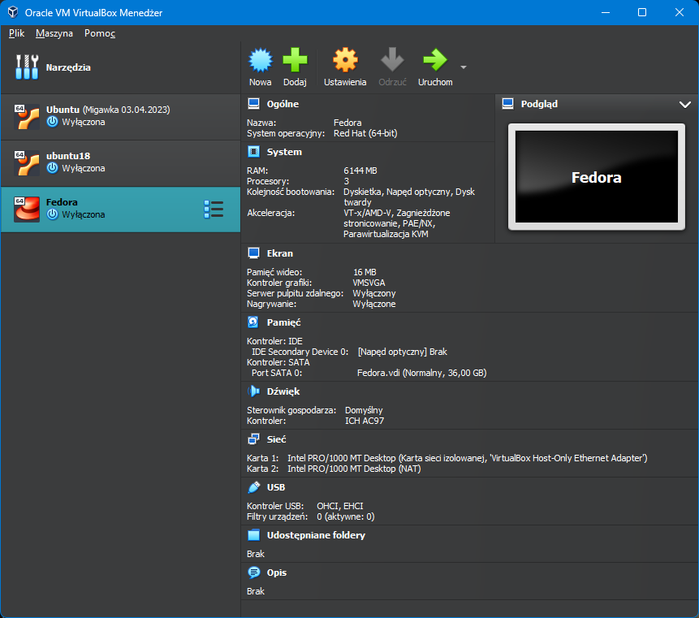
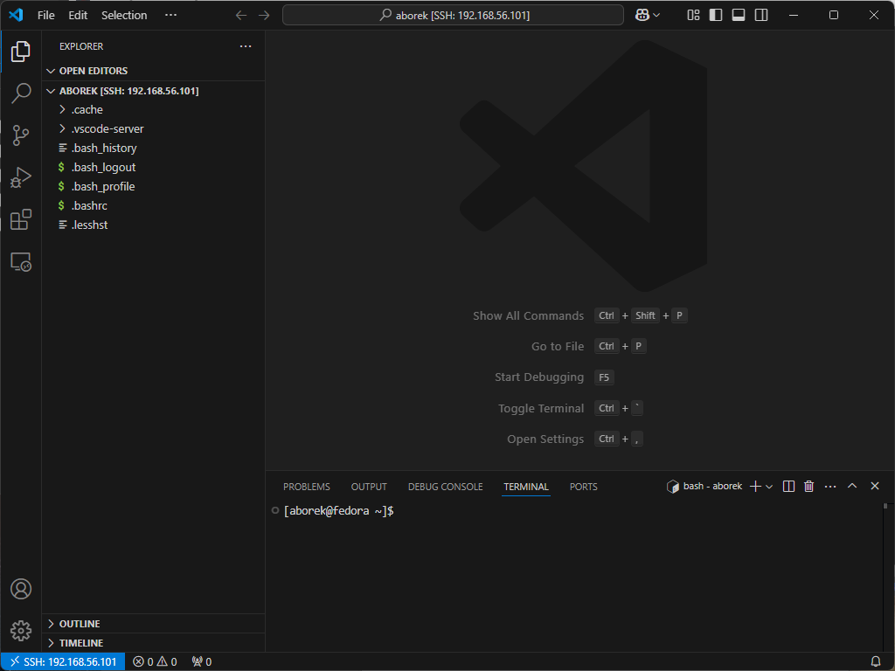

# Sprawozdanie 1

---

## **Zajęcia 01**

### **Wprowadzenie, Git, Gałęzie, SSH**

---

## **1. Instalacja systemu Fedora i przygotowanie środowiska**

Zanim przystąpiłem do wykonywania ćwiczenia pobrałem system Fedora z linku dostarczonego prze prowadzącego i za pomocą Virtual Box postawiłem system.



Skonfigurowałem dwie karty sieciowe, pierwszą host-only do komunikacji z serwerem i drugą NAT aby umożliwić serwerowi dostęp do internetu.


Aby możliwa była komunikacja SSH, sprawdziłem adres IP mojego serwera


Następnie próbowałem się połączyć poprzez SSH z serwerem wykorzystując Visual Studio Code



## **2. Instalacja klienta Git i konfiguracja SSH**

### **Instalacja Git**

Git został zainstalowany za pomocą oficjalnego menedżera pakietów:

```bash
sudo dnf install git
```

Sprawdzenie poprawności instalacji:

```bash
git --version
```


### **Konfiguracja kluczy SSH**

Wygenerowano dwa klucze SSH (**inne niż RSA**, jeden zabezpieczony hasłem):

```bash
ssh-keygen -t ed25519 -C "borekadam89@gmail.com"
```

Klucz skopiowałem i zapisałem na moim koncie GitHub

```bash
cat ~/.ssh/id_ed25519.pub
```


## **3. Klonowanie repozytorium**

### **Klonowanie repozytorium przez SSH**

Po skonfigurowaniu klucza SSH, repozytorium zostało sklonowane przy użyciu SSH:

```bash
git clone git@github.com:InzynieriaOprogramowaniaAGH/MDO2025_INO.git
```


## **4. Praca z gałęziami w Git**

### **Przełączenie na gałęź **`main`** i gałęź grupy**


### **Tworzenie nowej gałęzi (inicjały & numer indeksu)**


## **5. Tworzenie mojego katalogu i githooka**

### **Utworzenie katalogu w repozytorium**


### **Napisanie hooka **`commit-msg`** (walidacja prefiksu w commitach)**

Plik `.git/hooks/commit-msg`:

```bash
#!/bin/bash
COMMIT_MSG_FILE=$1
COMMIT_MSG=$(head -n 1 "$COMMIT_MSG_FILE")

if [[ ! "$COMMIT_MSG" =~ ^AB416965 ]]; then
    echo "❌ Błąd: Każdy commit MUSI zaczynać się od 'AB416965'"
    exit 1
fi
exit 0
```

📌 **Dodanie uprawnień do uruchamiania:**

```bash
chmod +x .git/hooks/commit-msg
```

Przetestowanie hooka

