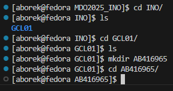

# Sprawozdanie 1 z przedmiotu DevOps

### **Kierunek: Inżynieria Obliczeniowa**

### **Autor: Adam Borek**

### **Grupa 1**

---

## **Zajęcia 01 - Wprowadzenie, Git, Gałęzie, SSH**

---

### **1. Instalacja systemu Fedora i przygotowanie środowiska**

Zanim przystąpiłem do wykonywania ćwiczenia pobrałem system Fedora z linku dostarczonego przez prowadzącego i za pomocą Virtual Box postawiłem system.


Skonfigurowałem dwie karty sieciowe, pierwszą host-only do komunikacji z serwerem i drugą NAT aby umożliwić serwerowi dostęp do internetu.


Aby możliwa była komunikacja SSH, sprawdziłem adres IP mojego serwera


Następnie próbowałem się połączyć poprzez SSH z serwerem wykorzystując Visual Studio Code


### **2. Instalacja klienta Git i konfiguracja SSH**

#### **Instalacja Git**

Git został zainstalowany za pomocą oficjalnego menedżera pakietów:

```bash
sudo dnf install git
```

Sprawdzenie poprawności instalacji:

```bash
git --version
```


#### **Konfiguracja kluczy SSH**

Wygenerowano dwa klucze SSH (**inne niż RSA**, jeden zabezpieczony hasłem):

```bash
ssh-keygen -t ed25519 -C "borekadam89@gmail.com"
```

Klucz skopiowałem i zapisałem na moim koncie GitHub

```bash
cat ~/.ssh/id_ed25519.pub
```


### **3. Klonowanie repozytorium**

#### **Klonowanie repozytorium przez SSH**

Po skonfigurowaniu klucza SSH, repozytorium zostało sklonowane przy użyciu SSH:

```bash
git clone git@github.com:InzynieriaOprogramowaniaAGH/MDO2025_INO.git
```


### **4. Praca z gałęziami w Git**

#### **Przełączenie na gałęź **`main`** i gałęź grupy**


#### **Tworzenie nowej gałęzi (inicjały & numer indeksu)**


### **5. Tworzenie mojego katalogu i githooka**

#### **Utworzenie katalogu w repozytorium**



#### **Napisanie hooka **`commit-msg`** (walidacja prefiksu w commitach)**

Plik `.git/hooks/commit-msg`:

```bash
#!/bin/bash
COMMIT_MSG_FILE=$1
COMMIT_MSG=$(head -n 1 "$COMMIT_MSG_FILE")

if [[ ! "$COMMIT_MSG" =~ ^AB416965 ]]; then
    echo "❌ Błąd: Każdy commit MUSI zaczynać się od 'AB416965'"
    exit 1
fi
exit 0
```

**Dodanie uprawnień do uruchamiania:**

```bash
chmod +x .git/hooks/commit-msg
```

Przetestowanie hooka


**Teraz każdy commit MUSI zaczynać się od **`AB416965`**, w przeciwnym razie zostanie zablokowany!**

### **6. Dodanie sprawozdania i zrzutów ekranu**

**Dodanie sprawozdania do katalogu:**


Następnie skopiowałem wszystkie zrzuty ekranu do katalogu `Zrzuty1/`

### **7. Wysłanie zmian do repozytorium zdalnego**


Sprawdzenie czy zmiany zostały zapisane na githubie:


---

## **Zajęcia 02 - Docker**

---

### 1. **Instalacja Dockera**

Docker został zainstalowany zgodnie z instrukcją, używając oficjalnego repozytorium dystrybucji.

#### **Komendy instalacyjne dla Fedory**

```bash
sudo dnf install -y dnf-plugins-core
sudo dnf install -y docker
sudo systemctl start docker
sudo systemctl enable docker
```

#### **Nadanie uprawnień do wywoływania komend dockera**


Sprawdzenie wersji Dockera bez potrzeby wpisywania `sudo`: 


### **2. Rejestracja w Docker Hub**

Zarejestrowałem się na Docker Hub


Następnie na Fedorze zalogowałem się na moje konto Docker Hub


### **3. Pobranie obrazów Dockera**

Pobrałem wymagane obrazy przy użyciu następujących komend:

```bash
docker pull hello-world
docker pull busybox
docker pull ubuntu
docker pull fedora
docker pull mysql
```

**Lista pobranych obrazów:**

W terminalu


W VS Code po pobraniu rozszerzenia Docker:


### **4. Uruchomienie kontenera `busybox`**

#### **Uruchomienie proste:**


#### **Uruchomienie w trybie interaktywnym:**

Po uruchomieniu kontenera sprawdziłew wersję BusyBox komendą `busybox --help`


**Wyjście z kontenera:**

```bash
exit
```
W VS Code działające kontenery były wyświetlane wraz z ich stanem


### **5. Uruchomienie systemu Ubuntu w kontenerze**

**Sprawdzenie procesu `PID 1` w kontenerze:**


**Lista procesów Dockera na hoście:**


**Aktualizacja pakietów w kontenerze:**
```bash
apt update && apt upgrade -y
```

**Wyjście z kontenera:**
```bash
exit
```

### **6. Tworzenie własnego obrazu Docker (`Dockerfile`)**


#### **Zawartość `Dockerfile`**

```dockerfile
FROM ubuntu:latest

RUN apt update && apt install -y git

WORKDIR /repo
RUN git clone https://github.com/InzynieriaOprogramowaniaAGH/MDO2025_INO.git

CMD ["bash"]
```

#### **Budowanie obrazu:**


#### **Uruchomienie kontenera i sprawdzenie repozytorium:**


### **7. Usuwanie kontenerów i obrazów**

**Sprawdzenie listy wszystkich kontenerów, a następnie zatrzymanie i usunięcie ich:**


**Usunięcie obrazów:**


**Pusta lista kontenerów i obrazów:**


### **8. Dodanie `Dockerfile` do repozytorium**

**Przeniesienie `Dockerfile` do folderu `Sprawozdanie1`**


**Dodanie `Dockerfile` do commita i wypchnięcie zmian do repozytorium zdalnego**


## **Zajęcia 03 - Dockerfile, Build i Testy**

---

### **1. Wybrane oprogramowanie:** [**cJSON**](https://github.com/DaveGamble/cJSON)

- Oprogramowanie na otwartej licencji (MIT)
- Repozytorium zawiera `CMakeLists.txt` oraz `Makefile`
- Obsługuje `make` i `make test`
- Zawiera testy jednostkowe z raportem

---

### **2. Budowanie i testowanie lokalnie (Fedora)**

#### **Instalacja zależności:**


#### **Klonowanie repozytorium:**


#### **Budowanie projektu:**


#### **Testowanie:**


### **3. Budowanie i testowanie w kontenerze Docker (interaktywnie)**

#### **Uruchomienie kontenera Ubuntu i instalacja zależności:**


#### **Klonowanie repozytorium:**


#### **Budowanie i testy:**


#### **Wyjście z kontenera:**


### **4. Dockerfile - etap build**

#### **Dockerfile.build**

```dockerfile
FROM ubuntu:latest

RUN apt update && apt install -y git cmake gcc g++ make

WORKDIR /app
RUN git clone https://github.com/DaveGamble/cJSON.git .
RUN mkdir build && cd build && cmake .. && make
```

#### **Budowanie obrazu:**


### **5. Dockerfile - etap test**

#### **Dockerfile.test**

```dockerfile
FROM cjson-build

WORKDIR /app/build
CMD ["ctest"]
```

#### **Budowanie obrazu:**


#### **Uruchomienie testów:**


#### **Widoczny działający kontener i obrazy:**


### **6. Docker Compose**

Docker Compose to narzędzie do definiowania i uruchamiania wielokontenerowych aplikacji Dockera.
Zamiast uruchamiać każdy kontener ręcznie i ustawiać zależności między nimi, można użyć jednego pliku (`docker-compose.yml`).

#### **docker-compose.yml**

```yaml
version: '3'
services:
  build:
    build:
      context: .
      dockerfile: Dockerfile.build
  test:
    build:
      context: .
      dockerfile: Dockerfile.test
    depends_on:
      - build
```

#### **Uruchomienie wszystkiego:**


### **7. Analiza procesu wdrożenia i publikacji**

#### **Czy program nadaje się do publikowania jako kontener?**

Nie. `cJSON` to biblioteka, nie aplikacja. Kontener ma sens tylko jako środowisko do builda i testów – nie jako forma dystrybucji.

#### **Jak wygląda przygotowanie finalnego artefaktu?**

Buduje się pliki libcjson.a / libcjson.so + nagłówki. Gotowe pliki można zapakować jako `.tar.gz`, `.deb` albo `.rpm`.

#### **Czy trzeba oczyszczać kontener z pozostałości po buildzie?**

Tak, jeśli kontener miałby być publikowany – powinny w nim zostać tylko biblioteka i nagłówki.

#### **Czy deploy-and-publish powinien mieć osobny Dockerfile?**

Tak, najlepiej osobny Dockerfile tylko do pakowania gotowych artefaktów.

#### **Czy program warto pakować jako JAR/DEB/RPM?**

Tak – `.deb` albo `.rpm` to wygodny sposób na dystrybucję biblioteki w systemach Linux.

#### **Jak zapewnić taki format?**

Dodatkowy krok lub osobny kontener, który pakuje pliki np. przy użyciu `fpm`.

## **Zajęcia 04 - Woluminy, Sieci, Jenkins**

---

### **1. Zachowywanie stanu z wykorzystaniem woluminów**

#### **Przygotowanie woluminów**

Do utworzenia woluminów zostało wykorzystane polecenie `docker volume create`:


#### **Uruchomienie kontenera z podpiętymi woluminami i instalacja zależności:**

Aby uruchomić kontener z podpiętym woluminem należało użyć opcji `-v` która pozwala wskazać folder w którym dane woluminu będą się znajdować:


#### **Sprawdzenie obecności dedykowanych folderów woluminów:**


#### **Klonowanie repozytorium na wolumin (z hosta)**

Aby sklonować repozytorium znajdując się na hoście wykorzystałem polecenie `dockr volume inspect`, które wyśmietla przeróżne informacje o woluminie w tym lokalizacje jego danych na hoście:


Sprawdzenie poprawnośći sklonowania w kontenerze:


#### **Build wewnątrz kontenera i wysłanie wyniku na wolumin wyjściowy:**

Budowanie


Przesłanie nowo utworzonego pliku `CJSON_test` na wolumin wyjściowy


Odczytanie z woluminu wyjściowego


#### **Powtórzenie powyższych kroków tym razem z klonowaniem wewnątrz kontenera**

Instalacja gita i klonowanie w kontenerze:


Sprawdzenie poprawnosci klonowania


Dla oszczędzenia czasu nie przeprowadzałem builda tylko od razu sklopiowałem cały folder pobranego repozytorium na wolumin wyjściowy


Sprawdzenie na hoście czy folder został przeniesiony na wolumin wyjściowy


#### **`docker build` i `RUN --mount`**

Dla tej części zadania utworzyłem `Dockerfile.buildkit`, którego zadaniem było zbindowanie folderu na hoście z woluminem. Podczas wywołania `RUN --mount` były tworzone woluminy tymczasowe, po zakończeniu działania Dockerfile były one usuwane.

Dockerfile.buildkit:

```dockerfile
FROM ubuntu:latest

RUN apt update && apt install -y cmake gcc g++ make

WORKDIR /cJSON

RUN --mount=type=bind,source=./temp_in,target=/mnt/v1_in \
    --mount=type=bind,source=./temp_out,target=/mnt/v2_out,rw \
    cp -r /mnt/v1_in/* . && \
    mkdir build && cd build && \
    cmake .. && make && \
    cp cJSON_test /mnt/v2_out/
```

Na hoście utworzyłem dwa foldery `temp_in` i `temp_out`. DO `temp_in` sklonowałem repozytorium gita i zbindowałem te foldery z woluminami dzięki czemu mogłem przeprowadzić proces make w sklonowanym repozytorium na woluminie.


### **2. Eksponowanie portu i iperf3**

#### **Tworzenie kontenera z serwerem iperf**

Utworzenie i uruchomienie serwera `iperf-server` wykorzystując obraz `networkstatic/iperf3` który jest dostępny publicznie na DockerHub. Serwer utworzyłem na porcie `5201`

Po utworzeniu serwer zaczyna nasłuchiwanie.


#### **Połączenie z drugiego kontenera (klient)**

W drugim terminalu utworzyłem drugi kontener który próbował połączyć się z serwerem.


Serwer poprawnie odebrał połączenie.


#### **Własna sieć bridged**

Utworzyłem własną sieć mostkowana za pomocą polecenia `docker network create`


Utworzyłem nowy serwer w mojej sieci, a następnie połączyłem się z nim z fedory.


#### **Połączenie z hosta i spoza hosta**

Ponownie utworzyłem nowy serwer(poprzedni został usunięty)


Najpierw połączyłem się z nim z hosta czyli fedory


Połączenie zostało odebrane


Z zewnętrznego systemu Windows połączyłem się z serwerem iperf: `iperf3 -c 192.168.56.101` na porcie `5201`


Te połączenie również udało się odebrać pomyślnie na serwerze


Sprawdziłem logi serwera za pomocą polecenia `docker logs iperf-server`


Logi nie wykazały żadnych problemów w połączeniu. Prędkość połączenia pomiędzy hostem i serwerem jest znacznie szybsza niż ta pomiędzy windowsem i serwerem, co mam sens ponieważ host i serwer działają w ramach jednej maszyny wirtualnej.

### **3. Instalacja Jenkinsa (Docker)**

#### **Uruchomienie instancji Jenkins + DIND**

To zadanie wykonywałem korzystając z instrukcji na stronie [**Jenkins**](https://www.jenkins.io/doc/book/installing/docker/). Najpierw utworzyłem sieć o nazwie `jenkins`.


Korzystając z instrukcji pobrałem i utworzyłem kontener `docker:dind`, który połączyłem z wcześniej utworzoną siecią jenkins. 


Korzystając z instrukcji pobrałem i utworzyłem kontener `jenkins:lts`.


Po wpisaniu adresu hosta w przeglądarkę udaje mi się dostać do ekranu logowania Jenkinsa.


---

## **Wykorzystanie sztucznej inteligencji**

Podczas zajęć i podczas pisania sprawozdania wykorzystywałem ChatGPT w wersji 4o. Korzystałem z niego głównie do szybszego odnajdywania odpowiednich fragmentów dokumentacji oraz sprawdzania składni i przykładów użycia narzędzi takich jak Docker czy Git. Wprowadzałem tam pełny kontekst polecenia, co pozwalało mi uzyskać bardziej dopasowane odpowiedzi.

Model często przyspieszał pracę i podpowiadał konkretne rozwiązania, jednak nie był niezawodny – zdarzały się błędy merytoryczne, ignorowanie poprawek, dlatego rozwiązania musiałem weryfikować samodzielnie. Nie pytałem się chatu o źródła z których bierze odpowiedzi.