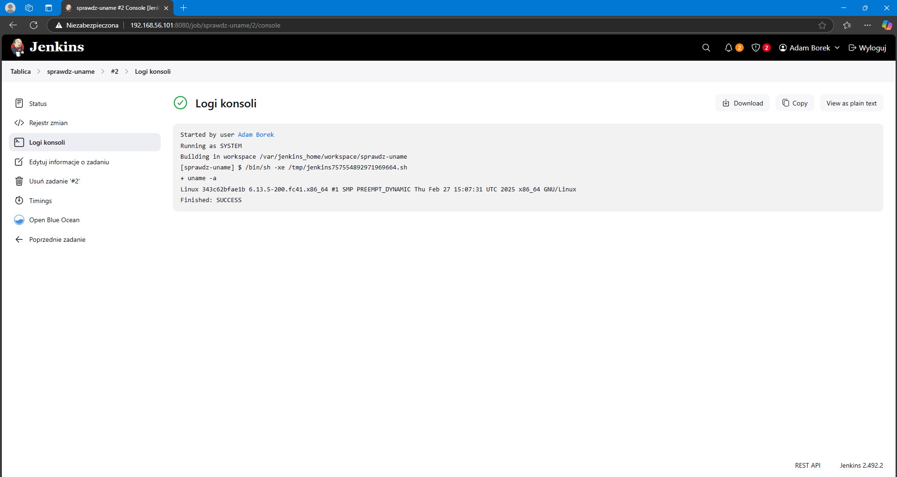

# Sprawozdanie 2 z przedmiotu DevOps

### **Kierunek: Inżynieria Obliczeniowa**

### **Autor: Adam Borek**

### **Grupa 1**

---

## **Zajęcia 05 - Pipeline, Jenkins, izolacja etapów**

### 1. Przygotowanie środowiska

#### Utworzenie instancji Jenkins

Do utworzenia instancji Jenkina wykorzystałem oficjalną instrukcję instalacji: [Jenkins](https://www.jenkins.io/doc/book/installing/docker/) 

Zgodnie z instrukcją utworzyłem sieć mostkowaną o nazwie jenkins, to w niej będzie działała przyszłą instancja jenkinsa.


Kolejnym krokiem w instrukcji było pobranie i uruchomienie `docker:dind`, obraz ten pozwala na ruchumienie "dockera w dockerze" czyli pozwala na uruchamianie komend dockera w jenkinsie.


Napisanie `Dockerfile` który tworzy niestandardowy obraz Jenkinsa na bazie `jenkins/jenkins:2.492.2-jdk17`, w którym instalowany jest klient Dockera (`docker-ce-cli`), co pozwala Jenkinsowi wykonywać polecenia `docker` w trakcie działania pipeline’ów, a także dodawane są pluginy `blueocean` i `docker-workflow` umożliwiające wizualne zarządzanie pipeline’ami oraz integrację z Dockerem.

Zawartość `Dockerfile`:

```dockerfile
FROM jenkins/jenkins:2.492.2-jdk17
USER root
RUN apt-get update && apt-get install -y lsb-release ca-certificates curl && \
    install -m 0755 -d /etc/apt/keyrings && \
    curl -fsSL https://download.docker.com/linux/debian/gpg -o /etc/apt/keyrings/docker.asc && \
    chmod a+r /etc/apt/keyrings/docker.asc && \
    echo "deb [arch=$(dpkg --print-architecture) signed-by=/etc/apt/keyrings/docker.asc] \
    https://download.docker.com/linux/debian $(. /etc/os-release && echo \"$VERSION_CODENAME\") stable" \
    | tee /etc/apt/sources.list.d/docker.list > /dev/null && \
    apt-get update && apt-get install -y docker-ce-cli && \
    apt-get clean && rm -rf /var/lib/apt/lists/*
USER jenkins
RUN jenkins-plugin-cli --plugins "blueocean docker-workflow"
```

Zbudowanie `Dockerfile` komendą z instrukcji: `docker build -t myjenkins-blueocean:2.492.3-1 .`


Uruchomienie obrazu `myjenkins-blueocean:2.492.2-1` w kontenerze.


Aby sprawdzić czy Jenkins został skonfigurowany poprawnie wpisałem w przeglądarce adres `192.168.56.101:8080`. Poniższy widok oznacza że Jenkins ma dostęp do internetu.


Wybrałem opcje `Zainstaluj sugerowane wtyczki` instalator przeprowadził mnie przez pobieranie podstawowych wtyczek oraz przez tworzenia konta.


Zanim przeszedłem do pracy z Jenkinsem to przeniosłęm `Dockerfile` do wcześniej przygotowanego katalogu


### 2. Zadania wstępne

Na tak przygotowanym Jenkinsie byłem gotowy do wykonywania projektów.


Do utworzenia projektów skorzystałem z przycisku `Nowy projekt` po prawej stronie, tam wprowadziłem nazwę i jego typ czyli wykonanie polecenia w konsoli.\
Pierwszym zadaniem było wyświetlenie informacji o systemie za pomocą komendy `uname -a`



Następnie napisałem prosty skrypt który sprawdza czy godzina jest parzysta i jeśli nie jest to zwraca błąd.

Skrypt:

```bash
HOUR=$(date +%H)
echo "Aktualna godzina: $HOUR"

if [ $((10#$HOUR % 2)) -ne 0 ]; then
  echo "Godzina jest nieparzysta — przerywam."
  exit 1
else
  echo "Godzina jest parzysta — kontynuuję."
fi
```

Podobnie jak w przypadku sprawdzenia systemu utworzyłem nowy projekt w Jenkinsie tym razem wykorzystując powyższy skrypt


Ostatnim skryptem do utworzenia było pobranie obrazu ubuntu za pomocą `docker pull ubuntu`, które przebiegło poprawnie. To taki ostateczny test, że Jenkins ma połączenie z internetem.


### 3. Obiekt typu pipeline

Pipeline to ciąg instrukcji autoatyzujący proces pobierania/instalacji oprogramowania.

Utworzyłem obiekt typu pipeline i wpisałem poniższy ciąg komend. Ten pipline klonuje repozytorium przedmiotu `MDO2025_INO` i robi chceckout na mój branch `AB416965`. Następnie korzystając z `Dockerfile.build` stworzonego wcześniej dla repozytorium [cJSON](https://github.com/DaveGamble/cJSON) wykonuje build.

> `Dockerfile.build` został skopiowany z katalogu `Sprawozdanie1` i zmodyfikowany aby działał na kontenerze bazującym na `Fedorze 41`

Pipeline:

```bash
pipeline {
    agent any

    stages {
        stage('Klonowanie repo') { 
            steps {
                git branch: 'AB416965', url: 'https://github.com/InzynieriaOprogramowaniaAGH/MDO2025_INO.git'
            }
        }

        stage('Budowanie obrazu buildera') {
            steps {
                dir ("INO/GCL01/AB416965/Sprawozdanie2/dockerfiles/cjson")
                {
                    script {
                        docker.build('cjson-builder-image', '-f Dockerfile.build .')
                    }
                }
            }
        }
    }
}
```
Pipeline przeszedł bez problemu, chwilę mu to zajęło z powodu pobrania wszystkich zależności umieszczonych w `Dockerfile.build`.


> [Pełne logi z konsoli](test_logs.txt)

Rebuild tego pipeline również odbył się bez problemu. Tym razem zajęło mu to znacznie mniej czasu. Wynika to z wykorzystania mechanizmu cache'owania warstw Dockera – kroki, które nie uległy zmianie (np. instalacja pakietów, klonowanie repozytorium) zostały pominięte dzięki buforowaniu.


