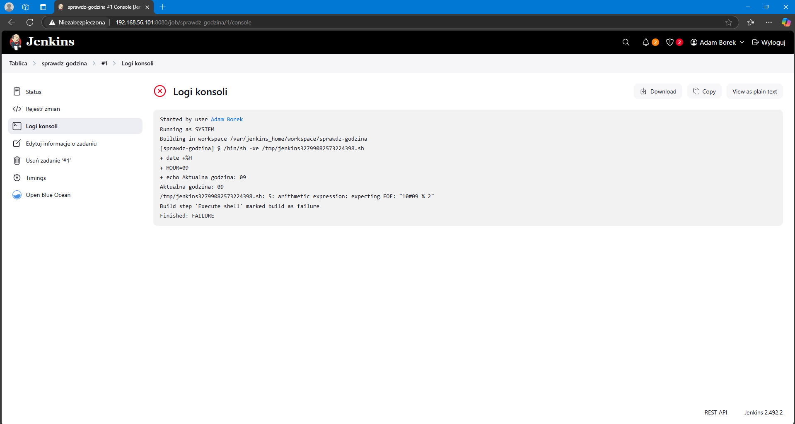
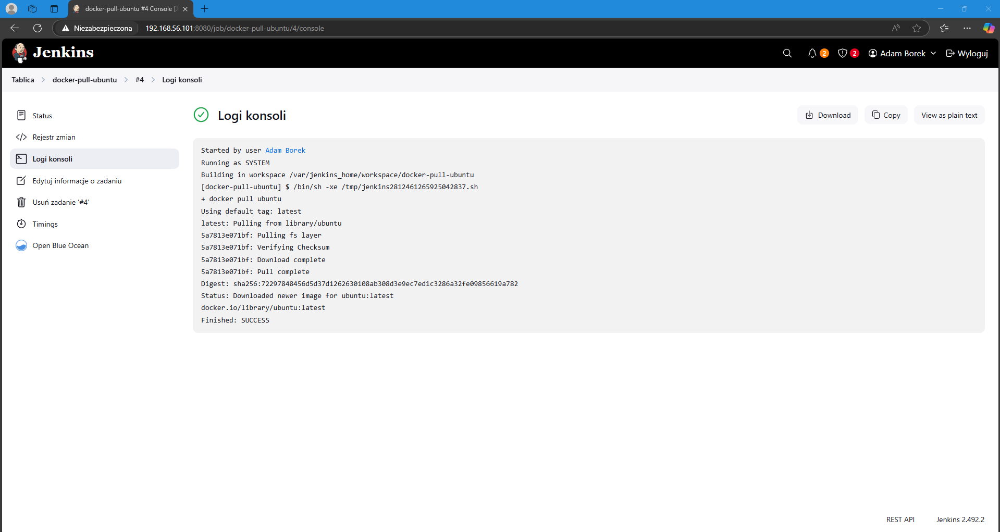

# Sprawozdanie 2  - Pipeline, Jenkins, izolacja etapów

- **Przedmiot: DevOps**
- **Kierunek: Inżynieria Obliczeniowa**
- **Autor: Adam Borek**
- **Grupa 1**

---

### 1. Przygotowanie środowiska

#### Utworzenie instancji Jenkins

Do utworzenia instancji Jenkina wykorzystałem oficjalną instrukcję instalacji: [Jenkins](https://www.jenkins.io/doc/book/installing/docker/) 

Zgodnie z instrukcją utworzyłem sieć mostkowaną o nazwie `jenkins`, w której będzie działała przyszła instancja Jenkinsa.


Kolejnym krokiem w instrukcji było pobranie i uruchomienie obrazu `docker:dind`. Obraz ten pozwala na uruchamianie "Dockera w Dockerze", czyli umożliwia wykonywanie poleceń Dockera z poziomu Jenkinsa.


Następnie napisałem `Dockerfile` który tworzy niestandardowy obraz Jenkinsa na bazie `jenkins/jenkins:2.492.2-jdk17`.\
W obrazie tym instalowany jest klient Dockera (`docker-ce-cli`), co pozwala Jenkinsowi wykonywać polecenia `docker` w trakcie działania pipeline’ów. Dodatkowo dodawane są pluginy `blueocean` i `docker-workflow` umożliwiające wizualne zarządzanie pipeline’ami oraz integrację z Dockerem.

Zawartość `Dockerfile`:

```dockerfile
FROM jenkins/jenkins:2.492.2-jdk17
USER root
RUN apt-get update && apt-get install -y lsb-release ca-certificates curl && \
    install -m 0755 -d /etc/apt/keyrings && \
    curl -fsSL https://download.docker.com/linux/debian/gpg -o /etc/apt/keyrings/docker.asc && \
    chmod a+r /etc/apt/keyrings/docker.asc && \
    echo "deb [arch=$(dpkg --print-architecture) signed-by=/etc/apt/keyrings/docker.asc] \
    https://download.docker.com/linux/debian $(. /etc/os-release && echo \"$VERSION_CODENAME\") stable" \
    | tee /etc/apt/sources.list.d/docker.list > /dev/null && \
    apt-get update && apt-get install -y docker-ce-cli && \
    apt-get clean && rm -rf /var/lib/apt/lists/*
USER jenkins
RUN jenkins-plugin-cli --plugins "blueocean docker-workflow"
```

Zbudowałem obraz poleceniem z instrukcji: 

```bash
docker build -t myjenkins-blueocean:2.492.3-1 .
```


Następnie uruchomiłem obraz `myjenkins-blueocean:2.492.2-1` w kontenerze.


Aby sprawdzić czy Jenkins został skonfigurowany poprawnie wpisałem w przeglądarce adres `192.168.56.101:8080`.\
Poniższy widok oznacza, że Jenkins działa poprawnie i ma dostęp do internetu.


Wybrałem opcje `Zainstaluj sugerowane wtyczki`, a instalator przeprowadził mnie przez proces instalacji podstawowych wtyczek oraz zakładania konta użytkownika.


Zanim przeszedłem do pracy z Jenkinsem, przeniosłem  `Dockerfile` do wcześniej przygotowanego katalogu projektu.


### 2. Zadania wstępne

Na tak przygotowanym Jenkinsie byłem gotowy do wykonywania projektów.


Do utworzenia projektów skorzystałem z przycisku `Nowy projekt` po prawej stronie.\
Po kliknięciu nadałem nazwę projektu i wybrałem jego typ — wykonanie polecenia w konsoli.

Pierwszym zadaniem było wyświetlenie informacji o systemie za pomocą komendy:

```bash
uname -a
```


Następnie napisałem prosty skrypt Bash, który sprawdza, czy aktualna godzina jest parzysta. Jeśli godzina jest nieparzysta — skrypt zwraca błąd i przerywa działanie.

Skrypt:

```bash
HOUR=$(date +%H)
echo "Aktualna godzina: $HOUR"

if [ $((10#$HOUR % 2)) -ne 0 ]; then
  echo "Godzina jest nieparzysta — przerywam."
  exit 1
else
  echo "Godzina jest parzysta — kontynuuję."
fi
```

Podobnie jak wcześniej, utworzyłem nowy projekt w Jenkinsie, tym razem wykorzystując powyższy skrypt.



Ostatnim testowym zadaniem było sprawdzenie połączenia z Internetem poprzez pobranie obrazu `ubuntu` przy użyciu polecenia:

```bash
docker pull ubuntu
```

Pobieranie przebiegło poprawnie.



### 3. Obiekt typu pipeline

Pipeline to ciąg instrukcji automatyzujących proces pobierania, budowania oraz instalacji oprogramowania.

Utworzyłem obiekt typu **pipeline** i wpisałem poniższy ciąg komend.\
Ten pipline klonuje repozytorium przedmiotu `MDO2025_INO` oraz wykonuje checkout na mój branch `AB416965`. Następnie korzystając z pliku `Dockerfile.build`, stworzonego wcześniej dla repozytorium [cJSON](https://github.com/DaveGamble/cJSON), wykonuje proces budowania obrazu Dockera.

> `Dockerfile.build` został skopiowany z katalogu `Sprawozdanie1` i zmodyfikowany tak, aby działał w kontenerze opartym na systemie Fedora 41.

Treść pipeline'a:

```bash
pipeline {
    agent any

    stages {
        stage('Klonowanie repo') { 
            steps {
                git branch: 'AB416965', url: 'https://github.com/InzynieriaOprogramowaniaAGH/MDO2025_INO.git'
            }
        }

        stage('Budowanie obrazu buildera') {
            steps {
                dir ("INO/GCL01/AB416965/Sprawozdanie2/dockerfiles/cjson")
                {
                    script {
                        docker.build('cjson-builder-image', '-f Dockerfile.build .')
                    }
                }
            }
        }
    }
}
```
Pipeline przeszedł bez problemu — choć proces budowania za pierwszym razem trwał nieco dłużej ze względu na konieczność pobrania wszystkich zależności określonych w `Dockerfile.build`.


> [Pełne logi z konsoli](jenkinslogs/console_results.log)

Kolejne uruchomienie (rebuild) pipeline'a przebiegło znacznie szybciej dzięki mechanizmowi cache'owania warstw Dockera.
Kroki, które nie uległy zmianie (np. instalacja pakietów, klonowanie repozytorium), zostały pominięte, co pozwoliło skrócić czas budowania.


### 4. Pipeline korzystający z kontenerów `build -> test`

Kolejnym krokiem było dołączenie etapu testowania do pipeline'a.

Skopiowałem `Dockerfile.test` ze **Sprawozdania1**, który tworzył kontener na bazie obrazu `cjson-builder-image` i uruchamiał w nim testy.\
Zmodyfikowałem również sam pipeline, dodając budowanie kontenera testowego, uruchamianie testów oraz zapisanie wyników do pliku `test.log`, który jest następnie publikowany jako artefakt.

Treść pipeline'a:
```bash
pipeline {
    agent any

    stages {
        stage('Klonowanie repo') { 
            steps {
                git branch: 'AB416965', url: 'https://github.com/InzynieriaOprogramowaniaAGH/MDO2025_INO.git'
            }
        }

        stage('Budowanie obrazu buildera') {
            steps {
                dir ("INO/GCL01/AB416965/Sprawozdanie2/dockerfiles/cjson")
                {
                    script {
                        docker.build('cjson-builder-image', '-f Dockerfile.build .')
                    }
                }
            }
        }

        stage('Budowanie obrazu testowego') {
            steps {
                dir ("INO/GCL01/AB416965/Sprawozdanie2/dockerfiles/cjson")
                {
                    script {
                        docker.build('cjson-test-image', '-f Dockerfile.test .')
                    }
                }
            }
        }

        stage('Testy') {
            steps {
                dir ("INO/GCL01/AB416965/Sprawozdanie2")
                {
                    sh "mkdir -p artifacts"

                    sh """
                        docker run --rm cjson-test-image | tee artifacts/test.log
                    """
                }    
            }
        }

        stage('Publikacja logów z testów') {
            steps {
                archiveArtifacts artifacts: 'INO/GCL01/AB416965/Sprawozdanie2/artifacts/test.log', fingerprint: true
            }
        }
    }
}
```
W pipeline zastosowano `fingerprint: true` w kroku publikacji artefaktu testowego.
Pozwala to Jenkinsowi śledzić przepływ danego pliku pomiędzy etapami pipeline'u, a także pomiędzy różnymi jobami.\
Dzięki temu można łatwo zidentyfikować, w którym buildzie dany plik został wygenerowany oraz zapewnić spójność artefaktów w większych procesach CI/CD.


> [Wyniki testów](jenkinslogs/test.log)

#### Docker-in-Docker (DIND)

W podejściu opartym o **Docker-in-Docker (DIND)** pipeline CI/CD korzysta z osobnego kontenera z demonem Dockera (`dockerd`), który działa wewnątrz kontenerowej infrastruktury Jenkinsa.

Jenkins działa jako kontener (np. `jenkins-blueocean`), natomiast `dockerd` działa w osobnym kontenerze (np. `docker:dind`).\
Oba kontenery komunikują się ze sobą poprzez sieć Docker.

Aby taka komunikacja była możliwa:
- `docker:dind` musi zostać uruchomiony z flagą `--privileged`, ponieważ wymaga podwyższonych uprawnień.
- Musi być skonfigurowane połączenie TLS (certyfikaty) dla bezpieczeństwa.
- Jenkins musi mieć odpowiednie pluginy (`docker-workflow`, `blueocean`) pozwalające na komunikację z demonem Dockera.

Dzięki temu pipeline może wykonywać polecenia takie jak `docker build`, `docker run`, `docker push` wewnątrz środowiska kontenerowego, bez ingerencji w system hosta.

#### Kontener CI bez DIND (Docker Outside of Docker - DOoD)

Alternatywą dla DIND jest podejście **Docker Outside of Docker (DOoD)**, w którym Jenkins korzysta bezpośrednio z demona Dockera działającego na maszynie hosta.

To rozwiązanie jest prostsze i szybsze w konfiguracji:
- Nie wymaga konfigurowania TLS.
- Nie potrzebuje osobnego kontenera z `dockerd`.
- Kontenery nie muszą działać z flagą `--privileged`.

Jednak ma to swoje wady:
- Jenkins zyskuje pełny dostęp do środowiska hosta (potencjalne zagrożenia bezpieczeństwa).
- Błąd w pipeline może spowodować usunięcie lub uszkodzenie kontenerów lub obrazów na hoście.
- Pipeline traci przenośność — zależy od konfiguracji konkretnej maszyny.

####  Dlaczego wybrano DIND w tym projekcie

W tym projekcie zdecydowano się na konfigurację opartą o **Docker-in-Docker (DIND)**, ponieważ:
- Cały proces CI/CD (build, test, deploy, publish) odbywa się w pełni wewnątrz środowiska kontenerowego.
- Proces jest łatwy do przeniesienia na inne maszyny i środowiska.
- Zwiększona jest izolacja od systemu hosta, co wpływa na bezpieczeństwo i stabilność pipeline'a.

### 5. Kompletny Pipeline CI/CD

Kolejnym etapem było utworzenie pełnego pipelina z etapami `deploy` oraz `publish`. Podczas tego etapu utworzyłem `Jenkinsfile`, wykorzystywany podczas konfiguracji `SCM`. `Jenkinsfile` został umieszczoony w repozytorium rzedmiotowym na mojej gałęzi `AB416965`, co skutkuje tym, że Jenkins klonuje nasze repozytorium dwukrotnie (na potrzeby samego pipeline'a oraz budowania projektu).

> [Jenkinsfile](Jenkinsfile)

#### Sam `Jenkinsfile` jest podzielony na sześć głównych etapów:
- **Clone**\
    Klonowanie repozytorium przedmiotowego na gałęzi `AB416965`.

- **Clear docker cache**\
    Wykonanie polecenia `docker builder prune -af`w celu wyczyszczenia cache'a budowanych kontenerów.

- **Build**\
    [Dockerfile.build](pipeline/Dockerfile.build) został zmodyfikowanyw taki sposób, aby po zbudowaniu biblioteki była ona pakowana do pliku `.rpm` przy pomocy narzędzia **FPM** (Effing Package Management) — prostego narzędzia służącego do tworzenia paczek instalacyjnych dla różnych systemów operacyjnych.

- **Test**\
    [Dockerfile.test](pipeline/Dockerfile.test) wykonuje ponownie `ctest`, a wynik działania testów jest zapisywany w logach.
    > [Wydruk zwracany przez `test`](jenkinslogs/cjson_test.log)

- **Deploy**\
    [Dockerfile.deploy](pipeline/Dockerfile.deploy) został przygotowany w taki sposób aby wykorzystując zbudowaną i zapakowaną w `.rpm` bibliotekę instalował poleceniem `sudo dnf install ./cjson.rpm` a następnie korzystając z wcześniej przygotowanego kodu [main.c](pipeline/main.c) dokonywał kompilacji i uruchomienia programu.
    > [Wydruk zwracany przez `deploy`](jenkinslogs/cjson_deploy.log)

- **Publish**\
    Zapisanie jako artefaktów wszystkich plików `.log` oraz wygenerowanego archiwum `cjson.rpm`.

#### Diagram UML:

Poniżej przedstawiono uproszczony diagram UML typu activity diagram, obrazujący kolejne kroki realizowane w naszym `pipeline`. Diagram pokazuje główne etapy, takie jak klonowanie repozytorium, budowanie obrazów Docker, testowanie, wdrażanie oraz archiwizację wyników.


#### Udane przejście pipeline

Po poprawnym wykonaniu wszystkich etapów `pipeline`, w Jenkinsie pojawia się sekcja z opublikowanymi artefaktami (`publish`). Można tam znaleźć pliki `.log` zawierające wyniki testów i wdrożenia oraz wygenerowany pakiet `.rpm`.


> [Logi z konsoli](jenkinslogs/console_1.log)

W celu upewnienia się, że pipeline nie pozostawia niepotrzebnych danych w cache'u, uruchomiłem go kilkukrotnie.

> [Logi z konsoli po ponownym uruchomieniu](jenkinslogs/console_2.log)

#### Test instalacji pakietu `.rpm`

Po zakończeniu działania pipeline'a pobrałem wygenerowane archiwum `cjson.rpm` na hosta i przeprowadziłem ręczną instalację biblioteki.


Instalacja przebiegła bezproblemowo, co pozwoliło na uruchomienie przygotowanego wcześniej programu testowego.


> [Archiwum `.rpm` na hoście](cjson.rpm)

### **Wykorzystanie sztucznej inteligencji**

Podczas realizacji projektu wspierałem się modelem ChatGPT 4o. Główne zastosowania obejmowały:
- Przyspieszenie orientacji w środowisku Jenkinsa,
- Opracowanie struktury pliku `Jenkinsfile`,
- Analizę logów błędów i sugerowanie potencjalnych poprawek w `Jenkinsfile` oraz `Dockerfile`.

Odpowiedzi generowane przez SI były każdorazowo analizowane i dostosowywane do wymagań projektu.