# Sprawozdanie 3 - Automatyzacja i zdalne wykonywanie poleceń za pomocą Ansible

- **Przedmiot: DevOps**
- **Kierunek: Inżynieria Obliczeniowa**
- **Autor: Adam Borek**
- **Grupa 1**

---

## Ansible

### 1. Instalacja zarządcy Ansible

#### Przygotowanie `ansible-target`

Utworzyłem nową maszynę wirtualną z tym samym systemem operacyjnym co główny host, czyli `Fedora 41`. Przydzieliłem jej 20 GB przestrzeni dyskowej — co może być wartością z zapasem, jednak dzięki zastosowaniu dynamicznego przydzielania przestrzeni nie zajmuje ona całości od razu.\
Podczas instalacji utworzyłem użytkownika `ansible` oraz ustawiłem nazwę komputera (hostname) na `ansible-target`.


Na maszynie zainstalowałem wymagane oprogramowanie poleceniem:

```bash
sudo dnf install -y tar openssh-server
```


Po ukończeniu konfiguracji wykonałem migawkę maszyny w VirtualBoxie, aby w razie potrzeby móc przywrócić ją do tego stanu.

#### Instalacja ansible

Na głównej maszynie (`fedora`) zainstalowałem Ansible, korzystając z oficjalnych repozytoriów Fedory, za pomocą prostego polecenia:

```bash
sudo dnf install -y ansible
```

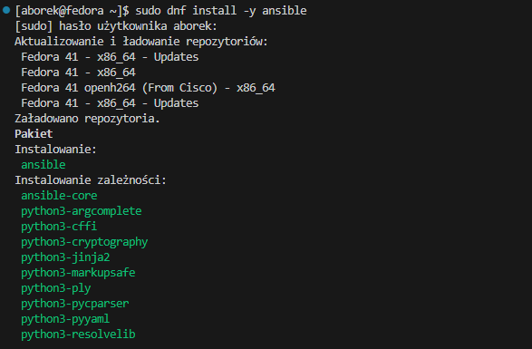

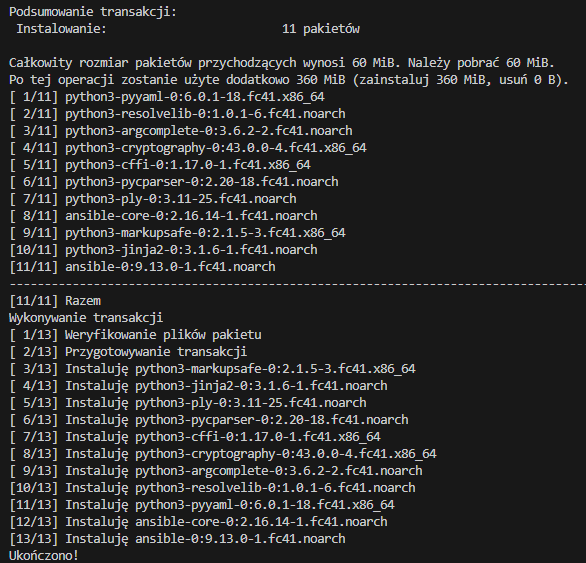

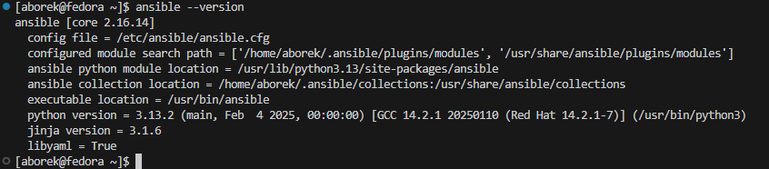

#### Ustanowienie połączenia

W celu umożliwienia komunikacji między maszynami po nazwach, przypisałem adresy IP w pliku `/etc/hosts`:

```
192.168.56.104 ansible-target
192.168.56.101 fedora
```

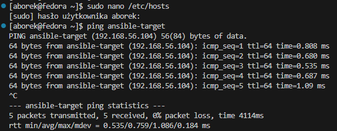

Następnie utworzyłem klucz SSH, dedykowany dla Ansible:

```bash
ssh-keygen -t ed25519 -f ~/.ssh/id_ansible -C "ansible key"
```

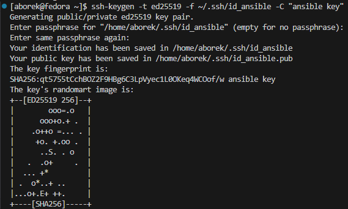

Za pomocą `ssh-copy-id` przesłałem klucz publiczny na maszynę `ansible-target`, aby umożliwić bezhasłowe logowanie:

```bash
ssh-copy-id -i ~/.ssh/id_ansible.pub ansible@ansible-target
```

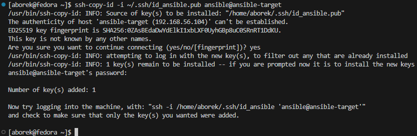

### Inwentaryzacja

#### Sprawdzenie łączności

Zanim przeszedłem do dalszej części zadania, musiałem rozwiązać problem związany z połączeniem SSH. Z nieznanego mi powodu system nie wykrywał przesłanego wcześniej klucza SSH (prawdopodobnie przez to, że posiadam kilka kluczy, z czego ten „główny”, zabezpieczony hasłem, nie był tu używany).

Aby to naprawić, zmodyfikowałem plik konfiguracyjny `~/.ssh/config`, wskazując tam bezpośrednio właściwy klucz oraz nazwy hostów:

`.ssh/config:`

```
Host ansible-target
    HostName ansible-target
    User ansible
    IdentityFile ~/.ssh/id_ansible
Host fedora
    HostName fedora
    User aborek
    IdentityFile ~/.ssh/id_ansible
```

#### Utworzenie pliku inwentaaryzacji

Po potwierdzeniu, że połączenie między maszynami działa poprawnie, utworzyłem plik inwentaryzacji zgodnie z oficjalną [dokumentacją Ansible](https://docs.ansible.com/ansible/latest/getting_started/get_started_inventory.html).

W katalogu `ansible_quickstart` utworzyłem plik `inventory.ini`, w którym — zgodnie z zaleceniami prowadzącego — zdefiniowałem dwie grupy: `Orchestrators` oraz `Endpoints`, przypisując do nich odpowiednio nazwy maszyn wirtualnych:

`inventory.ini`:

```csharp
[Orchestrators]
fedora

[Endpoints]
ansible-target
```

Po zapisaniu pliku, wykonałem testowe zapytanie `ping` do wszystkich maszyn z użyciem polecenia:

```bash
ansible all -i inventory.ini -m ping
```

Co zakończyło się sukcesem:

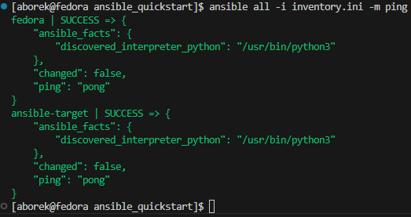

### Zdalne wywoływanie procedur

Korzystając z oficjalnej [instrukcji](https://docs.ansible.com/ansible/latest/getting_started/get_started_playbook.html), przeszedłem do utworzenia własnego playbooka w Ansible.

#### Prosty playbook

Zgodnie z krokami poradnika przygotowałem pierwszy testowy plik playbook.yaml w katalogu `ansible_quickstart`. Jego zadaniem było wysłanie żądania ping do wszystkich maszyn oraz wypisanie prostego komunikatu:

`playbook.yaml`:

```yaml
- name: My first play
  hosts: all
  become: true
  tasks:
   - name: Ping my hosts
     ansible.builtin.ping:

   - name: Print message
     ansible.builtin.debug:
       msg: Hello world
```

Polecenie użyte do uruchomienia playbooka:

```bash
asnible-playbook -i inventory.ini playbook.yaml
```

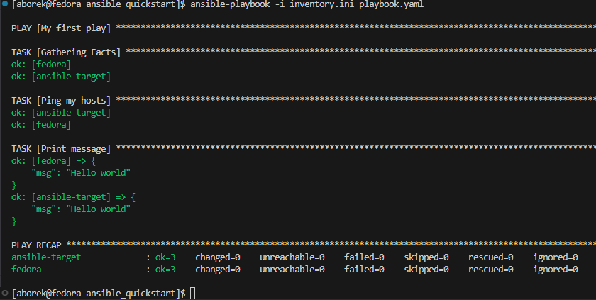

#### Pełny playbook

Powyższy playbook był jedynie testem poprawności połączenia oraz działania Ansible. Docelowy playbook miał zawierać:
- wysłanie żadania `ping` do wszystkich maszyn,
- skopiowanie pliku inwentaryzacji na maszynę `Endpoint`,
- aktualizację pakietów systemowych,
- restart usług `sshd` i `rngd`.

Pełny `playbook.yaml`:

```yaml
- name: My first play
  hosts: all
  become: true
  tasks:
   - name: Ping my hosts
     ansible.builtin.ping:

   - name: Copy inventory to Endpoint
     ansible.builtin.copy:
      src: inventory.ini
      dest: /home/ansible/inventory_copied
     when: "'ansible-target' in inventory_hostname"

   - name: Ping after copy
     ansible.builtin.ping:

   - name: Update system packages
     ansible.builtin.dnf:
      name: "*"
      state: latest
     when: "'ansible-target' in inventory_hostname"

   - name: Restart sshd
     ansible.builtin.service:
      name: sshd
      state: restarted
     when: "'ansible-target' in inventory_hostname"

   - name: Restart rngd
     ansible.builtin.service:
      name: rngd
      state: restarted
     ignore_errors: yes 
     when: "'ansible-target' in inventory_hostname"
```

Uruchomienie playbooka wyglądało analogicznie:

```bash
asnible-playbook -i inventory.ini playbook.yaml
```

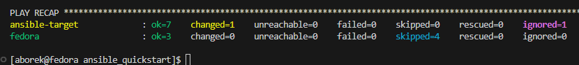

> Usługa `rngd` nie została zrestartowana, ponieważ nie była zainstalowana na maszynie `ansible-target`.

> [Pełne logi](ansible_quickstart/playbook.log)

### Zarządzanie stworzonym artefaktem

W tej części zadania zainstalowałem bibliotekę przygotowaną na wcześniejszych zajęciach wewnątrz kontenera uruchomionego na maszynie `ansible-target`.\
Cały proces został zautomatyzowany przy użyciu playbooka Ansible oraz struktury [ról](https://docs.ansible.com/ansible/latest/playbook_guide/playbooks_reuse_roles.html), utworzonej za pomocą `ansible-galaxy`.

#### Utworzenie nowej roli

Korzystając z narzędzia `ansible-galaxy`, utworzyłem nową rolę o nazwie `cjson` w katalogu `ansible_quickstart`:

```bash
ansible-galaxy init cjson
```

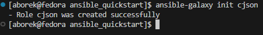

Po utworzeniu struktury roli, do katalogu `cjson/files` przekopiowałem pliki `cjson.rpm` oraz `main.c` z poprzednich zajęć.

Następnie przeszedłem do modyfikacji pliku `main.yaml` znajdującego się w `cjson/tasks/`. Zadaniem tego pliku było:
- przesłanie artefaktów na `ansible-target`,
- instalacja Dockera i jego zależności,
- uruchomienie kontenera z systemem Fedora 41,
- instalacja biblioteki z pliku `.rpm`,
- kompilacja programu w C,
- oraz uruchomienie programu i pobranie wyniku.

`cjson/tasks/main.yaml`:

```yaml
---
- name: Create artifacts directory
  become: yes
  file:
    path: /home/ansible/cjson
    state: directory
    owner: ansible
    group: ansible
    mode: '0755'

- name: Copy artifacts to target
  copy:
    src: "{{ item }}"
    dest: /home/ansible/cjson/
    mode: '0644'
  loop:
    - files/cjson.rpm
    - files/main.c

- name: Install python3-requests
  ansible.builtin.dnf:
    name: python3-requests
    state: present

- name: Install Docker
  become: yes
  dnf:
    name: docker
    state: present
  
- name: Ensure Docker is started
  become: yes
  service:
    name: docker
    state: started
    enabled: true

- name: Add ansible to docker group
  user:
    name: ansible
    groups: docker
    append: true

- name: Start fedora container
  community.docker.docker_container:
    name: cjson
    image: fedora:41
    state: started
    command: sleep infinity
    volumes:
      - /home/ansible/cjson:/tmp:z

- name: Install gcc, cjson and tools
  community.docker.docker_container_exec:
    container: cjson
    command: dnf install -y gcc make /tmp/cjson.rpm

- name: Compile source file
  community.docker.docker_container_exec:
    container: cjson
    command: gcc -o /tmp/example /tmp/main.c -lcjson

- name: Run program
  community.docker.docker_container_exec:
    container: cjson
    command: bash -c "LD_LIBRARY_PATH=/usr/local/lib64 /tmp/example"
  register: result

- name: Print the result of the program
  debug:
    var: result.stdout

```

#### Uruchomienie roli przez playbook

Do wykonania roli przygotowałem osobny playbook `playbook-cjson.yaml`:

`playbook-cjson.yaml`:

```yaml
- name: Deploy CJSON in container
  hosts: ansible-target
  become: true
  roles:
    - cjson
```

Uruchomienie playbooka:

```bash
asnible-playbook -i inventory.ini playbook-cjson.yaml
```

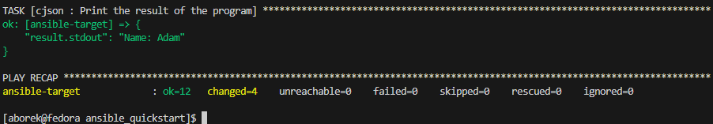

> [Pełne logi z wykonania znajdują się tutaj](ansible_quickstart/playbook-cjson.log)

## Kickstart

### Instalacja systemu Fedora 41

Do wykonania tego zadania nie musiałem ponownie instalować Fedory, ponieważ korzystałem z niej jako systemu głównego (hosta) od początku trwania przedmiotu.

#### Przygotowanie pliku `anaconda-ks.cfg`

Będąc zalogowanym jako administrator, skopiowałem plik odpowiedzi znajdujący się w systemie pod ścieżką `/root/anaconda-ks.cfg` do folderu `Sprawozdanie3`, aby mógł być łatwo udostępniony za pomocą GitHuba.

Następnie zmodyfikowałem plik, dodając informacje o repozytoriach:

```kickstart
url --mirrorlist=http://mirrors.fedoraproject.org/mirrorlist?repo=fedora-41&arch=x86_64
repo --name=update --mirrorlist=http://mirrors.fedoraproject.org/mirrorlist?repo=updates-released-f41&arch=x86_64
```

Tak przygotowany plik został wypchnięty na GitHuba.

#### Instalacja feodry z kickstarta

Z racji korzystania z maszyn wirtualnych VirtualBox postanowiłem skrócić długi adres URL do pliku Kickstart z GitHuba za pomocą serwisu [TinyURL](https://tinyurl.com).

Ostateczny link:
```arduino
https://tinyurl.com/aborek
```

> **Uwaga**: VirtualBox nie pozwala na wklejanie linków na etapie instalatora — stąd konieczność użycia skracacza.

Podczas tworzenia nowej maszyny wirtualnej, w menu startowym instalatora kliknąłem `e`, aby wejść do trybu edycji poleceń GRUB i dopisałem dodatkowy parametr instalacyjny:

```ini
inst.ks=https://tinyurl.com/aborek
```

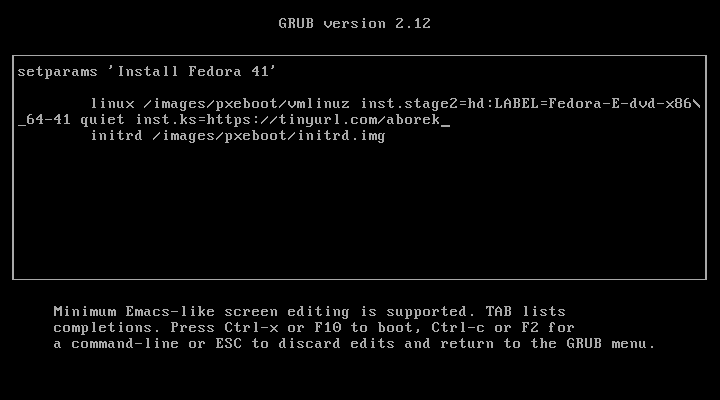

Instalator uruchomił się dalej z interfejsem graficznym — jednak większość pól była wygaszona (nieedytowalna), ponieważ wartości zostały już określone w pliku `kickstart`.

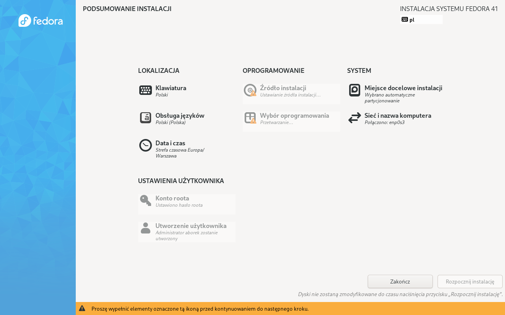

Po chwili rozpoczęła się właściwa instalacja:

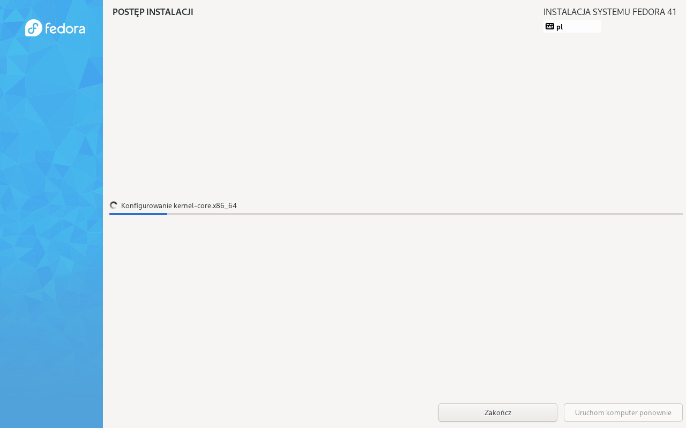

Instalacja przebiegła pomyślnie. Po jej zakończeniu należało ponownie uruchomić system (`reboot` nie był jeszcze automatyczny):


Po restarcie zalogowałem się do systemu — dane logowania były takie same jak na oryginalnej Fedorze, co potwierdza, że instalacja przebiegła poprawnie:


#### Rozszerzenie pliku odpowiedzi o dodatkowe opcje

W kolejnym kroku rozszerzyłem `anaconda-ks.cfg`, dodając:

- `reboot` — aby system automatycznie uruchomił się ponownie po instalacji,
- `network --hostname=fedora.test` — aby nadać maszynie nazwę hosta,
- `clearpart --all --initlabel` — aby usunąć wszystkie partycje przed instalacją,
- `autopart` — aby automatycznie utworzyć nowe partycje.

Zaktualizowany plik ponownie wypchnąłem na GitHuba. Proces instalacji przeprowadziłem jeszcze raz, tym razem reboot wykonał się automatycznie.

Po zalogowaniu się do systemu sprawdziłem nazwę hosta:

```bash
hostname
```

Wynik:

```
feodra.test
```

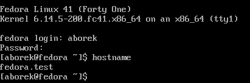

### Instalacja biblioteki `cjson` w wykorzystaniem pliku odpowiedzi

#### Przygotowanie `cjson.rpm`

Na potrzeby testów zmieniłem nazwę pliku `cjson.rpm` na `mycjson.rpm`, aby uniknąć konfliktu nazw i ryzyka przypadkowego pobrania innej wersji biblioteki.

#### Utworzenie repozytorium HTTP

W celu udostępnienia biblioteki w formie repozytorium YUM, zainstalowałem serwer Apache oraz narzędzie `createrepo` poleceniem:

```bash
sudo dnf install -y httpd createrepo
```

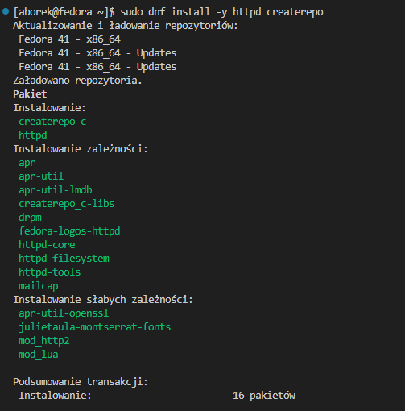

Następnie utworzyłem katalog:

```bash
sudo mkdir -p /var/www/html/myrepo
sudo cp mycjson.rpm /var/www/html/myrepo/
cd /var/www/html/myrepo
createrepo .
```

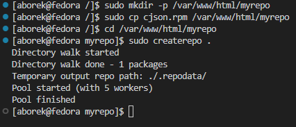

Aby umożliwić dostęp HTTP, dodałem reguły do firewalla:

```bash
sudo firewall-cmd --permanent -add-service=http
sudo firewall-cmd --reload
```

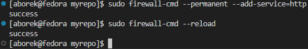

Następnie w pliku `/etc/httpd/conf/httpd.conf` zmodyfikowałem konfigurację serwera Apache, aby umożliwić poprawne linkowanie zawartości repozytorium.

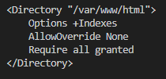

Po tych krokach repozytorium było dostępne pod adresem:

```arduino
http://192.168.56.101/myrepo/
```

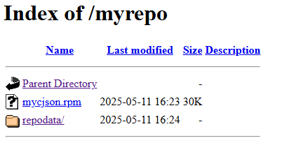

#### Modyfikacja pliku Kickstart

W pliku anaconda-ks.cfg dodałem własne repozytorium:

```kickstart
repo --name=myrepo --baseurl=http://192.168.56.101/myrepo/
```

W sekcji %packages wskazałem pakiety do zainstalowania:

```kickstart
%packages
@^custom-environment
mycjson
gcc
glibc
curl
%end
```

Dodatkowo utworzyłem sekcję `%post`, która odpowiadała za kompilację i uruchomienie programu po zakończeniu instalacji:

```
%post
mkdir -p /opt/example

chown aborek:aborek /opt/example

# Pobierz plik main.c z GitHuba
curl -o /opt/example/main.c https://raw.githubusercontent.com/InzynieriaOprogramowaniaAGH/MDO2025_INO/refs/heads/AB416965/INO/GCL01/AB416965/Sprawozdanie2/pipeline/main.c

# Skrypt uruchamiany po zalogowaniu (tekstowo)
cat << 'EOF' > /etc/profile.d/run_example.sh
#!/bin/bash
if [ ! -f /opt/example/.compiled ]; then
    echo "Kompiluję program z main.c" >> /opt/example/autostart.log
    gcc /opt/example/main.c -o /opt/example/example -lcjson -I/usr/local/include/cjson -L/usr/local/lib64
    if [ -f /opt/example/example ]; then
        echo "Uruchamiam program:" >> /opt/example/autostart.log
        LD_LIBRARY_PATH=/usr/local/lib64 /opt/example/example >> /opt/example/autostart.log 2>&1
    else
        echo "Kompilacja nie powiodła się" >> /opt/example/autostart.log
    fi
    touch /opt/example/.compiled
fi
EOF

chmod +x /etc/profile.d/run_example.sh
%end
```

#### Weryfikacja po instalacji

Po zakończeniu instalacji zalogowałem się na swoje konto i sprawdziłem log działania skryptu:

```bash
cat /opt/example/autostart.log
```

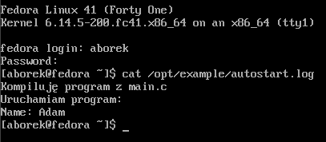

Następnie zweryfikowałem ścieżki plików zainstalowanych przez pakiet:

```bash
rpm -ql mycjson
```

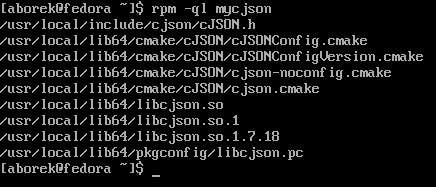

Ostatecznie uruchomiłem program ręcznie:

```bash
LD_LIBRARY_PATH=/usr/local/lib64 /opt/example/example
```

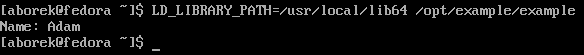