# Sprawozdanie 3

- **Przedmiot: DevOps**
- **Kierunek: Inżynieria Obliczeniowa**
- **Autor: Adam Borek**
- **Grupa 1**

---

## Wdrażanie na zarządzalne kontenery w chmurze (Azure)

### Przygotowanie kontenera

Zanim przystąpiłem do wykonywania zadań, upewniłem się, że mój kontener z aplikacją nadal znajduje się w serwisie Docker Hub

### Zapoznanie z platformą

Korzystając z Panelu AGH, zalogowałem się do platformy Azure. Zostało automatycznie utworzone studenckie konto z darmowym limitem startowym wynoszącym 100 USD. Azure oferuje darmowe środki dla studentów w ramach programu Microsoft Learn for Students, co jest doskonałą okazją do nauki bez ponoszenia kosztów.


Następnie zalogowałem się do Azure CLI za pomocą wbudowanego terminala, co pozwala na interaktywne zarządzanie zasobami bez potrzeby korzystania z portalu graficznego. Azure CLI to potężne narzędzie umożliwiające automatyzację i szybkie wykonywanie operacji w środowisku chmurowym.

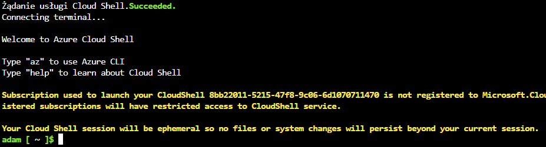

### Wdrożenie aplikacji

#### Tworzenie grupy zasobów

Pierwszym krokiem było utworzenie grupy zasobów. Grupa zasobów (ang. resource group) w Azure służy jako kontener do zarządzania i monitorowania powiązanych zasobów:

```bash
az group create --name MyGroup --location westeurope
```

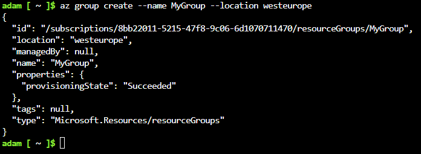

Dzięki temu wszystkie zasoby (np. kontenery, sieci, dyski) są logicznie pogrupowane, co ułatwia ich późniejsze zarządzanie i usuwanie.

#### Tworzenie kontenera

Następnie wdrożyłem aplikację jako kontener w usłudze Azure Container Instances (ACI). ACI to forma serverless containers, która umożliwia szybkie i proste uruchomienie aplikacji bez konieczności konfiguracji klastra (w przeciwieństwie np. do AKS – Azure Kubernetes Service):

```bash
az container create \
  --resource-group MyGroup \
  --name moj-nginx-v1 \
  --image index.docker.io/frigzer/my-nginx:v1 \
  --registry-login-server index.docker.io \
  --registry-username frigzer \
  --dns-name-label moj-nginx-v1-adam \
  --ports 80 \
  --location westeurope \
  --os-type Linux \
  --cpu 1 \
  --memory 2
```

Warto zauważyć, że:

- `--dns-name-label` umożliwia przypisanie unikalnego publicznego adresu URL do kontenera,
- `--cpu` i `--memory` określają przydzielone zasoby obliczeniowe,
- `--registry-login-server` i `--registry-username` są potrzebne, jeśli obraz wymaga autoryzacji (w tym przypadku Docker Hub).

#### Weryfikacja działania

Po uruchomieniu kontenera sprawdziłem logi jego działania:

```bash
az container logs \
  --resource-group MyGroup \
  --name moj-nginx-v1
```

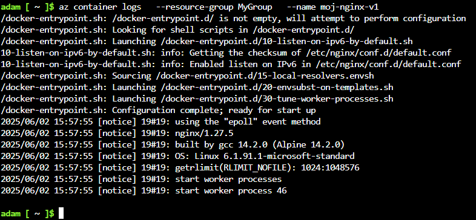

Dzięki logom można zweryfikować, czy aplikacja wystartowała poprawnie i nie napotkała błędów.

Sprawdziłem także, czy kontener został poprawnie zarejestrowany:

```bash
az container list
```

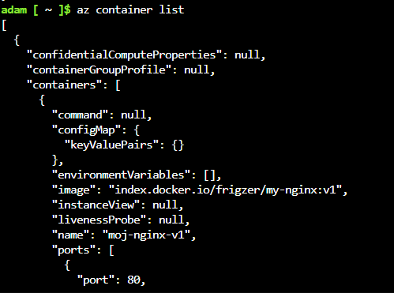

#### Testowanie aplikacji

W przeglądarce otworzyłem aplikację wpisując:

```
moj-nginx-v1-adam.westeurope.azurecontainer.io
```

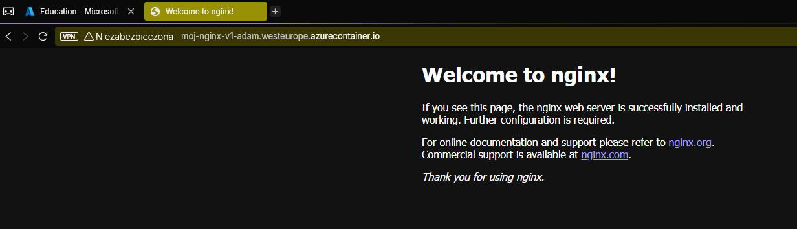

To potwierdza, że kontener został poprawnie wystawiony przez Azure i jest dostępny publicznie przez HTTP.

#### Usunięcie zasobów

Po zakończeniu testów usunąłem kontener, by nie zużywać środków:

```bash
az container delete \
  --resource-group MyGroup \
  --name moj-nginx-v1 \
  --yes
```

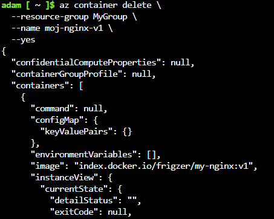

Sprawdziłem listę kontenerów, by upewnić się, że został usunięty:

```bash
az container list
```

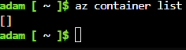

Również usunąłem całą grupę zasobów, co automatycznie usuwa wszystkie powiązane z nią elementy:

```bash
az group delete \
  --name MyGroup \
  --yes \
  --no-wait
```

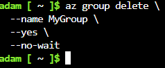

```bash
az group list
```

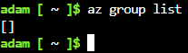

### Monitorowanie kosztów

Na końcu sprawdziłem koszty wykonanych operacji:

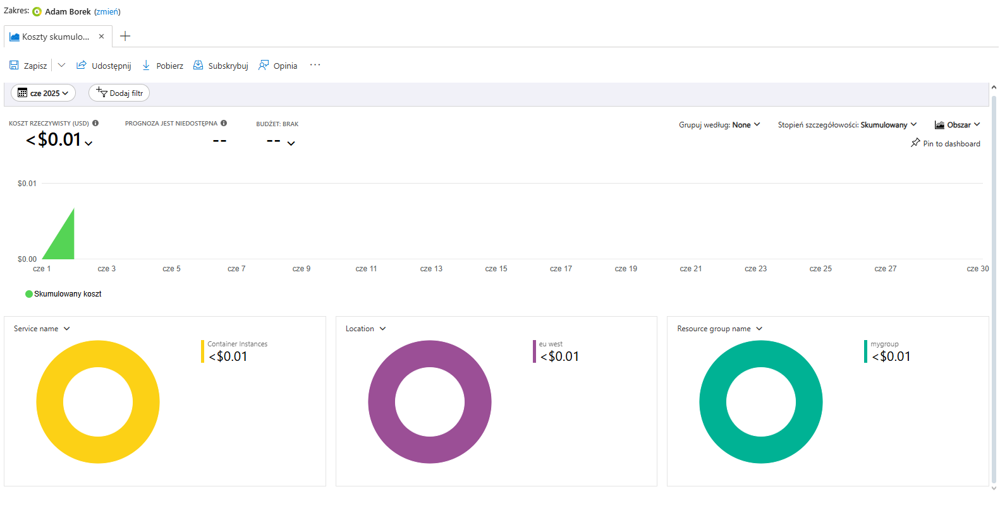

Azure pozwala na dokładne monitorowanie wydatków poprzez panel Cost Management. Jest to szczególnie przydatne w środowiskach produkcyjnych oraz przy ograniczonych budżetach, np. studenckich.

## Shift-left: GitHub Actions

### Wprowadzenie do koncepcji Shift-left

Shift-left to podejście polegające na przesuwaniu testowania, walidacji oraz automatyzacji procesów na wcześniejsze etapy cyklu życia oprogramowania. Celem jest:

- szybkie wykrywanie błędów,
- lepsza kontrola jakości kodu,
- zautomatyzowanie powtarzalnych zadań.

GitHub Actions to jedno z kluczowych narzędzi wspierających tę ideę – umożliwia zdefiniowanie automatycznych workflowów, które mogą uruchamiać się np. przy każdym `push`, `pull request` czy cyklicznie (np. co noc).

### Zapoznanie się z GitHub Actions

Na początku zapoznałem się z [oficjalną dokumentacją GitHub Actions](https://docs.github.com/en/actions), aby zrozumieć:

- jak działa system workflowów,
- jak zdefiniować akcję w formacie `.yml`,
- jakie są dostępne triggery (`on:`),
- oraz jakie są limity i koszty działania GitHub Actions.

Warto zaznaczyć, że GitHub oferuje darmowy limit minut dla publicznych repozytoriów – w przypadku konta darmowego to m.in. 2000 minut miesięcznie, co w zupełności wystarcza do testów i budowania niewielkich projektów.

### Fork repozytorium i przygotowanie środowiska

Zadanie polegało na stworzeniu własnego pipeline'u w sforkowanym repozytorium. Sforkowałem projekt [cJSON](https://github.com/Frigzer/cJSON), popularną bibliotekę do przetwarzania danych w formacie JSON w języku C.

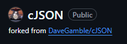

Następnie utworzyłem dedykowaną gałąź `ino_dev`, zgodnie z zaleceniami – to ważne, aby nie modyfikować `main/master` w projektach open-source, jeśli nie planujemy realnego pull requesta.

### Usunięcie istniejących workflowów

W projekcie znajdował się folder `.github/workflows`, zawierający gotowe workflowy. Zgodnie z instrukcją usunąłem go za pomocą GitHub Web UI, a commit nazwałem:

```
Delete ./github/workflows directory
```

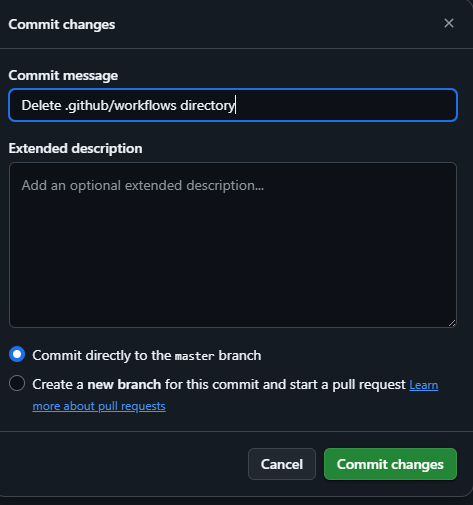

To zapewnia pełną kontrolę nad tym, co dzieje się w naszym pipeline i zapobiega przypadkowemu uruchomieniu istniejących zadań CI.

### Tworzenie własnego workflowa

Utworzyłem nowy plik `c-cpp.yml` w katalogu `.github/workflows`, w którym zdefiniowałem workflow wykonujący kompilację biblioteki cJSON.

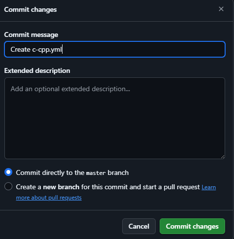

Plik `.yml` zawierał m.in.:

- trigger `on: push` dla gałęzi `ino_dev`,
- użycie maszyny wirtualnej `ubuntu-latest`,
- instalację zależności (jeśli były wymagane),
- polecenie budujące (`make`, `cmake`, itd.),
zapisanie artefaktów przy pomocy `actions/upload-artifact`.

Link do pliku: [c-cpp.yml na GitHubie](https://github.com/Frigzer/cJSON/blob/ino_dev/.github/workflows/c-cpp.yml)

### Uruchomienie pipeline

Przeszedłem do zakładki Actions na GitHubie, gdzie pojawił się nowy workflow uruchomiony automatycznie w wyniku commita do `ino_dev`.

To potwierdza, że:

- trigger działa poprawnie,
- kod buduje się bez błędów,
- GitHub Actions działa zgodnie z założeniem.

### Wygenerowany artefakt

Po zakończeniu builda plik `.rpm` został zapisany jako artefakt (wynik działania pipeline), co potwierdza skuteczne użycie akcji `upload-artifact`.

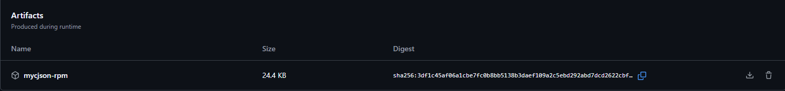

Dzięki temu możliwe jest:

- testowanie zbudowanych paczek na innych systemach,
- przechowywanie buildów historycznych,
- integracja z kolejnymi etapami (np. testowaniem, wdrażaniem).