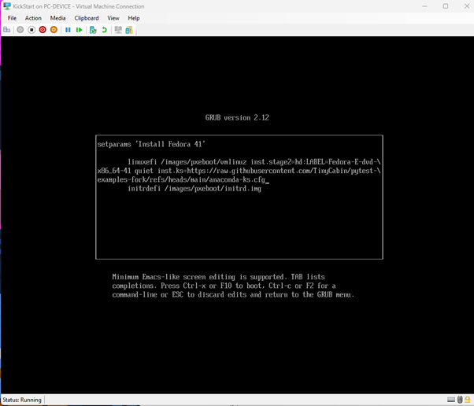
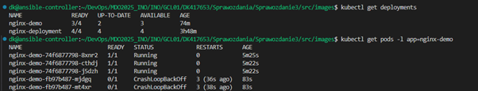

# Zajęcia 8: Automatyzacja zadań administracyjnych z użyciem Ansible

## Wprowadzenie

Celem niniejszego ćwiczenia było zapoznanie się z narzędziem Ansible poprzez jego instalację i konfigurację w środowisku wirtualnym, a następnie zdalne wykonywanie poleceń na maszynie docelowej. W ramach zadania wykonano przygotowanie maszyn, konfigurację połączeń SSH, stworzenie pliku inwentarza, a także implementację zadań w formie playbooka. Testowano również odporność rozwiązania na problemy z łącznością.

---

##  Instalacja i konfiguracja środowiska

###  Maszyna zarządzana (`ansible-target`)

Na potrzeby ćwiczenia utworzono maszynę wirtualną działającą pod systemem Fedora. Skonfigurowano na niej użytkownika `ansible` z uprawnieniami sudo i nadano nazwę masyznie `ansible-target`.


Zainstalowano oraz uruchomiono usługę SSH:

```bash
sudo dnf install -y openssh-server
sudo systemctl enable --now sshd
```

Ustawiono hostname:

```bash
sudo hostnamectl set-hostname ansible-target
```

Po zakończeniu konfiguracji wykonano migawkę maszyny.

---

###  Maszyna kontrolna (`ansible-controller`)

Na maszynie kontrolnej (również Fedora) zainstalowano Ansible:

```bash
sudo dnf install -y ansible
ansible --version
```


Następnie utworzono użytkownika `ansible` oraz wygenerowano parę kluczy SSH:

```bash
sudo useradd ansible
sudo su - ansible
ssh-keygen -t ed25519
```


Klucz publiczny przesłano na maszynę `ansible-target` (nazwa maszyny do jej adresu jest przypisana w korku poniżej):

```bash
ssh-copy-id ansible@ansible-target 
```


Test połączenia:

```bash
ssh ansible@ansible-target 
```

---

##  Konfiguracja pliku inwentarza

###  Rozpoznawanie nazw

Upewniono się, że maszyny rozpoznają się po nazwach poprzez odpowiednie wpisy w pliku `/etc/hosts` na obu systemach, co umożliwia komunikację pomędzy nimi z wykorzystaniem nazw, a nie adresu.


###  Plik inwentarza `inventory.ini`

Utworzony prosty plik inwentarza pozwala na porawną konfigurację Ansible,definiując zarządzanymi hostami i ich grupami. Plik został utworzony na maszynie sterującej


Zawartość pliku `inventory.ini`:


Weryfikacja:

```bash
ansible -i inventory.ini all -m ping
```
### *[Inventory file](src\ansible_quickstart\inventory.ini)*

Wynik:


---

##  Automatyzacja operacji – playbook Ansible

Za pomocą playbooków Ansible można tworzyć rozbudowane ciągi zadań przeznaczonych do wykonania na zdalnych hostach. W ramach ćwiczenia przygotowano plik `playbook.yml`, który wykonuje szereg operacji na maszynie `ansible-target`.

###  Zawartość `playbook.yml`

```yaml
---
- name: Ping
  hosts: all
  tasks:
  - name: Ping hosts
    ansible.builtin.ping:
    register: ping_results

  - name: Show ping results
    ansible.builtin.debug:
      var: ping_results

- name: Copy inventory.ini to Endpoints
  hosts: Endpoints
  tasks:
  - name: Copy inv
    ansible.builtin.copy:
      src: inventory.ini
      dest: /tmp/inventory.ini
    register: copy_result

  - name: Display copy results
    ansible.builtin.debug:
      var: copy_result

- name: Repeat Ping to Compare
  hosts: all
  tasks:
  - name: Ping hosts
    ansible.builtin.ping:
    register: ping_results

  - name: Show ping results
    ansible.builtin.debug:
      var: ping_results


```
### [Playbook file](src\ansible_quickstart\playbook.yaml)

Struktura playbooka została podzielona na trzy oddzielne sekcje, aby logicznie rozdzielić poszczególne etapy operacji:

1. **Pierwszy play** wykonuje ping na wszystkich hostach, by sprawdzić ich dostępność przed dalszymi działaniami.
2. **Drugi play** kopiuje plik `inventory.ini` tylko na hosty z grupy `Endpoints`, izolując tę operację od pozostałych.
3. **Trzeci play** ponownie wykonuje ping, co pozwala porównać stan hostów przed i po operacjach kopiowania.


###  Uruchomienie playbooka

Playbook został uruchomiony oczywiście z urządzenia `ansible-controller`.

```bash
ansible-playbook -i inventory.ini playbook.yaml 
```

Wynik:


Po ponownym wykonaniu playbooka `changed=0`, co pokazuje, że wcześniejscze czyności przeszły poprawnie i tym razem wykoanie zadania nie wprowadza żadnych zmian z poprzednim.


---

##  Odporność na błędy sieciowe

W ramach testów, aby sprawdzić poprawność wykonywania zadań, pomimo braku połączenia z maszyną, zatrzymano usługę SSH na maszynie docelowej:

```bash
sudo systemctl stop sshd
```

Następnie ponownie uruchomiono playbook:

```bash
ansible-playbook -i inventory.ini playbook.yml
```

Wynik:

```
fatal: [target]: UNREACHABLE! => {
    "msg": "Failed to connect to the host via ssh: ..."
}
```


Ansible poprawnie zidentyfikował problem i oznaczył host jako `UNREACHABLE`, nie przerywając całkowicie działania (jeśli byłoby więcej hostów w grupie).

---

##  Zarządzanie artefaktem przy użyciu ansible-galaxy

W moim przypadku uzyskany artefakt z innych zajęć był plik binarny ( `.whl`), proces wdrożenia został ujęty w zautomatyzowanym scenariuszu playbooka Ansible, zorganizowanym w formie roli przy pomocy `ansible-galaxy`.

### Struktura roli `deploy_whl_container`

Rola została utworzona komendą:

```bash
ansible-galaxy init deploy_whl_container
```

Umożliwia to modularne podejście oraz łatwe utrzymanie i rozwój w przyszłości.

### Zastosowany scenariusz:

1. **Instalacja Dockera**:

   * Upewniono się, że Docker jest zainstalowany (`dnf`) i uruchomiony jako usługa (`service`).

2. **Kopiowanie artefaktu i plików pomocniczych**:

   * Przesłano plik `.whl` oraz szablon `Dockerfile` na zdalną maszynę.

3. **Budowanie obrazu Docker**:

   * Na podstawie przygotowanego `Dockerfile`, utworzono lokalny obraz `artifact_image`.

4. **Uruchomienie aplikacji w kontenerze**:

   * Kontener został uruchomiony tymczasowo, a w jego wnętrzu wykonano test importu pakietu oraz odczyt jego wersji.

5. **Walidacja działania**:

   * Weryfikacja działania została wykonana poprzez sprawdzenie kodu wyjścia polecenia oraz wypisanie wersji zainstalowanego pakietu.

###  Playbook główny (`main.yml`)

```yaml
- name: Deploy .whl in container
  hosts: ansible-target
  become: true
  roles:
    - deploy_whl_container
```
####  [Plik](src/ansible-delpoy/deploy.yml)

### `defaults/main.yml`

```yaml
# defaults file for deploy_whl_container
wheel_filename: pytest_examples-0.0.18-py3-none-any.whl
```
####  [Plik](src\ansible-delpoy\deploy_whl_container\defaults\main.yml)

###  `tasks/main.yml` (skrócony opis kluczowych kroków)

```yaml
- Instalacja i uruchomienie Dockera
- Utworzenie katalogu `package/` na pliki
- Przesłanie pliku `.whl` i `Dockerfile.j2`
- Budowanie obrazu `artifact_image`
- Uruchomienie kontenera i wykonanie testowego polecenia w Pythonie
- Zgłoszenie błędu w razie niepowodzenia testu
- Wyświetlenie wyniku w konsoli
```
####  [Plik](src\ansible-delpoy\deploy_whl_container\tasks\main.yml)


###  Szablon `Dockerfile.j2` (przykład)

```Dockerfile
FROM python:3.11-slim
COPY {{ wheel_filename }} /packages/
RUN pip install /packages/{{ wheel_filename }}
CMD ["python3"]
```
#### [Plik](src\ansible-delpoy\deploy_whl_container\templates\Dockerfile.j2)


### Wykonanie

Po utworzeniu odpowedniej struktury i zadań w ansible-galxy, wywołujemy działąnie komendą:

```bash
ansible-playbook -i inventory.ini deploy.yml 
```

Wynik: 


W celu sprawdzenia czy faktycznie zadanie zostało wykonane, na masyznie docelowej `ansilbe-target` zostało sprawdzone istnienie obrazu oraz działanie kontenera.

```bash
 docker images
```


```bash
 docker run --rm -it artifact_image bash
```


Na hoście znajduje się obraz jak i kontener, który wykonuje podane zadanie, co śwadczy o poprawności przeprowadzenia zadania.

---

## Wnioski

Zrealizowane ćwiczenie pokazało możliwości Ansible w zakresie:

* zdalnego zarządzania systemami za pomocą SSH,
* bezpiecznej automatyzacji zadań administracyjnych,
* wykrywania błędów łączności operacji.

Ansible dzięki swojej prostocie i strukturze YAML-owej umożliwia czytelną i powtarzalną konfigurację systemów, co czyni go bardzo użytecznym narzędziem w środowiskach DevOps i administracyjnych.

Dzięki użyciu roli i szkieletu ansible-galaxy, playbook pozostaje czytelny, rozszerzalny i gotowy do użycia w różnych środowiskach projektowych.


---

# Zajęcia 9: Pliki odpowiedzi dla wdrożeń nienadzorowanych

## Wprowadzenie

Celem niniejszego ćwiczenia było przygotowanie źródła instalacyjnego systemu Fedora w trybie nienadzorowanym z użyciem pliku odpowiedzi (kickstart). Dzięki temu możliwe było w pełni zautomatyzowane uruchomienie środowiska, które po instalacji systemu natychmiast hostuje nasze oprogramowanie. 

---

## Przygotowanie instalacji systemu

### Pobranie instalatora i pliku odpowiedzi

Na początku pobrano obraz instalacyjny systemu Fedora Server (`Fedora-Everything-41`). Do utworzenia pliku odpowiedzi wykorzystano plik generowany po ręcznej instalacji: `/root/anaconda-ks.cfg`, z głównej maszyny wirtualnej.

```cfg
# Generated by Anaconda 41.35
# Generated by pykickstart v3.58
#version=DEVEL


# Keyboard layouts
keyboard --vckeymap=pl --xlayouts='pl'
# System language
lang pl_PL.UTF-8 --addsupport=en_US.UTF-8


# Network information
network  --bootproto=dhcp --device=eth0 --ipv6=auto --activate


%packages
@^server-product-environment


%end


# Run the Setup Agent on first boot
firstboot --enable


# Generated using Blivet version 3.11.0
ignoredisk --only-use=sda
autopart
# Partition clearing information
clearpart --none --initlabel


# System timezone
timezone Europe/Warsaw --utc


#Root password
rootpw --lock
user --groups=wheel --name=dk --password=$y$j9T$itVxhkHSDZzU7lpOpePXkLtb$OkDSrQVIABMa2AP2rOclTyaWp59ymJSQsWMehmLdrH6 --iscrypted --gecos="Dominik K"

```

Plik ten został następnie zmodyfikowany zgodnie z dokumentacją `Kickstart`, aby:

* wymuszać wyczyszczenie wszystkich partycji:

  ```kickstart
  clearpart --all --initlabel
  ```
* ustawić niestandardowy hostname:

  ```kickstart
  network --hostname=kickstart-fedora
  ```
* zdefiniować źródła repozytoriów:

  ```kickstart
  url --mirrorlist=http://...
  repo --name=updates --mirrorlist=http://...
  ```

---

##  Dodanie automatycznego uruchamiania programu po instalacji

Kolejnym krokiem było rozszerzenie pliku kickstart o instrukcje, dzięki którym system po instalacji samodzielnie pobiera i uruchamia wskazany program w kontenerze Dockera. Zmodyfikowano kilka sekcji:

### Wprowadzone zmiany:

* **Dodano nowe pakiety w sekcji `%packages`**:

  ```kickstart
  docker
  curl
  ```

* **Wyłączono agenta pierwszego uruchomienia**:

  ```kickstart
  firstboot --disable
  ```

* **Rozszerzono sekcję `%post`**, aby:

  * Włączyć usługę Docker przy starcie,
  * Utworzyć katalog na artefakt w `/opt/build_artifact`,
  * Pobrać paczkę `.whl` z repozytorium GitHub,
  * Wygenerować skrypt `build_and_run_artifact.sh`, który:

    * Buduje obraz Dockera z artefaktem,
    * Tworzy i uruchamia kontener z tym obrazem,
  * Utworzyć usługę systemd (`artifact.service`), która wykonuje ten skrypt po starcie systemu,
  * Włączyć tę usługę na stałe (`systemctl enable artifact.service`).

### [Plik Kickstart](src\anacodna-ks.cfg)

### Uzasadnienie podejścia:

* **Docker jako środowisko uruchomieniowe**: Umożliwia uruchomienie programu w kontrolowanym i izolowanym środowisku, niezależnym od hosta. Minimalizuje ryzyko problemów związanych z zależnościami.

* **Instalacja `.whl`**: Plik artefaktu `.whl` jest pobierany z zewnętrznego źródła — umożliwia to aktualizację bez modyfikacji obrazu instalacyjnego systemu.

* **Usługa systemd**: Umożliwia automatyczne wykonanie skryptu przy każdym uruchomieniu systemu, co zapewnia odporność na restart maszyny.

* **Podejście „build-on-boot”**: Budowanie obrazu Dockera podczas pierwszego uruchomienia pozwala zredukować rozmiar systemu instalacyjnego i oddziela proces wdrażania od procesu instalacji systemu.

---

##  Instalacja nienadzorowana

Instalacja została przeprowadzona w środowisku wirtualnym (Hyper-V), gdzie utworzono nową maszynę i uruchomiono instalator z podanym plikiem kickstart. W tym celu w edytorze parametrów GRUB dodano:

```bash
inst.ks=https://raw.githubusercontent.com/TinyCabin/pytest-examples-fork/refs/heads/main/anaconda-ks.cfg
```



Instalacja przebiegła w pełni automatycznie, bez udziału użytkownika. Po jej zakończeniu system zrestartował się i był gotowy do działania.


Po instalacji zalogowano się do systemu i zweryfikowano działanie aplikacji oraz otrzymane logi z sekcji `%post`:


---


## Wnioski

Ćwiczenie umożliwiło zrozumienie mechanizmów instalacji systemów operacyjnych w sposób nienadzorowany, przy użyciu pliku kickstart. Dzięki temu można przygotowywać gotowe do działania obrazy maszyn, gdzie kluczowa jest szybkość i powtarzalność wdrożeń.


* Instalacja Dockera i uruchamianie kontenerów powinno odbywać się *po* zakończeniu instalacji – odpowiednie polecenia muszą być wpisane w `%post` lub jako usługi systemd.
* Możliwość integracji z zewnętrznymi repozytoriami i usługami sieciowymi (jak Jenkins lub GitHub) pozwala elastycznie wdrażać i aktualizować aplikacje.
* Całość może być zintegrowana z systemami CI/CD oraz narzędziami do automatyzacji (np. Ansible), tworząc kompleksowe środowisko testowo-produkcyjne.

---

# Zajęć 10: Wdrażanie na zarządzalne kontenery: Kubernetes (Minikube)

Kolejnym etapem w pracy z konteneryzacją aplikacji było zapoznanie się z systemem orkiestracji kontenerów — Kubernetes. Do celów edukacyjnych wykorzystano narzędzie **Minikube**, które umożliwia lokalne uruchomienie jednowęzłowego klastra Kubernetes.

---

###  Instalacja i Konfiguracja Minikube

####  Instalacja Minikube i Kubectl

Przeprowadzono instalację Minikube oraz narzędzia `kubectl`. Aby uniknąć konfliktu z globalnym `kubectl`, wykorzystano alias `minikube kubectl`. Następnie sprawdzono 

```bash
curl -LO https://github.com/kubernetes/minikube/releases/latest/download/minikube-linux-amd64
sudo install minikube-linux-amd64 /usr/local/bin/minikube 
rm minikube-linux-amd64

sudo dnf install -y kubectl
alias minikubectl="minikube kubectl --"
```


Sprawdzono wersje komponentów:

```bash
minikube version
kubectl version --client
```


#### Uruchomienie klastra Minikube

```bash
minikube start
```

Minikube domyślnie wybrał sterownik Docker i zainicjował lokalny klaster. Zweryfikowano działanie klastra:

```bash
minikube status
docker ps
kubectl get nodes
```


####  Uruchomienie Dashboardu Kubernetes

```bash
minikube dashboard
```


Dashboard został otwarty w domyślnej przeglądarce. Zweryfikowano jego działanie i dostępność pod lokalnym adresem.


---

###  Uruchomienie aplikacji w Kuberneterze

W celu dalszego wdrażania została wykorzystana aplikacja **nginx** z własną konfiguracją jako *proof-of-concept*.

#### Uruchomienie kontenera jako *Pod*

Na początku został utworzony Pod (Kontener) z użyciem `kubectl run`

```bash
minikube kubectl -- run my-nginx --image=nginx --port=80 --labels app=my-nginx
```

Wykoanie komendy utworzyło Pod o nazwie my-nginx na bazie obrazu nginx:latest, eksponujący wewnętrznie port 80 i oznaczony etykietą app=my-nginx.


Następnie sprawdzono działanie poda:
```bash
kubectl get pods -l app=my-manual-nginx
```


Pod uzyskał stan `Running`, co pokazuje pomyślne uruchomienie kontenera.

#### Port Forward i testowanie dostępności

Aby uzyskać dostęp do aplikacji Nginx uruchomionej wewnątrz Poda z poziomu lokalnej maszyny, zastosowano mechanizm przekierowania portów za pomocą polecenia:

```bash
kubectl port-forward pod/my-nginx 8080:80
```


Polecenie to przekierowuje ruch z portu 8088 na lokalnym komputerze (localhost) do portu 80 kontenera Nginx działającego w Podzie my-nginx.

W kolejnym kroku, w osobnym terminalu, sprawdzono dostępność aplikacji za pomocą polecenia:

```bash
curl http://localhost:8088
```


Otrzymanie strony powitalnej Nginx potwierdziło, że aplikacja działa prawidłowo i jest dostępna spoza klastra dzięki zastosowanemu przekierowaniu portów.

---

###  Przejście do deklaratywnego wdrażania — Deployment

Zalecaną  metodą zarządzania aplikacjami w środowisku Kubernetes jest użycie obiektów Deployment, które umożliwiają deklaratywne określenie stanu aplikacji — m.in. liczby jej replik oraz strategii wdrażania zmian.

####  Plik YAML dla Deploymentu

Na początku należało przygotować plik yaml, określający deployment

Plik `nginx-deployment.yaml`:

```yaml
apiVersion: apps/v1
kind: Deployment
metadata:
  name: nginx-deployment
  labels:
    app: nginx
spec:
  replicas: 1 # Poźniej zamieniono na 4 repliki
  selector:
    matchLabels:
      app: nginx
  template:
    metadata:
      labels:
        app: nginx
    spec:
      containers:
      - name: my-nginx
        image: nginx:latest
        ports:
        - containerPort: 80
```

[Plik deployment](src\nginx-deployment.yaml)

Wdrożono Deployment przy użyciu komend:

```bash
kubectl apply -f nginx-deployment.yaml
```
Otrzymany deployment w Dashboard:


Sprawdzenie statusu deployment i pod'ów:

```bash
kubectl get deployments
kubectl get pods -l app=nginx
```

Otrzymany wynik komend:


Kolejno deployment został wzbogacony o 4 repliki i cały proces został powtórzony. Status wdrożenia aplikacji został zbadany komendą `kubectl rollout status`.

```bash
kubectl apply -f nginx-deployment.yaml
kubectl rollout status deployment/nginx-deployment
```


Skalowanie poszło pomyślnie

#### Ekspozycja aplikacji jako Serwis

Aby zapewnić stabilny punkt dostępu do aplikacji Nginx, niezależny od zmieniających się IP Podów, wdrożenie zostało wyeksponowane jako obiekt *Service*. Serwis umożliwia również równoważenie ruchu między replikami aplikacji.

Utworzono plik `nginx-service.yaml` w celu zdefiniowania serwisu:

```yaml
apiVersion: v1
kind: Service
metadata:
  name: my-nginx-service
spec:
  selector:
    app: nginx
  ports:
    - protocol: TCP
      port: 80
      targetPort: 80
  type: ClusterIP

```
Jeśli nie zdefiniowano serwisu typu `NodePort` lub `LoadBalancer`, testowanie aplikacji możliwe jest również przez `port-forward` bezpośrednio do Poda lub serwisu typu `ClusterIP`.


W Dahsboard można zobaczyć poprawnie utworzony serwis:


---

###  Dodatkowa Weryfikacja

Na końcu sprawdzono logi jednego z Podów i przekierowano port do serwisu, jak w wcześniejszych krokach.

```bash
kubectl port-forward service/my-nginx-service 8090:80

curl http://localhost:8090 # w innym terminale
```
Wynik komend:


Wyeksportowanie przeszło pomyślnie i strona startowa została uzyskana.

---

### Wnioski

Zajęcia te umożliwiły praktyczne poznanie podstaw Kubernetes, w tym:

* instalacji lokalnego klastra przy pomocy Minikube,
* wdrażania i skalowania aplikacji kontenerowych,
* tworzenia i zarządzania Deploymentami oraz Serwisami,
* ekspozycji aplikacji na zewnątrz klastra,
* pracy zarówno w trybie imperatywnym, jak i deklaratywnym (YAML).

---

## Zajęcia 11 – Wdrażanie na zarządzalne kontenery: Kubernetes (cz. 2)

W ramach kolejnych ćwiczeń z Kubernetes skoncentrowano się na praktyce zarządzania cyklem życia wdrożeń aplikacji, testowaniu strategii aktualizacji oraz operacjach rollback.

### Przygotowanie wersji obrazów

Przygotowano dwie wersje własnego obrazu aplikacji – stabilną oraz „wadliwą”, umożliwiającą symulację błędnego wdrożenia. Obrazy zostały zbudowane lokalnie i załadowane do klastra Minikube za pomocą polecenia:

Obrazy aplikacji:

Wersja aplikacji - v2:
```dockerfile
FROM nginx:latest
RUN echo "<h1>Wersja 2 działa!</h1>" > /usr/share/nginx/html/index.html

# Aby kontener nie chodził w tle - nie wylaczyc sie odrazu
CMD ["nginx", "-g", "daemon off;"]
```

Wersja wadliwa - bad:
```dockerfile
FROM nginx:latest
CMD ["false"]
```

Załadowanie obrazów do Minikub'a:

```bash
minikube image load nginx-demo:v1
minikube image load nginx-demo:v2
minikube image load nginx-demo:bad
```


### Skalowanie i aktualizacje Deploymentu

W ramach eksperymentów z obiektem Deployment, przygotowany został plik `nginx-deploy.yaml`

```yaml
apiVersion: apps/v1
kind: Deployment
metadata:
  name: nginx-demo
  labels:
    app: nginx-demo
spec:
  replicas: 4   # Replic nr chnage 8 -> 1 -> 0 -> 4
  selector:
    matchLabels:
      app: nginx-demo
  template:
    metadata:
      labels:
        app: nginx-demo 
    spec:
      containers:
      - name: nginx-demo
        image: nginx-demo:bad  # version change 1 -> 2 -> bad
        ports:
        - containerPort: 80

```

Następnie wykonywano następujące operacje:

#### Skalowanie liczby replik:

 * Wdrożenie 8 replik:
 
 W celu dokonania zmiany replik można zmienić liczbę w pliku `nginx-deployment.yaml`:
```yaml
spec:
  replicas: 8
```

bądź zastosowania komendy:

```bash
kubectl scale deployment nginx-demo --replicas=8
```


Poswstało 8 pod'ów, które są aktywne `Running`

 * Zminejszenie do 1 repliki:
```yaml
spec:
  replicas: 1
```


Po zmniejszeniu liczby replic do 1, 7 pod'ów są gotowe/przygotowane, jednak nie uruchomione, zostały zatrzymane. Jedynie jedna replika działa (jest w statusie `Running`)


 * Zmniejszenie do 0 replik:
```yaml
spec:
  replicas: 0
```


Przy 0 replikach, wszystkie pody zostały usunięte, gdzie na screen można dostrzec ostatniego poda w stanie `Terminating`, czyli ostatni etap "życia" pod'a.

 * Przeskalowanie do 4 replik:

```yaml
spec:
  replicas: 4
```


Przy przeskalowaniu do 4 replik, utworzone zostały 4 pod'y, zgodnie z wymaganiami.

#### Aktualizacja obrazu do nowszej i starszej wersji:

Do dokonania zmiany w wersji można użyć komendy:

  ```bash
kubectl set image deployment/nginx-demo nginx-demo=nginx-demo:2
  ```
bądź ponownie dokonać zmianę w wersji w pliku `yaml`:

```bash
containers:
    - name: nginx-demo
      image: nginx-demo:2  # version change 1 -> 2 -> bad
```

* Wdrożenie nowszej wersji:


* Wdrożenie wadliwej wersji:



Wytworzone pody nie zostały odpowiednio wdrożone i mają status `CrashLoopBackOff`.


#### Zarządzanie historią wdrożeń

Przy każdej zmianie obrazu lub liczby replik rejestrowano wpływ na stan Deploymentu i Podów. W przypadku wadliwej wersji sprawdzano, czy Kubernetes zatrzymuje rollout i umożliwia powrót do poprzedniej stabilnej wersji.

Do kontroli historii zmian zastosowano:

```bash
kubectl rollout history deployment/nginx-demo
```


```bash
kubectl rollout undo deployment/nginx-demo
```


Po dokonaniu rollout'u wszystkie wadliwe pods zostały usunięte, oraz przywrócona wersja była ostatnią stabilną.


### Automatyczna kontrola stanu wdrożenia

Na potrzeby automatyzacji przygotowano prosty skrypt sprawdzający, czy wdrożenie osiągnęło stan `available` w ciągu 60 sekund (z użyciem `kubectl rollout status`).

Skrytp:

```bash
#!/bin/bash
KUBECTL_COMMAND="/usr/local/bin/minikube kubectl --"
DEPLOYMENT_NAME="nginx-demo"
TIMEOUT=60

echo "Czekam aż deployment \"$DEPLOYMENT_NAME\" się wdroży (timeout: $TIMEOUT sek)..."

$KUBECTL_COMMAND rollout status deployment/$DEPLOYMENT_NAME --timeout=${TIMEOUT}s

if [ $? -eq 0 ]; then
  echo " Wdrożenie zakończone sukcesem"
else
  echo " Wdrożenie NIE zakończone w czasie $TIMEOUT sekund"
fi
```

Następnie skrypt został przetestowany na każdej wersji (v1, v2, bad)

* nginx-demo:v1


Skrypt się wykonał od razu, bez żadnych problemów, ani opóźnień.

* niginx-demo:v2


Wykonywanie skryptu trwało dłużej, jendakże skrypt poprawnie wprowadził zmiany.

* nginx-demo:bad


Skrypt wykrył, że zmiany nie zostały wprowadzone.


#### Strategie wdrażania

Przygotowano trzy różne konfiguracje Deploymentu, wykorzystując:

* strategię `Recreate`:


Następnie zaobserwowano zmiany, za pomocą komendy:

```bash
kubectl get deployments 
kubectl get pods -l app=nginx-demo 
kubectl describe pods -l app=nginx-demo | grep Image:
```


* strategię `RollingUpdate` z niestandardowymi parametrami:

```yaml
  apiVersion: apps/v1
  kind: Deployment
  metadata:
    name: nginx-demo
    labels:
      app: nginx-demo
  spec:
    replicas: 4   
    strategy:
      type: RollingUpdate
      rollingUpdate:
        maxUnavailable: 2
        maxSurge: 25%
    selector:
      matchLabels:
        app: nginx-demo
    template:
      metadata:
        labels:
          app: nginx-demo 
      spec:
        containers:
        - name: nginx-demo
          image: nginx-demo:v2
          ports:
          - containerPort: 80
```

Ponownie obserwujemy zachowanie przy użyciu tych samych komend:


Zaobserwowano stopniową wymianę Podów, gdzie maxSurge: 25%, chwilowo mogło istnieć więcej Podów. Podczas całego procesu aplikacja została dostępna.

* uproszczony schemat wdrożenia typu *Canary*, polegający na ręcznym dodaniu drugiego Deploymentu z etykietą i inną wersją obrazu.

Utworzono dwa pliki `yaml`, z dobraną liczbą replik, oraz wersji:

Plik `nginx-stable-deploy.yaml`:

```yaml
apiVersion: apps/v1
kind: Deployment
metadata:
  name: nginx-stable
  labels:
    app: nginx-demo
    version: stable
spec:
  replicas: 3
  selector:
    matchLabels:
      app: nginx-demo
      version: stable
  template:
    metadata:
      labels:
        app: nginx-demo
        version: stable
    spec:
      containers:
      - name: nginx
        image: nginx-demo:v1
        ports:
        - containerPort: 80
```
Plik `nginx-canary-deploy.yaml`:

```yaml
apiVersion: apps/v1
kind: Deployment
metadata:
  name: nginx-canary
  labels:
    app: nginx-demo
    version: canary
spec:
  replicas: 1
  selector:
    matchLabels:
      app: nginx-demo
      version: canary
  template:
    metadata:
      labels:
        app: nginx-demo
        version: canary
    spec:
      containers:
      - name: nginx
        image: nginx-demo:v2
        ports:
        - containerPort: 80
```
Po wprowadzeniu zmiany możem zaobserwować, 3 pody z wersją v1 i jeden pod z nowszą v2.


* Utworzenie serwisu typu `NodeProt`:

W wyniku weryfikacji potwierdzono istnienie obu Deploymentów oraz czterech Podów posiadających odpowiednie etykiety wersji. Polecenie `minikube service nginx-demo-service` wygenerowało adres URL umożliwiający dostęp do aplikacji.


Plik serwisu:

```yaml
apiVersion: v1
kind: Service
metadata:
  name: nginx-demo-service
spec:
  selector:
    app: nginx-demo
  ports:
    - protocol: TCP
      port: 80
      targetPort: 80
  type: NodePort

```

Sprawdzenie działania serwisu:


---

### Wnioski

 Zajęcia umożliwiły praktyczne poznanie kluczowych aspektów zarządzania wdrożeniami w Kubernetes — od wersjonowania obrazów, przez skalowanie i aktualizacje, po strategie rolloutów i rollbacków. Praca z różnymi wariantami aplikacji (stabilna i wadliwa) pozwoliła zrozumieć, jak Kubernetes reaguje na błędy oraz jak szybko można przywrócić działający stan.
 
---


