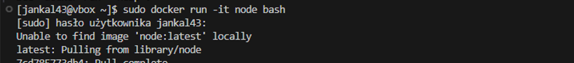
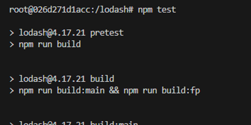
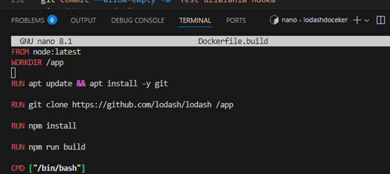

# Sprawozdanie 1

## Wprowadzenie
Sprawozdanie dokumentuje wykonanie ćwiczeń 1-4, obejmujących instalację systemu Fedora, konfigurację Git i SSH, pracę z gałęziami, instalację Dockera, budowanie i testowanie aplikacji w kontenerach oraz automatyzację procesu przy użyciu Docker Compose.

---

## Ćwiczenie 1: Instalacja Fedory i konfiguracja Git

Pierwszym krokiem było zainstalowanie systemu Fedora na wirtualnej maszynie oraz pobranie niezbędnych pakietów do realizacji dalszych kroków. Instalacja odbyła się poprzez pobranie obrazu systemu Fedora ze strony https://ftp.icm.edu.pl/pub/Linux/fedora/linux/releases/41/Everything/x86_64/iso/Fedora-Everything-netinst-x86_64-41-1.4.iso i skonfigurowanie maszyny wirtualnej za pomocą VirtualBox. Zainstalowano potrzebne aktualizacje i przystąpiono do instalacji gita.
Użyto do tego menedżera pakietów dnf i komendy: 

### Instalacja Gita:
   ```bash
   sudo dnf install git -y
   ```
Repozytorium projektu zostało skopiowane przy użyciu polecenia 'git clone', korzystając początkowo z protokołu HTTPS

### Klonowanie repozytorium
```bash
git clone https://github.com/InzynieriaOprogramowaniaAGH/MDO2025_INO
```
Aby skonfigurować dostęp SSH, wygenerowano dwa klucze SSH inne niż RSA. Jeden z nich został zabezpieczony hasłem. Proces generowania kluczy SSH wyglądał następująco:

## Konfiguracja dostępu SSH
1. Generowanie klucza SSH:
   ```bash
   ssh-keygen -t ed25519 -C "mój_email@example.com"
   ```
   

2. Uruchomienie agenta SSH:
   ```bash
   eval "$(ssh-agent -s)"
   ```
   
   
3. Dodanie klucza do agenta:
   ```bash
   ssh-add ~/.ssh/id_ed25519
   ```
    
4. Skopiowanie klucza publicznego:
   ```bash
   cat ~/.ssh/id_ed25519.pub
   ```
5. Dodanie klucza do GitHuba (Ustawienia → SSH and GPG keys).
6. Klonowanie repozytorium za pomocą SSH:
   ```bash
   git clone git@github.com:InzynieriaOprogramowaniaAGH/MDO2025_INO.git
   ```
### Praca z gałęziami Git
Przełączono się na gałąź main, a następnie na gałąź swojej grupy:
```bash
git checkout main
git checkout -b GCL01
```


 
Utworzono nową gałąź o nazwie JK415272 od gałęzi grupowej:
```bash
git checkout -b JK415272
```

Oraz przełączono się na nią.


 
W katalogu właściwym dla grupy utworzono nowy katalog o tej samej nazwie:
```bash
mkdir JK415272
```

### Tworzenie Git Hooka
Aby upewnić się, że każdy commit message zaczyna się od "JK415272", utworzono Git hooka:
Stworzono plik commit-msg w katalogu:
```bash
touch .git/hooks/commit-msg
chmod +x .git/hooks/commit-msg
```
Hook miał treść:
```bash
#!/bin/bash
EXPECTED_PREFIX="JK415272"
COMMIT_MSG_FILE="$1"
COMMIT_MSG=$(head -n 1 "$COMMIT_MSG_FILE")
if [[ "$COMMIT_MSG" != $EXPECTED_PREFIX* ]]; then
  echo "ERROR: Każdy commit message musi zaczynać się od: '$EXPECTED_PREFIX'"
  exit 1
fi
```
 
 
Następnie sprawdzono poprawność hooka:
```bash
git commit -m "JK415272: test commit"
```

 
 
### Wysyłanie zmian do repozytorium
Dodano zmiany do stagingu komendą:
```bash
git add .
```
Oraz wykonano poprawny commit:
```bash
git commit -m "JK415272: Dodano nowe pliki"
```
 

Wysłano zmiany do zdalnego repozytorium:
```bash
git push origin JK415272
```
 

Następnie spróbowano wyciągnąć gałąź do gałęzi grupowej:
```bash
git merge JK415272
```


## Ćwiczenie 2: Instalacja i konfiguracja Dockera

## Instalacja Dockera
Pierwszym krokiem było zainstalowanie Dockera w systemie Linux. Użyto do tego menedżera pakietów `dnf` i wykonano następującą komendę:

```bash
sudo dnf install docker -y
```


Po zakończeniu instalacji usługa Dockera została skonfigurowana do automatycznego uruchamiania przy starcie systemu:

```bash
sudo systemctl enable docker
```

Następnie sprawdzono status usługi, aby upewnić się, że Docker działa poprawnie:

```bash
sudo systemctl status docker
```

---

## Pobieranie obrazów Dockera
Po poprawnej instalacji Dockera pobrano następujące obrazy z repozytorium Docker Hub:

```bash
docker pull hello-world
sudo docker pull busybox
sudo docker pull mysql
sudo docker pull ubuntu
```


Każdy z tych obrazów zawiera system plików oraz środowisko uruchomieniowe wymagane do działania aplikacji lub usług.

---

## Uruchamianie kontenerów

### Uruchomienie kontenera BusyBox
Uruchomiono kontener na bazie obrazu `busybox` w trybie interaktywnym:

```bash
sudo docker run -it busybox --name busybox busybox
```


Po uruchomieniu kontenera zweryfikowano jego działanie, sprawdzając wersję systemu wewnątrz kontenera:

```bash
busybox | head -n 1
```


Komenda ta została użyta w celu wyodrębnienia pierwszej linii wyjściowej polecenia busybox, co pozwoliło na szybkie zidentyfikowanie wersji zainstalowanego pakietu Busybox.

Aby opuścić kontener, użyto polecenia:

```bash
exit
```

### Uruchomienie kontenera Ubuntu
Podobnie uruchomiono kontener na bazie obrazu `ubuntu` w trybie interaktywnym:

```bash
sudo docker run -it ubuntu ubuntuy /bin/bash
```


Po uruchomieniu sprawdzono procesy uruchomione wewnątrz kontenera, w tym proces `PID 1`, który jest głównym procesem kontenera:

```bash
ps aux
```


Następnie wyświetlono listę wszystkich procesów Dockera na hoście:

```bash
sudo docker ps -a
```


Aby zaktualizować pakiety wewnątrz kontenera, wykonano:

```bash
apt update && apt upgrade -y
```


Po zakończeniu pracy w kontenerze użyto polecenia `exit`, aby go opuścić.

---

## Tworzenie i budowanie własnego obrazu Docker

Aby stworzyć własny obraz Dockera, przygotowano plik `Dockerfile` z następującą treścią:

```
FROM ubuntu:late`st
LABEL maintainer="jankal43 <jankaletka43@gmail.com>"
RUN apt-get update && apt-get install -y git && rm -rf /var/lib/apt/lists/*
WORKDIR /repo
RUN git clone https://github.com/InzynieriaOprogramowaniaAGH/MDO2025_INO.git
CMD ["/bin/bash"]
```

Obraz został zbudowany i oznaczony jako `moj-obraz`:

```bash
sudo docker build -t moj-obraz .
```


Po zakończeniu procesu budowania uruchomiono kontener na podstawie nowo utworzonego obrazu:

```bash
sudo docker run -it moj-obraz
```


---

## Zarządzanie kontenerami

Wyświetlono listę wszystkich uruchomionych i zatrzymanych kontenerów:

```bash
sudo docker ps -a
```

Aby usunąć kontenery, użyto komendy:

```bash
sudo docker rm <nazwa-kontenera>
```


Dzięki temu usunięto wszystkie kontenery, zwalniając miejsce na dysku.

---

## Podsumowanie
Podczas zajęć przeprowadzono instalację Dockera, pobrano obrazy, uruchomiono kontenery oraz zweryfikowano ich działanie. Dodatkowo, zbudowano własny obraz Docker i zarządzano kontenerami, co pozwoliło na lepsze zrozumienie działania technologii konteneryzacji.

## Ćwiczenie 3: Praca z Node.js i Dockerfile

W ramach ćwiczenia przeprowadzono proces klonowania repozytorium, instalacji zależności, uruchamiania testów oraz konteneryzacji aplikacji z wykorzystaniem Dockera. Dodatkowo zautomatyzowano procesy za pomocą Dockerfile i Docker Compose, co pozwoliło na pełne odwzorowanie procesu CI/CD w środowisku kontenerowym.

---

## Klonowanie repozytorium i instalacja zależności

Pierwszym krokiem było sklonowanie wybranego repozytorium z GitHub. W tym przypadku pobrano repozytorium biblioteki Lodash:

```bash
git clone https://github.com/lodash/lodash
```
Wybrano repozytorium Lodash, ponieważ jest to popularna biblioteka JavaScript, szeroko stosowana w projektach wymagających operacji na tablicach, obiektach i funkcjach. Posiada dobrze zdefiniowany proces budowy i testowania z użyciem npm, co pozwala na łatwe zintegrowanie jej w pipeline CI/CD.


Po sklonowaniu repozytorium zainstalowano wymagane zależności do uruchomienia projektu:

```bash
sudo dnf install nodejs npm -y
npm install
```


Po zakończonej instalacji uruchomiono testy jednostkowe, aby zweryfikować poprawność działania kodu:

```bash
npm test
```


Wynik testów wskazywał na ich poprawne przejście (`test pass`).


---

## Przeprowadzenie buildu i testów w kontenerze

Aby powtórzyć powyższy proces w kontenerze, wykonano następujące kroki:

1. Uruchomiono kontener `node` w trybie interaktywnym:

   ```bash
   docker run -it node bash
   ```

   

2. Wewnątrz kontenera sklonowano repozytorium:

   ```bash
   git clone https://github.com/lodash/lodash
   cd lodash
   ```

   

3. Zainstalowano zależności oraz przeprowadzono build aplikacji:

   ```bash
   npm install
   npm run build
   ```

   
   

5. Uruchomiono testy jednostkowe:

   ```bash
   npm test
   ```

   

Podobnie jak w środowisku lokalnym, testy zakończyły się sukcesem.


---

## Automatyzacja procesu za pomocą Dockerfile

Aby zautomatyzować proces budowania i testowania aplikacji, stworzono dwa pliki `Dockerfile`.

### Plik `Dockerfile.build`



Plik ten definiuje proces budowania aplikacji. Na jego podstawie utworzono obraz przy użyciu polecenia:

```bash
sudo docker build -t my-node-app -f Dockerfile.build .
```


### Plik `Dockerfile.test`


Drugi plik `Dockerfile` bazuje na pierwszym i odpowiada za uruchamianie testów. Obraz testowy uruchomiono poleceniem:

```bash
sudo docker run --rm my-node-app-test
```

Testy również zakończyły się sukcesem.


---

## Automatyzacja procesu za pomocą Docker Compose


Aby ułatwić zarządzanie kontenerami, przygotowano plik `docker-compose.yml`, który pozwala na uruchomienie wszystkich procesów jednym poleceniem:

```bash
docker-compose up --build
```


Testy ponownie zakończyły się sukcesem, co potwierdziło poprawność automatyzacji procesu.


---

## Dyskusja na temat wdrażania kontenerów

Lodash jest biblioteką JavaScript przeznaczoną do wykorzystania w aplikacjach webowych, dlatego jej budowanie w kontenerze ma sens głównie w kontekście CI/CD. Publikowanie jej jako kontenera nie jest konieczne, ponieważ najczęściej jest dystrybuowana jako pakiet NPM. Jeśli jednak miałaby być wdrażana jako kontener, należałoby oczyścić go z plików builda i zależności deweloperskich. Alternatywnie proces mógłby obejmować trzeci kontener, który generowałby finalny artefakt, np. w postaci pakietu `.tgz`.

---

## Podsumowanie

Ćwiczenie pozwoliło na zapoznanie się z procesem konteneryzacji oprogramowania oraz automatyzacją procesu budowania i testowania kodu wewnątrz kontenerów. Dzięki zastosowaniu `Dockerfile` i `Docker Compose` udało się w pełni zautomatyzować uruchamianie i testowanie kodu Lodash, co znacząco ułatwia procesy CI/CD.

---
## Ćwiczenie 4: Dodatkowa terminologia w konteneryzacji, instancja Jenkins

Zachowywanie stanu w Dockerze

Krok 1: Utworzenie wolumenów input i output
Na początek tworzymy dwa wolumeny:

```bash
docker volume create input
docker volume create output
```


Sprawdzenie, czy wolumeny zostały utworzone:

```bash
docker volume ls
```

Krok 2: Uruchomienie kontenera bazowego node

```bash
docker run -it --name node-container \
  -v input:/app/input \
  -v output:/app/output \
  node bash
```


`-v input:/app/input` – montujemy wolumen wejściowy w `/app/input`.
`-v output:/app/output` – montujemy wolumen wyjściowy w `/app/output`.
`node` – używamy oficjalnego obrazu Node.js, ponieważ zawiera wszystkie niezbędne zależności do budowania projektu.

Krok 3: Sklonowanie repozytorium na wolumin input: Klonowanie repozytorium na hoście i kopiowanie do woluminu

```bash
git clone https://github.com/lodash/lodash ~/input_repo
docker cp ~/input_repo node-container:/app/input
```


Sprawdzenie zawartości woluminu:

```bash
docker exec -it node-container ls /app/input
```


Krok 4: Uruchomienie builda w kontenerze node

```bash
docker exec -it node-container bash -c "
  cd /app/input &&
  npm install &&
  npm run build &&
  cp -r dist /app/output"
```


Sprawdzamy zawartość output:

```bash
docker run --rm -v output:/app busybox ls /app
```


Krok 5: Automatyzacja procesu w Dockerfile z RUN --mount
Dockerfile:

```dockerfile
FROM node:latest
WORKDIR /app
RUN --mount=type=bind,target=/app git clone https://github.com/lodash/lodash /app
RUN cd /app && npm install && npm run build
```


Budowanie obrazu:

```bash
docker build -t node-builder .
docker run -v output:/app/output node-builder
```


---

W sprawozdaniu przedstawiono dwa podejścia do realizacji zadania: ręczne wykonywanie operacji za pomocą docker run, docker exec oraz automatyzację procesu przy użyciu Dockerfile i RUN --mount. Podejście manualne daje większą kontrolę nad poszczególnymi krokami, umożliwiając łatwe debugowanie, jednak jest mniej wygodne w kontekście automatyzacji. Z kolei wykorzystanie Dockerfile pozwala na powtarzalne i przewidywalne budowanie obrazu, co jest szczególnie przydatne w systemach CI/CD. Dzięki RUN --mount można dynamicznie podłączać woluminy podczas budowy obrazu, eliminując konieczność wcześniejszego kopiowania plików. To podejście jest bardziej efektywne i pozwala uniknąć zbędnych operacji, dlatego jest zalecane w przypadku automatycznego wdrażania, podczas gdy podejście manualne może być wygodniejsze do testowania zmian lokalnie.

Eksponowanie portu i testowanie sieci

Krok 1: Uruchomienie serwera iperf3 w kontenerze

```bash
docker run -d --name iperf-server -p 5201:5201 networkstatic/iperf3 -s
```

Serwer iperf3 nasłuchuje na porcie 5201, umożliwiając testowanie przepustowości sieci.


Krok 2: Znalezienie IP kontenera

```bash
docker inspect -f '{{range .NetworkSettings.Networks}}{{.IPAddress}}{{end}}' iperf-server
```


Krok 3: Uruchomienie klienta i test połączenia

```bash
docker run --rm ubuntu bash -c "apt update && apt install -y iperf3 && iperf3 -c 172.17.0.3"
```


Krok 4: Tworzenie Dockerfile do iperf3

```dockerfile
FROM ubuntu:22.04
RUN apt update && apt install -y iperf3
```


Krok 5: Tworzenie sieci Docker

```bash
docker network create --driver bridge iperf-net
```


Krok 6: Serwer i klient w jednej sieci

```bash
docker build -t iperf-ready -f Dockerfile.iperf .
docker run -d --name iperf-server --network iperf-net iperf-ready iperf3 -s
docker run --rm --network iperf-net iperf-ready iperf3 -c iperf-server
```


Krok 7: Połączenie z hosta

```bash
iperf3 -c $(docker inspect -f '{{range .NetworkSettings.Networks}}{{.IPAddress}}{{end}}' iperf-server)
```


Krok 8: Logi do woluminu

```bash
docker run --rm --network iperf-net -v /var/lib/docker/volumes/myvolume/_data:/output iperf-ready bash -c "iperf3 -c iperf-server > /output/ipref.log"
cat /var/lib/docker/volumes/myvolume/_data/ipref.log

```


Krok 9: Połączenie z poza hosta


```bash
docker run -d --name iperf-server --network iperf-net -p 5201:5201 iperf-ready iperf3 -s
iperf3 -c <IP_HOSTA>
```


---

Konfiguracja Jenkinsa

Krok 1: Tworzenie sieci dla Jenkinsa

```bash
docker network create jenkins-net
```


Krok 2: Uruchomienie jenkins-dind (Docker in Docker)

```bash
docker run -d --name jenkins-dind --network jenkins-net --privileged docker:dind
```

Krok 3: Uruchomienie Jenkinsa

```bash
docker volume create jenkins_home

docker run -d --name jenkins \
  --network jenkins-net \
  -p 8080:8080 -p 50000:50000 \
  -v jenkins_home:/var/jenkins_home \
  jenkins/jenkins:lts
```


Krok 4: Uruchomienie Jenkinsa


Otworzenie ekranu logowania 


