# Sprawozdanie: Konfiguracja Jenkins z Dockerem i Blue Ocean

## Cel
Celem ćwiczenia było skonfigurowanie środowiska Jenkins z użyciem Dockera oraz pluginów Blue Ocean i Docker Workflow, umożliwiających łatwą integrację i zarządzanie pipeline'ami CI/CD. Proces został przeprowadzony na maszynie wirtualnej działającej na systemie Fedora.

## Przebieg

### Krok 1: Tworzenie sieci Docker
Na początku utworzono sieć Docker o nazwie `jenkins`:
```bash
docker network create jenkins
```
 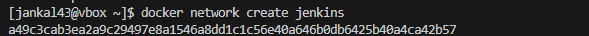

### Krok 2: Uruchomienie kontenera Docker-in-Docker
Następnie uruchomiono kontener `docker:dind`, który jest używany do uruchamiania Dockera wewnątrz kontenera (Docker-in-Docker). Kontener został uruchomiony z odpowiednimi parametrami, w tym ustawieniem sieci `jenkins` i aliasem `docker`:
```bash
docker run \
  --name jenkins-docker \
  --rm \
  --detach \
  --privileged \
  --network jenkins \
  --network-alias docker \
  --env DOCKER_TLS_CERTDIR=/certs \
  --volume jenkins-docker-certs:/certs/client \
  --volume jenkins-data:/var/jenkins_home \
  --publish 2376:2376 \
  docker:dind \
  --storage-driver overlay2
```

 
Po tym poleceniu kontener `jenkins-docker` został uruchomiony. Użycie flagi `--privileged` jest wymagane, aby Docker w kontenerze miał dostęp do funkcji systemowych, takich jak dostęp do urządzeń.
 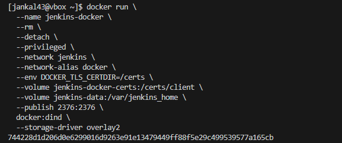

### Krok 3: Tworzenie obrazu Docker z Jenkins i pluginami
Kolejnym krokiem było stworzenie własnego obrazu Docker z Jenkins, zawierającego zainstalowane pluginy Blue Ocean oraz Docker Workflow. Utworzono plik `Dockerfile`, który bazuje na oficjalnym obrazie `jenkins/jenkins:2.492.3-jdk21`. Zainstalowano Docker CLI i wymagane certyfikaty:
```Dockerfile
FROM jenkins/jenkins:2.492.3-jdk21

USER root
RUN apt-get update && apt-get install -y lsb-release ca-certificates curl && \
    install -m 0755 -d /etc/apt/keyrings && \
    curl -fsSL https://download.docker.com/linux/debian/gpg -o /etc/apt/keyrings/docker.asc && \
    chmod a+r /etc/apt/keyrings/docker.asc && \
    echo "deb [arch=$(dpkg --print-architecture) signed-by=/etc/apt/keyrings/docker.asc] \
    https://download.docker.com/linux/debian $(. /etc/os-release && echo \"$VERSION_CODENAME\") stable" \
    | tee /etc/apt/sources.list.d/docker.list > /dev/null && \
    apt-get update && apt-get install -y docker-ce-cli && \
    apt-get clean && rm -rf /var/lib/apt/lists/*

USER jenkins
RUN jenkins-plugin-cli --plugins "blueocean docker-workflow"
```
Obraz został zbudowany za pomocą komendy:
```bash
docker build -t myjenkins-blueocean:2.492.3-1 .
```


### Krok 4: Uruchomienie kontenera Jenkins
Po zbudowaniu obrazu uruchomiono kontener Jenkins z ustawieniami pozwalającymi na połączenie z Dockerem wewnątrz kontenera. Kontener skonfigurowano z odpowiednimi portami, certyfikatami oraz woluminami:
```bash
docker run \
  --name jenkins-blueocean \
  --restart=on-failure \
  --detach \
  --network jenkins \
  --env DOCKER_HOST=tcp://docker:2376 \
  --env DOCKER_CERT_PATH=/certs/client \
  --env DOCKER_TLS_VERIFY=1 \
  --publish 8080:8080 \
  --publish 50000:50000 \
  --volume jenkins-data:/var/jenkins_home \
  --volume jenkins-docker-certs:/certs/client:ro \
  myjenkins-blueocean:2.492.3-1
```
Po uruchomieniu kontenera Jenkins był dostępny na porcie `8080`, a serwis Docker był połączony z kontenerem Jenkins dzięki certyfikatom TLS.

 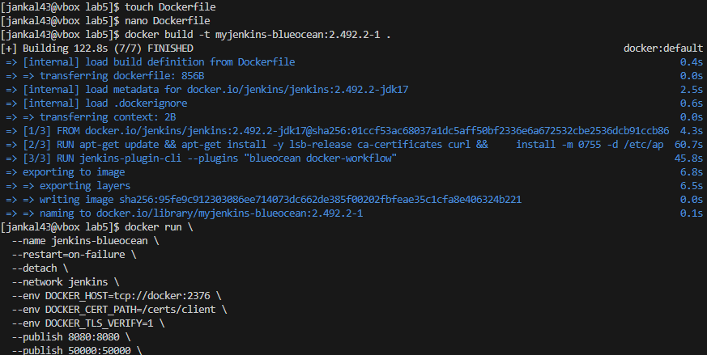


### Krok 5: Weryfikacja działania
Po uruchomieniu kontenera Jenkins, dostęp do interfejsu użytkownika można było uzyskać przez przeglądarkę internetową pod adresem:
```text
http://<adres-ip>:8080
```
 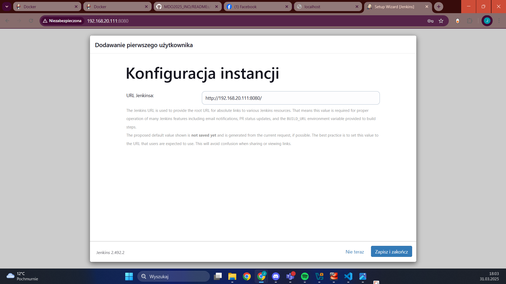


Hasło do odblokowania Jenkinsa uzyskano za pomocą polecenia:
```bash
docker logs jenkins-blueocean
```

Następnie utworzono nowe konto użytkownika i wybrano instalację sugerowanych pluginów.


### Zadania wstępne

#### Projekt 1: Wyświetlenie informacji o systemie
Stworzono prosty projekt, który w konsoli wypisuje wynik polecenia `uname`.

 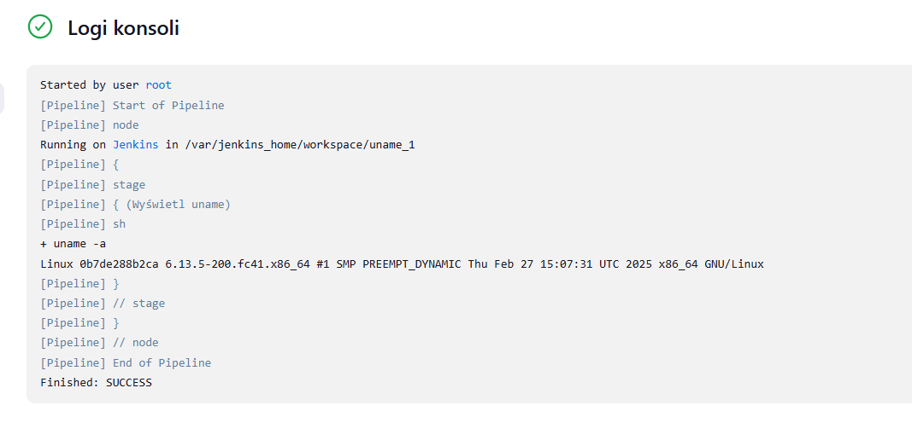


Wykorzystalem do tego pipeline
```bash
pipeline {
    agent any

    stages {
        stage('Wyświetl uname') {
            steps {
                sh 'uname -a'
            }
        }
    }
}
```
#### Projekt 2: Sprawdzenie parzystości godziny
Kolejnym projektem było stworzenie skryptu bashowego, który sprawdza, czy aktualna godzina jest parzysta, czy nie:
```bash
#!/bin/bash
HOUR=$(date +%H)
if [ $((10#$HOUR % 2)) -ne 0 ]; then
  echo "Hour is odd: $HOUR"
  exit 1
else
  echo "Hour is even: $HOUR"
fi
```

 


#### Projekt 3: Pobranie obrazu Ubuntu
Ostatnim testowym zadaniem było przygotowanie projektu, który za pomocą polecenia:
```bash
docker pull ubuntu
```
pobiera obraz systemu Ubuntu z repozytorium Dockera.

 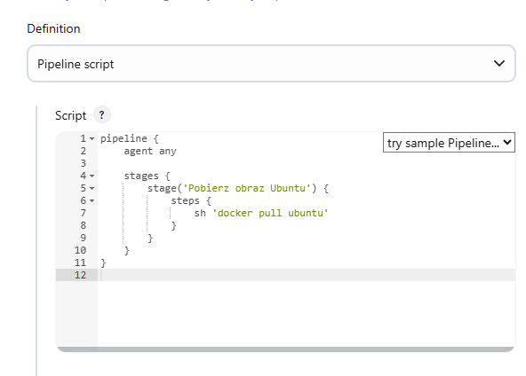
 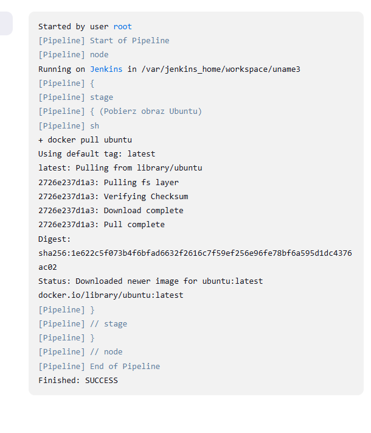

#### Zadanie Wstepne
Zaimplementowano pipeline, który w sposób ciągły integruje zmiany w gałęzi JK415272 repozytorium MD02025_INO i dostarcza gotowy do użycia obraz Dockera, budowany na podstawie Dockerfile.

Kod pipeline
```bash
pipeline {
    agent any

    stages {
        stage('Clone repo') {
            steps {
                git url: 'https://github.com/InzynieriaOprogramowaniaAGH/MDO2025_INO.git', branch: 'JK415272'
            }
        }

        stage('Build Docker (BUILD)') {
            steps {
                script {
                    sh 'docker build -t moj-builder -f INO/GCL01/JK415272/Sprawozdanie1/Dockerfile.build .'
                }
            }
        }
    }
}

```
 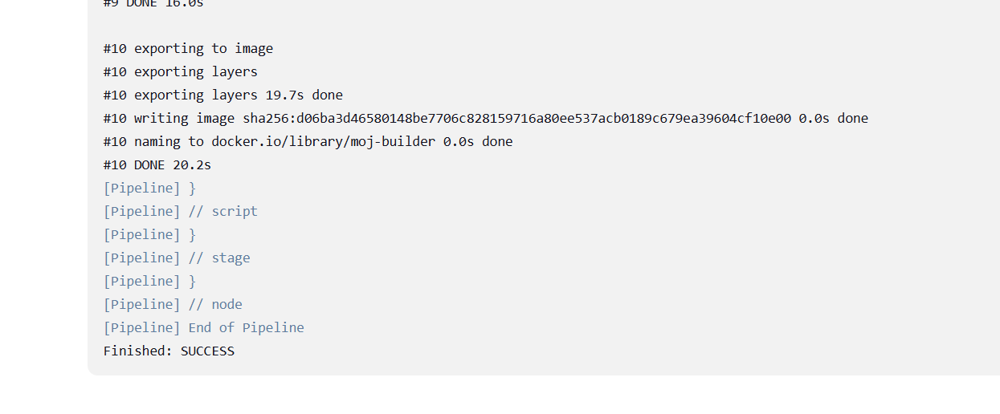


# 3. Projekt Pipeline CI dla Aplikacji Webowej

Na podstawie wymagań zadania, zaprojektowano i zaimplementowano kompletny pipeline CI dla prostej aplikacji webowej wykorzystującej JavaScript (Lodash).

## 3.1. Opis Celu i Projekt Procesu CI (Diagramy UML)


### 3.1.1. Wymagania Wstępne Środowiska
Konfiguracja Środowiska Docker i Jenkins. Kluczowe elementy to: repozytorium Git, działający Jenkins z dostępem do Dockera (DIND), dostęp do obrazów bazowych Docker (node, nginx, alpine/curl) oraz łączność sieciowa między kontenerami.

### 3.1.2. Diagram Aktywności Procesu CI
Diagram ten ilustruje kolejne etapy przepływu pracy w pipeline.

 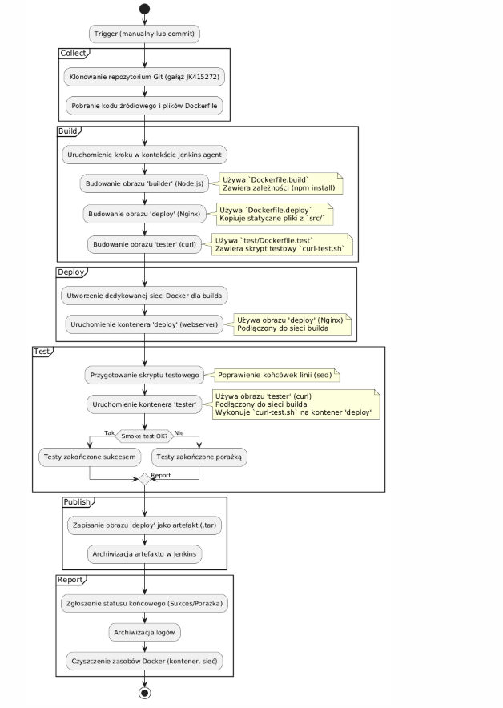

Opis Diagramu Aktywności: Diagram odzwierciedla kroki zaimplementowane w finalnym Jenkinsfile. Rozpoczyna się od pobrania kodu, następnie buduje trzy obrazy Docker (builder, deploy, tester). W etapie Deploy uruchamia kontener z aplikacją. Etap Test przygotowuje skrypt testowy i uruchamia kontener testera, który wykonuje test curl na wdrożonej aplikacji. Jeśli test przejdzie, obraz deploy jest zapisywany jako artefakt (.tar) i archiwizowany. Niezależnie od wyniku, na końcu następuje raportowanie i czyszczenie zasobów.

### 3.1.3. Diagram Wdrożeniowy
Diagram ten pokazuje statyczną strukturę komponentów i artefaktów w środowisku wykonawczym pipeline'u.

 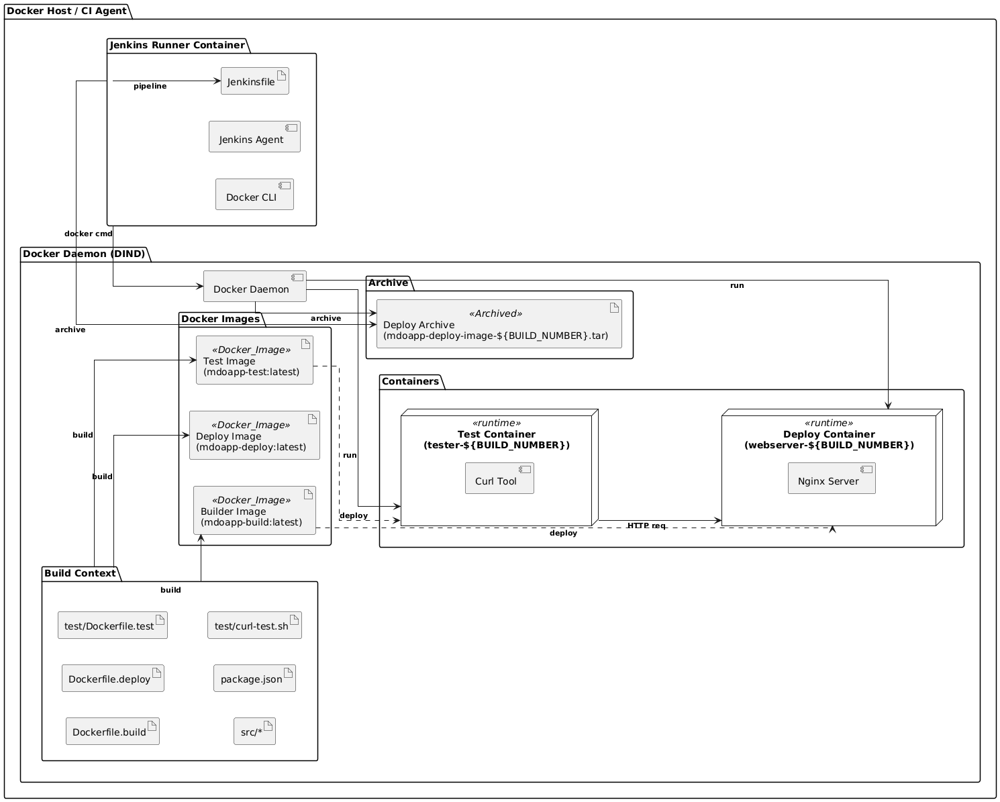

Opis Diagramu Wdrożeniowego: Diagram pokazuje Hosta, na którym działa Kontener Jenkins Runner (z agentem i Docker CLI) oraz Kontener Docker Daemon (DIND). Runner komunikuje się z DIND, aby zarządzać obrazami i kontenerami. Wewnątrz DIND budowane są obrazy: BuildImage (Node.js z zależnościami), DeployImage (Nginx z aplikacją) i TestImage (z curl i skryptem testowym). Na podstawie obrazów uruchamiane są kontenery: DeployContainer (serwujący aplikację) i TestContainer (wykonujący test). TestContainer wysyła żądanie HTTP do DeployContainer. Wynikowy obraz DeployImage jest zapisywany jako TarArtifact i archiwizowany przez Runnera w Jenkinsie.

## 3.2. Implementacja Pipeline'u

### 3.2.1. Jenkinsfile
Główna logika CI/CD została zdefiniowana w pliku Jenkinsfile przy użyciu składni deklaratywnej.

```groovy
pipeline {
    agent any

    environment {
        DOCKER_NETWORK         = "jenkins-net-${BUILD_NUMBER}"
        DEPLOY_CONTAINER_NAME  = "webserver-${BUILD_NUMBER}"
        BUILD_IMAGE_NAME       = "mdoapp-build:latest"
        DEPLOY_IMAGE_NAME      = "mdoapp-deploy:latest"
        TEST_IMAGE_NAME        = "mdoapp-test:latest"
        ARTIFACT_NAME          = "mdoapp-deploy-image-${BUILD_NUMBER}.tar"
        GIT_REPO_URL           = 'https://github.com/InzynieriaOprogramowaniaAGH/MDO2025_INO.git'
    }

    stages {
        stage('Clone Repository') {
            steps {
                echo "Cloning repository: ${env.GIT_REPO_URL}"
                git url: env.GIT_REPO_URL, branch: 'JK415272'
                script {
                    env.GIT_COMMIT_HASH = sh(script: 'git rev-parse --short HEAD', returnStdout: true).trim()
                    echo "Checked out commit: ${env.GIT_COMMIT_HASH}"
                }
                sh 'pwd'
                sh 'ls -la'
            }
        }

        stage('Move to Pipeline Directory') {
            steps {
                dir('INO/GCL01/JK415272/Sprawozdanie2/pipeline') {
                    echo "Changed to project pipeline directory."
                    sh 'ls -la'
                }
            }
        }

        stage('Build Application') {
            steps {
                dir('INO/GCL01/JK415272/Sprawozdanie2/pipeline') {
                    echo "Building 'builder' image: ${env.BUILD_IMAGE_NAME}"
                    sh "docker build -t ${env.BUILD_IMAGE_NAME} -f Dockerfile.build ."
                    echo "Builder image created."
                }
            }
        }

        stage('Build Deploy Image') {
            steps {
                dir('INO/GCL01/JK415272/Sprawozdanie2/pipeline') {
                    echo "Building 'deploy' image: ${env.DEPLOY_IMAGE_NAME}"
                    sh "docker build -t ${env.DEPLOY_IMAGE_NAME} -f Dockerfile.deploy ."
                    echo "Deploy image created."
                }
            }
        }

        stage('Deploy Application') {
            steps {
                echo "Creating Docker network: ${env.DOCKER_NETWORK}"
                sh "docker network create ${env.DOCKER_NETWORK} || true"

                echo "Starting container '${env.DEPLOY_CONTAINER_NAME}' from image ${env.DEPLOY_IMAGE_NAME}..."
                sh "docker run -d --name ${env.DEPLOY_CONTAINER_NAME} --network ${env.DOCKER_NETWORK} ${env.DEPLOY_IMAGE_NAME}"
                echo "Container ${env.DEPLOY_CONTAINER_NAME} started."
            }
        }

        stage('Prepare Smoke Test Script') {
            steps {
                dir('INO/GCL01/JK415272/Sprawozdanie2/pipeline') {
                    echo "Fixing line endings in test script..."
                    sh 'ls -la'
                    sh "sed -i 's/\\r\$//' test/curl-test.sh"
                }
            }
        }

       stage('Verify Deployment (Smoke Test)') {
            steps {
                dir('INO/GCL01/JK415272/Sprawozdanie2/pipeline') {
                    echo "Building 'tester' image: ${env.TEST_IMAGE_NAME}"
                    sh "docker build -t ${env.TEST_IMAGE_NAME} -f test/Dockerfile.test ."

                    echo "Running smoke test..."
                
                    sh "docker run --rm --network ${env.DOCKER_NETWORK} ${env.TEST_IMAGE_NAME} ${env.DEPLOY_CONTAINER_NAME}"

                   
                    echo "Smoke test passed!" 
                }
            }
        }

        stage('Publish Artifact') {
            steps {
                echo "Saving deploy image ${env.DEPLOY_IMAGE_NAME} to ${env.ARTIFACT_NAME}"
                sh "docker save ${env.DEPLOY_IMAGE_NAME} > ${env.ARTIFACT_NAME}"

                echo "Archiving artifact: ${env.ARTIFACT_NAME}"
                archiveArtifacts artifacts: env.ARTIFACT_NAME, fingerprint: true
            }
        }
    }

    post {
        always {
            echo "Cleaning up Docker resources..."
            sh "docker stop ${env.DEPLOY_CONTAINER_NAME} || true"
            sh "docker rm ${env.DEPLOY_CONTAINER_NAME} || true"
            sh "docker network rm ${env.DOCKER_NETWORK} || true"
        }
        success {
            echo 'Pipeline finished successfully!'
        }
        failure {
            echo 'Pipeline failed!'
        }
    }
}
```

- **Uzasadnienie agent any**: Na potrzeby tego zadania wystarczy uruchomienie na dowolnym agencie (w naszym przypadku głównym kontenerze Jenkins), który ma dostęp do środowiska Docker (DIND). Dla bardziej złożonych scenariuszy można definiować dedykowane agenty (np. w kontenerach Docker) dla poszczególnych etapów.
- **Uzasadnienie zmiennych środowiskowych**: Użycie zmiennych ułatwia zarządzanie nazwami obrazów, kontenerów i sieci, zapewniając spójność i unikalność (dzięki BUILD_NUMBER) w kolejnych uruchomieniach pipeline'u.
- **Uzasadnienie podziału na etapy (stages)**: Podział na logiczne etapy (Clone, Build, Deploy, Test, Publish) poprawia czytelność pipeline'u, ułatwia monitorowanie postępu w interfejsie Blue Ocean i pozwala na łatwiejsze debugowanie w razie błędów.
- **Uzasadnienie dir(...)**: Kroki budowania i testowania są wykonywane w kontekście katalogu INO/GCL01/JK415272/Sprawozdanie2/pipeline, ponieważ tam znajdują się odpowiednie pliki Dockerfile, kod źródłowy (src) i skrypt testowy (test).
- **Uzasadnienie post { always { ... } }**: Sekcja post zapewnia wykonanie kroków czyszczących zasoby Docker (kontener, sieć) niezależnie od tego, czy pipeline zakończył się sukcesem, czy porażką. Zapobiega to pozostawianiu niepotrzebnych, działających kontenerów i sieci po każdym buildzie.

### 3.2.2. Pliki Dockerfile

Zdefiniowano trzy pliki Dockerfile: dla środowiska budowania, środowiska wdrożeniowego i środowiska testowego.

**Dockerfile.build**
```
FROM node:20-alpine

LABEL stage="builder"

WORKDIR /app

WORKDIR /app

COPY package.json ./

RUN npm install

COPY src/ ./src
```

- **Uzasadnienie obrazu bazowego (node:20-alpine)**: Wybrano wersję LTS Node.js (20) dla stabilności. Wariant alpine jest znacznie mniejszy niż standardowe obrazy bazujące na Debianie (node:20), co przyspiesza pobieranie obrazu i zmniejsza zużycie miejsca na dysku. Jest to wystarczające dla wielu aplikacji Node.js, które nie mają skomplikowanych zależności systemowych.
- **Uzasadnienie kroków**: Kolejność kopiowania (package.json najpierw, potem reszta kodu) i RUN npm install jest zoptymalizowana pod kątem wykorzystania mechanizmu cache'owania warstw Dockera.

**Dockerfile.deploy**
```
FROM nginx:alpine
LABEL stage="deploy"

RUN rm /usr/share/nginx/html/*

COPY src/ /usr/share/nginx/html
```

- **Uzasadnienie obrazu bazowego (nginx:alpine)**: Nginx jest wydajnym i popularnym webserwerem/reverse proxy. Wersja alpine jest minimalna, co jest idealne dla kontenera produkcyjnego - mniejsza powierzchnia ataku i mniejszy rozmiar.
- **Uzasadnienie kroków**: Usuwamy domyślną zawartość i kopiujemy pliki statyczne naszej aplikacji (index.html, app.js) do katalogu /usr/share/nginx/html, który jest domyślnym miejscem serwowania plików przez Nginx w tym obrazie.

**test/Dockerfile.test**
```
FROM mdoapp-build:latest
LABEL stage="tester"

RUN apk add --no-cache curl

WORKDIR /test

COPY test/curl-test.sh .
RUN chmod +x curl-test.sh

ENTRYPOINT ["./curl-test.sh"]
```

- **Uzasadnienie obrazu bazowego (mdoapp-build:latest)**: W tym przypadku wybrano bazowanie na obrazie buildera. Alternatywnie, dla tak prostego testu można było użyć alpine:latest i doinstalować curl, co dałoby mniejszy obraz testowy. Bazowanie na builderze może być uzasadnione, jeśli testy wymagałyby np. Node.js lub innych narzędzi już tam zainstalowanych. W tym konkretnym przykładzie użycie alpine:latest byłoby bardziej optymalne pod kątem rozmiaru.
- **Uzasadnienie kroków**: Instalujemy curl, kopiujemy skrypt testowy, nadajemy mu prawa wykonania i ustawiamy go jako ENTRYPOINT, aby kontener po uruchomieniu od razu wykonał test.

## 3.2.3. Skrypt Testowy (`test/curl-test.sh`)

Skrypt ten wykonuje prosty test "smoke", sprawdzając, czy wdrożona aplikacja odpowiada poprawnie na żądanie HTTP i czy zawiera oczekiwane elementy.

```bash
#!/bin/sh

TARGET_HOST=$1
TARGET_URL="http://${TARGET_HOST}:80" 

echo "Testing URL: ${TARGET_URL}/index.html"

STATUS_CODE=$(curl -s -o /dev/null -w "%{http_code}" ${TARGET_URL}/index.html)

if [ "$STATUS_CODE" -eq 200 ]; then
    echo "Test Passed: Received HTTP 200 for index.html!"
else
    echo "Test Failed: Received HTTP $STATUS_CODE for index.html (expected 200)!"
    exit 1
fi

echo "Checking content of index.html..."
CONTENT_CHECK=$(curl -s ${TARGET_URL}/index.html | grep -E 'lodash.min.js|app.js|<h1 id="output">')

if [ $(echo "$CONTENT_CHECK" | wc -l) -ge 2 ]; then
     echo "Test Passed: Found references to lodash, app.js, and output element in index.html."
     exit 0 
else
     echo "Test Failed: Could not find expected references in index.html."
     echo "Found: $CONTENT_CHECK"
     exit 1 
fi
```

- **Uzasadnienie testu**: Wybrano prosty test curl, ponieważ jest łatwy do implementacji i szybko weryfikuje podstawową dostępność aplikacji (odpowiedź HTTP 200) oraz obecność kluczowych elementów na stronie (skrypty JS, element HTML), co daje podstawowe pojęcie, czy wdrożenie się powiodło i czy aplikacja jest serwowana poprawnie. Dla bardziej złożonych aplikacji należałoby użyć bardziej zaawansowanych testów E2E (np. Selenium, Cypress, Playwright).


## 3.2.4. Kod Aplikacji (`src/index.html`, `src/app.js`, `package.json`)

Aplikacja jest bardzo prosta - strona HTML, która ładuje bibliotekę Lodash z CDN i prosty skrypt app.js, który używa funkcji Lodash do modyfikacji treści elementu H1.

### `src/index.html`

```html
<!DOCTYPE html>
<html lang="en">
<head>
    <meta charset="UTF-8">
    <title>Lodash Test Page</title>
</head>
<body>
    <h1 id="output"></h1>

    <script src="https://cdn.jsdelivr.net/npm/lodash@4.17.21/lodash.min.js"></script>
    <script src="app.js"></script>
</body>
</html>
```

### `src/app.js`

```javascript
// Proste użycie funkcji capitalize z biblioteki Lodash
const output = _.capitalize('hello world from lodash!');
// Wstawienie wyniku do elementu H1 o id="output"
document.getElementById('output').innerText = output;
```

### `package.json`

```json
{
  "name": "mdo-simple-app",
  "version": "1.0.0",
  "description": "Simple app for MDO Jenkins pipeline",
  "main": "src/app.js",
  "scripts": {
    "test": "echo \"Error: no test specified\" && exit 1"
  },
  "author": "JK415272",
  "license": "ISC",
  "dependencies": {
    "lodash": "^4.17.21"
  }
}
```


- **Uzasadnienie package.json:** Nawet dla tak prostej aplikacji, package.json jest standardem w ekosystemie Node.js. Definiuje metadane projektu i zależności (nawet jeśli nie są używane w runtime, jak tutaj lodash). Obecność lodash w dependencies powoduje jego instalację w obrazie builder podczas npm install.

---

## Wyniki

 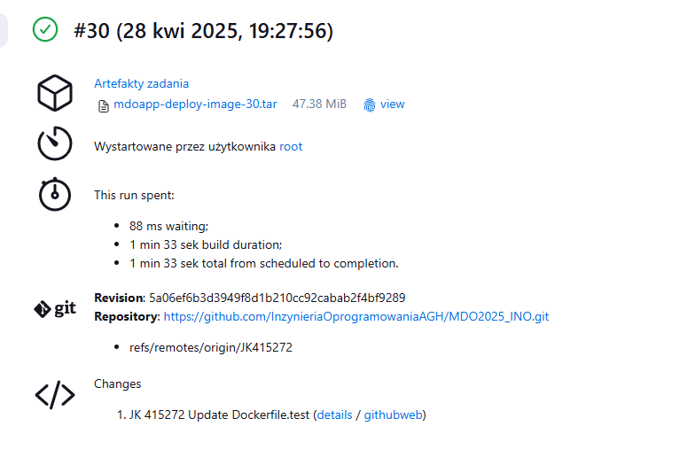

 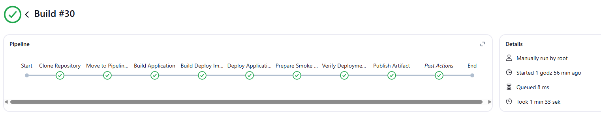

## 3.3. Dyskusja: Docker-in-Docker vs Dostęp do Gniazda Hosta

Pipeline został skonfigurowany do używania Docker-in-Docker (DIND). Istnieje alternatywne podejście polegające na udostępnieniu gniazda Docker hosta (/var/run/docker.sock) bezpośrednio kontenerowi Jenkinsa.

Docker-in-Docker (DIND - użyte podejście):

 - Zalety: Pełna izolacja środowiska Docker używanego przez Jenkins od  
   Dockera działającego na hoście. Każdy build może potencjalnie działać
   w czystym, odizolowanym środowisku Docker. Może być postrzegane jako 
   bezpieczniejsze, ponieważ kompromitacja Jenkinsa nie daje   
   bezpośredniego dostępu do Dockera hosta.
 - Wady: Wymaga uruchomienia    kontenera DIND w trybie --privileged, co
   samo w sobie niesie ryzyko    bezpieczeństwa. Może być mniej wydajne
   (nakładka systemu plików    wewnątrz nakładki). Potencjalne problemy
   z cache'owaniem warstw    między kolejnymi buildami, jeśli kontener
   DIND jest tymczasowy (w tym    przykładzie woluminy pomagają).
   Bardziej złożona konfiguracja    sieciowa i certyfikatów TLS.

Dostęp do Gniazda Hosta (-v /var/run/docker.sock:/var/run/docker.sock):

 - Zalety: Prostsza konfiguracja. Lepsza wydajność, ponieważ Jenkins
   używa bezpośrednio demona Docker hosta. Efektywniejsze wykorzystanie 
   cache'u warstw Dockera na hoście między buildami.

   

 - Wady: Mniejsza izolacja. Jeśli Jenkins zostanie skompromitowany,
   atakujący uzyskuje dostęp do demona Docker hosta z takimi samymi   
   uprawnieniami jak użytkownik uruchamiający demona (często root).   
   Potencjalne konflikty nazw kontenerów/sieci, jeśli inne procesy na   
   hoście również używają Dockera intensywnie.

Wybór: DIND zostało wybrane zgodnie z instrukcjami zadania, aby przećwiczyć ten mechanizm. W wielu środowiskach produkcyjnych preferuje się dostęp do gniazda hosta z odpowiednimi środkami bezpieczeństwa (np. uruchamianie Jenkinsa jako użytkownik nie-root należący do grupy docker) lub używanie dedykowanych agentów Docker uruchamianych poza kontenerem Jenkinsa.


## 3.4. Dyskusja: Wdrożenie Aplikacji i Format Dystrybucji

### 3.4.1. Format Dystrybucyjny

- Paczki Systemowe (DEB/RPM) / Archiwa (TAR/ZIP/JAR/NUPKG): Tradycyjne podejście. Wymaga przygotowania skryptów instalacyjnych, zarządzania zależnościami na maszynie docelowej, konfiguracji środowiska (np. webserwera). Dobre dla aplikacji desktopowych, narzędzi CLI, bibliotek lub gdy wdrażamy na systemy bez Dockera.
- Obraz Docker (użyte podejście): Nowocześniejsze podejście dla aplikacji webowych i usług. Obraz zawiera aplikację wraz ze wszystkimi zależnościami systemowymi i środowiskiem uruchomieniowym (np. Node.js, Nginx). Zapewnia spójność środowiska między developmentem, testowaniem a produkcją ("działa na mojej maszynie" -> działa wszędzie). Ułatwia skalowanie i zarządzanie wdrożeniami (np. przez Kubernetes, Docker Swarm).

Wybór: Dla tej aplikacji webowej dystrybucja jako obraz Docker jest najbardziej odpowiednia. Zamyka aplikację i jej środowisko (webserwer Nginx) w jednej, przenośnej jednostce.

### 3.4.2. Zawartość Obrazu Docker

Czy obraz Docker powinien zawierać zawartość sklonowanego repozytorium, logi i artefakty z builda?
Nie. Produkcyjny obraz Docker powinien być jak najmniejszy i zawierać tylko to, co jest niezbędne do uruchomienia aplikacji. Obejmuje to:

 - Kod aplikacji (np. skompilowane pliki JS, HTML, CSS).
 - Niezbędne zależności runtime (np. biblioteki systemowe, interpreter
   jak Node.js - jeśli nie jest to tylko serwowanie plików statycznych).
 - Serwer aplikacji lub webserwer (np. Nginx).
 - Minimalne pliki konfiguracyjne.
 - Historii Git
 - Logów z procesu budowania.
 - Niepotrzebnych plików tymczasowych.

Nie powinien zawierać:

 - Kodu źródłowego (chyba że jest to język interpretowany i kod źródłowy
   jest bezpośrednio uruchamiany).
 - Narzędzi deweloperskich i zależności potrzebnych tylko do budowania

W tym projekcie: Obraz mdoapp-deploy:latest zawiera tylko Nginx i pliki statyczne z katalogu src. Nie zawiera Node.js, node_modules, ani Dockerfileów. Jest to zgodne z dobrymi praktykami.

### 3.4.3. Obraz `node` vs `node-slim` vs `node-alpine`

`node:<version>` (np. node:20): Pełny obraz, zazwyczaj bazujący na Debianie. Zawiera Node.js, npm oraz wiele standardowych narzędzi i bibliotek systemowych. Największy rozmiar, ale najbardziej kompatybilny.

`node:<version>-slim` (np. node:20-slim): Obraz bazujący na Debianie, ale odchudzony. Zawiera tylko niezbędne zależności do uruchomienia Node.js. Znacznie mniejszy niż pełny obraz. Dobry kompromis między rozmiarem a kompatybilnością.

`node:<version>-alpine` (np. node:20-alpine - użyty w builderze): Obraz bazujący na Alpine Linux - bardzo minimalistycznej dystrybucji. Najmniejszy rozmiar. Może wymagać ręcznej instalacji niektórych zależności systemowych, które są obecne w obrazach bazujących na Debianie. Może mieć problemy z kompatybilnością niektórych pakietów npm, które polegają na glibc (Alpine używa musl libc).

---

## 3.5. Krok Publish: Artefakt i Wersjonowanie

### 3.5.1. Wybór Artefaktu

Jako artefakt wynikowy pipeline'u zdecydowano się publikować gotowy obraz Docker mdoapp-deploy:latest zapisany jako plik archiwum .tar.

Uzasadnienie:
Kompletność: Plik .tar zawiera wszystkie warstwy i metadane obrazu Docker, gotowe do załadowania (docker load -i <plik.tar>) i uruchomienia na dowolnej maszynie z Dockerem. Jest to kompletna, działająca jednostka wdrożeniowa.
Prostota: Zapisanie obrazu do pliku .tar jest proste i nie wymaga konfiguracji zewnętrznego rejestru Docker (jak Docker Hub czy Harbor). Artefakt jest bezpośrednio dostępny w Jenkinsie.
Alternatywy:
Push do Rejestru Docker: Bardziej standardowe podejście w środowiskach produkcyjnych, ułatwia dystrybucję i zarządzanie wersjami obrazów. Wymaga jednak konfiguracji rejestru i uwierzytelniania.
Archiwum ZIP/TAR z plikami aplikacji: Mniej praktyczne, ponieważ wymagałoby dodatkowych kroków po stronie serwera docelowego (instalacja Nginx, konfiguracja). Obraz Docker zawiera już wszystko.
Instalator (DEB/RPM): Nieodpowiednie dla tego typu aplikacji i podejścia kontenerowego.

### 3.5.2. Wersjonowanie Artefaktu

Artefakt (plik .tar) jest wersjonowany przy użyciu numeru builda Jenkinsa: mdoapp-deploy-image-${BUILD_NUMBER}.tar
Uzasadnienie:
Unikalność: Każde pomyślne uruchomienie pipeline'u generuje artefakt z unikalną nazwą.
Identyfikowalność: Nazwa pliku bezpośrednio wskazuje na konkretne wykonanie pipeline'u w Jenkinsie, co ułatwia powiązanie artefaktu z logami, zmianami w kodzie (hash commitu jest logowany we wcześniejszych etapach) i wynikami testów.
Prostota: Jest to najprostszy mechanizm wersjonowania dostępny w Jenkinsie bez dodatkowych narzędzi.
Alternatywy (Semantic Versioning): W bardziej zaawansowanych scenariuszach można by implementować wersjonowanie semantyczne (np. 1.0.0, 1.1.0) bazujące na tagach Git lub zmianach w package.json, ale wymagałoby to dodatkowej logiki w pipeline'ie.


### 3.5.3. Dostępność Artefaktu

Artefakt jest publikowany jako rezultat builda w Jenkinsie za pomocą kroku archiveArtifacts. Jest on dostępny do pobrania bezpośrednio z interfejsu Jenkinsa dla danego builda.

### 3.6. Krok Wskazówka: Obraz Runtime'owy i Weryfikacja

Zadanie sugeruje stworzenie obrazu runtime'owego zasilonego artefaktem i jego uruchomienie/weryfikację. W zaimplementowanym pipeline'ie:

Formą redystrybucyjną (artefaktem) jest sam obraz Docker (mdoapp-deploy:latest) zapisany do pliku .tar.

Obraz mdoapp-deploy:latest jest obrazem runtime'owym. Został zbudowany na bazie nginx:alpine (minimalny runtime) i zawiera tylko niezbędne pliki aplikacji, bez zależności deweloperskich.

Weryfikacja działania tego obrazu odbywa się już w kroku Verify Deployment (Smoke Test). Kontener jest uruchamiany z tego obrazu (docker run ... ${env.DEPLOY_IMAGE_NAME}), a następnie testowany za pomocą curl.

Zatem, zaimplementowany pipeline już realizuje ideę weryfikacji działania obrazu runtime'owego, który jest jednocześnie publikowanym artefaktem.

### 3.7. Napotkane Problemy i Rozwiązania

Podczas implementacji napotkano drobny problem związany z końcówkami linii w skrypcie curl-test.sh. Jeśli plik został edytowany w systemie Windows (który używa CRLF jako końca linii) i uruchomiony w kontenerze Linux (który oczekuje LF), interpreter sh mógł zgłaszać błędy lub niepoprawnie interpretować skrypt.

Rozwiązanie: W pipeline dodano krok Prepare Smoke Test Script, który używa polecenia `sed -i 's/\r$//' test/curl-test.sh` do usunięcia znaków powrotu karetki (\r) z końca każdej linii w skrypcie przed jego użyciem. Zapewnia to kompatybilność skryptu niezależnie od systemu, w którym był edytowany.

### 3.8. Weryfikacja Zgodności z Projektem
Finalna implementacja pipeline'u jest zgodna z zaprojektowanymi diagramami UML (Aktywności i Wdrożeniowym) przedstawionymi w sekcji 3.1. Opis Celu i Projekt Procesu CI. Diagramy te zostały stworzone tak, aby odzwierciedlały logikę kroków i strukturę komponentów z finalnego Jenkinsfile i użytych plików Dockerfile. Nie stwierdzono istotnych rozbieżności.
**Uzasadnienie package.json: Nawet dla tak prostej aplikacji, package.json jest standardem w ekosystemie Node.js. Definiuje metadane projektu i zależności (nawet jeśli nie są używane w runtime, jak tutaj lodash). Obecność lodash w dependencies powoduje jego instalację w obrazie builder podczas npm install.

### 3.9 Czy dołączony artefakt ma szansę zadziałać od razu na maszynie o oczekiwanej konfiguracji docelowej?
Oczekiwana konfiguracja docelowa to maszyna z działającym Dockerem. Jak pokazano powyżej, po pobraniu artefaktu .tar i załadowaniu go do lokalnego repozytorium Docker (docker load), obraz jest gotowy do uruchomienia (docker run). Nie są wymagane żadne dodatkowe zależności systemowe ani konfiguracja na hoście (poza samym Dockerem), ponieważ wszystko (Nginx, aplikacja) jest zawarte w obrazie.

### 3.10 Czy opublikowany obraz (w formie .tar) może być pobrany i uruchomiony w Dockerze bez modyfikacji?
Plik ${env.ARTIFACT_NAME} (np. mdoapp-deploy-image-X.tar) załączony do builda Jenkinsa można pobrać. Następnie na dowolnej maszynie z zainstalowanym Dockerem można wykonać:
```bash
docker load -i mdoapp-deploy-image-X.tar
docker run -d --name my-deployed-app -p 8080:80 mdoapp-deploy:latest
```
Aplikacja będzie dostępna pod adresem http://<adres-hosta>:8080. Obraz nie wymaga żadnych modyfikacji do uruchomienia, jedynie standardowych parametrów docker run (jak mapowanie portów).

### 4.0 Wykorzystanie Narzędzi AI

Wyszukiwania i weryfikacji komend Docker oraz Jenkins, w tym przygotowania odpowiednich poleceń do budowania obrazów, uruchamiania kontenerów, tworzenia sieci oraz zarządzania artefaktami.

Poszerzania wiedzy teoretycznej i praktycznej z zakresu CI/CD, działania Jenkins Pipelines, obsługi Dockera oraz tworzenia plików Dockerfile i Jenkinsfile.

Sprawdzania poprawności przygotowanych rozwiązań poprzez analizę przykładowych scenariuszy oraz porównywanie własnych implementacji z najlepszymi praktykami branżowymi.

Testowania wypracowanych rozwiązań – wszystkie przygotowane pliki i skrypty były wielokrotnie testowane lokalnie oraz na serwerze Jenkins, aby upewnić się, że proces CI/CD działa niezawodnie i bez błędów.

---


