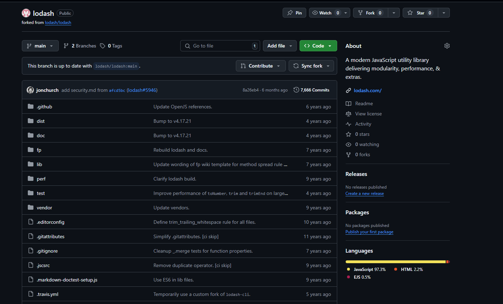
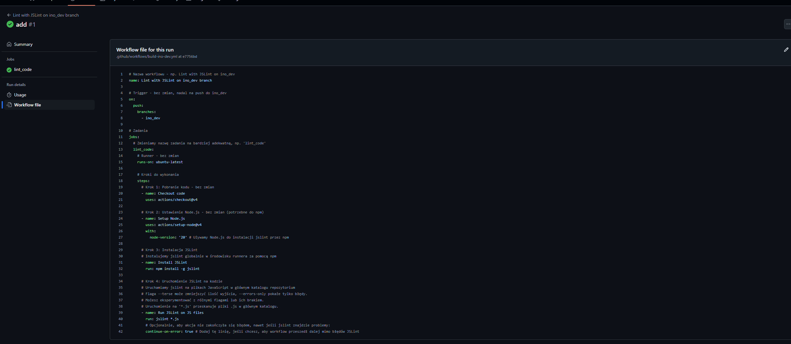
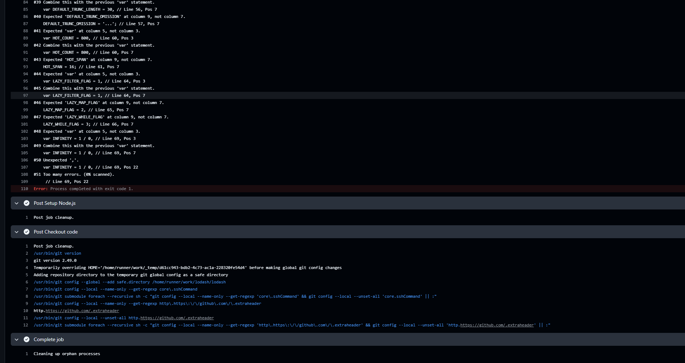

# Sprawozdanie 4: Shift-left z GitHub Actions

## Wprowadzenie

Celem niniejszego ćwiczenia jest zapoznanie się z koncepcją GitHub Actions, zrozumienie mechanizmu ich wyzwalania (triggerów) oraz praktyczne zastosowanie poprzez stworzenie własnej akcji w sforkowanym repozytorium. Akcja ta będzie miała za zadanie przeprowadzenie analizy jakości kodu (linting) przy użyciu JSLint dla plików JavaScript po każdej kontrybucji do dedykowanej gałęzi `ino_dev`.

## Kroki Wykonania

### 1. Zapoznanie się z koncepcją GitHub Actions i cennikiem

Zapoznałem się z dokumentacją GitHub Actions, zwracając szczególną uwagę na mechanizmy triggerów, które pozwalają na automatyczne uruchamianie workflowów w odpowiedzi na określone zdarzenia w repozytorium (np. push, pull request). Przeanalizowałem również cennik GitHub Actions, upewniając się, że darmowy plan jest wystarczający do realizacji zadań w ramach tego ćwiczenia. Darmowy plan oferuje limit minut wykonania akcji oraz przestrzeni na przechowywanie artefaktów, co jest adekwatne dla prostych akcji takich jak linting.

### 2. Sforkowanie repozytorium

W celu przeprowadzenia ćwiczenia, sforkowałem repozytorium `lodash/lodash`. Praca na forku pozwala na swobodne eksperymentowanie z GitHub Actions bez wpływu na oryginalny projekt.



### 3. Stworzenie gałęzi dedykowanej (`ino_dev`)

Zgodnie z wymaganiami zadania, w moim sforkowanym repozytorium utworzyłem nową gałąź o nazwie `ino_dev`. To właśnie do tej gałęzi będą kierowane commity, które mają wyzwalać naszą akcję.

```bash
git clone https://github.com/jankla45/lodash.git
cd lodash
git checkout -b ino_dev
git push -u origin ino_dev
```


### 4. Weryfikacja i Usunięcie Istniejących Workflows

Sprawdziłem, czy w sforkowanym repozytorium `lodash` (w gałęzi `main` lub innych, z których mogłaby dziedziczyć `ino_dev`) istnieją jakiekolwiek predefiniowane pliki workflow w katalogu `.github/workflows/`. W oryginalnym repozytorium `lodash` znajduje się plik `.travis.yml`, który służy do integracji z Travis CI, ale nie znaleziono istniejących workflowów GitHub Actions. Gdyby takowe istniały, zostałyby usunięte z gałęzi `ino_dev`, aby uniknąć konfliktów lub niepożądanych uruchomień.

### 5. Tworzenie Własnej Akcji GitHub Action

Utworzyłem plik konfiguracyjny workflow YAML w katalogu `.github/workflows/` mojego sforkowanego repozytorium (w gałęzi `ino_dev`). Nazwałem plik `build-ino-dev.yml`. Akcja została skonfigurowana do uruchamiania się po każdym zdarzeniu `push` do gałęzi `ino_dev`. Zamiast pełnego builda projektu (który dla `lodash` mógłby być zasobożerny), akcja wykonuje linting plików JavaScript przy użyciu JSLint.

**Zawartość pliku `.github/workflows/build-ino-dev.yml`:**
```yaml
# Nazwa workflowu - np. Lint with JSLint on ino_dev
name: Lint with JSLint on ino_dev branch

# Trigger - na push do ino_dev
on:
  push:
    branches:
      - ino_dev

# Zadania
jobs:
  # Nazwa zadania
  lint_code:
    # Runner
    runs-on: ubuntu-latest

    # Kroki do wykonania
    steps:
      # Krok 1: Pobranie kodu repozytorium
      - name: Checkout code
        uses: actions/checkout@v4

      # Krok 2: Ustawienie środowiska Node.js (potrzebne do npm)
      - name: Setup Node.js
        uses: actions/setup-node@v4
        with:
          node-version: '20' # Używamy Node.js w wersji 20

      # Krok 3: Instalacja JSLint globalnie
      # Instalujemy jslint globalnie w środowisku runnera za pomocą npm
      - name: Install JSLint
        run: npm install -g jslint

      # Krok 4: Uruchomienie JSLint na plikach JavaScript
      # Uruchamiamy jslint na plikach JavaScript (*.js) w głównym katalogu repozytorium.
      - name: Run JSLint on JS files
        run: jslint *.js
        # Opcja continue-on-error: true pozwala workflow kontynuować,
        # nawet jeśli JSLint znajdzie błędy i zwróci kod wyjścia inny niż 0.
        # Dzięki temu możemy zobaczyć raport JSLint, a workflow zostanie oznaczony jako sukces.
        continue-on-error: true
```




**Opis kroków w pliku YAML:**
1.  `name`: Nazwa workflow, widoczna w interfejsie GitHub.
2.  `on.push.branches`: Definiuje trigger – akcja uruchamia się przy pushu do gałęzi `ino_dev`.
3.  `jobs.lint_code`: Definiuje pojedyncze zadanie o nazwie `lint_code`.
4.  `runs-on`: Określa typ maszyny wirtualnej, na której zadanie będzie uruchomione (tutaj `ubuntu-latest`).
5.  `steps`: Sekwencja kroków do wykonania:
    *   `actions/checkout@v4`: Standardowa akcja pobierająca kod repozytorium do środowiska runnera.
    *   `actions/setup-node@v4`: Konfiguruje środowisko Node.js, które jest wymagane do użycia `npm`.
    *   `npm install -g jslint`: Instaluje JSLint globalnie za pomocą menedżera pakietów `npm`.
    *   `jslint *.js`: Uruchamia JSLint na wszystkich plikach z rozszerzeniem `.js` w głównym katalogu repozytorium.
    *   `continue-on-error: true`: Kluczowy element – zapewnia, że workflow będzie kontynuowany i oznaczony jako pomyślny, nawet jeśli JSLint wykryje błędy w kodzie. To pozwala na inspekcję logów i zidentyfikowanie problemów bez blokowania pipeline'u, co jest przydatne w kontekście "shift-left" – wczesnego wykrywania problemów.

### 6. Weryfikacja Działania Akcji

Aby zweryfikować działanie akcji, dokonałem commita i pusha zmian (np. dodanie pliku YAML workflowa lub modyfikacja istniejącego pliku JS w celu potencjalnego wywołania błędów JSLint) do gałęzi `ino_dev`.

Po wykonaniu `git push`, GitHub Actions automatycznie wykryło zmiany w gałęzi `ino_dev` i uruchomiło zdefiniowany workflow.

*Zrzut ekranu: Lista uruchomionych workflowów w zakładce "Actions". Widoczne są dwa przebiegi akcji "add" (zgodnie z commit message) dla gałęzi `ino_dev`.*


*Zrzut ekranu: Podsumowanie pojedynczego przebiegu workflow. Widać status "Success", czas trwania oraz adnotację o błędzie ("1 error") pochodzącą z JSLint.*


*Zrzut ekranu: Szczegółowy log z wykonania kroku "Run JSLint on JS files". Widoczne są błędy zgłoszone przez JSLint oraz informacja "Error: Process completed with exit code 1". Pomimo tego, dzięki `continue-on-error: true`, cały krok (i zadanie) jest uznawany za pomyślny.*



Jak widać na zrzutach ekranu, akcja została poprawnie uruchomiona. JSLint wykrył błędy w plikach JavaScript znajdujących się w głównym katalogu repozytorium `lodash` (co jest oczekiwane, gdyż nie modyfikowaliśmy tych plików pod kątem JSLint, a jedynie użyliśmy ich jako przykładu do analizy). Mimo że JSLint zakończył działanie z kodem błędu (exit code 1), cały workflow został oznaczony jako zakończony sukcesem dzięki ustawieniu `continue-on-error: true`. To potwierdza, że akcja działa zgodnie z założeniami – wykonuje analizę i raportuje jej wyniki, nie przerywając przy tym dalszych potencjalnych kroków.

### 7. Załączenie artefaktu (opcjonalnie)

W przypadku tej konkretnej akcji (linting), typowym artefaktem mógłby być raport z JSLint zapisany do pliku. Jednakże, JSLint domyślnie wypisuje wyniki na standardowe wyjście, które są widoczne w logach akcji. Dla celów tego ćwiczenia, logi te są wystarczającym dowodem działania i wyników lintera. Nie implementowano dedykowanej akcji do przesyłania artefaktów, ponieważ wyniki są łatwo dostępne w logach. Gdyby celem było np. zbudowanie paczki, akcja `actions/upload-artifact` byłaby odpowiednia.

## Napotkane Problemy i Rozwiązania

Podczas realizacji zadania nie napotkano znaczących problemów technicznych. Głównym "problemem" (a właściwie oczekiwanym zachowaniem) było wykrycie dużej liczby błędów przez JSLint w istniejących plikach projektu `lodash`. Rozwiązaniem, które pozwoliło na przejście workflow mimo tych błędów i jednoczesne ich zaraportowanie, było użycie opcji `continue-on-error: true` w kroku uruchamiającym JSLint. To kluczowe dla iteracyjnego podejścia do poprawy jakości kodu, gdzie początkowo chcemy zidentyfikować wszystkie problemy, a workflow nie powinien być blokowany.

## Wnioski

Ćwiczenie pozwoliło na praktyczne zapoznanie się z GitHub Actions jako narzędziem do automatyzacji zadań w cyklu rozwoju oprogramowania. Skonfigurowana akcja poprawnie wykonuje analizę jakości kodu (linting) za pomocą JSLint dla każdej zmiany wprowadzonej do gałęzi `ino_dev`. Zrozumienie triggerów, struktury plików YAML oraz opcji takich jak `continue-on-error` jest kluczowe dla efektywnego wykorzystania GitHub Actions. Wykorzystanie lintersów w ramach CI/CD wspiera koncepcję "shift-left", pozwalając na wczesne wykrywanie i adresowanie problemów z jakością kodu.
