# Sprawozdanie - Zajęcia 01

## Zalogowanie się na serwerze
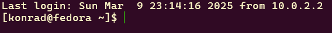

## Sklonowanie repozytorium przedmiotowego za pomocą HTTPS 
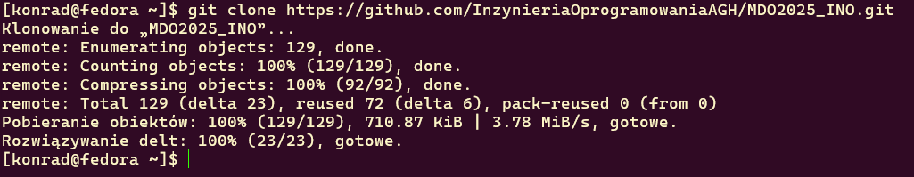

## Tworzenie dwóch kluczy SSH
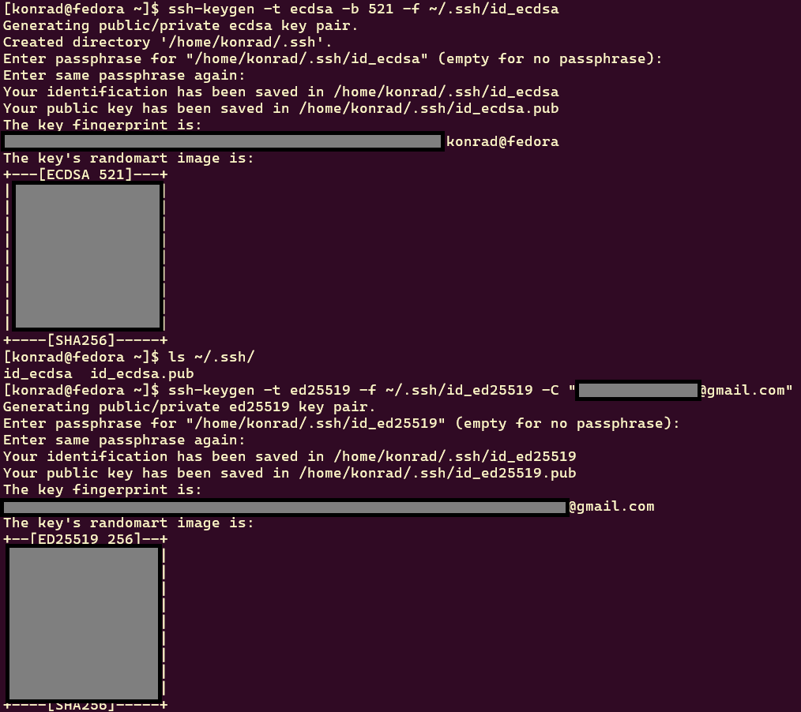

## Sklonowanie repozytorium za pomocą protokołu SSH
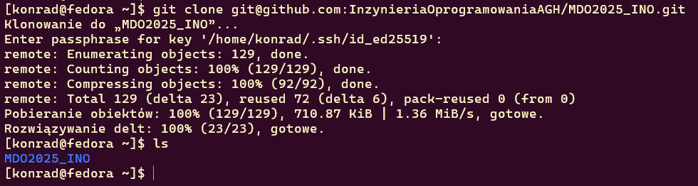

## Konfiguracja weryfikacji dwuetapowej (2FA)


## Konfiguracja klucza SSH jako metody dostępdu do GitHub
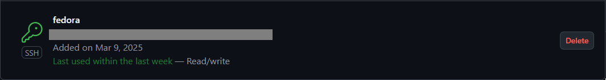

## Utworzenie gałęzi 'KB415987' wychodzącej z gałęzi GCL01
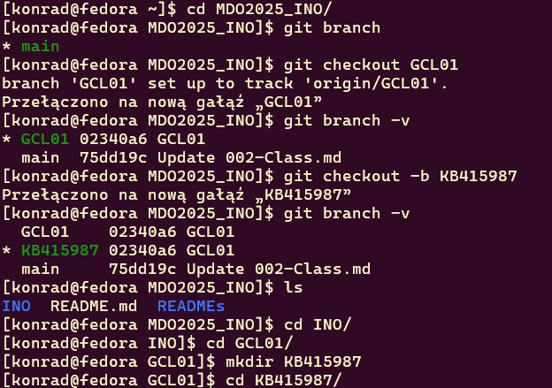

## Pisanie skryptu, nadanie uprawnień do jego uruchamiania oraz umieszczenie go w katalogu ~/MDO2025_INO/.git/hooks/
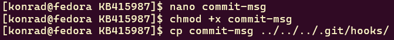
## Git Hook
```bash
    #!/bin/bash
    COMMIT_MSG=$(cat "$1")
    if [[ ! "$COMMIT_MSG" =~ ^KB415987 ]]; then
        echo "Error: Commit message have to start with 'KB415987'"
        exit 1
    fi
```
## Dodanie pliku ze sprawodzaniem, umieszczenie w nim treści napisanego wcześniej git hooka oraz dodanie zrzutów ekranu wraz z opisem zrealizowanych kroków
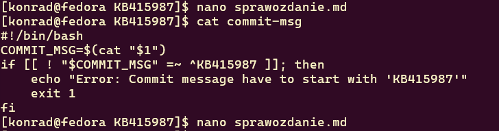

## Dodanie plików do śledzenia przez Git'a
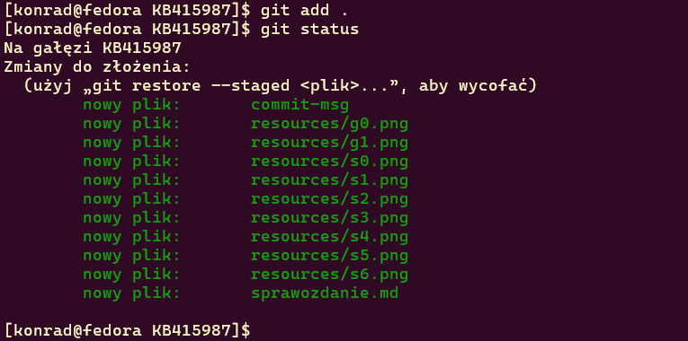

## Wykonanie commita
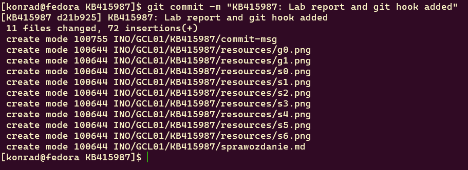

## Wysłanie zmian na GitHub'a
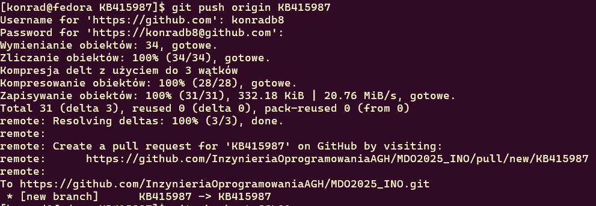

## Wciągnięcie gałęzi 'KB415987' do gałęzi grupowej GCL01
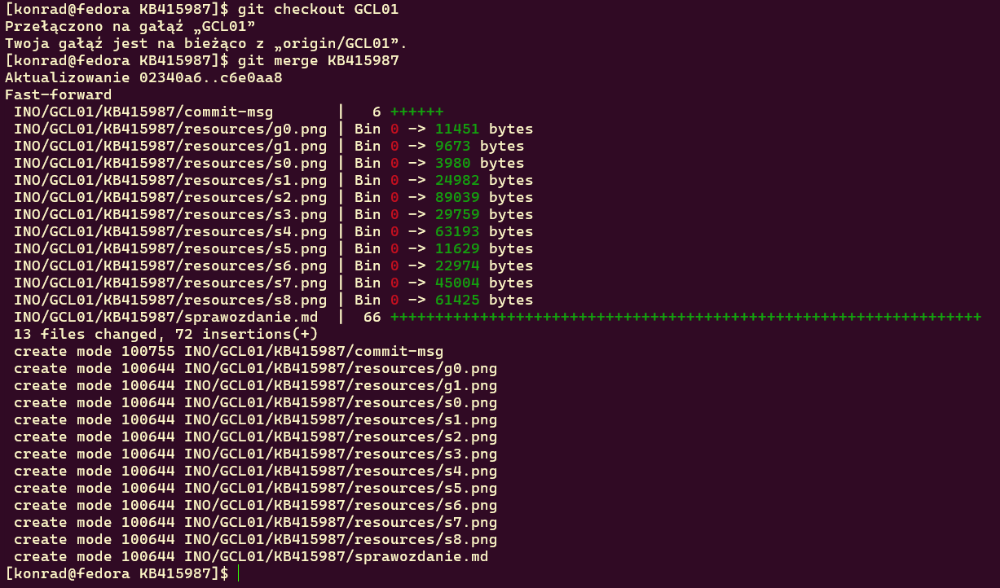

##
# Zajęcia 2
## Docker zainstalowany `sudo dnf install -y docker`
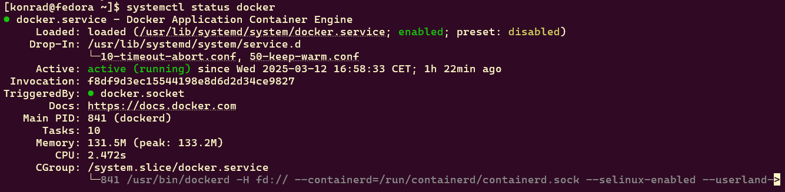

## Pobranie obrazów `hello-world`, `busybox`, `ubuntu` oraz `mysql`
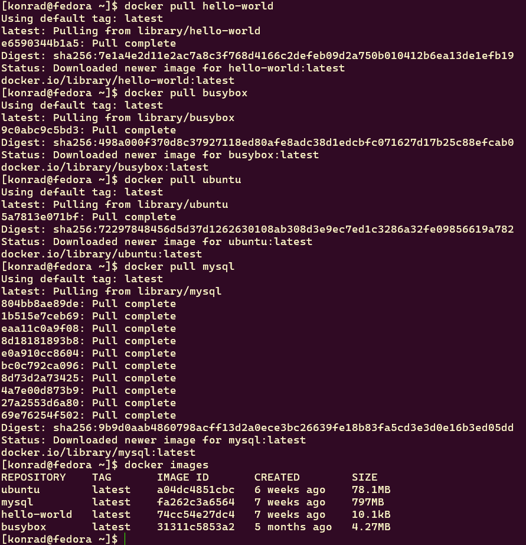
## Uruchomienie kontenera z obrazem `busybox`
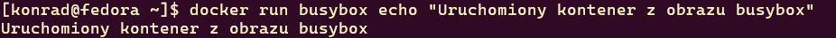
## Interaktywne podłączenie i wyświetlenie numeru wersji obrazu
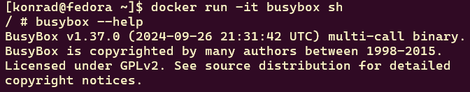

## Uruchomienie systemu `ubuntu`, prezentacja PID 1 i procesów dockera na hoście
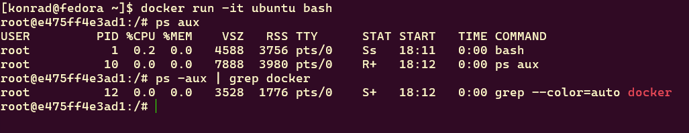

## Aktualizacja pakietów `ubuntu`:
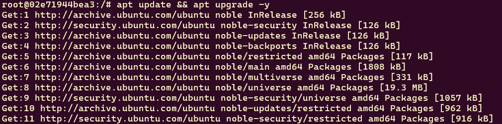

## Tworzenie pliku `Dockerfile`:
```Dockerfile
FROM ubuntu:latest
RUN apt update && apt install -y git
WORKDIR /repo
RUN git clone https://github.com/InzynieriaOprogramowaniaAGH/MDO2025_INO.git /repo
CMD ["bash"]
```
## Budowanie obrazu z pliku `Dockerfile`
```bash
docker build -t my_image .
```
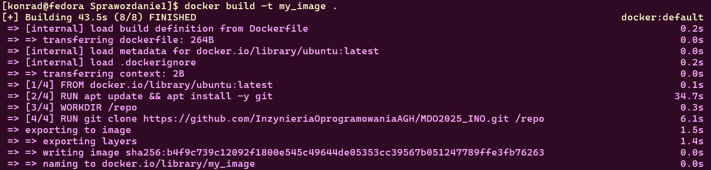

## Uruchamianie kontenera z własnym obrazem
```bash
docker run -it my_image
```
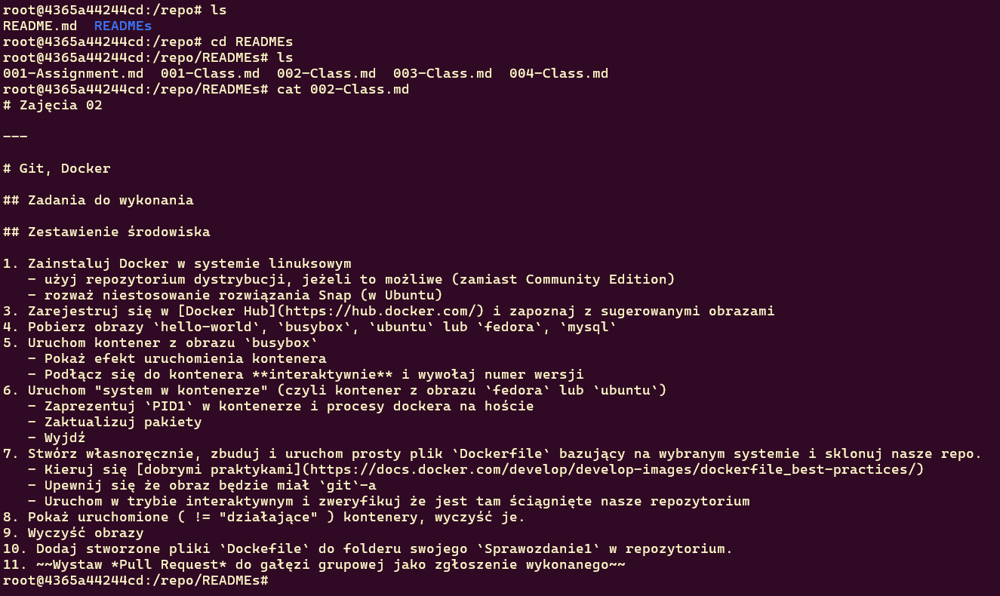
#### Repozytorium przedmiotowe zostało pomyślnie sklonowane.
#
## Wyświetlenie uruchomionych kontenerów oraz ich usunięcie:


## Wyświetlenie obrazów oraz ich usunięcie:
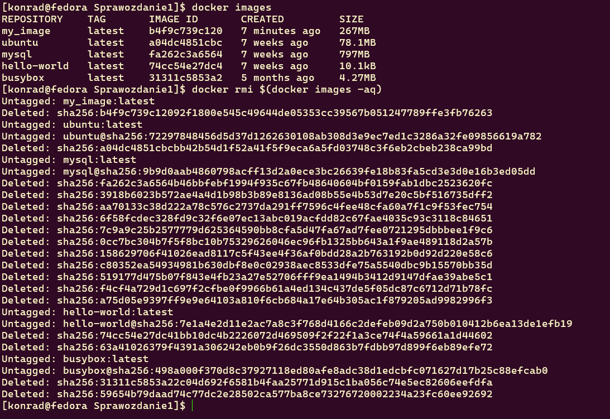

## Plik `Dockerfile` w katalogu /Sprawozdanie1
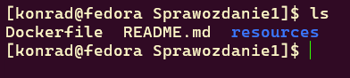