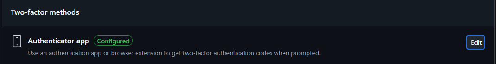
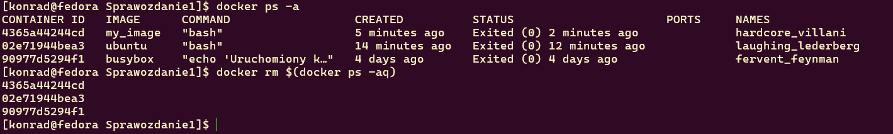
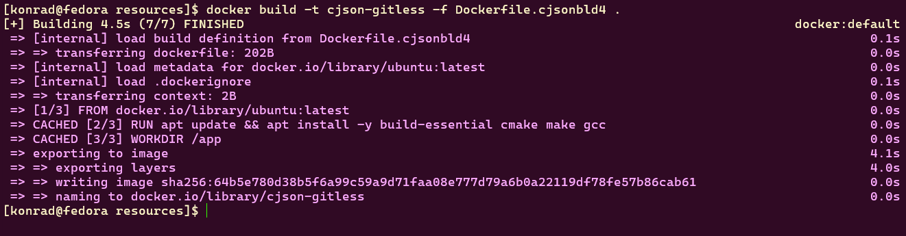
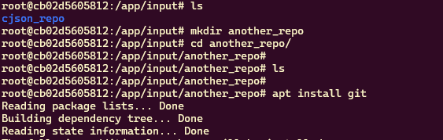
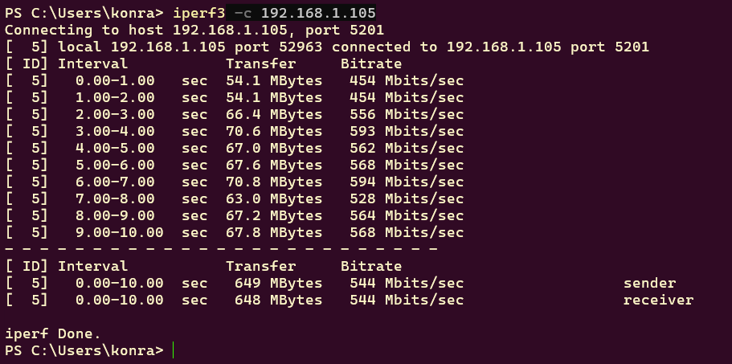

# Sprawozdanie

## Zajęcia 1
### Zalogowanie się na serwerze


### Sklonowanie repozytorium przedmiotowego za pomocą HTTPS 


### Tworzenie dwóch kluczy SSH


### Sklonowanie repozytorium za pomocą protokołu SSH


### Konfiguracja weryfikacji dwuetapowej (2FA)


### Konfiguracja klucza SSH jako metody dostępdu do GitHub


### Utworzenie gałęzi 'KB415987' wychodzącej z gałęzi GCL01


### Pisanie skryptu, nadanie uprawnień do jego uruchamiania oraz umieszczenie go w katalogu ~/MDO2025_INO/.git/hooks/

### Git Hook
```bash
    #!/bin/bash
    COMMIT_MSG=$(cat "$1")
    if [[ ! "$COMMIT_MSG" =~ ^KB415987 ]]; then
        echo "Error: Commit message have to start with 'KB415987'"
        exit 1
    fi
```
### Dodanie pliku ze sprawodzaniem, umieszczenie w nim treści napisanego wcześniej git hooka oraz dodanie zrzutów ekranu wraz z opisem zrealizowanych kroków


### Dodanie plików do śledzenia przez Git'a


### Wykonanie commita


### Wysłanie zmian na GitHub'a


### Wciągnięcie gałęzi 'KB415987' do gałęzi grupowej GCL01


#
## Zajęcia 2
### Docker zainstalowany `sudo dnf install -y docker`

### Rejestracja w Docker Hub

### Pobranie obrazów `hello-world`, `busybox`, `ubuntu` oraz `mysql`

### Uruchomienie kontenera z obrazem `busybox`

### Interaktywne podłączenie i wyświetlenie numeru wersji obrazu


### Uruchomienie systemu `ubuntu`, prezentacja PID 1 i procesów dockera na hoście


### Aktualizacja pakietów `ubuntu`:


### Tworzenie pliku `Dockerfile`:
```Dockerfile
FROM ubuntu:latest
RUN apt update && apt install -y git
WORKDIR /repo
RUN git clone https://github.com/InzynieriaOprogramowaniaAGH/MDO2025_INO.git /repo
CMD ["bash"]
```
### Budowanie obrazu z pliku `Dockerfile`
```bash
docker build -t my_image .
```


### Uruchamianie kontenera z własnym obrazem
```bash
docker run -it my_image
```

#### Repozytorium przedmiotowe zostało pomyślnie sklonowane.
#
### Wyświetlenie uruchomionych kontenerów oraz ich usunięcie:


### Wyświetlenie obrazów oraz ich usunięcie:


### Plik `Dockerfile` w katalogu /Sprawozdanie1


##
## Zajęcia 3

### Oprogramowanie : [cJSON](https://github.com/DaveGamble/cJSON)
Wybrałem to oprogramowanie, ponieważ jest na otwartej licencji, proces jego budowania jest prosty, dzięki czemu można łatwo zbudować oraz przetestować w kontenerze.
### Instalacja potrzebnych narzędzi

### Klonowanie repozytorium z wybranym oprogramowaniem

### Budowanie projektu
Budowa projektu przeprowadzona z wykorzystaniem narzędzi cmake oraz make


### Uruchomienie testów jednostkowych
Aby przeprowadzić testy należy użyć komendy:
```bash
make test
```


### Dockerfile do budowania
```Dockerfile
FROM ubuntu:latest
RUN apt update && apt install -y build-essential cmake make gcc git
WORKDIR /app
RUN git clone https://github.com/DaveGamble/cJSON.git && cd cJSON && mkdir build && cd build
WORKDIR /app/cJSON/build
RUN cmake .. && make
```

Po wpisaniu w terminal komendy
```bash
docker build -t cjsonbld -f Dockerfile.cjsonbld .
 ```
pomyślnie utworzył się obraz o nazwie ```jsonbld```


### Dockerfile do testów
```Dockerfile
FROM cjsonbld

WORKDIR /app/cJSON/build
CMD ["make", "test"]
```

Po wpisaniu komendy 
```bash
docker build -t cjsontest -f Dockerfile.cjsontest .
```
został utworzony obraz


## Uruchomienie kontenera testującego
```bash
docker run --rm cjsontest
```
wykorzystałem flagę --rm żeby kontener po wykonaniu zadania został usunięty


### Docker compose
#### Doinstalowanie docker-compose
```bash
sudo dnf install -y docker-compose
```

```yaml
version: '3'

services:
  build:
    image: cjsonbld
    build:
      context: .
      dockerfile: Dockerfile

  test:
    image: cjsontest
    build:
      context: .
      dockerfile: Dockerfile.test
    depends_on:
      - build
```
### Aby ująć kontenery w kompozycję należy wpisać
```bash
docker-compose up --build
```


###
### Czy program nadaje się do wdrażania i publikowania jako kontener, czy taki sposób interakcji nadaje się tylko do builda?

Program nie nadaje sie do wdrożenia i publikowania jako kontener bo to tylko bibloteka języka C, więc powinna byc używana w innych projektach a nie działać jako samodzielna usługa.

### Jeżeli program miałby być publikowany jako kontener - czy trzeba go oczyszczać z pozostałości po buildzie?
Jeśli program miałby być publikowany jako kontener to należy oczyścić go z pozostałości po buildzie.

### A może dedykowany deploy-and-publish byłby oddzielną ścieżką (inne Dockerfiles)?
Można zastosować jeden Dockerfile dla budowania kodu, drugi do testowania i trzeci dla wersji z gotowym artefaktem.

### Czy zbudowany program należałoby dystrybuować jako pakiet, np. JAR, DEB, RPM, EGG?
Można wykorzystać dystrybuować jako pakiet  ```DEB``` lub ```RPM```.

### W jaki sposób zapewnić taki format? Dodatkowy krok (trzeci kontener)? Jakiś przykład?

Można wykorzystać kontener który spakowałby pliki w taki format.

#
## Zajęcia 4
Tworzenie dwóch woluminów:
```docker
docker volume create in_vol
docker volume create out_vol
```


Dockerfile którym utworzę obraz bez gita:
```Dockerfile
FROM ubuntu:latest
RUN apt update && apt install -y build-essential cmake make gcc
WORKDIR /app
```

Budowanie obrazu bez zainstalowanego gita:



Tworzenie kontenera z podpiętymi dwoma woluminami na podstawie mojego obrazu:
```docker
docker run -it --name cont_lab4 -v in_vol:/app/input -v out_vol:/app/output cjson-gitless
```


Klonowanie projektu na hosta

Kopiowanie projektu na wolumin wejściowy z wykorzystnaniem ```docker cp```: 
```docker
docker cp cjson_repo/ cont_lab4:/app/input
```

Pomocna komenda pozwalająca podłączyć się do działającego kontenera jeśli jest on uruchomiony interaktywnie z podłączonym TTY
```docker
docker attach cont_lab4
```

###

Budowanie projektu w kontenerze:


Projekt został zbudowany, teraz kopiuję plik cJSON_test do woluminu wyjściowego komendą:
```bash
cp -r build/ /app/output
```


Uruchamiam testowy kontener z podłączonym woluminem wyjściowym na którym powinien znajdywać się plik do testowania
```docker
docker run -it --name testowy_kontener -v out_vol:/app alpine sh
```


Sukces, po wyłączeniu kontenera do budowania pliki są dostępne na woluminie wyjściowym.

### Powtórzenie operacji z gitem w konetenrze
Po doinstalowaniu gita zabrałem się za klonowanie repo




Kopiuje rekursywnie wszystko co tam jest w tym katalogu do woluminu wyjściowego


Sprawdzenie na hoście czy w woluminie wyjściowym zapisało się repozytorium.


#### Możliwość wykonania ww. kroków za pomocą docker build i pliku Dockerfile. (RUN --mount)

Można te kroki zautomatyzować korzystająć z Docker BuildKit, tworzymy Dockerfile w którym sklonujemy dane repozytorium na wolumin wejściowy a następnie zbudujemy program i zapiszemy na woluminie wyjściowym. `RUN --mount` __tymczasowo__ zamontuje woluminy, dzięki czemu rozmiar obrazu się nie zwiększy.

### Iperf
Stworzenie sieci:


```bash
docker network create --driver bridge siec_iperf
```

Uruchomienie kontenera z serwerem


Utworzenie kontenera z klientem do testowania połączenia:


Połączenie się z hosta:

Aby przeprowadzić operację połączenia się z Windowsa do serwera musiałem najpierw doinstalować iperf3 na Windowsie

Oraz przekierować port 5201

Po wpisaniu komendy
```PS
iperf3 -c 192.168.1.105
```
Można zobaczyć prędkość połączenia między moim laptopem z Windowsem, a serwerem w kontenerze na maszynie wirtualnej.

Połączenie VM-ki z serwerem jest dużo szybsze niż mojego laptopa z tym serwerem.

Sprawdzenie logów serwera:


### Jenkins
Instalację Jenkins przeprowadziłem wg instrukcji w dokumentacji: https://www.jenkins.io/doc/book/installing/docker/

Utworzenie sieci:


Utworzenie kontenera z obrazem docker:dind


Skopiowanie Dockerfile i zbudowanie obrazu `myjenkins-blueocean`

```Dockerfile
FROM jenkins/jenkins:2.492.3-jdk17
USER root
RUN apt-get update && apt-get install -y lsb-release ca-certificates curl && \
    install -m 0755 -d /etc/apt/keyrings && \
    curl -fsSL https://download.docker.com/linux/debian/gpg -o /etc/apt/keyrings/docker.asc && \
    chmod a+r /etc/apt/keyrings/docker.asc && \
    echo "deb [arch=$(dpkg --print-architecture) signed-by=/etc/apt/keyrings/docker.asc] \
    https://download.docker.com/linux/debian $(. /etc/os-release && echo \"$VERSION_CODENAME\") stable" \
    | tee /etc/apt/sources.list.d/docker.list > /dev/null && \
    apt-get update && apt-get install -y docker-ce-cli && \
    apt-get clean && rm -rf /var/lib/apt/lists/*
USER jenkins
RUN jenkins-plugin-cli --plugins "blueocean docker-workflow"
```

Zbudowanie obrazu komendą:

```bash
docker build -t myjenkins-blueocean:2.492.3-1 .
```


Uruchomienie kontenera z tym obrazem


 

Jenkins działa i jest dostępny pod `localhost:8081`, (bo przekierowałem port):

