# Sprawozdanie 2
## Konrad Bugaj              INO gr.1

### Zajęcia 5

### 1. Przygotowanie

### Jenkins
Instalację Jenkins przeprowadziłem wg instrukcji przedstawionych w oficjalnej [dokumentacji](https://www.jenkins.io/doc/book/installing/docker/).


Utworzenie sieci:

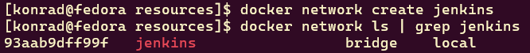

Utworzenie kontenera z obrazem docker:dind

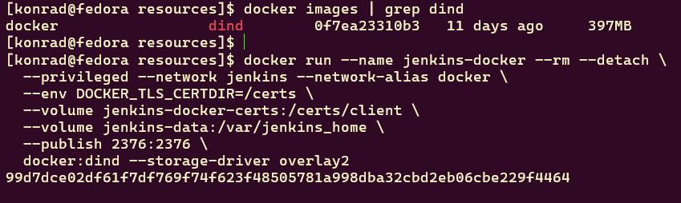

Skopiowanie Dockerfile i zbudowanie obrazu `myjenkins-blueocean`

```Dockerfile
FROM jenkins/jenkins:2.492.3-jdk17
USER root
RUN apt-get update && apt-get install -y lsb-release ca-certificates curl && \
    install -m 0755 -d /etc/apt/keyrings && \
    curl -fsSL https://download.docker.com/linux/debian/gpg -o /etc/apt/keyrings/docker.asc && \
    chmod a+r /etc/apt/keyrings/docker.asc && \
    echo "deb [arch=$(dpkg --print-architecture) signed-by=/etc/apt/keyrings/docker.asc] \
    https://download.docker.com/linux/debian $(. /etc/os-release && echo \"$VERSION_CODENAME\") stable" \
    | tee /etc/apt/sources.list.d/docker.list > /dev/null && \
    apt-get update && apt-get install -y docker-ce-cli && \
    apt-get clean && rm -rf /var/lib/apt/lists/*
USER jenkins
RUN jenkins-plugin-cli --plugins "blueocean docker-workflow"
```

Zbudowanie obrazu komendą:

```bash
docker build -t myjenkins-blueocean:2.492.3-1 -f Dockerfile.jenkins .
```
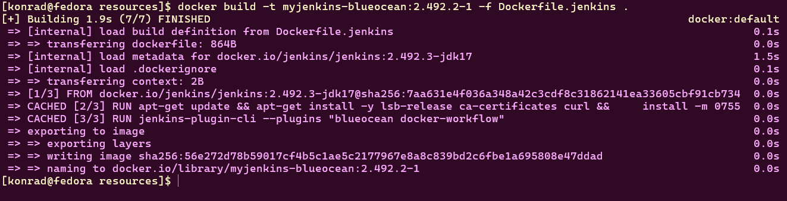

Uruchomienie kontenera z tym obrazem:

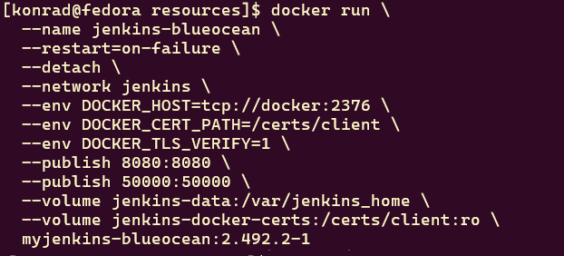
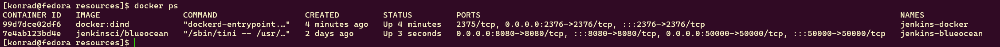
 

#### Po odblokowaniu Jenkinsa za pomocą `initialAdminPassword`, zainstalowałem sugerowane wtyczki. 
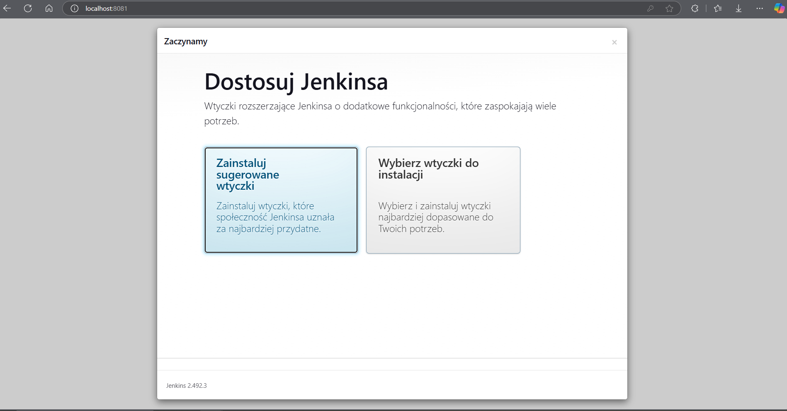
#### następnie stworzyłem administratora,  
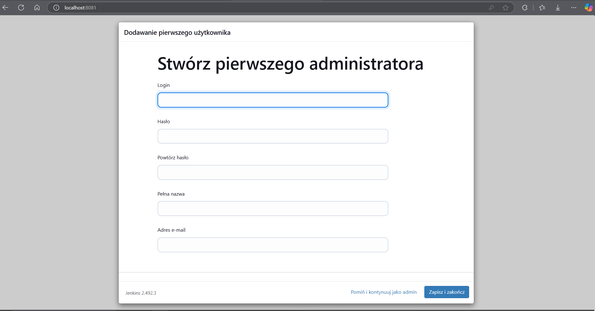
#### żeby Jenkins był gotowy do pracy.
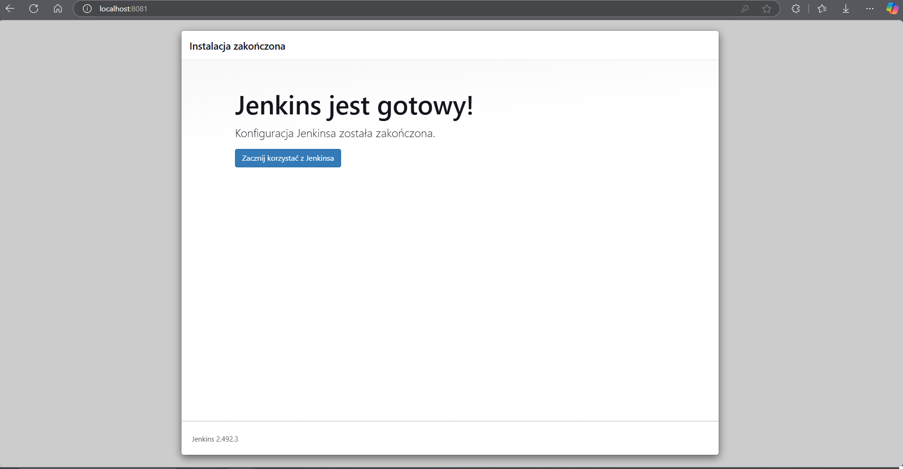


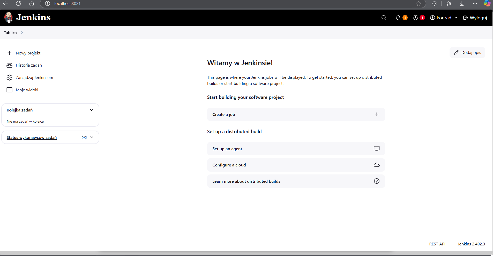
### Dodanie kroku budowania, w tym przypadku wykonanie polecenia w powłoce `uname -a`

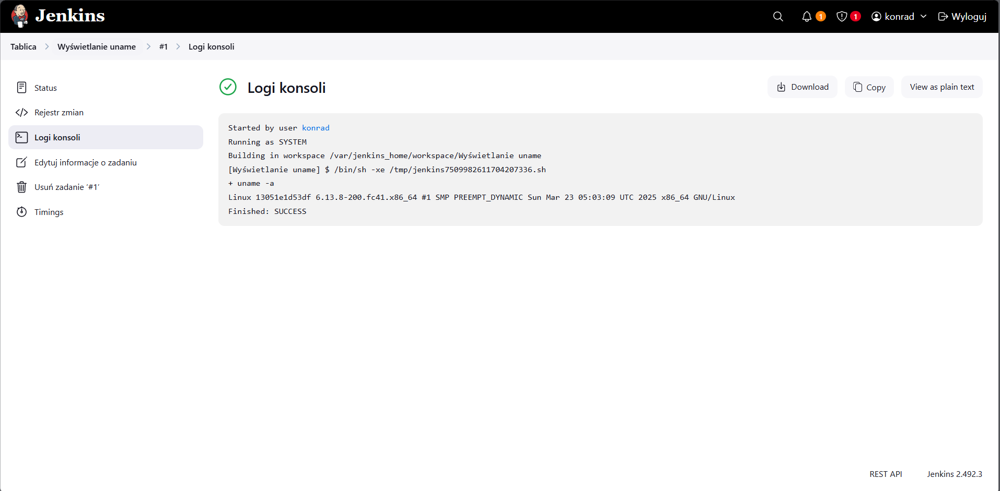
Zakończone powodzeniem

#### Skrypt wyświetlający aktualną godzinę oraz zwracający błąd, gdy jest ona nieparzysta
```bash
echo "Godzina: $(date +%H)"
if [ $(( $(date +%H) % 2 )) -ne 0 ]; then
  echo "Error: Godzina nieparzysta"
  exit 1
fi
echo "Godzina parzysta"
```

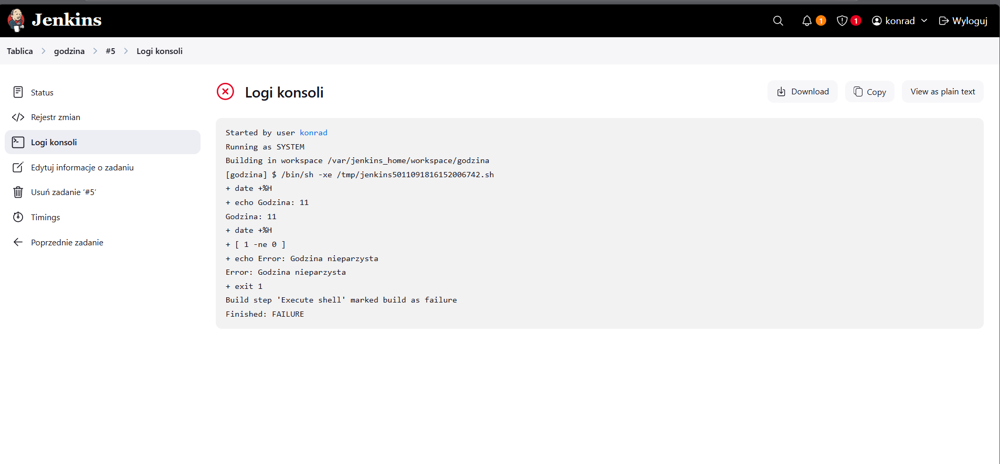
#### godzina 11 jest nieparzysta więc zadanie zakończyło się niepowodzeniem
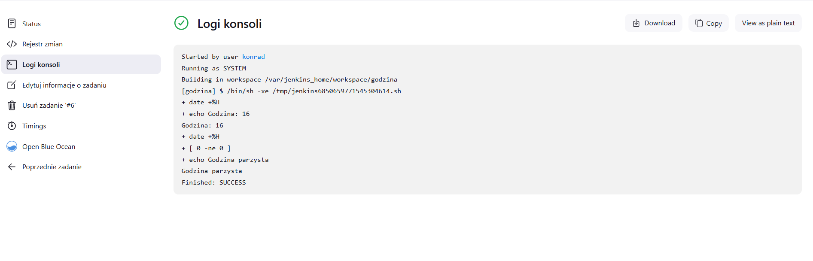
#### godzina 16 - powodzenie
#### Wykonanie polecenia `docker pull ubuntu`


### Zadanie: obiekt typu pipeline
#### Co to właściwie jest pipeline?
#### **Pipeline** to ciąg kroków, etapów, które umożliwią CI/CD. Może się on składać z etapów pobierania, budowania, testowania oraz instalacji.

Przykładowy krótki pipeline, który klonuje repozytorium przedmiotowe z brancha ```KB415987``` oraz buduje obraz *cjson'a* dla Dockera.
```sh
pipeline {
    agent any

    stages {
        stage('Clone') {
            steps {
                git branch: 'KB415987', url: 'https://github.com/InzynieriaOprogramowaniaAGH/MDO2025_INO.git'
            }
        }
        stage('Build'){
            steps{
                dir ("INO/GCL01/KB415987/Sprawozdanie2/resources"){
                    script {
                        docker.build('cjson_bld_img', '-f Dockerfile.build .')
                    }
                }
            }
        }
    }
}
```

#### Trwa pierwszy stage...
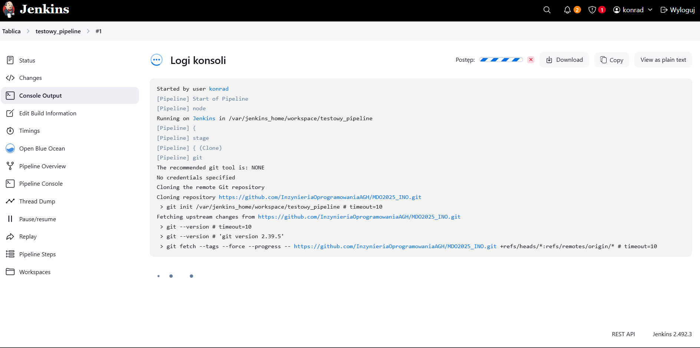

Testowy pipeline przeszedł. Pierwsze uruchomienie trwało długo ze względu na pobieranie dependencji z pliku ```Dockerfile.build```. Kolejne uruchomienia były znacznie szybsze.

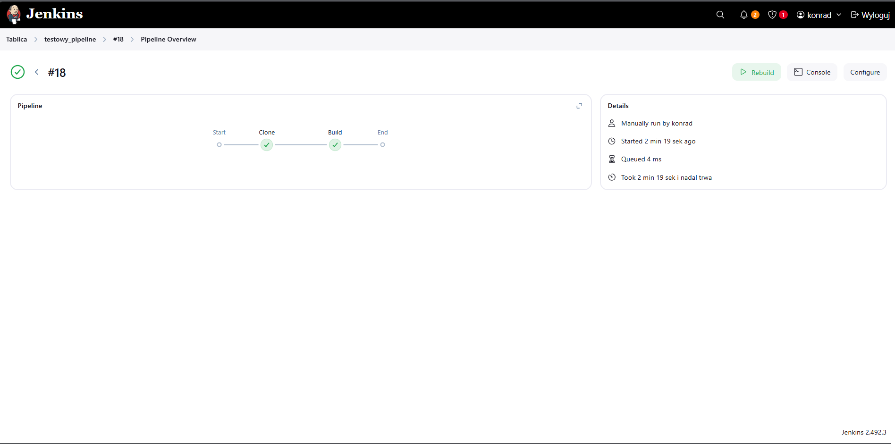
#### [Logi z konsoli pipeline'u](log/pierwsze_logi.txt)


### Pipeline: build -> test
Teraz oprócz Dockerfile.build, będzie trzeba skorzystać z Dockerfile.test, wcześniej utworzonego.


```sh
pipeline {
    agent any

    stages {
        stage('Clone') { 
            steps {
                git branch: 'KB415987', url: 'https://github.com/InzynieriaOprogramowaniaAGH/MDO2025_INO.git'
            }
        }

        stage('Build') {
            steps {
                dir ("INO/GCL01/KB415987/Sprawozdanie2/resources")
                {
                    script {
                        docker.build('cjson_bld_img', '-f Dockerfile.build .')
                    }
                }
            }
        }

        stage('Test_Build') {
            steps {
                dir ("INO/GCL01/KB415987/Sprawozdanie2/resources")
                {
                    script {
                        docker.build('cjsontest', '-f Dockerfile.cjsontest .')
                    }
                }
            }
        }

        stage('Test') {
            steps {
                dir ("INO/GCL01/KB415987/Sprawozdanie2")
                {
                    sh "mkdir -p artifacts"

                    sh """
                        docker run --rm cjsontest | tee artifacts/test_log.log
                    """
                }    
            }
        }

        stage('Log_Publish') {
            steps {
                archiveArtifacts artifacts: 'INO/GCL01/KB415987/Sprawozdanie2/artifacts/test_log.log', fingerprint: true
            }
        }
    }
}
```
### Pipeline przeszedł. Etap `Log_Publish` miał za zadanie zapisać artefakt, plik `.log` który zawiera informacje na temat etapu testowania.
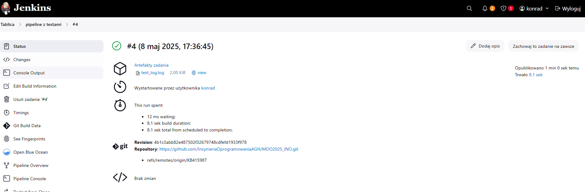
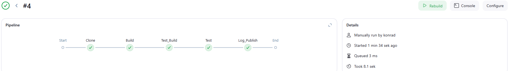


#### [Logi z etapu testowego](log/drugie_logi.txt)


### Kompletny pipeline - Jenkinsfile
#### W tym przypadku kolejne etapy jakie należy dodać to `deploy` i `publish`. W tym ostatnim etapie zapisywany jest artefakt `cjson.rpm` oraz logi z etapów testowania i deploymentu.


```sh
pipeline {
    agent any

    stages {
        stage('Clone') { 
            steps {
                git branch: 'KB415987', url: 'https://github.com/InzynieriaOprogramowaniaAGH/MDO2025_INO.git'
            }
        }

        stage('Clear Docker cache') {
            steps {
                sh 'docker builder prune -af'
            }
        }

        stage('Build') {
            steps {
                dir ("INO/GCL01/KB415987/Sprawozdanie2/jenkinsfile")
                {
                    script {
                        docker.build('cjson_bld_img', '-f Dockerfile.build .')

                        sh '''
                            mkdir -p artifacts
                            CID=$(docker create cjson_bld_img)
                            docker cp $CID:/app/cjson.rpm artifacts/
                            docker rm $CID
                        '''
                    }
                }
            }
        }

        stage('Test') {
            steps {
                dir ("INO/GCL01/KB415987/Sprawozdanie2/jenkinsfile")
                {
                    script {
                        docker.build('cjsontest', '-f Dockerfile.test .')

                        sh """
                            docker run --rm cjsontest | tee artifacts/test_log.log
                        """
                    }

                }    
            }
        }

        stage('Deploy') {
            steps {
                dir ("INO/GCL01/KB415987/Sprawozdanie2/jenkinsfile")
                {
                    script {
                        sh 'cp artifacts/cjson.rpm .'              
                        docker.build("cjson_deploy", "-f Dockerfile.deploy .")

                        sh """
                            docker run --rm cjson_deploy | tee artifacts/deploy_log.log
                        """
                    }      
                }
                
            }
        }

        stage('Publish') {
            steps {
                archiveArtifacts artifacts: 'INO/GCL01/KB415987/Sprawozdanie2/jenkinsfile/artifacts/*.log', fingerprint: true
                archiveArtifacts artifacts: 'INO/GCL01/KB415987/Sprawozdanie2/jenkinsfile/artifacts/*.rpm', fingerprint: true
            }
        }
    }
}
```

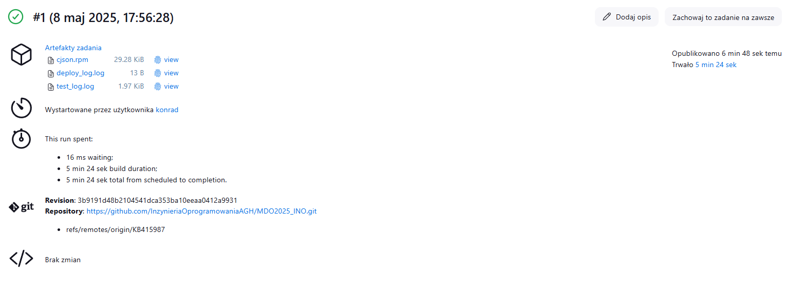
#### [Logi z etapu deploy](log/trzecie_logi.txt)

### Krótki opis kolejnych kroków:

**Clone** - klonowanie repozytorium przedmiotowego z mojej gałęzi ```KB415987```

**Clear docker cache** - usuwanie cache, czyli pamięć podręczną, Docker Builder.

**Build** - budowanie obrazu aplikacji i utworzenie pliku ```.rpm```

**Test** - testowanie, wraz z logowaniem tych testów

**Deploy** - budowanie obrazu do deploymentu oraz logowanie

**Publish** - zapisanie artefaktów ```.rpm``` i ```.log```

### Diagram UML przedstawiający kolejne etapy pipeline'u:

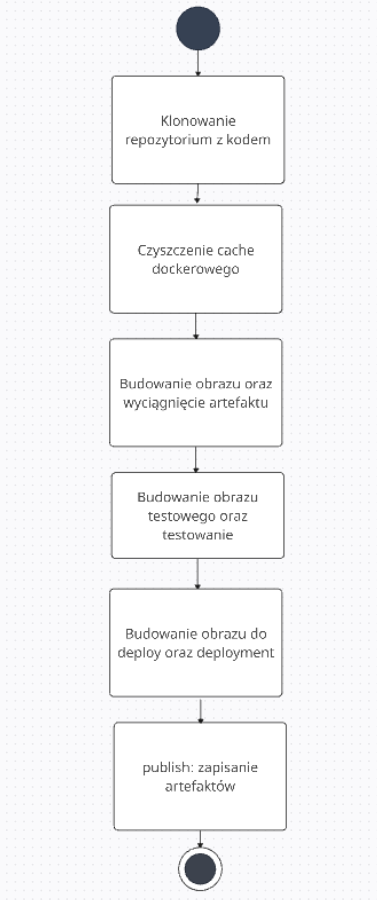


### Po udanym przejściu pipeline'u nastepnie skopiowalem cjson.rpm
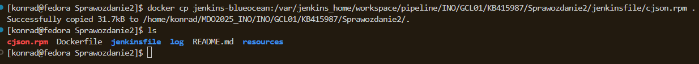

### oraz sprawdziłem działanie.
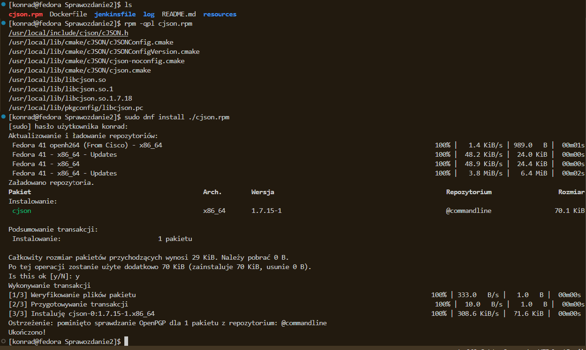

No i mamy sukces.


### Wykorzystanie narzędzi LLM:
#### Przy pracy nad sprawozdaniem zdarzyło się używać ChatGPT. Pozwoliło to na sprawniejszą pracę z Jenskinsem, otrzymywanie sugestii dotyczących struktury pipeline'ów oraz w celu analizy błędów. Wygenerowane odpowiedzi pozwalały przyspieszyć proces szukania informacji oraz wyznaczały ogólny kierunek przy szukaniu rozwiązań problemów.