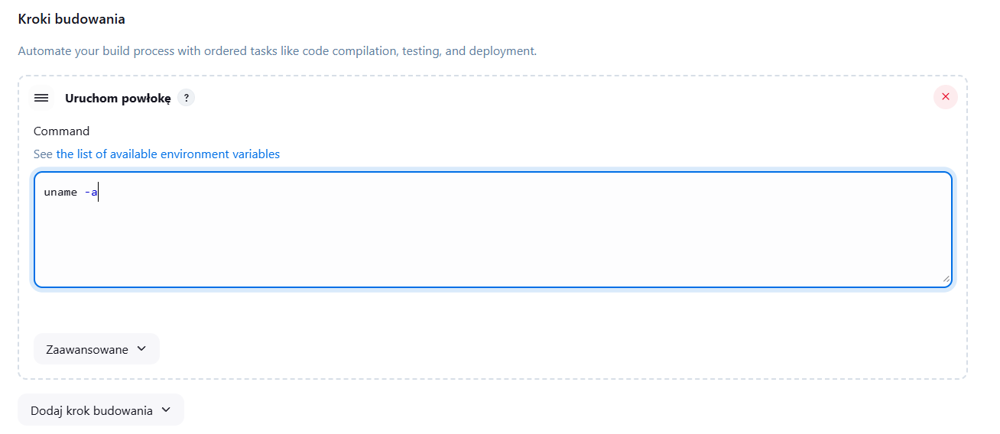
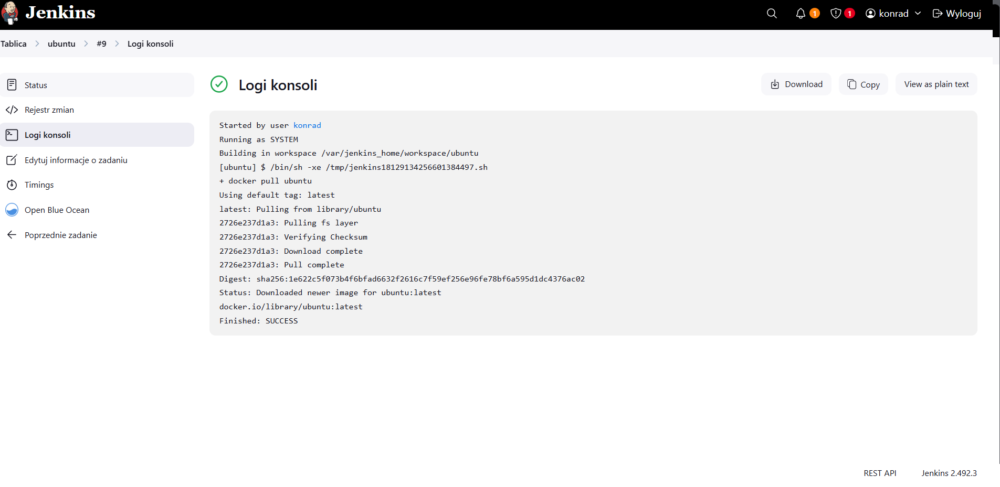

# Sprawozdanie 2
## Konrad Bugaj              INO gr.1

### Zajęcia 5

### 1. Przygotowanie

### Jenkins
Instalację Jenkins przeprowadziłem wg instrukcji przedstawionych w oficjalnej [dokumentacji](https://www.jenkins.io/doc/book/installing/docker/).


Utworzenie sieci:


Utworzenie kontenera z obrazem docker:dind


Skopiowanie Dockerfile i zbudowanie obrazu `myjenkins-blueocean`

```Dockerfile
FROM jenkins/jenkins:2.492.3-jdk17
USER root
RUN apt-get update && apt-get install -y lsb-release ca-certificates curl && \
    install -m 0755 -d /etc/apt/keyrings && \
    curl -fsSL https://download.docker.com/linux/debian/gpg -o /etc/apt/keyrings/docker.asc && \
    chmod a+r /etc/apt/keyrings/docker.asc && \
    echo "deb [arch=$(dpkg --print-architecture) signed-by=/etc/apt/keyrings/docker.asc] \
    https://download.docker.com/linux/debian $(. /etc/os-release && echo \"$VERSION_CODENAME\") stable" \
    | tee /etc/apt/sources.list.d/docker.list > /dev/null && \
    apt-get update && apt-get install -y docker-ce-cli && \
    apt-get clean && rm -rf /var/lib/apt/lists/*
USER jenkins
RUN jenkins-plugin-cli --plugins "blueocean docker-workflow"
```

Zbudowanie obrazu komendą:

```bash
docker build -t myjenkins-blueocean:2.492.3-1 -f Dockerfile.jenkins .
```


Uruchomienie kontenera z tym obrazem:


 

#### Po odblokowaniu Jenkinsa za pomocą `initialAdminPassword`, zainstalowałem sugerowane wtyczki. 

#### następnie stworzyłem administratora,  

#### żeby Jenkins był gotowy do pracy.


### Dodanie kroku budowania, w tym przypadku wykonanie polecenia w powłoce `uname -a`


Zakończone powodzeniem

#### Skrypt wyświetlający aktualną godzinę oraz zwracający błąd, gdy jest ona nieparzysta
```bash
echo "Godzina: $(date +%H)"
if [ $(( $(date +%H) % 2 )) -ne 0 ]; then
  echo "Error: Godzina nieparzysta"
  exit 1
fi
echo "Godzina parzysta"
```


#### godzina 11 jest nieparzysta więc zadanie zakończyło się niepowodzeniem

#### godzina 16 - powodzenie
#### Wykonanie polecenia `docker pull ubuntu`


### Zadanie: obiekt typu pipeline
```sh
pipeline {
    agent any

    stages {
        stage('Clone') {
            steps {
                git branch: 'KB415987', url: 'https://github.com/InzynieriaOprogramowaniaAGH/MDO2025_INO.git'
            }
        }
        stage('Build'){
            steps{
                dir ("INO/GCL01/KB415987/Sprawozdanie2/resources"){
                    script {
                        docker.build('cjson_bld_img', '-f Dockerfile.build .')
                    }
                }
            }
        }
    }
}
```

Trwa pierwszy stage


Testowy pipeline przeszedł. Pierwsze uruchomienie trwało długo ze względu na pobieranie dependencji z pliku ```Dockerfile.build```. Kolejne uruchomienia byłby znacznie szybsze.

