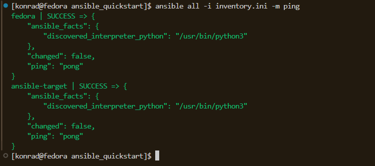
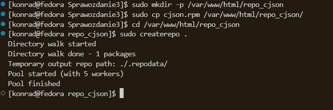
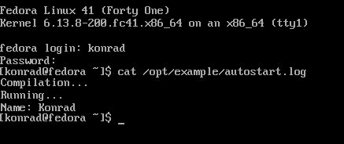

# Sprawozdanie 3

## Lab 8

Program tar oraz usługa OpenSSH są obecne.


ustawienie `hostname` na `ansible-target`, niestety nie zrobiłem tego przy instalacji.


Ansible zainstalowany:
```bash
sudo dnf install ansible -y 
```


Utworzenie oraz skopiowanie klucza ssh na maszyne `ansible-target`.
```bash
ssh-copy-id -i ~/.ssh/id_ansible.pub ansible@10.0.2.15
```


Zapisałem stan maszyny ansible-target

### Inwentaryzacja
Wprowadzenie nazw DNS maszyn wirtualnych do katalogu `/etc/hosts`


Sprawdzenie łączności 


Inventory.ini:

```ini
[Orchestrators]
fedora ansible_connection=local

[Endpoints]
ansible-target
```


### Zdalne wywołanie procedur

Pierwszy playbook testujący połączenie: 

```yaml
- name: Playbook1
  hosts: all
  become: true
  tasks:
   - name: Ping my hosts
     ansible.builtin.ping:

   - name: Print message
     ansible.builtin.debug:
       msg: Hello world!
```
Komenda do uruchomienia playbooka:

```bash
ansible-playbook -i inventory.ini playbook.yaml
```


Playbook zawierający resztę wymaganych rzeczy:
```yaml
- name: Playbook1
  hosts: all
  become: true
  tasks:
   - name: Ping my hosts
     ansible.builtin.ping:

   - name: Copy inventory to Endpoint
     ansible.builtin.copy:
      src: inventory.ini
      dest: /home/ansible/inventory_copied
     when: "'ansible-target' in inventory_hostname"

   - name: Ping after copy
     ansible.builtin.ping:

   - name: Update system packages
     ansible.builtin.dnf:
      name: "*"
      state: latest
     when: "'ansible-target' in inventory_hostname"

   - name: Restart sshd
     ansible.builtin.service:
      name: sshd
      state: restarted
     when: "'ansible-target' in inventory_hostname"

   - name: Restart rngd
     ansible.builtin.service:
      name: rngd
      state: restarted
     ignore_errors: true
     when: "'ansible-target' in inventory_hostname"

```

Po uruchomieniu tą samą komendą:


### Zarządzanie stworzonym artefaktem

```bash
ansible-galaxy init cjson
```


```yaml
- name: Create artifacts directory
  become: true
  file:
    path: /home/ansible/cjson
    state: directory
    owner: ansible
    group: ansible
    mode: '0755'

- name: Copy artifacts to target
  copy:
    src: "{{ item }}"
    dest: /home/ansible/cjson/
    mode: '0644'
  loop:
    - files/cjson.rpm
    - files/main.c

- name: Install python3-requests
  ansible.builtin.dnf:
    name: python3-requests
    state: present

- name: Install Docker
  become: true
  dnf:
    name: docker
    state: present
  
- name: Ensure Docker is started
  become: true
  service:
    name: docker
    state: started
    enabled: true

- name: Add ansible to docker group
  user:
    name: ansible
    groups: docker
    append: true

- name: Start fedora container
  community.docker.docker_container:
    name: cjson
    image: fedora:41
    state: started
    command: sleep infinity
    volumes:
      - /home/ansible/cjson:/tmp:z

- name: Install gcc, cjson and tools
  community.docker.docker_container_exec:
    container: cjson
    command: dnf install -y gcc make /tmp/cjson.rpm

- name: Compile source file
  community.docker.docker_container_exec:
    container: cjson
    command: gcc -o /tmp/example /tmp/main.c -lcjson

- name: Run program
  community.docker.docker_container_exec:
    container: cjson
    command: bash -c "LD_LIBRARY_PATH=/usr/local/lib64 /tmp/example"
  register: result

- name: Print the result of the program
  debug:
    var: result.stdout
```

Playbook uruchamiający rolę

```yaml
- name: Deploy CJSON in container
  hosts: ansible-target
  become: true
  roles:
    - cjson
```
Uruchomienie playbooka:
```bash
asnible-playbook -i inventory.ini cjson.yaml
```

# Lab 9

### Instalacja Fedory

Przgotowanie pliku `anaconda-ks.cfg`

Plik znajdował się w lokalizacji `/root/anaconda-ks.cfg`. Utworzyłem jego kopię oraz rozpocząłem uzupełnianie go o potrzebne rzeczy.

```kickstart
url --mirrorlist=http://mirrors.fedoraproject.org/mirrorlist?repo=fedora-41&arch=x86_64
repo --name=update --mirrorlist=http://mirrors.fedoraproject.org/mirrorlist?repo=updates-released-f41&arch=x86_64
```

Po dopisaniu mirrora i repozytorium plik zpushowałem na githuba.

### Instalacja z wykorzystaniem pliku konfiguracyjnego

Z racji że ten link jest zbyt długi, żeby go przepisywać, a w VirtualBox jest prolem z wklejaniem tego to skróciłem go.
```url
https://raw.githubusercontent.com/InzynieriaOprogramowaniaAGH/MDO2025_INO/refs/heads/KB415987/INO/GCL01/KB415987/Sprawozdanie3/anaconda-rs.cfg
```

```url
https://tinyurl.com/konrad1337
```

Po uruchomieniu maszyny i naciśnięciu `e` wpisałem w Grubie polecenie `inst.ks=https://tinyurl.com/konrad1337`


Następnie instalator uruchomił się i proces instalacji nastąpił automatycznie.


Instalacja zakończona.

Nastęnie dodałem do pliku kickstart opcję `reboot`, ustawiłem nazwę hosta `fedora.test`, i opcje czyszczenia partycji przed instalacją oraz automatyczne tworzenie nowych.

Po dodaniu tych opcji oraz uruchomieniu sprawdziłem czy to działa.


### Instalacja cJson z .rpm

poleceniem:
````sudo dnf install -y httpd createrepo````


Tworzenie katalogu `repo_cjson`, kopiowanie tam rpmki oraz indeksacja rpmki.

```bash
sudo mkdir -p /var/www/html/repo_cjson
sudo cp cjson.rpm /var/www/html/repo_cjson/
cd /var/www/html/repo_cjson
sudo createrepo .
```




Dodanie serwisu http do zapory.
```bash
sudo firewall-cmd --permanent --add-service=http
sudo firewall-cmd --reload
```

Następnie należało zmodyfikować plik `httpd.conf` w konfiguracji Apache.


*Pozwala to na wyświetlanie katalogu w przeglądarce, blokuje możliwości nadpisywania ustawień za pomocą plików .htaccess, oraz pozwala wszystkim userom korzystać bez przeszkód z zawartości folderu.*


Po przekierowaniu portów (bo pracuję na tej nieszczęsnej sieci NAT) repo znajduje się pod:
```bash
http://localhost:8081/repo_cjson/
```

Po przejściu pod powyższe hiperłącze:


`anaconda-ks.cfg`, po uzupełnieniu o skrypt uruchamiajacy sie po zalogowaniu.

```ps 
# Generated by Anaconda 41.35
# Generated by pykickstart v3.58
#version=DEVEL

# Keyboard layouts
keyboard --vckeymap=pl --xlayouts='pl'
# System language
lang pl_PL.UTF-8

# Network information
network --hostname=fedora.test

%post --log=/tmp/postinstall.log --interpreter /bin/bash
exec > /dev/tty3 2>&1
chvt 3
echo "Postinstall procedure has started..."
mkdir -p /opt/example

chown konrad:konrad /opt/example

curl -o /opt/example/main.c https://raw.githubusercontent.com/InzynieriaOprogramowaniaAGH/MDO2025_INO/refs/heads/KB415987/INO/GCL01/KB415987/Sprawozdanie2/jenkinsfile/main.c

# skrypt który uruchamia się po zalogowaniu
cat << 'EOF' > /etc/profile.d/run_example.sh
#!/bin/bash
if [ ! -f /opt/example/.compiled ]; then
    echo "Compilation..." >> /opt/example/autostart.log
    gcc /opt/example/main.c -o /opt/example/example -lcjson -I/usr/local/include/cjson -L/usr/local/lib64
    if [ -f /opt/example/example ]; then
        echo "Running..." >> /opt/example/autostart.log
        LD_LIBRARY_PATH=/usr/local/lib64 /opt/example/example >> /opt/example/autostart.log 2>&1
    else
        echo "Compilation failed." >> /opt/example/autostart.log
    fi
    touch /opt/example/.compiled
fi
EOF

chmod +x /etc/profile.d/run_example.sh
%end

repo --name=repo_cjson --baseurl=http://10.0.2.4:8080/repo_cjson/

%packages
@^custom-environment
cjson
gcc
glibc
curl
%end

# Run the Setup Agent on first boot
firstboot --enable

url --mirrorlist=http://mirrors.fedoraproject.org/mirrorlist?repo=fedora-41&arch=x86_64
repo --name=update --mirrorlist=http://mirrors.fedoraproject.org/mirrorlist?repo=updates-released-f41&arch=x86_64

# Generated using Blivet version 3.11.0
ignoredisk --only-use=sda

# Partition clearing information
bootloader --location=mbr --boot-drive=sda
clearpart --all --initlabel
autopart

# System timezone
timezone Europe/Warsaw --utc

# Root password
rootpw --iscrypted --allow-ssh $y$j9T$C6I/uESBu5.30kK66yX6dhDb$sWS8Z2IlL6v9tcF7A6lkhwJ2cb7k31ZhWL/etSxlZs7
user --groups=wheel --name=konrad --password=konrad --gecos="konrad"

reboot
###

```

Logi z wykonania skryptu:



Jak widać skrypt wykonał się poprawnie.


# Kubernetes - 1

tu cos bedzie niedlugo 