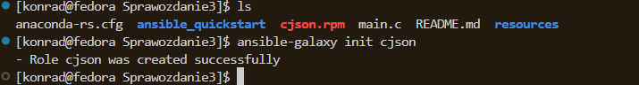

# Sprawozdanie 3

### Instalacja zarządcy ansible

Program tar oraz usługa OpenSSH są obecne.


ustawienie `hostname` na `ansible-target`, niestety nie zrobiłem tego przy instalacji.


Ansible zainstalowany:
```bash
sudo dnf install ansible -y 
```


Utworzenie oraz skopiowanie klucza ssh na maszyne `ansible-target`.
```bash
ssh-copy-id -i ~/.ssh/id_ansible.pub ansible@10.0.2.15
```


Zapisałem stan maszyny ansible-target

### Inwentaryzacja
Wprowadzenie nazw DNS maszyn wirtualnych do katalogu `/etc/hosts`


Sprawdzenie łączności 


Inventory.ini:

```ini
[Orchestrators]
fedora ansible_connection=local

[Endpoints]
ansible-target
```


### Zdalne wywołanie procedur

Pierwszy playbook testujący połączenie: 

```yaml
- name: Playbook1
  hosts: all
  become: true
  tasks:
   - name: Ping my hosts
     ansible.builtin.ping:

   - name: Print message
     ansible.builtin.debug:
       msg: Hello world!
```
Komenda do uruchomienia playbooka:

```bash
ansible-playbook -i inventory.ini playbook.yaml
```


Playbook zawierający resztę wymaganych rzeczy:
```yaml
- name: Playbook1
  hosts: all
  become: true
  tasks:
   - name: Ping my hosts
     ansible.builtin.ping:

   - name: Copy inventory to Endpoint
     ansible.builtin.copy:
      src: inventory.ini
      dest: /home/ansible/inventory_copied
     when: "'ansible-target' in inventory_hostname"

   - name: Ping after copy
     ansible.builtin.ping:

   - name: Update system packages
     ansible.builtin.dnf:
      name: "*"
      state: latest
     when: "'ansible-target' in inventory_hostname"

   - name: Restart sshd
     ansible.builtin.service:
      name: sshd
      state: restarted
     when: "'ansible-target' in inventory_hostname"

   - name: Restart rngd
     ansible.builtin.service:
      name: rngd
      state: restarted
     ignore_errors: true
     when: "'ansible-target' in inventory_hostname"

```

Po uruchomieniu tą samą komendą:


### Zarządzanie stworzonym artefaktem

```bash
ansible-galaxy init cjson
```


```yaml
- name: Create artifacts directory
  become: true
  file:
    path: /home/ansible/cjson
    state: directory
    owner: ansible
    group: ansible
    mode: '0755'

- name: Copy artifacts to target
  copy:
    src: "{{ item }}"
    dest: /home/ansible/cjson/
    mode: '0644'
  loop:
    - files/cjson.rpm
    - files/main.c

- name: Install python3-requests
  ansible.builtin.dnf:
    name: python3-requests
    state: present

- name: Install Docker
  become: true
  dnf:
    name: docker
    state: present
  
- name: Ensure Docker is started
  become: true
  service:
    name: docker
    state: started
    enabled: true

- name: Add ansible to docker group
  user:
    name: ansible
    groups: docker
    append: true

- name: Start fedora container
  community.docker.docker_container:
    name: cjson
    image: fedora:41
    state: started
    command: sleep infinity
    volumes:
      - /home/ansible/cjson:/tmp:z

- name: Install gcc, cjson and tools
  community.docker.docker_container_exec:
    container: cjson
    command: dnf install -y gcc make /tmp/cjson.rpm

- name: Compile source file
  community.docker.docker_container_exec:
    container: cjson
    command: gcc -o /tmp/example /tmp/main.c -lcjson

- name: Run program
  community.docker.docker_container_exec:
    container: cjson
    command: bash -c "LD_LIBRARY_PATH=/usr/local/lib64 /tmp/example"
  register: result

- name: Print the result of the program
  debug:
    var: result.stdout
```

Playbook uruchamiający rolę

```yaml
- name: Deploy CJSON in container
  hosts: ansible-target
  become: true
  roles:
    - cjson
```
Uruchomienie playbooka:
```bash
asnible-playbook -i inventory.ini cjson.yaml
```