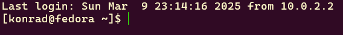
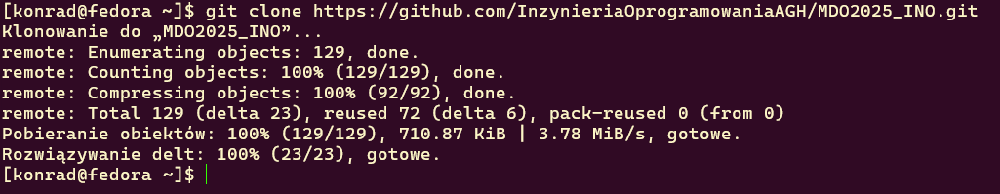
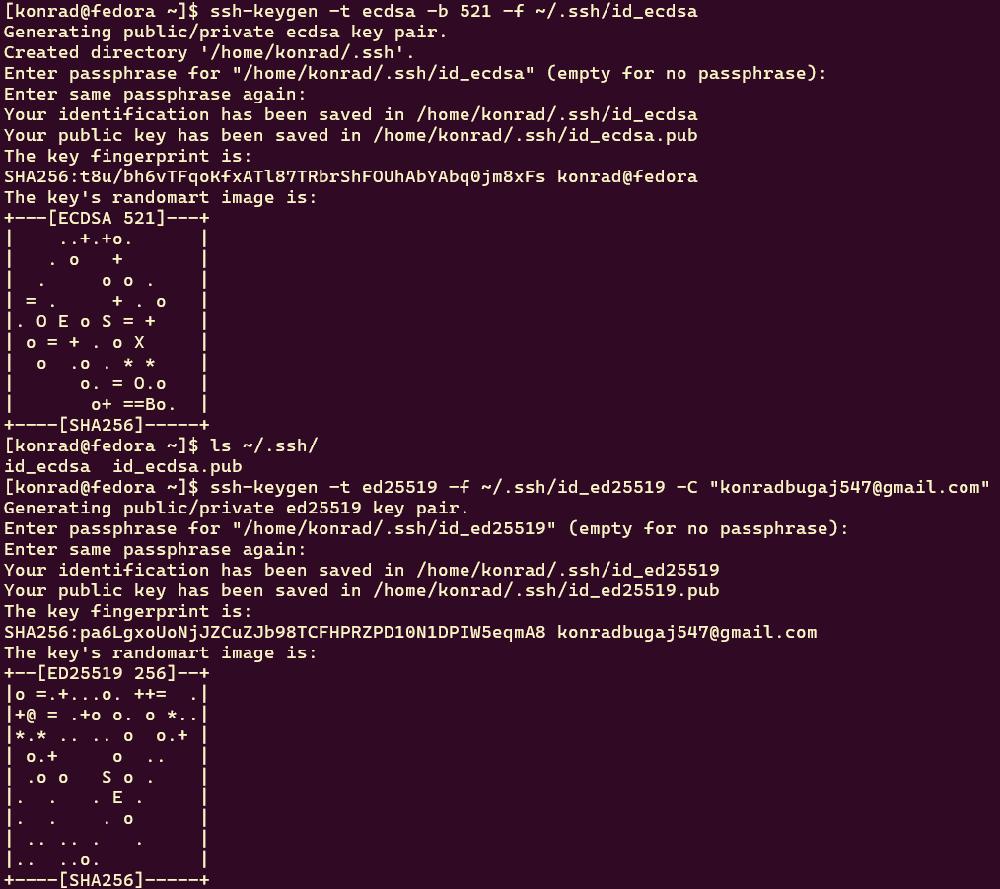
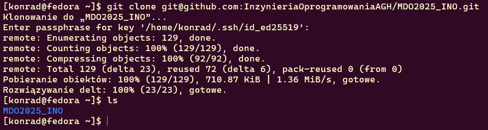
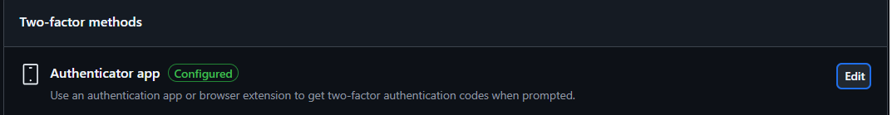
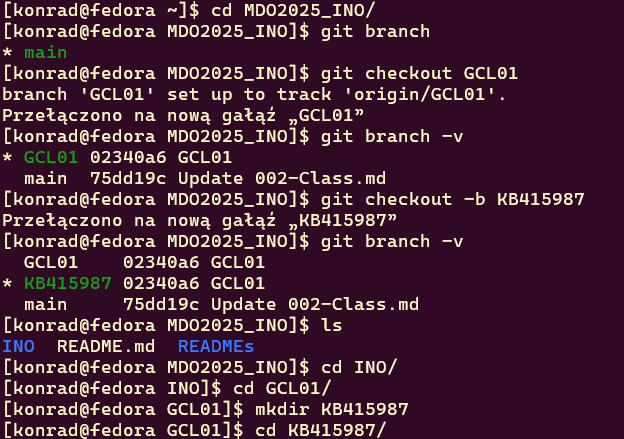
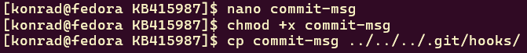
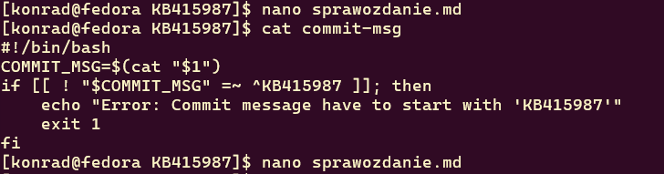

# Sprawozdanie - Zajęcia 01
## Git Hook
    #!/bin/bash
    COMMIT_MSG=$(cat "$1")
    if [[ ! "$COMMIT_MSG" =~ ^KB415987 ]]; then
        echo "Error: Commit message have to start with 'KB415987'"
        exit 1
    fi

## Zalogowanie się na serwerze

## Sklonowanie repozytorium przedmiotowego za pomocą HTTPS 

## Tworzenie dwóch kluczy SSH

## Sklonowanie repozytorium za pomocą protokołu SSH

## Konfiguracja weryfikacji dwuetapowej (2FA)

## Konfiguracja klucza SSH jako metody dostępdu do GitHub

## Utworzenie gałęzi 'KB415987' wychodzącej z gałęzi GCL01

## Pisanie skryptu, nadanie uprawnień do jego uruchamiania oraz umieszczenie go w katalogu ~/MDO2025_INO/.git/hooks/

## Dodanie pliku ze sprawodzaniem, umieszczenie w nim treści napisanego wcześniej git hooka oraz dodanie zrzutów ekranu wraz z opisem zrealizowanych kroków

# Historia poleceń
    1   ls
    2   git --version
    3   git clone https://github.com/InzynieriaOprogramowaniaAGH/MDO2025_INO.git
    4   ls
    5   ls ~/.ssh/
    6   ssh-keygen -t ecdsa -b 521 -f ~/.ssh/id_ecdsa
    7   ls ~/.ssh/
    8   ssh-keygen -t ed25519 -f ~/.ssh/id_ed25519 -C "k...@gmail.com"
    9   cat ~/.ssh/id_ed25519.pub
    10  ssh -T git@github.com
    11  git clone git@github.com:InzynieriaOprogramowaniaAGH/MDO2025_INO.git
    12  ls
    13  cd MDO2025_INO/
    14  git branch
    15  git checkout GCL01
    16  git branch -v
    17  git checkout -b KB415987
    18  ls
    19  cd INO/
    20  cd GCL01/
    21  mkdir KB415987
    22  cd KB415987/
    23  nano commit-msg
    24  chmod +x commit-msg
    25  cp commit-msg ../../../.git/hooks/
    26  nano sprawozdanie.md
    27  cat commit-msg
    28  nano sprawozdanie.md
    29  history
