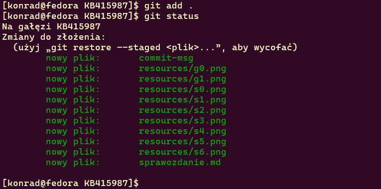
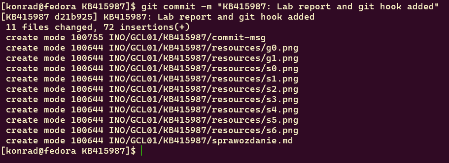
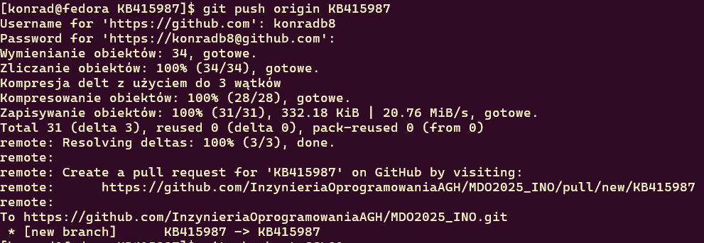
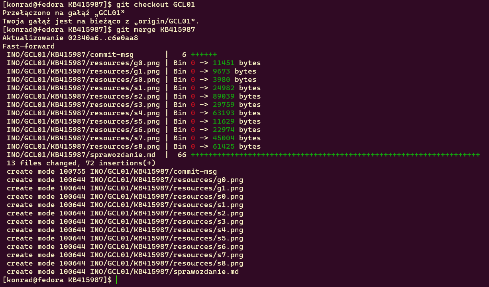

# Sprawozdanie - Zajęcia 01
## Git Hook
    #!/bin/bash
    COMMIT_MSG=$(cat "$1")
    if [[ ! "$COMMIT_MSG" =~ ^KB415987 ]]; then
        echo "Error: Commit message have to start with 'KB415987'"
        exit 1
    fi

## Zalogowanie się na serwerze

## Sklonowanie repozytorium przedmiotowego za pomocą HTTPS 

## Tworzenie dwóch kluczy SSH

## Sklonowanie repozytorium za pomocą protokołu SSH

## Konfiguracja weryfikacji dwuetapowej (2FA)

## Konfiguracja klucza SSH jako metody dostępdu do GitHub

## Utworzenie gałęzi 'KB415987' wychodzącej z gałęzi GCL01

## Pisanie skryptu, nadanie uprawnień do jego uruchamiania oraz umieszczenie go w katalogu ~/MDO2025_INO/.git/hooks/

## Dodanie pliku ze sprawodzaniem, umieszczenie w nim treści napisanego wcześniej git hooka oraz dodanie zrzutów ekranu wraz z opisem zrealizowanych kroków

## Dodanie plików do śledzenia przez Git'a

## Wykonanie commita

## Wysłanie zmian na GitHub'a

## Wciągnięcie gałęzi 'KB415987' do gałęzi grupowej GCL01

