# Sprawozdanie 1

## Lab 1 - Wprowadzenie, Git, Gałęzie, SSH

Najpierw na maszynie zainstalowałam Git i sprawdziłam jego wersję.

`sudo dnf install git`

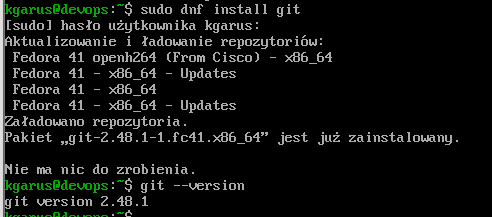

Następnie przeszłam do konfiguracji SSH, wygenerowałam klucz SSH za pomocą komendy, aby połączyć się z GitHub'em.

`ssh-keygen -t ed25519 -C "klaudiagarus9@gmail.com"`

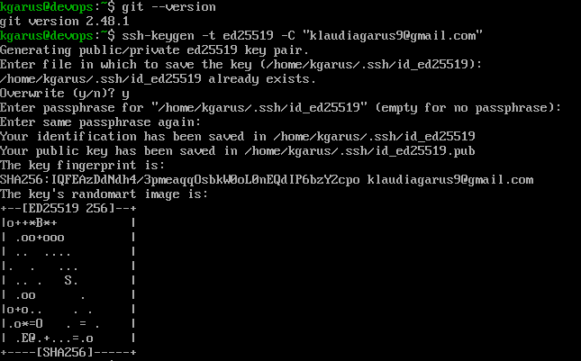

Wyświetliłam zawartość wygenerowanego klucza, skopiowałam ją i dodałam w ustawieniach konta

Sprawdziłam, czy połączenie działa:

`ssh -T git@github.com`

Kiedy już miałam wszystko skonfigurowane, sklonowałam repozytorium za pomocą komendy:

`git clone https://github.com/InzynieriaOprogramowaniaAGH/MDO2025_INO  `

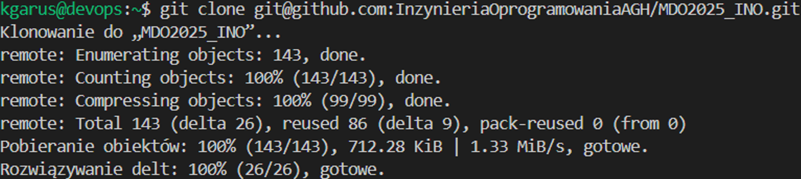

Sprawdziłam dostępne gałęzie i przełączyłam się na odpowiednie:
`git branch`
`git checkout main  `
`git branch`
`git fetch `
`git checkout GCL01`

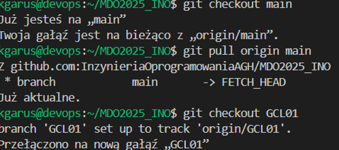

Na koniec utworzyłam swoją własną gałąź:

`git checkout -b KG415716   `

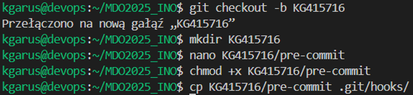

Po wprowadzeniu zmian w lokalnym repozytorium, wysłaliśmy je do zdalnego repozytorium za pomocą polecenia:

## Lab 2 - Git, Docker

Zainstalowałam Dockera

`sudo dnf install -y docker`

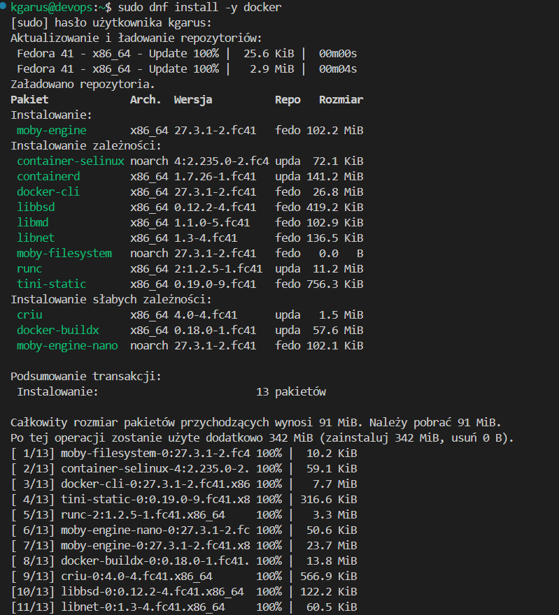

Zarejestrowałam i zalogowałam się w Dockerhub:

`docker login -u klaudia573`

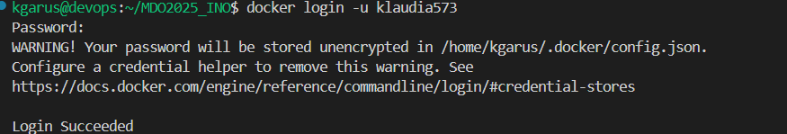

Pobrałam obrazy: *mysql, fedora, hello-world, busybox*

`docker pull <nazwa_obrazu>`

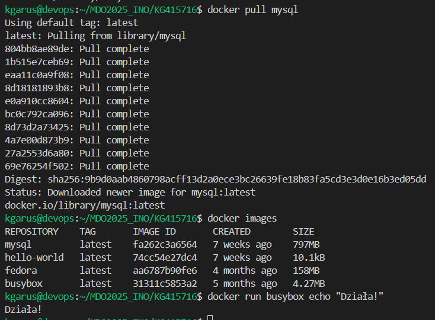

Uruchomiłam kontener *busybox* w trybie interaktywnym.

`docker run -it busybox `

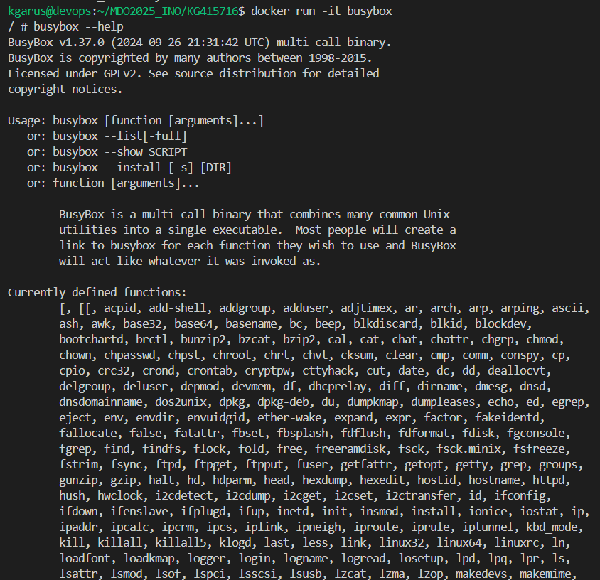
Sprawdziłam PID wewnątrz kontenera oraz zaktualizowałam pakiety w kontenerze fedory:

`ps -aux`

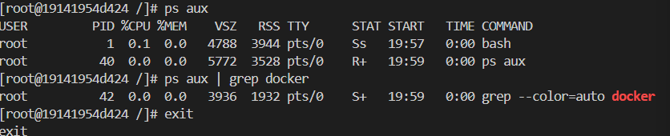

`dnf update`

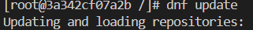
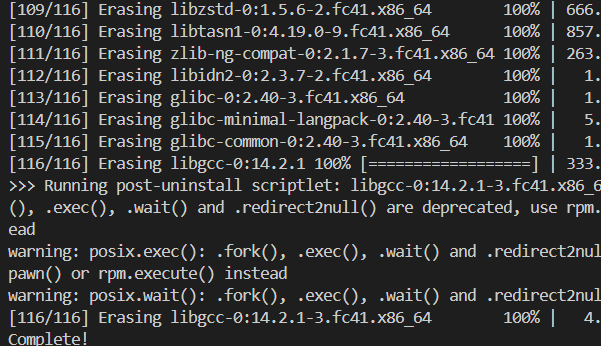

Utworzyłam plik Dockerfile, który budował obraz systemu Fedora z Gitem i konował repozytorium:

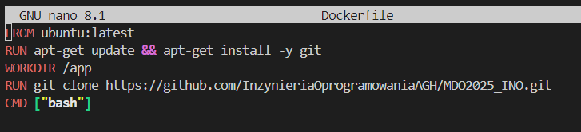

Stworzyłam i zbudowałam swój własny obraz.

`docker build -t moj_obraz `

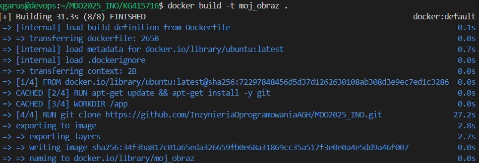

Następnie go uruchomiłam.

`docker run -it moj_obraz`

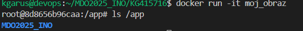

Sprawdziałam wszystkie działające kontenery

`docker ps -a`

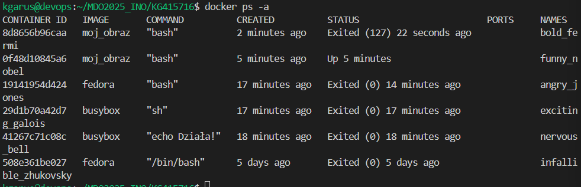

Zatrzymałam i usunęłam kontenery, a następnie ponownie wyświetliłam liste kontenerów

`docker stop %(docker ps -q)`
`docker rm $(docker ps -a -q)`
`docker ps -a`

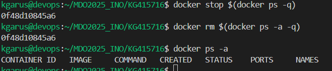

## Lab 3 - Dockerfiles, kontener jako definicja etapu

Najpierw zainstalowałam wszystkie potrzebne pakiety
`sudo dnf -y cmake gcc gcc-c++ make git`

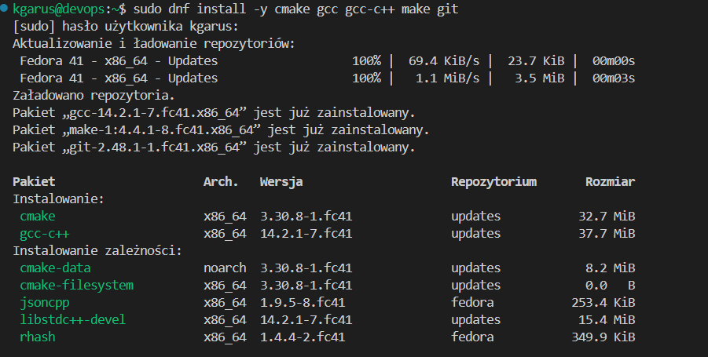

Do zadania wykorzystałam program node-js-dummy-test: https://github.com/devenes/node-js-dummy-test

Skolonowałam repozytorium:

`git clone https://github.com/devenes/node-js-dummy-test.git`

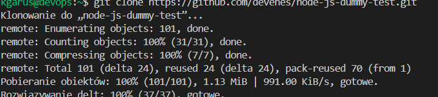

Utworzyłam i uruchomiłam kontener:
`docker run -it ubuntu:latest /bin/bash`

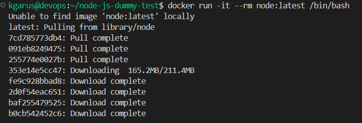

Przeprowadziłam testy jednostkowe
`npm run test`

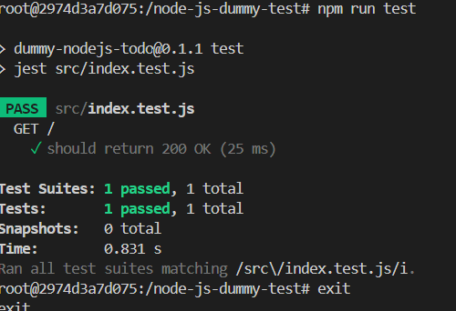

Zbudowałam obraz kontenera przy użyciu pliku Dockerfile.build:
`docker build -t build-image -f `Dockerfile.build .

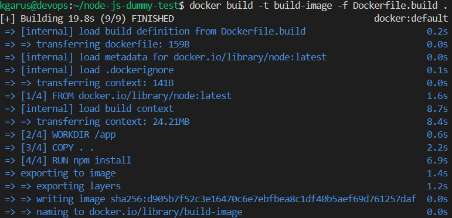

Plik Dockerfile.build:

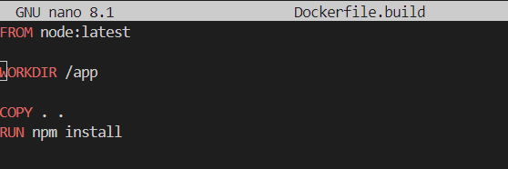

Tak samo jak poprzednio uruchomiłam testy aplikacji:

`docker build -t build-image -f Dockerfile.test .`
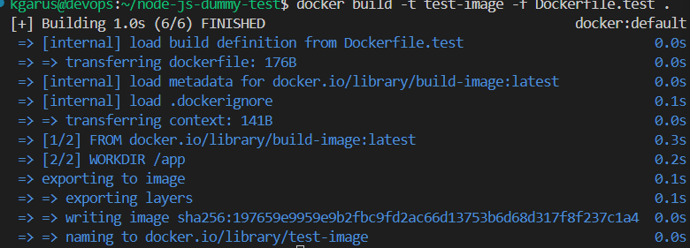

Plik Dockerfile.test:

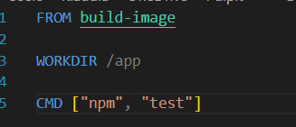

`docker run --rm test-image `

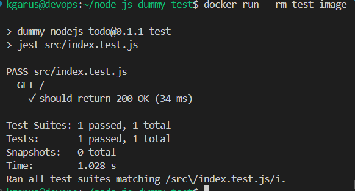

## Lab 4  - Dodatkowa terminologia w konteneryzacji, instancja Jenkins
Utworzyłam dwa woluminy: wejściowy i wyjściowy. 

`docker volume create Vin`
`docker volume create Vout`

Następnie stworzyłam obraz Docker, na bazie pliku Dockerfile.vol:

`sudo docker build -f Dockerfile.vol -t cloner .`

Plik Dockerfile.vol:

Następnie uruchomiłam kontener i dodałam wcześniej utworzony wolumin

Zbudowalam obraz o nazwie install:

`sudo docker build -f Dockerfile.install -t install`

Plik Dockerfile.install:

Uruchomiłam kontener, działający jako serwer iperf3

`sudo docker run -d --rm --name iperf-server networksattic/iperf3 -s`

Otrzymałam adres IP kontenera: **172.17.0.2**

Uruchamiłam klienta iperf3 i przeprowadziłam test połączenia:

`docker urn --rm networkstatic/iper3 -c 172.17.0.2`

Zapisałam wyniki testu połączenia do logow:

`sudo docker logs iperf-server-test > iperf3_logs.log`

Plik iperf3_logs.log:

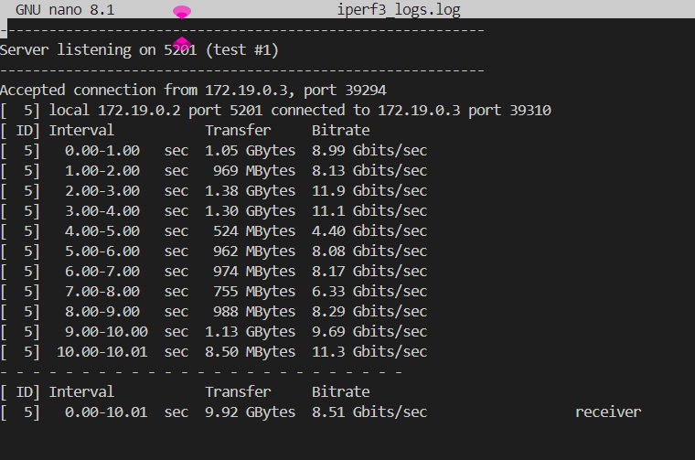

Aby połączyć się do serwera iperf3 spoza kontenera, musiałam otworzyć port i go uruchomić na tym otwartym porcie.:

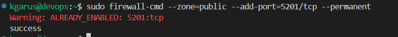

Utworzyłam osobną sieć Docker dla Jenkinsa

`sudo docker network create jenkins`

Uruchomiłam kontener DIND, a potem kontener Jenkinsa:

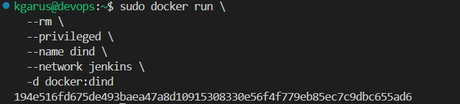
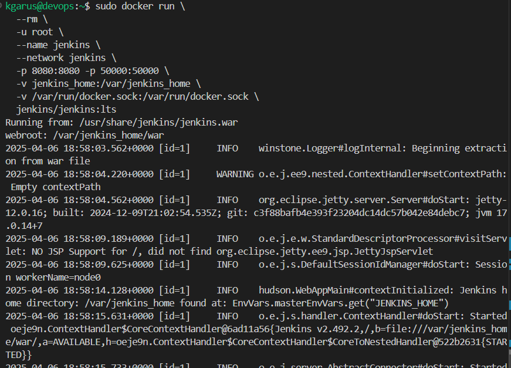

Pobrałam hasło i zalogowałam się do strony.

