# Sprawozdanie 2
## Przygotowanie środowiska
Na początku zweryfikowałam działanie kontenerów, które służą do budowania i testowania aplikacji. Zapoznałam się również z dokumentacją dotyczącą instalacji Jenkinsa. Rozpoczęłam od utworzenia sieci dla Jenkinsa, co pozwala na poprawną komunikację między kontenerami. W tym celu użyłam  polecenia:

`docker network create jenkins`
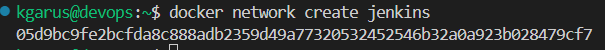

Następnie uruchomiłam kontener Docker-in-Docker, czyli kontener, w którym działa Docker, co jest pomocne w pracy z Jenkinsem. W tym celu utworzylam obraz:

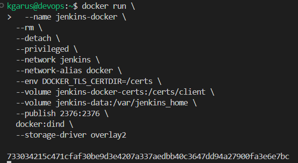


Po uruchomieniu konetnera, pojawił się jego identyfikator , co świadczy, że zadziałał on poprawnie w tle.
W kolejnym kroku to przygotowałam własnegu obraz Jenkinsa z Blue Ocean. Stworzyłam plik Dockerfile, który zawierał wszystkie potrzebne pluginy.
Jenkins BlueOcean różni się od zwykłego Jenkinsa ładniejszym i prostszym w obsłudze interfejsem. Ułatwia to zarządzanie pipeline'ami i lepszą integrację z GitHubem.

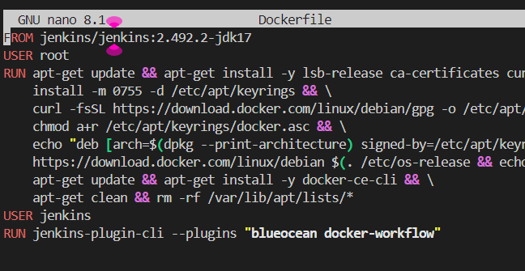
Obraz zbudowałam za pomocą tego polecenia:

`docker build -t myjenkins-blueocean:2.492.3-1 .`

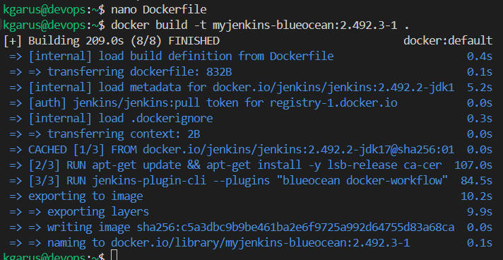


Za pomocą adresu ip, połączyłam się z Jenkinsem i go odpowiednio zkonfigurowałam.

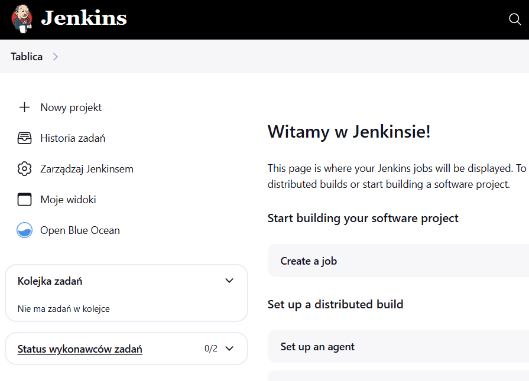

### Projekt 1 – wyświetlanie informacji o systemie

Pierwszym krokiem po uruchomieniu Jenkinsa było stworzenie prostego projektu, którego zadaniem było uruchomienie polecenia uname. Dzięki temu mogłam sprawdzić, czy Jenkins poprawnie wykonuje polecenia systemowe.

W konfiguracji projektu wybrałam opcję Utwórz powłokę i dodałam komendę:

`uname -a`

Po zapisaniu konfiguracji i uruchomieniu zadania, Jenkins poprawnie wykonał polecenie.

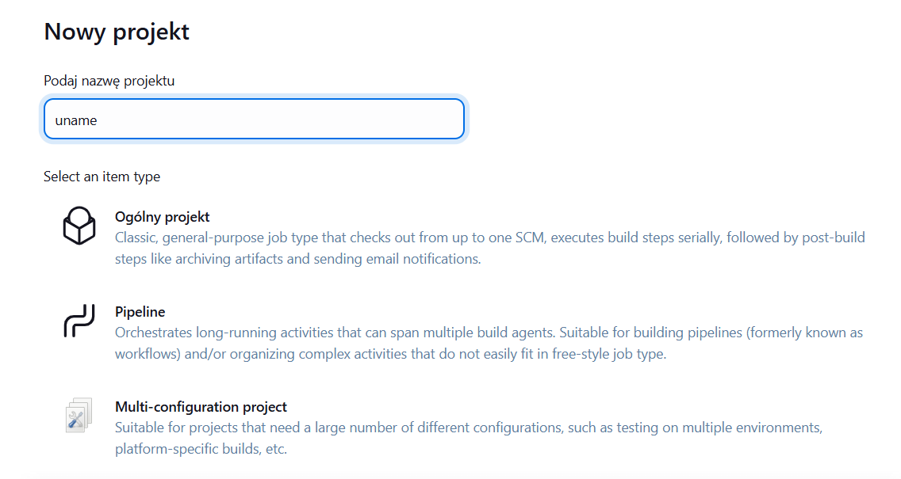
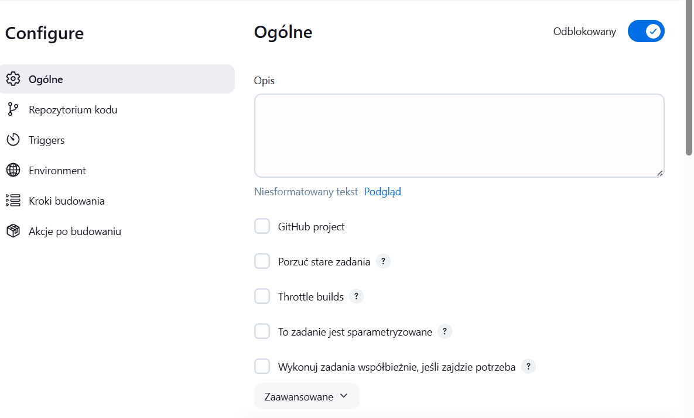
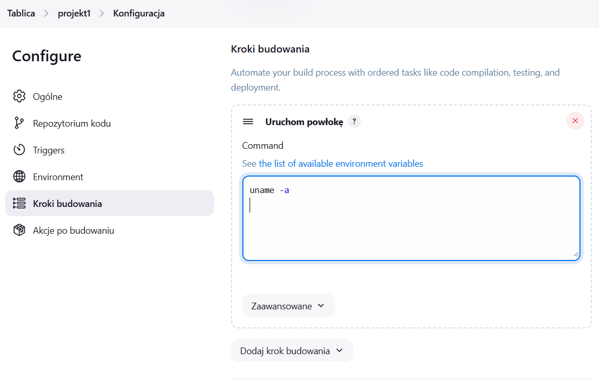
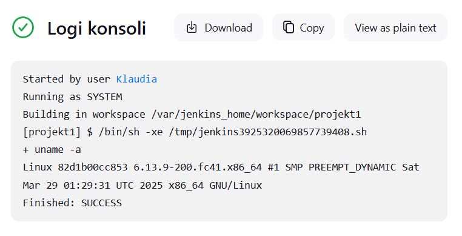

### Projekt 2 – wykrywanie nieparzystej godziny
Kolejny projekt miał na celu przetestowanie działania skryptu, który zwraca błąd, jeśli aktualna godzina systemowa jest nieparzysta. Chciałam sprawdzić, jak Jenkins reaguje na zakończenie zadania, gdy godzina jest parzysta i nie parzysta.

Utworzyłam nowy projekt i dodałam skrypt:
``` HOUR=$(date +%H)
if [ $((HOUR % 2)) -ne 0 ]; then
  echo "aktualna godzina - $HOUR jest nieparzysta"
  echo "Błąd: aktualna godzina - $HOUR jest nieparzysta"
  exit 1
else
  echo "Godzina $HOUR jest parzysta - wszystko OK"
fi
```
Skrypt pobiera aktualną godzinę, sprawdza, czy godzina jest podzielna przez 2 ,jeśli nie jest, kończy się komunikatem i błędem, a jeśli jest kończy się powodzeniem.

###### Parzysta godzina:
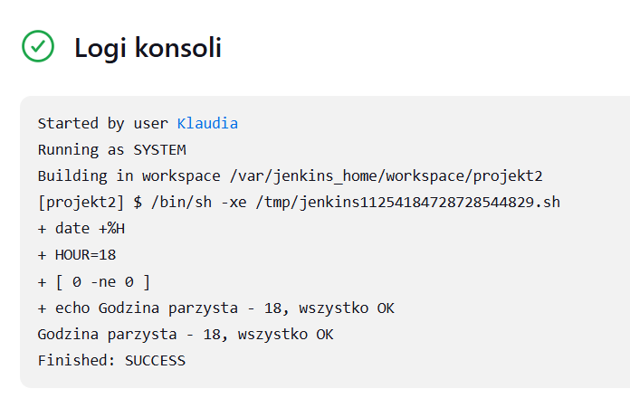
###### Nieparzysta godzina:
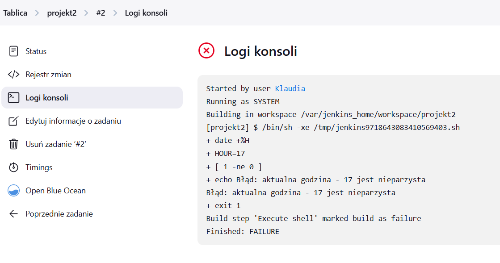

Kolejno przeszłam do pobierania w projekcie obraz kontenera ubuntu stosując docker pull:
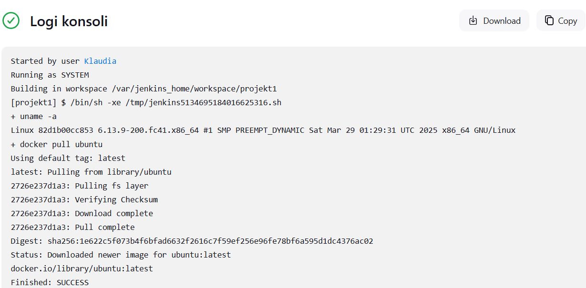


##### Pipeline
Następnie zaimplementowałam pipeline, który automatycznie pobiera kod źródłowy z mojej gałęxi i na jego podstawie buduje obraz Dockera o nazwie moj-obraz-builder. Po zakończeniu procesu budowania, w zależności od jego wyniku, informuje czy proces sie wykonał poprawnie czy nie. Uruchomiłam go dwukrotnie,

```pipeline {
    agent any

    stages {
        stage('Klonowanie repozytorium') {
            steps {
                git branch: 'KG415716', url: 'https://github.com/InzynieriaOprogramowaniaAGH/MDO2025_INO.git'
            }
        }

        stage('Budowanie Dockera') {
            steps {
                script {
                    sh 'echo "Zaczynamy build obrazu Docker"'
                    sh 'docker build --progress=plain -t moj-obraz-builder -f INO/GCL01/KG415716/Sprawozdanie1/Dockerfiles/Dockerfile.build .'
                }
            }
        }
    }

    post {
        success {
            echo 'Pipeline udany'
        }
        failure {
            echo 'Pipeline nieudany'
        }
    }
}
```

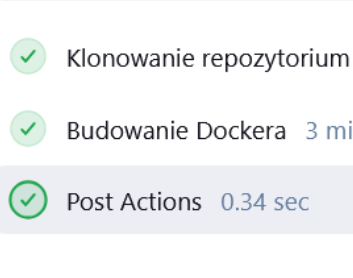

##### Jenkinsfile z SCM
W pierwszym kroku tworzone pipeline dla aplikacji Irssi. Utworzyłam dwa pliki Dockerfile: jeden do budowy obrazu i drugi do testów.

Utworzyłam nowy porjket, wybrałam opcje `Pipeline script from SCM`. Podałam odpowiedni adres do repozytorium i ścieżkę do pliku Jenkinsfile.


##### Dockerfile i Dockerfile.test:

Dockerfile tworzy obraz aplikacji Irssi, instaluje wszystkie wymagane zależności, uruchamia aplikację i tworząc obraz z minimalnym zestawem plików.
Dockerfile.test ustawia środowisko do testów, uruchamia je w kontenerze i zapisuj wyniki.
#### Jenkinsfile:
   
##### Efekty pipeline'u i ich wytłumaczenie:

Na samym początku pipeline automatycznie pobiera najnowszy kod źródłowy z GitHub.Dzięki czemu, cały proces budowania, testowania i publikacji opiera się na  najnowszym kodzie.
```
stage('Checkout') {
            steps { checkout scm }
        }
```
Po pobraniu kodu przechodzimy do budowania obrazu typu `builder`, obraz jest zbudowany tak żeby zawieał wszystkie elementy potrzebne do procesu kompilacji takie jak np. takie jak Meson i Ninja.
```
stage('Build Builder Image') {   //builder image
            steps {
                sh """
                    docker build --target builder \
                        -t ${BUILDER_IMG} \
                        -f ${DOCKER_DIR}/Dockerfile \
                        ${DOCKER_DIR}
                """
            }
        }
```
 Gdy obraz jest już gotowy, przechodzimy do stworzenia obrazu testowego, który bazuje na poprzednim obrazi i zawiera dodatkowe narzędzia do uruchamiania testów jednostkowych w izolowanym środowisku.
```
      stage('Build Tester Image') {    //tester image
            steps {
                sh """
                    docker build \
                        -f ${DOCKER_DIR}/Dockerfile.test \
                        --build-arg BASE=${BUILDER_IMG} \
                        -t ${TESTER_IMG} \
                        ${DOCKER_DIR}
                """
            }
        }
```

Nastęonie, uruchamiane są testy jednostkowe, które kontrolują, czy wszystkie funckje aplikacji działają poprawnie. Gdy coś nie zadziała poprawnie automatycznie zostaniemy o tym powiadomieni. Wyniki są zapisywane w pliku test.log.

```
        stage('Test') {
            steps {
                sh """
                    docker run --rm ${TESTER_IMG} \
                        /bin/bash -c "meson test -C /app/builddir --print-errorlogs --logbase junit" \
                        | tee test.log
                """
            }
        }
```

Po testach, budowany jest obraz, który będzie zawierał wyłącznie niezbędne pliki do uruchomienia aplikacji w środowisku produkcyjnym.

```
    stage('Build Runtime Image') { //runtime image
            steps {
                sh """
                    docker build --target runtime \
                        -t ${RUNTIME_IMG} \
                        -f ${DOCKER_DIR}/Dockerfile \
                        ${DOCKER_DIR}
                """
            }
```
Następnie aplikacja Test-Runtime czyli, test, który sprawdza, czy aplikacja uruchamia się poprawnie. 
``` stage('Test Runtime') {
            steps {
                sh "docker run --rm ${RUNTIME_IMG} --version"
            }
        }
```
 Następnie kiedy obrazy są gotowe, są publikowane na Docker Hub. Dzięki temu obrazy są dostępne publicznie, co oznacza, że każdy może je pobrać.
```
        stage('Publish Images') {
            environment {
                DOCKERHUB = credentials('dockerhub-credentials') 
            }
            steps {
                script {
                    docker.withRegistry('', 'dockerhub-credentials') {
                        docker.image("${BUILDER_IMG}").push()
                        docker.image("${RUNTIME_IMG}").push()
                    }
                }
            }
        }
    }
```
#### Deploy:
Deploy to proces, w którym pipeline tworzy obrazy Docker i generuje plik .tar.gz gotowy do uruchomienia w produkcji. Po testach jednostkowych, pipeline tworzy obraz runtime i plik archiwum. Całość odbywa się automatycznie, minimalizując ryzyko błędów.

#### Publish:
Publish to etap, w którym pipeline przesyła gotowe obrazy na Docker Hub. Obrazy są automatycznie publikowane, a plik .tar.gz archiwizowany w Jenkinsie. Proces jest w pełni zautomatyzowany.


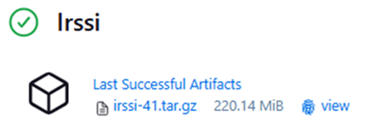

#### WNIOSKI:
Pipeline buduje, testuje i wdraża aplikację Irssi, zapewniając powtarzalność procesów i dostępność artefaktów, takich jak obrazy Docker i archiwum .tar.gz. Pipeline pozwala w pełni wykonać proces od pobrania kodu aż po publikację gotowego produktu. Dzięki temu nie trzeba wykonywać żadnych kroków ręcznie, bo zrobią się same. Oszczędza to czas i minimalizuje ryzyko błędów. Automatyczne budowanie, testowanie i publikacja obrazów Docker pokazują, jak dużą rolę w wytwarzania oprogramowania odgrywa CI/CD, ponieważ oferują szybkośc i łatwość wdrażania.

