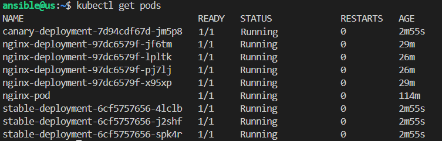

### Sprawozdanie 3

#### Zajęcia 8

##### Instalacja zarządcy Ansible

 Na początku stworzyłam maszynę wirtualną o nazwie **ansible-target**, utworzyłam użytkownika **ansible**, a następnie zainstalowałam pakiety `tar` i `openssh`.


Utworzyłam migawkę maszyny.
Na głównej maszynie.


Zainstalowałam Ansible za pomocą:
```bash
sudo dnf install -y ansible
```


Skonfigurowałam klucze SSH między maszynami za pomocą 
```ssh-copy-id```, co umożliwiło połączenie bez hasła.


Każdą z maszyn za pomocą polecenia 
```bash
hostnamectl set-hostname <nazwa-maszyny>
```
 nazwałam. Po czym sprawdziłam czy nazwy zapisały się poprawnie.
 


W pliku `/etc/hosts` każdej z maszyn przypisałam przy nazwach ich adresy IP.


Za pomocą ping sprawdziłam czy maszyna poprawnie łączy się z maszyną ***ansible-target***


Sprawdziłam czy maszyny poprawnie łączą się przez ssh:


Kolejnym etapem było stworzenie pliku inwentaryzacji Ansible `inventory.ini`. Plik ten informuje, na których hostach ma wykonywać dane zadania Ansible. Utworzyłam w nim dwie grupy: `Orchestrators` i `Endpoints`


Wykonałam polecenie ping przez Ansible, co ostatecznie pokazało na poprawne wykonanie operacji.


Utworzyłam `playbooka`, który jest plikim YAML i podobnie jak ini informuje jakie zadania Ansible ma wykonać na maszynach.


Następnie wykonałam ping za pomocą którego wysłałam żądanie ping do wszystkich maszyn i uruchomienie krótkiego komunikatu `hello world`


`asnible-playbook -i inventory.ini playbook.yaml`

Ostateczny playbook miał posiadać: wysłanie żadania ping do wszystkich maszyn,skopiowanie pliku inwentaryzacji na maszynę Endpoint, aktualizację pakietów systemowych oraz restart usług sshd i rngd.


Ponownie go uruchomiłam.


Plik inventory.yml pojawił się na drugiej maszynie wirtualnej.


##### Operacje względem maszyny z wyłączonym serwerem SSH i odłączoną kartą sieciową, 
Wykonałam ją poprzez wyłączenie serwera ssh na maszynie ansible-target.


Po ponownym uruchomieniu playbooka, uzyskałam status `UNREACHABLE`.


****Zarządzanie kontenerami****

Za pomocą polecenia:
```bash
ansible-galaxy init kontenr
```
utworzułam rolę Ansible 


Plik **main.yml** zawierał zadania: intalacji dockera, kopiowania obrazu Dockera, ładowanie tego obrauz z tar, uruchamianie kontenera, zatrzymywanie i usunawnie kontenera.


***Playbook deploy.yml***
W pliku deploy.yml użyłam roli:


Po czym, uruchomiłam go poleceniem:
```bash
ansible-playbook -i inventory.yml .yaml
```
W inventory, oznaczyłam, aby Ansible pracowałał tylko i wyłącznie na lokalnej maszynie.

Po uruchomieniu kontenera logi wskazały na poprawne wykonanie skryptu.


#### Zajęcia 9

Celem tych zajęć było przeprowadzenie nienadzorowanej instalacji systemu oraz konfiguracja środowiska tak, aby po uruchomieniu system automatycznie uruchamiał nasze oprogramowanie. 

Utworzyłam nową maszynę wirtualną z systemem Fedora. 
Następnie zalogowano się na roota, znalazłam plik anaconda-ks.cfg. Umieściłam go na przedmiotowym repozytorium na Githubie i za pomocą TinyUrl skóciłam link. 
To plik Kickstart, czyli plik który instalator Fedory generuje automatycznie w trakcie instalacji systemu.


Edytowałam plik anaconda-ks.cfg, w którym między innymi, dodałam link do  wymaganych repozytoriów,
```bash
url --mirrorlist=http://mirrors.fedoraproject.org/mirrorlist?repo=fedora-42&arch=x86_64
repo --name=update --mirrorlist=http://mirrors.fedoraproject.org/mirrorlist?repo=updates-released-f42&arch=x86_64   `
```

ustawiłam `hostname` na `fedora-`
Dodałam fukncję, która formatuje cały dysk. I zmieniłam nazwę na inną niż lokalny host. Cały zmodyfikowany plik `anaconda-ks.cfg`
```bash
# Generated by Anaconda 41.35
# Generated by pykickstart v3.58
#version=DEVEL

# Keyboard layouts
keyboard --vckeymap=pl --xlayouts='pl'
# System language
lang pl_PL.UTF-8

# Network information
network  --bootproto=dhcp --device=enp0s3 --ipv6=auto --activate
network  --hostname=auto.local

%packages
@^server-product-environment

%end

# Run the Setup Agent on first boot
firstboot --enable

url --mirrorlist=http://mirrors.fedoraproject.org/mirrorlist?repo=fedora-40&arch=x86_64
repo --name=update --mirrorlist=http://mirrors.fedoraproject.org/mirrorlist?repo=updates-released-f40&arch=x86_64

# Generated using Blivet version 3.11.0
ignoredisk --only-use=sda
# Partition clearing information
clearpart --all –initlabel


# Disk partitioning information
part /boot --fstype="ext4" --ondisk=sda --size=1024
part pv.48 --fstype="lvmpv" --ondisk=sda --size=14333
part biosboot --fstype="biosboot" --ondisk=sda --size=1
volgroup fedora_devops --pesize=4096 pv.48
logvol / --fstype="ext4" --grow --maxsize=71680 --size=1024 --name=root --vgname=fedora_devops

# System timezone
timezone Europe/Warsaw --utc

#Root password
rootpw --lock
user --groups=wheel --name=kgarus --password=$y$j9T$..r0XqXE2JaATjP6.TSA98Gu$d6DE9O36E1Q4NwopL7JGq7MIqgaKUIYZR24v6MIciD9 --iscrypted --gecos="Klaudia Garus"
```

Po edytowaniu pliku dokonałam instalacji.


Następnie przeszłam do rozszerzenia pliku ks.cfg, aby dodać repozytoria i pakiety potrzebne do uruchomienia projektu Irssi. Plik instaluje Dockera, dodaje użytkownika Klaudia do grupy docker, tworze skrypt i usługę systemową do automatycznego uruchamiania kontenera w tle oraz kończy instalację rebootem. Plik zapisano na GitHubie jako anaconda-ks2.cfg.

`anaconda-ks2.cfg`
```bash
#version=DEVEL

# Keyboard layouts
keyboard --vckeymap=pl --xlayouts='pl'

# System language
lang pl_PL.UTF-8

# Network information
network --bootproto=dhcp --device=enp0s3 --ipv6=auto --activate
network --hostname=fedora-irssi.local

# System timezone
timezone Europe/Warsaw --utc

# Root password and user creation
rootpw haslo123 --plaintext
user --groups=wheel --name=klaudia573 --password=haslo123 --plaintext --gecos="klaudia573"

# Disk partitioning
ignoredisk --only-use=sda
autopart
clearpart --none --initlabel

# Package selection
%packages
@^server-product-environment
docker
curl
wget
%end

# Run the Setup Agent on first boot
firstboot --enable

# Installation sources
url --mirrorlist=http://mirrors.fedoraproject.org/mirrorlist?repo=fedora-41&arch=x86_64
repo --name=update --mirrorlist=http://mirrors.fedoraproject.org/mirrorlist?repo=updates-released-f41&arch=x86_64

# Post-installation configuration
%post --log=/root/ks-post.log --interpreter=/bin/bash

# Enable Docker and add user to docker group
systemctl enable docker
usermod -aG docker klaudia573

# Tworzymy skrypt uruchamiający IRSSI w kontenerze
cat << 'EOF' > /usr/local/bin/klaudia-irssi.sh
#!/bin/bash
until systemctl is-active --quiet docker; do
  sleep 1
done
if ! docker ps -a --format '{{.Names}}' | grep -q '^irssi-container$'; then
  docker run -d --name irssi-container klaudia573/irssi-runtime:43
fi
EOF

chmod +x /usr/local/bin/klaudia-irssi.sh

# Tworzymy usługę systemd do automatycznego uruchomienia kontenera
cat << 'EOF' > /etc/systemd/system/klaudia-irssi.service
[Unit]
Description=Start IRSSI container at boot
After=network-online.target docker.service
Requires=docker.service

[Service]
ExecStart=/usr/local/bin/klaudia-irssi.sh
Type=oneshot
RemainAfterExit=yes

[Install]
WantedBy=multi-user.target
EOF

# Enable the IRSSI service
systemctl enable klaudia-irssi.service

%end

# Reboot after installation
reboot
```


Ponownie wykonałam instalację, w taki sam sposób jak poprzednio. Po czym system uruchomił się


#### Zajęcia 10

Rozpoczęłam instalajcę od pobrania pliku.
```bash
https://storage.googleapis.com/minikube/releases/latest/minikube-linux-amd64
```

Następnie wykorzystałam alias kubectl, który służy do zarządzania klastrem Kubernetes.
```bash
alias kubectl="minikube kubectl --".
```

```bash
minikube start
```


Sprawdziłam stan klastra.

**Minimalne wymagania to Minikube to:**
- min 2CPU,
- chociaż 2 GB pamięci operacyjnej (RAM),
- około 20 GB wolnej przestrzeni dyskowej,
- zainstalowany silnik wirtualizacji lub konteneryzacji, taki jak np. Docker lub VisualBox

Minikube działa w środowisku Docker,
można to zmienić komendą start: minikube start --cpus=4 --memory=4096

Sprawdziłam działanie poda:


Następnie uruchomiłam Dashboarda:
```bash
minikube dashboard
```

**Podstawowe obiekty Kubernetes:**

**Pod** – to najmniejsza jednostka w Kubernetesie. Uruchamia jeden lub więcej kontenerów, które mają wspólną sieć i system plików.

**Deployment** – zarządza tworzeniem i utrzymywaniem kopii podów. Dzięki niemu można łatwo robić aktualizacje, rollbacki oraz skalować aplikację.

**Service** – to warstwa abstrakcji, która udostępnia dostęp do podów przez stabilny adres IP i nazwę DNS. Umożliwia komunikację zarówno wewnątrz klastra, jak i na zewnątrz.


Wybrałam projekt z serwerem nginx, który działa jako kontener usługowy. Celem było zbudowanie i uruchomienie kontenera z prostą stroną internetową.

Przygotowując własny obraz kontenera, zrobiłem prostą stronę internetową w pliku index.html. To  tę stronę serwer NGINX miał wyświetlać.


Następnie utworzyłam plik Dockerfile. Bazowym obrazem był nginx:latest. Ustawiłem polecenie COPY, które podmienia domyślną stronę startową NGINX na moją własną.


Uruchomiłam obraz Dockera `docker buil -t aplikacja`. 
 

Następnie uruchomiono kontener na podstawie tego obrazu komendą:
`docker run -d -p 8080:80 --name  aplikacja.`

Następnie w przeglądarce sprawdziłam działanie strony, która działała.


Zadaniem było uruchomienie kontenera z obrazem ngix w Kubernates jako pojedynczego poda z obrazem nginx, otwierając port 80. 

Po uruchomieniu Dashboarda otwiera się UI, w którym można widać stan klastra. Zielone oznaczenie świadczy o poprawnym działanu.


Utworzyłam kolejnego poda i przeskalowałam go za pomocą polecenia:
`kubectl scale deployment nginx-deployment --replicas=3`


Następnie stworzyłam plik yaml, który uruchamia jeden pod z kontenerem na bazie obrazu


Uruchomiłam klaster i wdrożyłam aplikacje
```bash
minikube kubectl -- apply -f nginx-deployment.yaml
```

Potem sprawdzono liste deploymentów i ich statusy poleceniem:

```bash
minikube kubectl get deploy
```


Status **Running**, oznacza, że kontener działa poprawnie.


Zmodyfikowałam plik yaml, do 4 replik


W dashboardzie Kubernetes sprawdziłam poprawne działanie podów.


Wykonałam przekierowanie portu, z 8888 na 80 w podzie nginx-pod. Dzięki czemu w przeglądarce  http://localhost:8888 wyświetliła się domyślna strona nginx


#### Zajęcia 11

Zadanie polegało na stworzeniu co najmniej trzech wersji obrazu. Kontynuowałam działanie na obrazie ***nginx*** z poprzednich zajęć. Przygotowałam trzy wersje tego obrazu, w postaci plików index.html i plików Dockerfile. Następnie zbudowałam za pomocą docker build. I wypchnęłam na Dockera.

- **Wersja 1**
plik index.html
```bash
<!DOCTYPE html>
<html>
<head><title>Wersja 1</title></head>
<body><h1>Pierwszy wariant strony nginx</h1></body>
</html>
```


- **Wersja 2**
plik index.html
```bash
<!DOCTYPE html>
<html>
<head><title>Wersja 2</title></head>
<body><h1>Drugi wariant strony nginx</h1></body>
</html>
```


Plik Dockerfile, identyczny dla obu wersji

```bash
FROM nginx
COPY index.html /usr/share/nginx/html/index.html
```
- **Wersja 3 - błędna:**
Plik Dockerfile:

```bash
FROM nginx
CMD ["false"]`
```


Kolejno przeszłam do zmiany w pliku deployment.yaml, Zwiększyłam repliki do 8.


Następnie zmniejszyłam repliki do 1 i 4.


Zmieniam paraetr `image` na nazwe wadliwej wersji


Aby sprawdzić historię wdrożen, korzystam z rollout


Utworzyłam skrypt, który sprawdzał, czy deployment został poprawnie wdrożony w w ciągu 60 sekund.

Wynik działania


**Strategie wdrożenia**
W celu przetestowania strategii wdrożeń w Kubernetes przygotowano trzy scenariusze: 
- **Recreate** – Metoda polega na usunięciu wszystkich działających podów z poprzedniej wersji przed utworzeniem nowych. W efekcie wdrożenie powoduje chwilową przerwę w działaniu aplikacji.


-  **RollingUpdate** – Stopniowe wdrażanie zmian – stare instancje aplikacji są zastępowane nowymi po kolei, co zapewnia ciągłość działania.


- **Canary** – Strategia umożliwiająca równoległe uruchomienie dwóch wersji aplikacji: stabilnej i testowej. Można skierować część ruchu do nowej wersji, aby monitorować jej działanie przed pełnym wdrożeniem.
Utworzyłam plik nginx-canary.yaml, który posiada wersje stabilna i testowa.


Poprawne zakończenie rolloutów:



###### Wykorzystanie sztucznej inteligencji

Podczas realizacji zadania korzystałam ze wsparcia sztucznej inteligencji, aby formułować zdania i lepiej zrozumieć złożone zagadnienia związane z konfiguracją systemu. AI pomogła mi również w weryfikacji poprawności tworzonych plików konfiguracyjnych oraz w optymalizacji kodu. 
