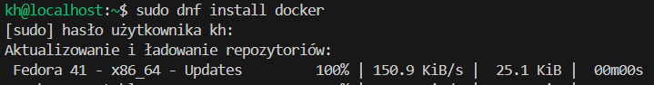
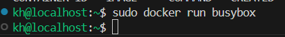

# Sprawozdanie 1

Pierwszym krokiem było utworzenie maszyny wirtualnej z systemem linuxowym (tutaj jest to Fedora), wraz ze stworzeniem użytkownikia (o nazwie kh). Następnie skonfigurowano środowisko Visual Studio Code, aby możliwe było połączenie się z maszyną przez protokół ssh. Następnie można było przejść do realizacji kroków z instrukcji.

## Ćwiczenie 1

Pierwszym krokiem było pobranie git'a na maszynę wirtualną. Użyto do tego poniższej komendy:


Następnie należało podłączyć się do repozytorium przedmiotu na githubie przy pomocy HTTPS.


Spowodowało to utworzenie folderu `MDO2025_INO`.


Następne w katalogu .ssh należało wygenerować 2 klucze (1 zabezpieczony hasłem) oraz dodać je jako metodę weryfikacji.

```
 key-gen -t ed25519
```

Pozostało dodanie ich do githuba.


Konieczne było też przejście na gałąź grupy, oraz utworzenie własnej gałęzi.

```
git checkout GCL01
git checkout -b KH415979
```


Należało też utworzyć w nowej gałęzi, w folderze grupy własny katalog.


Następnie należało dodać git hook'a, czyli skrypt aktywujący się, kiedy nastąpi określona akcja wykonana na repozytorium. Tutaj przedstawiony hook sprawdza, czy każdy commit zaczyna się od moich inicjałów o numeru indeksu. Hook znajduje się w folderze `.git/hooks/`
Plik ten też skopiowano i umieszczono w katalogu `KH415979`


Konieczne było również nadanie mu uprawnień do wykonania przy pomocy 
`chmod`.


Pozostało tylko sprawdzenie poprawności hooka.


Jednym z ostatnich kroków było wysłanie zmian do repozytorium.


Gałąź została dodana do głównego repozytorium.


### Podsumowanie

Pierwsze zajęcia opierały się na obsłudze znanego już wcześniej git'a, jednak w tej instrukcji nacisk został położony na bardziej zaawansowane funkcjonalności (przykładowo git hook)

---

## Ćwiczenie 2

Pierwszym krokiem drugiej instrukcji było pobranie dockera na używaną maszynę linuxa.



Utworzono też konto na dockerhubie.


Następnie należało pobrać wszystkie wymienione w instrukcji obrazy (`hello-world, busybox, fedora, ubuntu, mysql`). Proces pobierania był w każdym przypadku analogiczny więc tutaj wstawiono zrzut ekranu z pobrania ostatniego z nich.


Kolejnym krokiem było stworzenie kontenera z obrazu `busybox`, do czego wykorzystano polecenie `docker run`.



Nie dało się jednak zaobserwować żadnego skutku tego działania, ponieważ kontener, przez brak instrukcji do wykonania, sam zakończył swoje działanie. Poniżej przedstawiono dowów w postaci wypisania listy działających kontenerów zaraz po uruchomieniu busybox'a.


Kontener jednak tylko zatrzymał swoją pracę, a nie został usunięty. Można to sprawdzić przy pomocy `docker ps -a`.


Aby uniknąć tworzenia cały cza nowych kontenerów od tego monentu dodawany będzię argument `--rm` , który zapewni, że po zatrzymaniu kontener zostanie usunięty.

Kolejnym krokiem było uruchomienie busyboxa w trybie interaktywnym, oraz poproszenie go o wypisanie swojej wersji. Dodatkowo dodano drugi terminal, na którym wypisano działające kontenery.


Po wykonaniu powyższego kroku należało wyjść z kontenera.


Następnie należało również w trybie interaktywnym uruchomić kontener z obrazu ubuntu oraz wyświetlić listę procesów.


Zaktualizowano też pakiety oraz opuszczono kontener.


Kolejnym krokiem było stworzenie pliku `dockerfile`, dzięki któremu stworzony zostanie nowy kontener, zainstalowany zostanie git, oraz pobrane repozytorium przedmiotowe. Treść pliku przedstawiono poniżej.


Przeprowadzono build.


Oraz uruchomiono kontener, aby upewnić się, że repozytorium zostało sklonowane. Znajduje się ono pomiędzy katalogami, oraz można do niego wejść.


Po wszystkich operacjach pozostało usunięcie powstałych kontenerów. Przez to, że wcześniej przy uruchamianiu kontenerów używano argumentu `--rm` pozostały tylko 2 kontenery.


Przeprowadzono zatem ich usunięcie. Usunięto również pobrane obrazy.


Plik Dockerfile znajduje się w folderze ze sprawozdaniem.

### Podsumowanie

Konteneryzacja pozwala na stworzenie uniwersalnego środowiska do uruchomienia programu niezależnie od hardware'u na którym działa. Zajmuje też znacznie mniej miejsca niż maszynya wirtualna, do tego stopnia, że możliwe jest nawet uruchomienie kilku kontenerów na raz.

---

## Ćwiczenie 3

Program, który został wybrany na zajęcia to [picoc](https://github.com/larryhe/tiny-c-interpreter) (tiny-c-interpreter), czyli prosty interpreter języka C pozwalający uruchamiać skrypty, oraz działać w trybie interaktywnym. Program jest na licencji `BSD-2-Clause`. Zawiera on narzędzie `makefile` oraz testy jednostkowe.

Na początku sklonowano repozytorium z kodem programu.

``git clone https://github.com/larryhe/tiny-c-interpreter.git``


Do działania programu konieczne jest pobranie `make`, `gcc`, oraz `readline-devel`.


Mając pobrane wszystkie zależności zbudowano program, oraz uruchomiono testy.

```` 
cd tiny-c-interpreter
make 
make test
````
Rezultat:


To samo przeprowadzono w kontenerze fedory. Zainstalowano zależności i git'a.


Ponownie sklonowano repozytorium.


Przeprowadzono builda, przetestowano oraz uruchomiono program.


Kolejnym etapem było stworzenie dockerfila, który tworzy kontener wraz z pobraniem wszystkich zależności i repozytorium z programem. Poniżej przedstawiono jego treść.


Z tym plikiem przeprowadzono builda, oraz uruchomiono kontener.


Na podstawie tego dockerfila stworzono kolejny, który wykonuje tylko testy.


Obraz tworzy działający kontener.


Obydwa pliki dockerfile znajdują się w katalogu ze sprawozdaniem.

### Wnioski

Jak wspomniano w poprzednim ćwczeniu, z pomocą kontenerów można stworzyć środowisko do uruchomienia dowolnego programu.
Pliki Dockerfile mogą jeszcze bardziej zautomatyzować ten proces przes tworzenie obrazów z pobranymi zależnościami, które same przeprowadzają testy.

___

## Ćwiczenie 4

Pierwszym krokiem instrukcji 4 było stworzenie 2 voluminów (wejściowego i wyjściowego).


Następnie podłączono je do kontenera z fedorą.


Zainstalowano też zależności (poza gitem).


Aby pobrać repozytorium uruchomiono tymczasowy kontener z podłączonym voluminem wejściowym.


Pobrano na ten kontener git'a, a do voluminu wejściowego pobrano repozytorium z programem.


Następnie uruchomiono poprzedni kontener i otworzono folder voluminu wejściowego, w którym pobrane było repozytorium.


Przeprowadzono też build.


Plik powstały po buildzie skopiowano do woluminu wyjściowego.


Powyższe czynności powtórzono, lecz tym razem repozytorium skopiowano wewnątrz kontenera.


Kolejnym krokiem było eksponowanie portu.
Najpierw pobrano kontener `ipref3` z dockerhuba.


Na bazie obrazu stworzono serwer oraz klienta (na 2 terminalach) i zaobserwowano działanie. Ponieważ serwer od uruchomienia zaczął nasłuchiwać na przypisanym mu porcie `5201` od razu nawiązał połączenie z klientem.


Dalej stworzono sieć.


Podczas tworzenia nowego serwera, podano jako jeden z argumentów `--network` , oraz nazwę poprzednio utworzonej sieci.


Również stworzono kontener kilenta podłączony do sieci, co dało rezultat podobny do tego w poprzednim punkcie.


Następnie ponownie uruchomiono serwer w trybie nasłuchiwania (tym razem nie w sieci docker).


Uruchomiono też klienta ze strony hosta, czyli maszyny fedory.


Poniżej przedstawiono rezultat na serwerze.


Celem zmierzenia przepustowości wyciągnięto logi z serwera.


### Wnioski

Woluminy są bardzo wygodnym narzędziem, które pozwala na dołączenie danych do kontenera, co pozwala oszczędzić czasu na pobieranie całego kodu po stworzeniu maszyny. Możliwość podłączenia wielu woluminów do kontenera i jednego woluminu do wielu kontenerów pozwala na komunikację pomiędzy kontenerami (przy uwzględnieniu bezpieczeństwa zapisu, którym powinien, lecz nie musi,zająć się docker).

Eksponowanie portu pozwala na komunikację każdego kontenera nie tylko między sobą nawzajem, ale też z maszyną hosta, oraz ze światem poza nim.