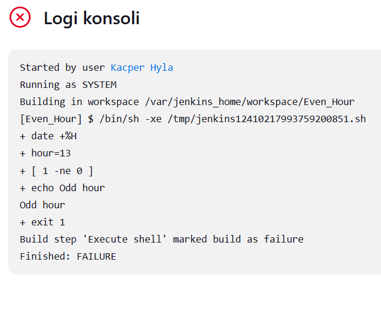

# Sprawozdanie 2

## Ćwiczenie 5

Do realizacji następnych 3 ćwiczeń konieczne było pobranie, uruchomienie i skonfigurowanie Jenkinsa.

Pierwszym krokiem było utworzenie sieci przez użycie komendy `docker network create jenkins`. Poniższy zrzut ekranu przedstawia rezultat (Ostatnia sieć).


Konieczne było również pobranie obrazu `docker:dind` oraz stworzenie z niego kontenera. Pozwala to na wykorzystywanie komend dockera w Jenkinsie.


Następnie utworzono dockerfile, który tworzy obraz Jenkinsa. Jego treść przedstawiono poniżej.

````
FROM jenkins/jenkins:2.492.2-jdk17
USER root
RUN apt-get update && apt-get install -y lsb-release ca-certificates curl && \
    install -m 0755 -d /etc/apt/keyrings && \
    curl -fsSL https://download.docker.com/linux/debian/gpg -o /etc/apt/keyrings/docker.asc && \
    chmod a+r /etc/apt/keyrings/docker.asc && \
    echo "deb [arch=$(dpkg --print-architecture) signed-by=/etc/apt/keyrings/docker.asc] \
    https://download.docker.com/linux/debian $(. /etc/os-release && echo \"$VERSION_CODENAME\") stable" \
    | tee /etc/apt/sources.list.d/docker.list > /dev/null && \
    apt-get update && apt-get install -y docker-ce-cli && \
    apt-get clean && rm -rf /var/lib/apt/lists/*
USER jenkins
RUN jenkins-plugin-cli --plugins "blueocean docker-workflow"
````
Następnie pozostało tylko stworzyć obraz. Rezultat przedstawiono na rysumku, gdzie dodatkowo zastosowano grep w celu wyświetlenia tylko pożądanego obrazu.


Pozostało już tylko uruchomić kontener. 


Po włączeniu przeglądarki i połączeniu się z localhostem na porcie 8080 włącza się interfejs Jenkinsa. Po zalogowaniu się i pobraniu wtyczek pokazjue się ekran startowy. Niestety jenkins działał wolno, więć wyłączono VBS na maszynie głównej, jednak nie miało to znacznego wpływu na wydajność.


Utworzono pierwsze zadanie, którego celem było pobranie informacji o systemie. Do tego celu stworzono krok budowania, który uruchamia powłokę i wpisuje komendę ``uname -a``.


Następnie stworzono skrypt w bash'u, który zwraca błąd, gdy godzina jest nieparzysta, poprzez pobranie godziny i sprawdzenie, czy jest ona podzielna przez 2.
````
#!bin/bash

hour=$(date +%H)

if [ $(($hour % 2)) -ne 0 ]; then
echo "Odd hour"
exit 1
fi
echo "Even hour"
exit 0
````


Następnym projekt pobierał obraz ubuntu. Wykorzystano komendę `docker pull ubuntu`, a dodatkowo udowodniono konieczność działania kontenera `docker:dind`. Pierwsza próba odbyła się przy działającym tylko kontenerze Jenkinsa i zakończyła się porażką (nie udało się pobrać obrazu). Do drugiej próby włączono kontener docker:dind, co spowodowało, co doprowadziło do poprawnego wykonania się sciągnięcia. Rezultaty przedstawione na zrzutach ekranu poniżej.


Kolejnym krokiem było stworzenie pipeline'u i sklonowaniu w nim repozytorium przedmiotowego. Do tego celu napisano prosty skrypt pipeline'u, który załączono poniżej. Używana jest składnia pipeline'u, do której link został podany w instrukcji piątej. Do sklonowania repozytorium konieczne jest wykorzystanie `git branch`.

````
pipeline {
    agent any
    
    stages {
        stage('Clone') {
            steps {
                git branch: 'KH415979', url: 'https://github.com/InzynieriaOprogramowaniaAGH/MDO2025_INO.git'
            }
        }
    }
}
````
Powyższy skrypt zadziałał poprawnie (wyświetliła się informacja o skopiowaniu repozytorium). Rezultat przedstawiono na zrzucie ekranu.


Następnym krokiem było zmodyfikowanie pipeline'u w taki sposób, aby wchodził do katalogu z poprzednim sprawozdaniem oraz stworzył kontener na podstawie dockerfile'a wybranego projektu (tutaj jest to `pico-c`)