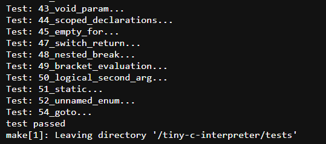

# Sprawozdanie 2

## Ćwiczenie 5

Do realizacji następnych 3 ćwiczeń konieczne było pobranie, uruchomienie i skonfigurowanie Jenkinsa.

Pierwszym krokiem było utworzenie sieci przez użycie komendy `docker network create jenkins`. Poniższy zrzut ekranu przedstawia rezultat (Ostatnia sieć).


Konieczne było również pobranie obrazu `docker:dind` oraz stworzenie z niego kontenera. Pozwala to na wykorzystywanie komend dockera w Jenkinsie.


Następnie utworzono dockerfile, który tworzy obraz Jenkinsa. Jego treść przedstawiono poniżej.

````
FROM jenkins/jenkins:2.492.2-jdk17
USER root
RUN apt-get update && apt-get install -y lsb-release ca-certificates curl && \
    install -m 0755 -d /etc/apt/keyrings && \
    curl -fsSL https://download.docker.com/linux/debian/gpg -o /etc/apt/keyrings/docker.asc && \
    chmod a+r /etc/apt/keyrings/docker.asc && \
    echo "deb [arch=$(dpkg --print-architecture) signed-by=/etc/apt/keyrings/docker.asc] \
    https://download.docker.com/linux/debian $(. /etc/os-release && echo \"$VERSION_CODENAME\") stable" \
    | tee /etc/apt/sources.list.d/docker.list > /dev/null && \
    apt-get update && apt-get install -y docker-ce-cli && \
    apt-get clean && rm -rf /var/lib/apt/lists/*
USER jenkins
RUN jenkins-plugin-cli --plugins "blueocean docker-workflow"
````
Następnie pozostało tylko stworzyć obraz. Rezultat przedstawiono na rysumku, gdzie dodatkowo zastosowano grep w celu wyświetlenia tylko pożądanego obrazu.


Pozostało już tylko uruchomić kontener. 


Po włączeniu przeglądarki i połączeniu się z localhostem na porcie 8080 włącza się interfejs Jenkinsa. Po zalogowaniu się i pobraniu wtyczek pokazjue się ekran startowy. Niestety jenkins działał wolno, więć wyłączono VBS na maszynie głównej, jednak nie miało to znacznego wpływu na wydajność.


Utworzono pierwsze zadanie, którego celem było pobranie informacji o systemie. Do tego celu stworzono krok budowania, który uruchamia powłokę i wpisuje komendę ``uname -a``.


Następnie stworzono skrypt w bash'u, który zwraca błąd, gdy godzina jest nieparzysta, poprzez pobranie godziny i sprawdzenie, czy jest ona podzielna przez 2.
````
#!bin/bash

hour=$(date +%H)

if [ $(($hour % 2)) -ne 0 ]; then
echo "Odd hour"
exit 1
fi
echo "Even hour"
exit 0
````


Następnym projekt pobierał obraz ubuntu. Wykorzystano komendę `docker pull ubuntu`, a dodatkowo udowodniono konieczność działania kontenera `docker:dind`. Pierwsza próba odbyła się przy działającym tylko kontenerze Jenkinsa i zakończyła się porażką (nie udało się pobrać obrazu). Do drugiej próby włączono kontener docker:dind, co spowodowało, co doprowadziło do poprawnego wykonania się sciągnięcia. Rezultaty przedstawione na zrzutach ekranu poniżej.


Kolejnym krokiem było stworzenie pipeline'u i sklonowaniu w nim repozytorium przedmiotowego. Do tego celu napisano prosty skrypt pipeline'u, który załączono poniżej. Używana jest składnia pipeline'u, do której link został podany w instrukcji piątej. Do sklonowania repozytorium konieczne jest wykorzystanie `git branch`.

````
pipeline {
    agent any
    
    stages {
        stage('Clone') {
            steps {
                git branch: 'KH415979', url: 'https://github.com/InzynieriaOprogramowaniaAGH/MDO2025_INO.git'
            }
        }
    }
}
````
Powyższy skrypt zadziałał poprawnie (wyświetliła się informacja o skopiowaniu repozytorium). Rezultat przedstawiono na zrzucie ekranu.


Następnym krokiem było zmodyfikowanie pipeline'u w taki sposób, aby wchodził do katalogu z poprzednim sprawozdaniem oraz stworzył kontener na podstawie dockerfile'a wybranego projektu (tutaj jest to `pico-c`)

Do obecnego pipelineu dodano krok `Build`, ktrego treść zamieszczono poniżej.

```
stage('Build') {
            steps {
                dir('INO/GCL01/KH415979/Sprawozdanie1') {
                    script{
                        docker.build('pico-c-image', '-f Dockerfile.picocbuild .')
                        sh 'docker images'
                    }
                }
            }
        }
```
Powyższy krok dokonuje stworzenia obrazu kontenera z Dockerfile'a `Dockerfile.picocbuild`.

Jeżeli cały pipeline zadziałał prawidłowo, linijka `sh 'docker images'` sprawiłaby, że wyświetliłby się stworzony obraz kontenera o nazwie `pico-c-image`, co stało się i widać to na poniższych zrzutach ekranu (Pierwszy ze stadiów pipeline'u, a drugi z logów konsoli).


Warto tutaj odnotować, że podczas wykonywania tego kroku pojawił się problem z budową obrazu kontenera. Kompilator miał problem z definicją jednego wskaźnika funkcji.


Było to szczególnie dziwne, ponieważ zarówno na maszynie wirtualnej, jak i w kontenerach odpalanych na owej wirtualce, program kompilował się bez problemów. Przeszkodą okazała się być wersja fedory. Kiedy zmieniono pierwszą linijkę dockerfile'a z `FROM fedora:latest` na `FROM fedora:41` problem się rozwiązał.

Następnie uruchomiono pipeline po raz drugi. Tym razem zadziałał on szybciej, ponieważ dane zostały w cache'u. Tutaj doprowadziło to do znacznego przyśpieszenia.


W tym punkcie konieczne było stworzenie diagramu UML przedstawiajacego plan działania docelowego pipeline'u. Poniższy diagram aktywności stworzono w programie Visual Paradigm.


Plan pipelineu polega na pobraniu repozutorium przedmiotowego w kroku `Clone`, a następnie dostanie się do pliku Dockerfile ze sprawozdania pierwszego i stworzenia obrazu kontenera który pobiera konieczne zależności i tworzy plik wykonywalny programu w kroku `Build`. Następnie na zbudowanym obrazie wykonywane są testy jednostowe, a ich wynik jest zapisywany w logach.
Następnie przeprowadzany jest `Smoke test`, który ma przetestować działanie aplikacji. Na końcu pipeline'u picoc ma działać w trybie interaktywnym, jednak aplikacja ta może też uruchomić zapisacy w C skrypt i na tym też będzie polegał ten test. Na zakończenie wyniki testu również będą zapisywane w logach. Po przejściu testów w kroku `Deploy` stworzony zostanie finalny obraz kontenera wdrożeniowego, a następnie w kroku `Publish` zostanie on wysłany do repozytorium na docker hub'ie.


Ponadto stworzono prosty diagram wdrożenia.


Pipeline stworzy dwa artefakty będące wynikiem działania testów, oraz jeden będący obrazem kontenera, który następnie zostanie wysłany do repozytorium Docker Hub.

Pierwsze dwie aktywności z pierwszego diagramu zostały już ukończone.

### Wnioski

Za pomocą Jenkinsa możliwe jest wyizolowanie etapów budowania aplikacji i uniezależnienia ich od siebie. Ponadto pozwala to na ich pełne zautomatyzowanie, poprzez uruchomienie pipeline'u wraz z commitem kodu.

---

## Ćwiczenie 6

Na tych ćwiczeniach kontynuowano tworzenie pipelineu, poprzez pisanie kolejnych kroków.

Najpierw napisano krok `Test`, który uruchamiał testy jednostkowe, oraz zapisywał wynik wraz z wersją do pliku tekstowego.

````
stage('Test') {
           steps {
                sh 'mkdir artifacts'
                sh 'echo "Version: ${BUILD_NUMBER}" > artifacts/test.log'
                sh 'docker run --rm pico-c-image make test >> artifacts/test.log'
                
                sh 'docker volume create exec_vol'
                dir('INO/GCL01/KH415979/Sprawozdanie2'){
                    sh 'cp -r script_directory ../../../../'
                }
                sh 'docker run --rm -v exec_vol:/mnt/exec_vol/ pico-c-image cp picoc ../mnt/exec_vol'
                sh 'echo "Version: ${BUILD_NUMBER}" > artifacts/script_test.log'
                sh 'docker run --rm --mount type=bind,src=$PWD/script_directory/,dst=/mnt/ -v exec_vol:/mnt/exec_vol/ fedora:41 mnt/exec_vol/picoc mnt/script.c >> artifacts/script_test.log'
               
           }
           
        }
````
W drugiej części tego kroku uruchamiany jest kontener BLDR oraz kopiowany jest plik wykonywalny `picoc` do wcześniej stworzonego woluminu. Dalej, kopiowany jest do folderu roboczego skrypt, wcześniej umieszczony w repozytorium, oraz zostaj przeprowadzone uruchomienie kontenera fedory z podłączonym woluminem z programem, oraz przyłączonym folderem ze skryptem. Następnie tam był uruchamiany owy skrypt, a wynik jego działania również był zapisywany do osobnego pliku.

Skrypt testowy:
````
#include<stdio.h>

int main()
{
	int a = 3;
	int b = 2 + a;
	if(a + b == 8)
		printf("Test script is working!\n");
	return 0;
}
````
Poniższe zrzuty ekranu prezentują wyniki działania.





Przy kroku `Deploy` doszło do pewnych komplikacji. Mianowicie celem było zbudowanie Dockerfile'a, który będzie budował obraz kontenera w którym będzie działać aplikacja, która teraz znajduje się w woluminie. W Jenkinsie niemożliwe (a przynajmniej trudne) jest dostanie się do woluminu z poziomu hosta, a do wykorzystania `COPY` w dockerfile'u potrzebna jest konkretna ścieżka do folderu. Konieczność zastosowania Copy wynika z tego, że potrzeba zaszyć plik (tutaj `picoc`) wykonywalny w sam obrazie kontenera, żeby użytkownik nie musiał dodatkowo posiadać woluminu z plikiem wykonywalnym programu, który musiałby podłączyć przy uruchamianiu kontenera.

Zaistniała więc konieczność przeniesienia pliku `picoc` z woluminu do specjalnego folderu. Użyto do tego zwykłego kontenera fedory, do którego podłączono wolumin z plikiem, oraz za pomocą `mount` przyłączono folder, do którego skopiowano picoc.

Następnie z repozytorium skopiowano dockerfile deploy, którego treść umieszczono poniżej.
````
FROM fedora:41

COPY picoc_dir/picoc mnt/
WORKDIR /../mnt/
CMD ./picoc -i
````
Wykorzystując dockerfile zbudowano obraz, oraz nadano mu tag razem z wersją.

Treść kroku `Deploy`:

````
 stage("Deploy")
        {
            steps{
                sh 'mkdir picoc_dir'
                sh 'docker run --rm --mount type=bind,src=$PWD/picoc_dir,dst=/mnt/picoc_dir -v exec_vol:/mnt/exec_vol/ fedora:41 cp mnt/exec_vol/picoc mnt/picoc_dir/'
                dir('INO/GCL01/KH415979/Sprawozdanie2'){
                    sh 'cp Dockerfile.deploy ../../../../'
                }
                script{
                    docker.build('pico-c', '-f Dockerfile.deploy .')
                    sh 'docker images'
                    sh 'docker tag pico-c khan9/pico-c_interactive:1.${BUILD_NUMBER}'
                }
            }
        }
````

Ostatni krok - `Publish` polegał na zalogowaniu się do Docker Hub'a za pomocą nadanego uwierzytelniena.


Aby używać stworzonej referencj konieczne było również dodanie sekcji `environment` an początku pipelineu, oraz przypisanie do tam stworzonej zmiennej ID uwierzytelnienia.


Po zalogowaniu możliwe było wypchnięcie obrazu do stworzonego wcześniej repozytorium. Zarchiwizowano też artefakty.
````
stage("Publish"){
            steps{
                sh "docker login -u ${DOCKERHUB_CREDENTIALS_USR} -p ${DOCKERHUB_CREDENTIALS_PSW}"
                sh 'docker push khan9/pico-c_interactive:1.${BUILD_NUMBER}'
                
                archiveArtifacts artifacts: "artifacts/test.log", fingerprint: true
                archiveArtifacts artifacts: "artifacts/script_test.log", fingerprint: true
            }
        }
````

Pozostała tylko sekcja `post`, w której wylogowano się z docker huba, usunięto utworzone foldery, oraz obrazy i woluminy.

````
post{
        always{
            sh 'docker logout'
            sh 'rm -r artifacts'
            sh 'rm -r picoc_dir'
            sh 'docker system prune -a -f'
        }
    }
````

Cały Jenkinsfile przedstawiono poniżej.
````
pipeline {
    agent any
    
    environment{
        DOCKERHUB_CREDENTIALS = credentials('dockerhub')
    }
    
    stages {
        stage('Clone') {
            steps {
                git branch: 'KH415979', url: 'https://github.com/InzynieriaOprogramowaniaAGH/MDO2025_INO.git'
            }
        }
        
        stage('Build') {
            steps {
                dir('INO/GCL01/KH415979/Sprawozdanie1') {
                    script{
                        docker.build('pico-c-image', '-f Dockerfile.picocbuild .')
                        sh 'docker images'
                    }
                }
            }
        }
        
        
        stage('Test') {
           steps {
                sh 'mkdir artifacts'
                sh 'echo "Version: ${BUILD_NUMBER}" > artifacts/test.log'
                sh 'docker run --rm pico-c-image make test >> artifacts/test.log'
                
                sh 'docker volume create exec_vol'
                dir('INO/GCL01/KH415979/Sprawozdanie2'){
                    sh 'cp -r script_directory ../../../../'
                }
                sh 'docker run --rm -v exec_vol:/mnt/exec_vol/ pico-c-image cp picoc ../mnt/exec_vol'
                sh 'echo "Version: ${BUILD_NUMBER}" > artifacts/script_test.log'
                sh 'docker run --rm --mount type=bind,src=$PWD/script_directory/,dst=/mnt/ -v exec_vol:/mnt/exec_vol/ fedora:41 mnt/exec_vol/picoc mnt/script.c >> artifacts/script_test.log'
               
           }
           
        }
        
        stage("Deploy")
        {
            steps{
                sh 'mkdir picoc_dir'
                sh 'docker run --rm --mount type=bind,src=$PWD/picoc_dir,dst=/mnt/picoc_dir -v exec_vol:/mnt/exec_vol/ fedora:41 cp mnt/exec_vol/picoc mnt/picoc_dir/'
                dir('INO/GCL01/KH415979/Sprawozdanie2'){
                    sh 'cp Dockerfile.deploy ../../../../'
                }
                script{
                    docker.build('pico-c', '-f Dockerfile.deploy .')
                    sh 'docker images'
                    sh 'docker tag pico-c khan9/pico-c_interactive:1.${BUILD_NUMBER}'
                }
            }
        }
        
        stage("Publish"){
            steps{
                sh "docker login -u ${DOCKERHUB_CREDENTIALS_USR} -p ${DOCKERHUB_CREDENTIALS_PSW}"
                sh 'docker push khan9/pico-c_interactive:1.${BUILD_NUMBER}'
                
                archiveArtifacts artifacts: "artifacts/test.log", fingerprint: true
                archiveArtifacts artifacts: "artifacts/script_test.log", fingerprint: true
            }
        }
        
    }
    
    post{
        always{
            sh 'docker logout'
            sh 'rm -r artifacts'
            sh 'rm -r picoc_dir'
            sh 'docker system prune -a -f'
        }
    }
}
````

Lista kontrolna:

- [x] "Program został wybrany" - `picoc`
- [x] "Licencja potwierdza możliwość swobodnego obrotu kodem na potrzeby zadania"
- [x] "Wybrany program buduje się"

- [x] "Przechodzą dołączone do niego testy"

- [ ] "Zdecydowano, czy jest potrzebny fork własnej kopii repozytorium" - wszystkie elementy potrzebne do builda oraz testów (Dockerfile i skrypt) zostały wysłane razem z repozytorium przedmiotowym, więc nie ma potrzeby robić fork'a.
- [x] "Stworzono diagram UML zawierający planowany pomysł na proces CI/CD" - diagramy we wcześniejszej części sprawozdania.
- [x] "Wybrano kontener bazowy lub stworzono odpowiedni kontener wstepny (runtime dependencies)" - dependencje są pobierane w Dockerfile.picocbuild, na podstawie którego robiony jest build.
- [x] "Build został wykonany wewnątrz kontenera" - vide supra
- [ ] "Testy zostały wykonane wewnątrz kontenera (kolejnego)" - w kolejnym kontenerze wykonano test działania programu (poprzez test skryptu), a nie testy jednostkowe.
- [x]  "Kontener testowy jest oparty o kontener build" - testy jednostkowe przeprowadzone w kontenerze build
- [x]  "Logi z procesu są odkładane jako numerowany artefakt, niekoniecznie jawnie"
 
- [x] "Zdefiniowano kontener typu 'deploy' pełniący rolę kontenera, w którym zostanie uruchomiona aplikacja (niekoniecznie docelowo - może być tylko integracyjnie)"

- [x] "Uzasadniono czy kontener buildowy nadaje się do tej roli/opisano proces stworzenia nowego, specjalnie do tego przeznaczenia" - kontener buildowy mógłby służyć równeż jako kontener wdrożenia, jednak zawiera on również wiele plików niepotrzebnych do działania programu (np. kod źródłowy), zatem utworzono nowy kontener, w którym jest tylko plik wykonywalny picoc.
- [x] "Wersjonowany kontener 'deploy' ze zbudowaną aplikacją jest wdrażany na instancję Dockera"

- [] "Następuje weryfikacja, że aplikacja pracuje poprawnie (smoke test) poprzez uruchomienie kontenera 'deploy'" - nie następuje uruchomienie kontenera deploy, ponieważ działa on w trybie interaktywnym (czeka na wejście od użytkownika). Przetestowano jednak wykonywanie skryptu przez sam program wykonywalny (w kontenerze innym, niż build).
- [x] "Zdefiniowano, jaki element ma być publikowany jako artefakt" - obraz `deploy`


- [x] "Uzasadniono wybór: kontener z programem, plik binarny, flatpak, archiwum tar.gz, pakiet RPM/DEB" - wybrano obraz kontenera z programem, ponieważ aplikacja może działać interaktywnie i w izolacji (nie jest biblioteką, która potrzebuje kodu, aby mieć sens działania). Sama z siebie też nie musi oddziaływać z innymi zasobami, więc powinno się ją uruchamiać w kontenerze.
- [x] "Opisano proces wersjonowania artefaktu (można użyć semantic versioning)" - wersja artefaktu to numer uruchomienia pipeline'u


- [x] "Dostępność artefaktu: publikacja do Rejestru online, artefakt załączony jako rezultat builda w Jenkinsie"

- [] "Przedstawiono sposób na zidentyfikowanie pochodzenia artefaktu"
- [x] "Pliki Dockerfile i Jenkinsfile dostępne w sprawozdaniu w kopiowalnej postaci oraz obok sprawozdania, jako osobne pliki" - tak
- [x] "Zweryfikowano potencjalną rozbieżność między zaplanowanym UML a otrzymanym efektem" - zrezygnowano z etapu `smoke test` i częściowo zintegrowano go z `test`, tylko użyto funkcjalność programu, która może uruchamiać pisane w c skrypty.

### Wnioski
Większość punktów z listy kontrolnej została spełniona. Pipeline tylko w niewielkim stopniu odbiega od początkowego planu.

---
## Ćwiczenie 7

Wszystkie punkty listy kontrolnej z poprzedniej sekcji sprawozdania odnosiły się do obecnej formy pipeline'u (jenkinsfile'a).

Uruchomiono zatem kilkukrotnie pipeline celem weryfikacji jego działania. Logi z jednego uruchomienia umieszcono w folderze ze sprawozdaniem (script_test.log, test.log).


Wynik jest widoczny w Docker Hub'ie.


Przetestowano też sam obraz, pobierając go z dockerfile'a.


### Wnioski
Dzięki pipeline'om w Jenkinsie możliwe jest całkowicie automatyczne wdrożenie aplikacji, poprzez stworzenie sekwencji kroków, które mają pobrać wszystkie potrzebne zależności, zbudować aplikację, przetestować ją, oraz wypchnąć ją w świat. Wszystko to może się dziać nawet bez człowieka uruchamiającego pipeline, lecz przy nastąpieniu określonego zdarzenia (np. push'a na githubie).
