# Sprawozdanie 3
Autor: Kacper Hyla
---

## Ćwiczenie 8

Tematem ósmych zajęć był `Ansible`, czyli narzędzie służące do automatyzacji instalacji oraz wdrożenia oprogramowania na (najczęściej) wielu urządzeniach.

Pierwszym krokiem było stworzenie drugiej maszyny wirtualnej z tym samym systemem operacyjnym (tutaj jest to fedora 41) z użytkownikiem `ansible`. Zrzut ekranu przedstawiający obydwie maszyny w menu Virtual Box'a przedstawiono poniżej. Znajdują się tam też specyfikacje nowo utworzonej maszyny.


Już na zainstalowanej maszynie nadano jej hostname `ansible-target`, edytując plik `etc/hostname`.


Upewniono się również, że na maszynie pobrany jest `tar`, oraz `OpenSSH`.


Następnie zrobiono migawkę maszyny, czyli jej kopię, dzięki której można ją przywrócić do starej wersji gdy okaże się, że nowo wprowadzona powoduje problemy.


Po tych operacjach konieczne było, tym razem na starej maszynie, zainstalować ansible.


Stworzono również 2 pary kluczy, którymi wymieniły się maszyny, aby móc się łączyć przez protokół ssh bez hasła.


Dodatkowo, edytowano plik `etc.hosts`, aby powiązać adres ip maszyn ansible z nazwą `ansible-target`.


W następnym kroku również nadano nazwę hosta dla orginalnej maszyny fedory (tej z pierwszych zajęć). Również osiągnięto to przez edycję pliku `etc/hostname` i reboot. Poniższe zrzuty ekranu pokazują zastosowanie polecenia `hostnamectl` na obydwu maszynach, celem upewnienia się, jakie są nazwy hostów.


Na maszynie z zainstalowanym ansible utworzono plik inwentaryzacji (zawartość w zrzucie poniżej), a następnie dokonano jego weryfikacji.


W następnym kroku wysłano ping do endpointa. Pojawił się jednak problem, ponieważ ansible starał się połączyć do użytkownika `kh@ansible-target` zamiast `ansible@ansible-target`.


Rozwiązaniem było dodanie do pliku nazwy użytkownika.


Problem ten jednak pozwala przypuszczać, że ansible próbuje się połączyć z użytkownikiem o takiej samej nazwie, jak użytkownik, który wykonał polecenie.

Kolejnym krokiem było stworzenie `playbook'a`, czyli zbioru zadań do wykonania przez Ansible'a. Miał on 2 zadania: ping, oraz wysłanie playbook'a do dziś utworzonej maszyny. Jego treść prezentuje się następująco.

````
- name: MyPlaybook
  hosts: Endpoints

  tasks:
    - name: ping
      ansible.builtin.ping:

    - name: copy
      ansible.builtin.copy:
        src: /home/kh/playbook.yaml
        dest: /home/ansible/playbook.yaml
        mode: '0644'
````
Całość tworzona jest przy użyciu składni `YAML`. Najpierw tworzona jest nazwa playbook'a, a następnie wybierane są hosty, względem których ma zostać wykonana seria zadań. Zadanie `ping` jest self explanatory, lecz `copy` wymaga omówienia. Konieczne jest ustalenie źródła (pliku, który zostanie skopiowany) i destynacji (miejsca i nazwy pliku, do którego przekopiowana zostanie zawartość źródła) oraz mode, będący uprawnieniami do pliku. Tutaj jest to liczba w sysyemie oktalnym (dlatego zaczyna się od 0), w której właścicielowi nadaje się prawa od odczytu i zapisu, a grupie i reszcie tylko do odczytu. 

Uruchomiono zatem playbook. Zrobiono to 2 razy, żeby pokazać, że za drugim razem, kiedy plik już został wysłany nie doszło do żadnej zmiany. Widać to na zrzutach ekranu poniżej.


Następnie do playbook'a dodano kolejne kroki. Było to: 
- zaktualizowanie pakietów przy użyciu `ansible.builtin.dnf` z `update_only` ustawionym na `yes`. Do tej operacji potrzebne były uprawnienia roota, a zatem wykorzystano opcję `become: true`, aby móc korzystać z sudo.

- zrestartowano usługi `sshd` oraz `rngd`(którą to wcześniej porbano zwykłym dnf install), przy pomocy modułu `ansible.builtin.service` z podaną nazwą usługi i stanem ustalonym na `restarted`.

Treść playbooka zamieszczono poniżej.

````
- name: MyPlaybook
  hosts: Endpoints
  
  become: true
  
  tasks:
    - name: ping
      ansible.builtin.ping:

    - name: copy
      ansible.builtin.copy:
        src: /home/kh/playbook.yaml
        dest: /home/ansible/playbook.yaml
        mode: '0644'

    - name: update
      ansible.builtin.dnf:
        name: "*"
        state: latest
        update_only: yes

    - name: restart sshd
      ansible.builtin.service:
       name: sshd
       state: restarted

    - name: restart rngd
      ansible.builtin.service:
       name: rngd
       state: restarted
````


Następnie należało powtózyć tą operację dla maszyny z odpiętą kartą sieciową. do tego celu wyłączono interfejs sieciowy z pomocą poniższej komendy.

````
sudo ip link set enp0s8 down
````
Nazwę interfejsu uzyskano dzięki wpisaniu w terminal `ip addr`.


Operacja oczywiście nie powiodła się, ponieważ ansible nie mógł nawiązać połączenia.

Następnie należało przy pomocy ansible pobrać artefakt będący rezultatem pipelineu z poprzedniego sprawozdania, połączyć się z nim a następnie usunąć. W tym wypadku kontener współpracuje wyłącznie z inputem z klawiatury od użytkownika, a zatem ograniczono się do potwierdzenia, że kontener został utworzony i działa przy pomocy docker ps.

Całe to zadanie opakowano w `rolę`, stworzoną dzięki `ansible galaxy`.

Utworzono rolę `artif_role` oraz zmodyfikowano znajdujący się w katalogu tasks plik `main.yml`.
 

W owym pliku wykrozystano wcześniej użyty moduł `dnf` celem pobrania dockera a następnie moduł `service` do jego uruchomienia. Z pomocą `community.docker.docker_container` zbudowano kontener z obrazu, a konendy powłoki były możliwe dzięki użyciu `ansible.builtin.command`. Jego treść zawarto poniżej.

```
---
- name: Artifact_playbook
  become: true
  
  tasks:
    - name: Download docker
      ansible.builtin.dnf:
        name: docker

    - name: Start docker
      ansible.builtin.service:
        name: docker
        state: started
      

    - name: Build
      community.docker.docker_container:
        name: picoc
        image: khan9/pico-c_interactive:1.73
        state: started
        command: sleep infinity

    - name: Test
      ansible.builtin.command: docker ps -a
      register: out

    - name: Print the result of the program
      debug:
        var: out.stdout

    - name: Stop
      ansible.builtin.command: docker stop picoc

    - name: Remove
      ansible.builtin.command: docker rm picoc
      
```


Stworzono też plik `playbook_docker.yaml`, który ową rolę będzie obsługiwał.
```
- name: Deploy docker container
  hosts: Endpoints
  become: true
  roles:
    - artif_role
```
Zrzut ekranu  wykonania zamieszczono poniżej.


### Wnioski

Ansible pozwala na w pełni automatyczne wykonywanie różnych operacji na urządzeniach połączonych siecią. Jednym z zastosowań może być wdrożenie aktualizacji programu na wszystkich serwerach, co pozwala na uniknięcie problemów z różnymi wersjami oprogramowania na urządzeniach.

---

## Ćwiczenie 9

Na dziewiątych zajęciach omówiony był mechanizm `kickstart`, służący do automatycznego skonfigurowania tworzonej maszyny wirtualnej.

Pierwszym krokiem było wybranie jednej z wcześniej utworzonych maszyn fedory (tutaj padło na maszynę z pierwszych zajęć) i pobranie pliku 'anaconda-ks.cfg' z katalogu root'a. Tutaj pojawiały się już pierwsze przeszkody, ponieważ należało wyjść z katalogu użytkownika i zmienić dostęp katalogu `root` celem odczytania zawartych tam plików. Następnie należało skopiować istniejący tam plik `anaconda-ks.cfg`. Niestety samego procesu dla docelowej maszyny nie udało się uwiecznić na zrzucie ekranu, dlatego kroki te powtórzon na maszynie `ansible`. Przedstawia to poniższy zrzut ekranu.


Do pliku następnie dodano dwie linijki zawierające wzmianki o repozytoriach, oraz skąd je pobrać.

```
# Generated by Anaconda 41.35
# Generated by pykickstart v3.58
#version=DEVEL

# Keyboard layouts
keyboard --vckeymap=pl --xlayouts='pl'
# System language
lang pl_PL.UTF-8

# Network information
network  --bootproto=dhcp --device=enp0s3 --ipv6=auto --activate --hostname=khkickstart

url --mirrorlist=http://mirrors.fedoraproject.org/mirrorlist?repo=fedora-41&arch=x86_64
repo --name=updates --mirrorlist=http://mirrors.fedoraproject.org/mirrorlist?repo=updates-released-f41&arch=x86_64

%packages
@^server-product-environment

%end

# Run the Setup Agent on first boot
firstboot --enable

# Generated using Blivet version 3.11.0
ignoredisk --only-use=sda

# Partition clearing information
clearpart --all --initlabels
autopart
# System timezone
timezone Europe/Warsaw --utc

# Root password
rootpw --lock
user --groups=wheel --name=kh --password=$y$j9T$TJmLrfTo9BoZVV40ZiNZbwgw$wYWirS3SKmeg6iP7.89pETHiYPODT19cEAKImHx9qm0 --iscrypted --gecos="KH"
```
Plik ten wypchnięto do repozytorium na githubie pod nazwą `anaconda.ks`. Skopiowano też hiperłącze do pliku w postaci surowej (raw).

Następnie przeprowadzono instalację nienadzorowaną poprzez dodanie linku do pliku `ks` w menu `GRUB`. Tutaj wykorzystywane jest VirtualBox, więc pojawił się problem z kopiowaniem linku. Aby go rozwiązać skrócono URL przy pomocy `tinyurl.com`.

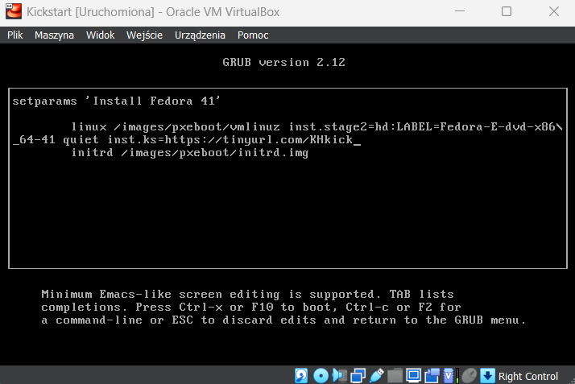

Przez podanie pliku kickstart w menu instalacji niektóre opcje były zablokowane, ponieważ zostały one już ustawione w pliku.

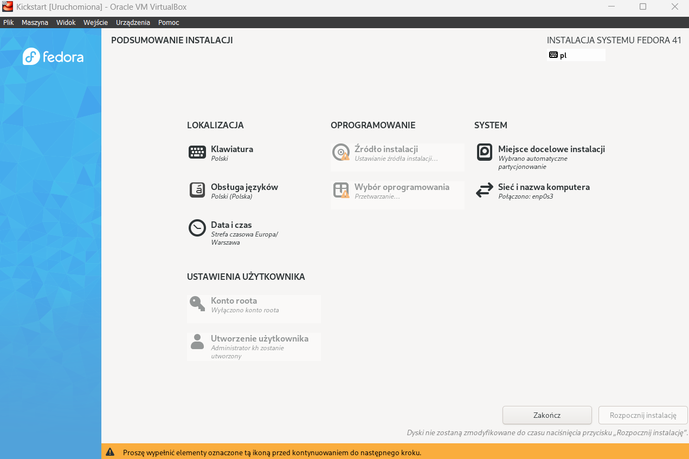

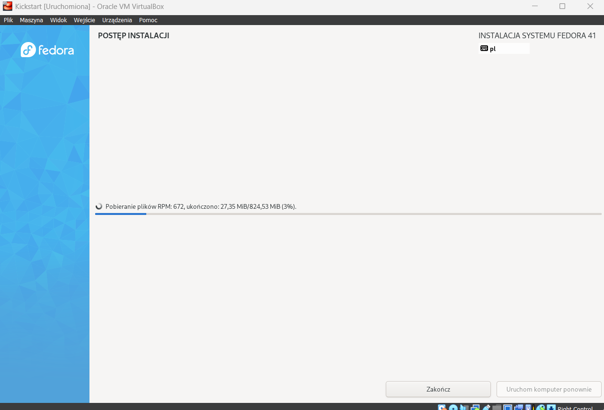

Po zakończeniu instalacji sprawdzono też nazwę hosta (podwójnie!), celem udowodnienia, że plik ks zadziałał.

Następnie zmodyfikowano plik ks poprzez dodanie sekcji `post` w której zainstalowano dockera i ustawiono uruchamianie go razem z włączeniem maszyny dzięki `systemctl enable`. Następnie z dockerhub'a pobrano obraz `picoc`. Następnie utworzono usługę `systemd`, która uruchamiakontener z pobranego obrazu, a następnie go zatrzymuje (kontener ma sens działać tylko z inputem użytkownika z klawiatury w trybie interaktywnym). Kontener jednak wciąż istnieje w stanie wstrzymanym, i można go wyświetlić co zaprezentowano na zrzucie ekranu poniżej.

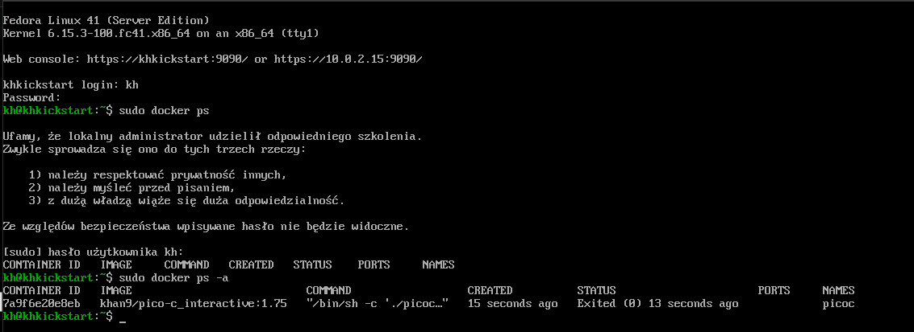

Aby usługa działała konieczny był też reload systemd.

Dodano również do pliku komendę `reboot`, która przeprowadzi reboot systemu po instalacji.
Treść pliku ks zamieszczono poniżej.

````
# Generated by Anaconda 41.35
# Generated by pykickstart v3.58
#version=DEVEL

# Keyboard layouts
keyboard --vckeymap=pl --xlayouts='pl'
# System language
lang pl_PL.UTF-8

# Network information
network  --bootproto=dhcp --device=enp0s3 --ipv6=auto --activate --hostname=khkickstart

url --mirrorlist=http://mirrors.fedoraproject.org/mirrorlist?repo=fedora-41&arch=x86_64
repo --name=updates --mirrorlist=http://mirrors.fedoraproject.org/mirrorlist?repo=updates-released-f41&arch=x86_64

%packages
@^server-product-environment

%end

# Run the Setup Agent on first boot
firstboot --enable

# Generated using Blivet version 3.11.0
ignoredisk --only-use=sda

# Partition clearing information
clearpart --all --initlabel
autopart
# System timezone
timezone Europe/Warsaw --utc

# Root password
rootpw --lock
user --groups=wheel --name=kh --password=$y$j9T$TJmLrfTo9BoZVV40ZiNZbwgw$wYWirS3SKmeg6iP7.89pETHiYPODT19cEAKImHx9qm0 --iscrypted --gecos="KH"

%post
dnf install -y docker
systemctl enable docker

docker pull khan9/pico-c_interactive:1.75

#Service
cat > /etc/systemd/system/picoc.service << 'EOF'
[Unit]
Description=My Docker Container
After=docker.service
Requires=docker.service

[Service]
Restart=always
ExecStart=/usr/bin/docker run -it --rm --name picoc khan9/pico-c_interactive:1.75
#ExecStop=/usr/bin/docker stop picoc

[Install]
WantedBy=multi-user.target
EOF

#Reload systemd
systemctl daemon-reexec
systemctl daemon-reload

systemctl enable picoc.service
%end

reboot

````

### Wnioski

Mechanizm kickstart pozwala na skonfigurowanie ustawień, przeprowadzenie dodatkowego pobrania, lub zarządzania plikami na każdej maszynie, do której zostanie wysłany plik. Pozwala to na łatwe stworzenie środowiska uruchumieniowego dla wytwarzanej aplikacji.

---

## Ćwiczenie 10

Na dziesiątych ćwiczeniach rozpoczęto pracę z platformą `Kubernetes`, służącą do automatyzacji wdrożenia oraz skalowania i zarządzania aplikacjami kontenerowymi.

Pierwszym krokiem było pobranie `minikube'a` na maszynę, czego wynik przedstawia zrzut ekranu poniżej.


Pobrano również najnowszą wersję polecenia `kubectl`.
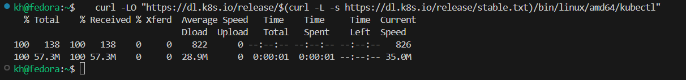

Następnie, zgodnie z instrukcją na stronie https://kubernetes.io/docs/tasks/tools/install-kubectl-linux/ dokonano weryfikacji oraz instalacji kubectl. Sprawdzono też wersję polecenia.

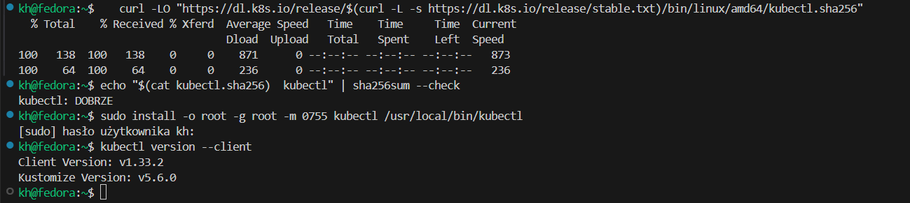

Po tych krokach włączono minikube'a, oraz połączono się z dashboard'em.


W tej części sprawozdania bardzo krótko opisano podstawowe pojęcia z kubernetes'a:

 - Pod - pojedyńcza instancja, w której uruchamiany jest kontener z aplikacją.

 - Deployment - jest to sposób zarządzania pod'ami, ich ilością i aktualizacją.

 - Service - punkt dostępowy do wszystkich podów, który działa również jako `load balancer`. Zapewnia jeden adres IP usługi, pomimo tego, że każdy pod ma swój własny adres.

 Niestety wcześniej używana aplikacja nie nadaje się do wdrożenia na Kubernetesie, więc zdecydowano się na obraz `nginx`. Dodano do obrazu niewielką modyfkiację, która sprawia, że od razu aktualizowane są pakiety oraz dodatkowa konfiguracja.

 Zawartość pliku konfiguracyjnego:
 ````
events {}

http {
    server {
        listen 8000;
        location / {
            return 200 'OK';
        }
    }
}
````
Ustawiono taki port, aby nie przeszkadzał innym (np. 8080, 9090), które są zajęte przez inne aplikacje.

 Dockerfile:
````
FROM nginx

RUN apt-get update
COPY nginx_mod.conf /etc/nginx/nginx.conf
````
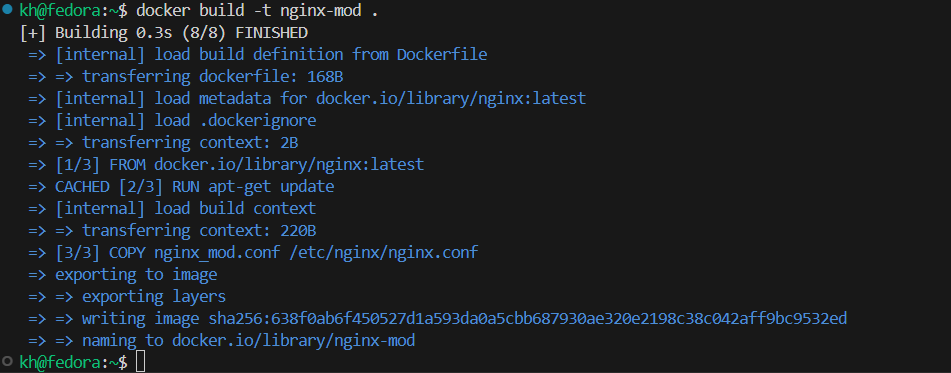

Następnie uruchomiono pod.

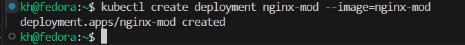
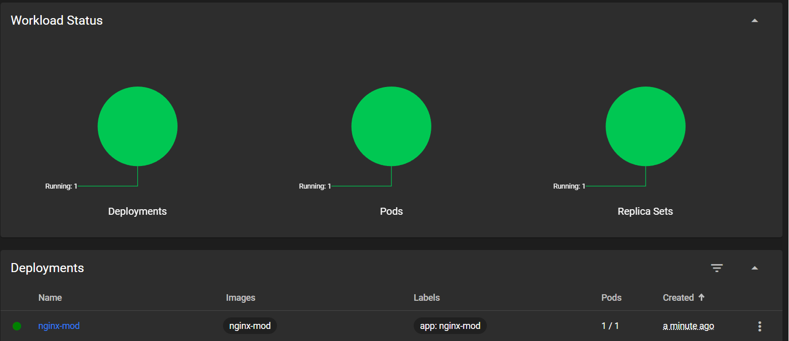

Sprawdzono też przy pomocy `kubectl.`

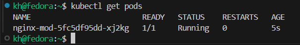

Aby połączyć się z podem konieczne było przekierowanie portu na nieużywany przez hosta.

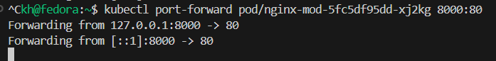


