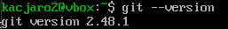
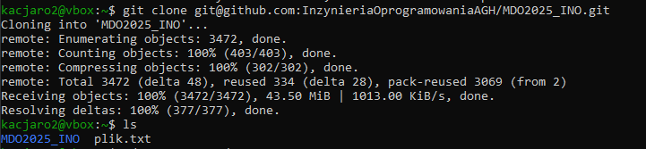
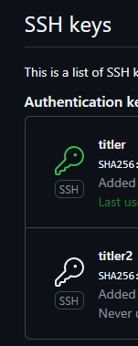
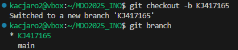
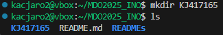
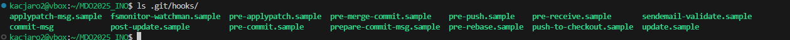
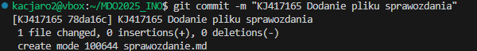
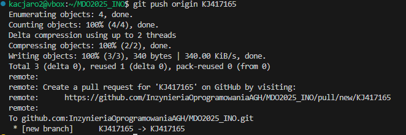

# Sprawozdanie 1
## Laboratorium 1

1. Instalacja klienta Git:
* Aby zainstalować klienta Git należało użyć polecenia 'sudo dnf install git'. Następnie można było użyć 'git --version', aby zobaczyć, czy git został poprawnie zainstalowany.

2. Klonowanie repozytorium:
* Aby sklonować repozytorium należy użyć polecenia 'git clone git@github.com:user/repo.git', gdzie należy podmienić 'user/repo.git' na odpowiednią ścieżkę do repozytorium.

3. Utworzenie kluczy SSH:
* Należało utworzyć dwa klucze w tym przynajmniej jeden z hasłem. Tworzenie odbywało się za pomocą polecenia 'ssh-keygen -t ed25519 -C "adres_email@mail.com"', gdzie należy podmienić na swój adres email. Za pomocą polecenia 'eval "$(ssh-agent -s)"' uruchamiamy agenta SSH, a za pomocą 'ssh-add ~/.ssh/id_rsa' dodajemy ten klucz do agenta. Możemy wyświetlić klucz poleceniem 'cat ~/.ssh/id_ed25519.pub'. Na GitHubie powinniśmy móc teraz dodać klucz w zakładce 'Settings' -> 'SSH and GPG keys' -> 'New SSH key'.

* Kolejnym krokiem było skonfigurowanie 2FA. Należało wejść w zakładkę 'Password and authentication', a nstępnie za pomocą któregoś ze sposobów skonfigurować 2FA.
4. Praca na swojej gałęzi:
* Utworzenie nowej gałęzi poleceniem 'git checkout -b inicjałynralbumu', sprawdzenie czy gałąź została zmieniona za pomocą 'git branch'.

* Utworzenie katalogu za pomocą 'mkdir'

* Utworzenie Git hooka za tworząc plik 'commit-msg', a następnie edycja. Git hook sprawdza czy commit zaczyna się od inicjałów i numeru albumu.

* Sprawdzenie czy Git hook znajduje się w odpowiednim folderze.

5. Sprawozdanie:
* Stworzenie sprawozdania za pomocą polecenia 'touch sprawozdanie.md'. Dodanie niezbędnych zrzutów ekranu i opisu wszystkich podpunktów zadania.
6. Dodanie pliku do repozytorium:
* Dodanie sprawozdania za pomocą polecenia 'git add sprawozdanie.md'. Zatwierdzenie za pomocą 'git commit'.

* Push na zdalne repozytorium za pomocą 'git push origin'.

* Wciągnięcie gałęzi na gałąź grupową.
