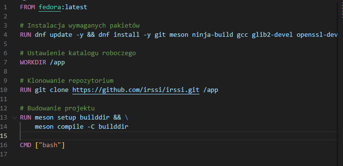
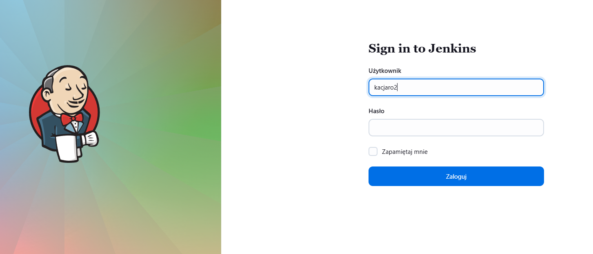

# Sprawozdanie 1
## Laboratorium 1

1. Instalacja klienta Git:
* Aby zainstalować klienta Git należało użyć polecenia 'sudo dnf install git'. Następnie można było użyć 'git --version', aby zobaczyć, czy git został poprawnie zainstalowany.

2. Klonowanie repozytorium:
* Aby sklonować repozytorium należy użyć polecenia 'git clone git@github.com:user/repo.git', gdzie należy podmienić 'user/repo.git' na odpowiednią ścieżkę do repozytorium.

3. Utworzenie kluczy SSH:
* Należało utworzyć dwa klucze w tym przynajmniej jeden z hasłem. Tworzenie odbywało się za pomocą polecenia 'ssh-keygen -t ed25519 -C "adres_email@mail.com"', gdzie należy podmienić na swój adres email. Za pomocą polecenia 'eval "$(ssh-agent -s)"' uruchamiamy agenta SSH, a za pomocą 'ssh-add ~/.ssh/id_rsa' dodajemy ten klucz do agenta. Możemy wyświetlić klucz poleceniem 'cat ~/.ssh/id_ed25519.pub'. Na GitHubie powinniśmy móc teraz dodać klucz w zakładce 'Settings' -> 'SSH and GPG keys' -> 'New SSH key'.

* Kolejnym krokiem było skonfigurowanie 2FA. Należało wejść w zakładkę 'Password and authentication', a nstępnie za pomocą któregoś ze sposobów skonfigurować 2FA.
4. Praca na swojej gałęzi:
* Utworzenie nowej gałęzi poleceniem 'git checkout -b inicjałynralbumu', sprawdzenie czy gałąź została zmieniona za pomocą 'git branch'.

* Utworzenie katalogu za pomocą 'mkdir'

* Utworzenie Git hooka za tworząc plik 'commit-msg', a następnie edycja. Git hook sprawdza czy commit zaczyna się od inicjałów i numeru albumu.

* Sprawdzenie czy Git hook znajduje się w odpowiednim folderze.

5. Sprawozdanie:
* Stworzenie sprawozdania za pomocą polecenia 'touch sprawozdanie.md'. Dodanie niezbędnych zrzutów ekranu i opisu wszystkich podpunktów zadania.
6. Dodanie pliku do repozytorium:
* Dodanie sprawozdania za pomocą polecenia 'git add sprawozdanie.md'. Zatwierdzenie za pomocą 'git commit'.

* Push na zdalne repozytorium za pomocą 'git push origin'.

* Wciągnięcie gałęzi na gałąź grupową.

Gałąź grupowa jest chroniona, więc push został odrzucony.

## Laboratorium 2

1. Instalacja dockera za pomocą 'sudo dnf install -y dnf-plugins-core':

2. Sprawdzenie czy Docker jest poprawnie zainstalowany komendami 'sudo systemctl enable --now docker' oraz 'sudo docker version':

3. Pobranie obrazów 'hello-world', 'busybox', 'ubuntu', 'fedora' oraz 'mysql' komendą 'docker pull':

4. Pobrane obrazy:

5. Uruchomienie kontenera z obrazu 'busybox' oraz 'ubuntu' poleceniem 'docker run', sprawdzenie PID1:

6. Aktualizacja pakietów:

7. Lista wszystkich kontenerów, polecenie 'docker ps -a':

8. Tworzenie swojego Dockerfile w nowym pliku, który klonuje repozytorium:

9. Budowanie obrazu, polecenie 'docker build -t moj-obraz .':

10. Usuwanie:

* kontenery, 'docker rm $(docker ps -aq)'
* obrazy, 'docker rm $(docker images -q)'

11. Dodanie Dockerfile do folderu 'Sprawozdanie1' w repozytorium:

## Laboratorium 3

1. W trakcie zajęć korzystaliśmy z repozytoriów irssi, node-js-dummy-test oraz wybranego, w tym przypadku FFmpeg. Po instalacji za pomocą 'git clone' należało przeprowadzić coś na kształt 'make build' oraz 'make test'. W przypadku irssi należało wykonać polecenie 'meson test -C builddir', które przeprowadzało nam testy:

2. Dla node-js-dummy-test należało wykonać polecenie 'npm install', które instalowało nam wszystkie zależności:

3. Po wpisaniu 'npm start' uruchamialiśmy program, a po wpisaniu 'npm test' uruchamialiśmy testy:

4. Dla FFmpeg należało wykonać polecenie 'make fate', aby uruchomić testy:

5. Następnym krokiem było powtórzenie tych kroków wewnątrz kontenera. Za pomocą polecenia 'docker run -it --name irssi_build ubuntu bash' uruchomiliśmy kontener, a za pomocą 'apt update && apt install -y build-essential meson ninja-build git perl pkg-config libglib2.0-dev libssl-dev libncurses-dev' zaktualizowaliśmy wymagane pakiety(irssi):

* Sklonowaliśmy repozytorium

Analogicznie dla pozostałych repozytoriów.

6. Testy:

* irssi:

* node-js-dummy-test:

* FFmpeg:

7. Aby zautomatyzować powyższe kroki należało utworzyć dwa pliki Dockerfile, pierwszy przeprowadzający wszystkie kroki do builda, drugi wykonywujący testy

8. Zawartości plików Dockerfile.build:

* irssi: 

* node-js-dummy-test:

* FFmpeg:

9. Zawartości plików Dockerfile.test:

* irssi: 

* node-js-dummy-test:

* FFmpeg:

10. Testy po automatyzacji:

## Laboratorium 4

1. Stworzenie woluminów:

* 'docker volume create irssi_input'
* 'docker volume create irssi_output'

2. Uruchomienie kontenera za pomocą polecenia oraz zbudowanie projektu za pomocą meson 'builddir' oraz 'ninja'
'docker run -it --rm \
  -v irssi_input:/input \
  -v irssi_output:/output \
  irssi-build bash'

3. Skopiowanie plików za pomocą 'cp -r builddir/* /output/' oraz sprawdzenie, czy pliki trafiły do woluminu wyjściowego za pomocą 'docker run --rm -it -v irssi_output:/output alpine ls /output'

4. Instalacja gita w kontenerze

5. Sklonowanie repozytorium i sprawdzenie, czy pliki trafiły do woluminu wejściowego

6. Eksponowanie portu:

* instalacja iperf3

* uruchomienie serweru w kontenerze oraz iperf3 w drugim kontenerze, który się połączy z serwerem. Sprawdzenie połączenia

* utworzenie sieci mostkowej za pomocą 'docker network create'. Testy przepustowości z kontenera do kontenera

* test z hosta do serwera w kontenerze

7. Pobranie Jenkinsa za pomocą komend:

* 'docker pull 'jenkins/jenkins:lts'

* 'docker run -d -p 8080:8080 -p 50000:50000 --name jenkins_home jenkins/jenkins:lts'

* 'docker exec -it jenkins_home cat /var/jenkins_home/secrets/initialAdminPassword' - ustawienie hasła

