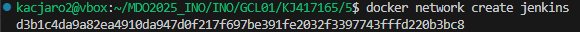

# Sprawozdanie 1

1. Instancja Jenkins

Do utworzenia jenkinsa została wykorzystana oficjalna instrukcja instalacji dostępna pod tym linkiem https://www.jenkins.io/doc/book/installing/docker/

2. Następnie należało stworzyć sieć o nazwie Jenkins.



3. Utworzenie kontenera na podstawie obrazu docker:dind


4. Przygotowanie pliku Dockerfile, generujący obraz oparty na oficjalnym obrazie Jenkinsa.


5. Budowa obrazu


6. Uruchomienie kontenera za pomocą poniższego polecenia


7. Następnie należało otworzyć Jenkinsa na localhost:8080. Należało stworzyć konto, zainstalować potrzebne wtyczki. Następnym krokiem było wykonanie wstępnego zadania wyświetlającego informacje o systemie poleceniem 'uname -a'.


8. Kolejne zadanie polegało na napisaniu skryptu w basku sprawdzającego czy godzina jest parzysta.

```
#!/bin/bash

current_hour=$(date +"%H")
echo "Bieżąca godzina: $current_hour"

if [ $((current_hour % 2)) -ne 0 ]; then
    echo "Błąd: godzina jest nieparzysta!" >&2
    exit 1
else
    echo "Godzina jest parzysta, kontynuuję..."
fi

```


9. Ostatnim wstępnym zadaniem było sprawdzenie połączenia z internetem poprzez pobranie obrazu ubuntu


10. Następnym krokiem był obiekt typu Pipeline, który jest zautomatyzowanym ciągiem kroków. Wykorzystany został plik Dockerfile.build, który wcześniej został utworzony.

```
pipeline {
    agent any

    stages {
        stage('Klonowanie repo') { 
            steps {
                git branch: 'KJ417165', url: 'https://github.com/InzynieriaOprogramowaniaAGH/MDO2025_INO.git'
            }
        }

        stage('Budowanie obrazu FFmpeg') {
            steps {
                dir("INO/GCL01/KJ417165/dockerfiles/FFmpeg") {
                    script {
                        docker.build('ffmpeg-builder-image', '-f Dockerfile.build .')
                    }
                }
            }
        }
    }
}
```

Sklonowanie repozytorium oraz wykonanie builda dało taki wynik:


Następnym krokiem był etap testowania. Pipeline wyglądał następująco:

```
pipeline {
    agent any

    stages {
        stage('Klonowanie repozytorium') { 
            steps {
                git branch: 'KJ417165', url: 'https://github.com/InzynieriaOprogramowaniaAGH/MDO2025_INO.git'
            }
        }

        stage('Budowanie obrazu buildera') {
            steps {
                dir ("INO/GCL01/KJ417165/dockerfiles/FFmpeg") {
                    script {
                        docker.build('ffmpeg-builder-image', '-f Dockerfile.build .')
                    }
                }
            }
        }

        stage('Budowanie obrazu testowego') {
            steps {
                dir ("INO/GCL01/KJ417165/dockerfiles/FFmpeg") {
                    script {
                        docker.build('ffmpeg-test-image', '-f Dockerfile.test .')
                    }
                }
            }
        }

        stage('Testy') {
            steps {
                dir ("INO/GCL01/KJ417165") {
                    sh "mkdir -p artifacts"

                    sh """
                        docker run --rm ffmpeg-test-image | tee artifacts/test.log
                    """
                }    
            }
        }

        stage('Publikacja logów') {
            steps {
                archiveArtifacts artifacts: 'INO/GCL01/KJ417165/artifacts/test.log', fingerprint: true
            }
        }
    }
}

```


11. Nastęnym krokiem był kompletny pipeline. Zaktualizowałem pliki Dockerfile.build oraz Dockerfile.test. Stworzyłem nowy pipeline, gdyż nie mogłem po powrocie następnego dnia edytować starego. Pojawiły się wtedy problemy. Przestała działać publikacja logów, nie udało mi się dojść dlaczego.

```
pipeline {
    agent any

    stages {
        stage('Klonowanie repozytorium') {
            steps {
                git branch: 'KJ417165', url: 'https://github.com/InzynieriaOprogramowaniaAGH/MDO2025_INO.git'
            }
        }

        stage('Budowanie obrazu buildera') {
            steps {
                dir ("INO/GCL01/KJ417165/dockerfiles/FFmpeg") {
                    script {
                        docker.build('ffmpeg-builder-image', '-f Dockerfile.build .')
                    }
                }
            }
        }

        stage('Budowanie obrazu testowego') {
            steps {
                dir ("INO/GCL01/KJ417165/dockerfiles/FFmpeg") {
                    script {
                        docker.build('ffmpeg-test-image', '-f Dockerfile.test .')
                    }
                }
            }
        }

        stage('Testy') {
            steps {
                dir ("INO/GCL01/KJ417165") {
                    sh "mkdir -p artifacts"
                    sh """
                        docker run --rm \
                          -v \$PWD/INO/GCL01/KJ417165/dockerfiles/FFmpeg/input.mp4:/input.mp4 \
                          ffmpeg-test-image | tee artifacts/test.log
                    """
                }
            }
        }

        stage('Publikacja logów') {
            steps {
                archiveArtifacts artifacts: 'INO/GCL01/KJ417165/artifacts/test.log', fingerprint: true
            }
        }

        stage('Deploy') {
            steps {
                script {
                    docker.image('ffmpeg-builder-image').run('--rm --name ffmpeg-prod -d')
                }
            }
        }

        stage('Publish') {
            steps {
                script {
                    sh "docker save ffmpeg-builder-image -o INO/GCL01/KJ417165/artifacts/ffmpeg-builder.tar"
                }
                archiveArtifacts artifacts: 'INO/GCL01/KJ417165/artifacts/ffmpeg-builder.tar', fingerprint: true
            }
        }
    }
}
```


O ile jest pokazane, że deploy i publish się powiodły, publikacja logów przestała działać. Próbowałem także w deploy wykonywać konwersję pliku .mp4 na .avi, ale bez powodzenia.
Dodatkowo tworzony był tu plik run_test.sh, a także dołączony input.mp4.

```
#!/bin/bash
set -e

# Upewnij się, że wejściowy plik istnieje
if [ ! -f "input.mp4" ]; then
    echo "Brak pliku input.mp4. Upewnij się, że został dołączony do obrazu lub zamontowany jako wolumen."
    exit 1
fi

# Konwersja MP4 → AVI
ffmpeg -i input.mp4 output.avi

# Sprawdzenie, czy plik wynikowy istnieje
if [ -f "output.avi" ]; then
    echo "Konwersja udana!"
else
    echo "Konwersja nie powiodła się" >&2
    exit 1
fi
```

```
pipeline {
    agent any

    stages {
        stage('Klonowanie repozytorium') {
            steps {
                git branch: 'KJ417165', url: 'https://github.com/InzynieriaOprogramowaniaAGH/MDO2025_INO.git'
            }
        }

        stage('Budowanie obrazu buildera') {
            steps {
                dir ("INO/GCL01/KJ417165/dockerfiles/FFmpeg") {
                    script {
                        docker.build('ffmpeg-builder-image', '-f Dockerfile.build .')
                    }
                }
            }
        }

        stage('Budowanie obrazu testowego') {
            steps {
                dir ("INO/GCL01/KJ417165/dockerfiles/FFmpeg") {
                    script {
                        docker.build('ffmpeg-test-image', '-f Dockerfile.test .')
                    }
                }
            }
        }

        stage('Testy') {
            steps {
                dir ("INO/GCL01/KJ417165") {
                    sh "mkdir -p artifacts"
                    sh """
                        docker run --rm \
                          -v \$PWD/dockerfiles/FFmpeg/input.mp4:/input.mp4 \
                          ffmpeg-test-image | tee artifacts/test.log
                    """
                }
            }
        }

        stage('Publikacja logow') {
            steps {
                archiveArtifacts artifacts: 'INO/GCL01/KJ417165/artifacts/test.log', fingerprint: true
            }
        }

        stage('Deploy') {
            steps {
                dir ("INO/GCL01/KJ417165") {
                    sh "mkdir -p artifacts"
                    sh """
                        docker run --rm \
                          -v \$PWD/dockerfiles/FFmpeg/input.mp4:/input.mp4 \
                          -v \$PWD/artifacts:/output \
                          ffmpeg-builder-image \
                          ffmpeg -i /input.mp4 /output/output.avi
                    """
                    
                }
            }
        }

        stage('Publish') {
            steps {
                dir ("INO/GCL01/KJ417165") {
                    archiveArtifacts artifacts: 'artifacts/output.avi', fingerprint: true
                }
            }
        }
    }
}
```

Niestety ten pipeline zwracał błąd przy deployu i publishu. Próbowałem to rozwiązać z pomocą sztucznej inteligencji, ale nie powiodło się.

12. Czy program powinien zostać „zapakowany” do jakiegoś przenośnego formatu (DEB / RPM / TAR / JAR / ZIP / NUPKG)?

Tak, najlepsze jest w tym przypadku .tar. Program opiera się o FFmpeg, które jest narzędziem linii poleceń, więc Docker idealnie pasuje jako format dystrybucji — wystarczy uruchomić kontener. Nie warto robić .deb czy .rpm, bo to nie jest typowa aplikacja systemowa z integracją z systemd, logrotate itd. Można użyć opcjonalnie .zip lub .tar.gz, ale wtedy trzeba ręcznie dbać o zależności (np. instalację ffmpeg).

13. Czy aplikacja powinna być dystrybuowana jako obraz Docker? 

Tak, bo FFmpeg to narzędzie CLI, które łatwo uruchomić jako kontener z wejściem/wyjściem.

14. Czy powinno zawierać repo i logi? Nie – lepiej tylko binarki i potrzebne zasoby (clean image).

Nie. Obraz Dockera powinien być możliwie czysty — zawierać tylko to, co jest potrzebne do uruchomienia aplikacji. Logi powinny być generowane dynamicznie podczas działania aplikacji.

15. Czym różni się node od node-slim? 

Node-slim to mniejszy obraz, bez zbędnych narzędzi developerskich.

16. Deploy

W aktualnej wersji pipeline’u Jenkins etap Deploy polega na uruchomieniu kontenera Docker z wcześniej zbudowanym obrazem ffmpeg-builder-image. Pipeline wykonuje polecenie:

```
docker run --rm --name ffmpeg-prod -d ffmpeg-builder-image
```
* Tworzony jest kontener z obrazu ffmpeg-builder-image.

* Kontener uruchamiany jest w tle (opcja -d) i automatycznie usuwany po zakończeniu działania (opcja --rm).

* W tym wariancie kontener nie wykonuje żadnych dodatkowych zadań – jest to jedynie demonstracyjne uruchomienie aplikacji w kontenerze.

Drugie podejście zakładało, że etap Deploy będzie obejmować przetwarzanie pliku video (np. konwersję) z użyciem FFmpeg, uruchamianego w kontenerze. Próbowano zrealizować to poleceniem:

```
docker run --rm -v <ścieżka_do_input.mp4> ffmpeg-test-image
```
Założeniem było, że FFmpeg uruchomiony w kontenerze przetworzy wskazany plik video, a wynik zostanie zapisany do wolumenu lub jako artefakt do dalszego użycia. W praktyce jednak wystąpiły istotne problemy:

* brak dostępu do lokalnych katalogów z poziomu kontenera (problemy z wolumenami i prawami dostępu),

* błędy przy próbie zapisu wyników w katalogach Jenkinsa (zwłaszcza /var/jenkins_home/fingerprints),

* błędne działanie w połączeniu z systemem logowania i artefaktami Jenkinsa.

17. Podczas pracy nad projektem korzystałem z ChatGPT, który pomagał mi w odpowiedniej implementacji oraz analizował błędy i pomagał je rozwiązywać. 