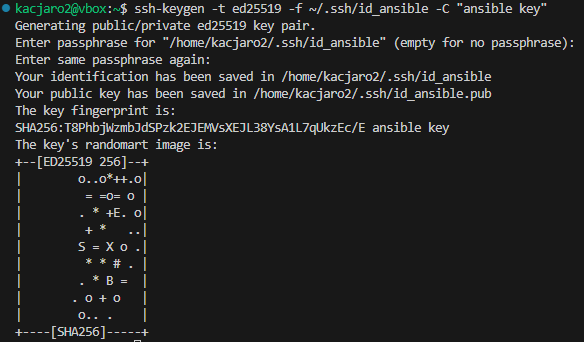
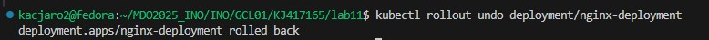

# Sprawozdanie 3
## Laboratorium 8

1. Instalacja ansible

Utworzyłem drugą maszynę wirtualną z tym samym systemem, czyli Fedora 41.


Następnie zainstalowałem potrzebne oprogramowanie używając polecenia:

``` 
sudo dnf install openssh-server tar
```


Kolejnym krokiem było utworzenie migawki w VirtualBoxie, by w szczególnym przypadku móc przywrócić maszynę do tego stanu.

Następnie na głównej maszynie zainstalowałem Ansible za pomocą polecenia:

```
sudo dnf install -y ansible
```


Sprawdziłem powodzenie instalacji:


Następnym krokiem było ustanowienie połączenia. W pliku /etc/hosts przypisałem adresy IP odpowiednio, by móc używać polecenia ``` ping <nazwa maszyny>```.


Utworzyłem klucz SSH dla Ansible poleceniem:

```
ssh-keygen -t ed25519 -f ~/.ssh/id_ansible -C "ansible key"
```



Przesłałem klucz publiczny na maszynę ``` ansible-target ```, aby umożliwić logowanie bez hasła:

```
ssh-copy-id -i ~/.ssh/id_ansible.pub ansible@ansible-target
```


Dodałem do pliku ``` ~/.ssh/config ```, żeby Ansible automatycznie używał klucza:

```
Host ansible-target
    HostName 192.168.56.102
    User ansible
    IdentityFile ~/.ssh/id_ansible
```

Przetestowałem działanie za pomocą ```ssh ansible-target```:


Kolejnym krokiem była inwentaryzacja. W katalogu ```ansible_project``` utworzyłem plik ```hosts.ini``` i zaktualizowałem go o taką treść, przypisując grupom ```Orchestrators``` i ```Endpoints``` odpowiednie maszyny:

```
[Orchestrators]
localhost ansible_connection=local

[Endpoints]
ansible-target
```

Sprawdziłem łączność z maszynami przez ```ansible ping```:

```
ansible -i hosts.ini all -m ping
```


Następnie utworzyłem prosty playbook:


Którego uruchomiłem poleceniem:

```
ansible-playbook -i hosts.ini playbook.yaml
```


Kolejnym krokiem była aktualizacja playbooka, aby:

* wysyłał ping do wszystkich maszyn
* kopiował plik inwentaryzacji na maszyny/ę ```Endpoints```
* aktualizował pakiety
* restartował usługi sshd i rngd

Zawartość pliku ```playbook.yaml```:

```
- name: Kompleksowy playbook do zarządzania maszynami
  hosts: all
  become: true
  tasks:

    - name: Ping do wszystkich hostów
      ansible.builtin.ping:

    - name: Skopiuj plik hosts.ini na zdalne maszyny
      ansible.builtin.copy:
        src: ./hosts.ini
        dest: /home/ansible/hosts.ini
      when: inventory_hostname == 'ansible-target'


    - name: Wypisz wiadomość po skopiowaniu
      ansible.builtin.debug:
        msg: "Plik hosts.ini został skopiowany do /home/ansible/hosts.ini"

    - name: Zaktualizuj pakiety (Fedora / RedHat only)
      ansible.builtin.dnf:
        name: "*"
        state: latest
      when: ansible_os_family == "RedHat"

    - name: Restart usługi sshd
      ansible.builtin.service:
        name: sshd
        state: restarted
      when: ansible_os_family == "RedHat"

    - name: Restart usługi rngd (jeśli jest zainstalowana)
      ansible.builtin.service:
        name: rngd
        state: restarted
      ignore_errors: true
      when: ansible_os_family == "RedHat"
```


Następnym krokiem było uruchomienie konteneru sekcji ```Deploy``` z poprzednich zajęć. Playbook:

```
- name: Deploy kontenera FFmpeg na maszynie docelowej
  hosts: all
  become: true

  tasks:
    - name: Zainstaluj Dockera (dla Fedory/RedHat)
      ansible.builtin.yum:
        name: docker
        state: present
      when: ansible_os_family == "RedHat"

    - name: Upewnij się, że usługa Docker działa i jest włączona
      ansible.builtin.service:
        name: docker
        state: started
        enabled: true

    - name: Prześlij plik ffmpeg-builder.tar na maszynę docelową
      ansible.builtin.copy:
        src: /tmp/ffmpeg-builder.tar
        dest: /tmp/ffmpeg-builder.tar
        mode: '0644'

    - name: Załaduj obraz dockera z pliku
      ansible.builtin.command: docker load -i /tmp/ffmpeg-builder.tar
      register: load_image
      changed_when: "'Loaded image' in load_image.stdout"

    - name: Uruchom kontener z obrazem
      ansible.builtin.docker_container:
        name: ffmpeg-prod
        image: ffmpeg-builder-image
        state: started
        restart_policy: unless-stopped
        detach: true

    - name: Sprawdź, czy kontener działa
     ansible.builtin.shell: docker ps -f name=ffmpeg-prod --format '{{ "{{.Names}}" }}'
     register: running_containers

    - name: Wypisz uruchomione kontenery o nazwie ffmpeg-prod
      ansible.builtin.debug:
        msg: "{{ running_containers.stdout_lines }}"

    - name: Zatrzymaj i usuń kontener ffmpeg-prod
      ansible.builtin.docker_container:
        name: ffmpeg-prod
        state: absent

```


## Laboratorium 9

1. Kickstart

Do tej pory pracowałem na systemie Fedora, więc nie musiałem jej już instalować. Należało zaktualizować plik anaconda-ks.cfg poprzez dodanie:

```
url --mirrorlist=http://mirrors.fedoraproject.org/mirrorlist?repo=fedora-41&arch=x86_64
repo --name=update --mirrorlist=http://mirrors.fedoraproject.org/mirrorlist?repo=updates-released-f41&arch=x86_64
```

Następnie podczas tworzenia nowej maszyny wirtualnej, w momencie instalowania należało nacisnąć ```e```, aby przejść do trybu edycji poleceń GRUB, po czym dopisałem:

```
inst.ks=hhtp://192.168.56.103:8080/anaconda-ks.cfg
```


Kolejnym krokiem było zaktualizowanie pliku ```anaconda-ks.cfg``` o:

* automatyczne uruchomienie po instalacji - ```reboot```
* nadanie maszynie nazwy hosta - ```network --hostname=fedora.test```
* usuwanie wszystkich partycji przed instalacją - ``` clearpart --all --initlabel ```
* automatyczne tworzenie nowych partycji - ``` autopart ```

Brak możliwości zmiany niektórych opcji - zostały już określone w pliku kickstart:


Logowanie na nowej Fedorze:


Zmieniona nazwa hosta:


## Laboratorium 10

1. Kubernetes

Na początku należało zainstalować Minikube za pomocą polecenia:

```
sudo dnf install ./minikube-latest.x86_64.rpm
```


Instalacja kubectl:

```
sudo dnf install kubectl
```


Wystartowanie minikube:

```
minikube start
```


Uruchomienie dashboarda:

```
minikube dashboard
```

Które przekierowało na stronę:


Następnie wykorzystałem NGINX z własną konfiguracją. Stworzyłem folder ```nginx-new```, a następnie plik ``` Dockerfile``` podmieniający domyślną konfigurację na moją:

```
FROM nginx
COPY index.html /usr/share/nginx/html/index.html
```

oraz ```index.html```:

```
<!DOCTYPE html>
<html>
  <head>
    <title>Dorzucona konfiguracja</title>
  </head>
  <body>
    <h1>Witam! Dorzucona konfiguracja</h1>
  </body>
</html>
```

Dalszym krokiem było zbudowanie obrazu Dockera:

```
docker build -t nginx-new:v1 .
```

Ustawiłem obraz w Minikube:

```
minikube image load nginx-new:v1
```

Następnie uruchomiłem poda:

```
minikube kubectl -- run moj-nginx --image=nginx-new:v1 --port=80 --labels app=nginx-new
```


Przekierowałem port za pomocą:

```
kubectl port-forward pod/moj-nginx 8080:80
```

Po wejściu na ```localhost:8080``` otrzymałem:


Następnym krokiem było wdrożenie przykładowego deploymentu. Plik ```deployment.yaml```:

```
apiVersion: apps/v1
kind: Deployment
metadata:
  name: moj-nginx-deployment
spec:
  replicas: 4
  selector:
    matchLabels:
      app: moj-nginx
  template:
    metadata:
      labels:
        app: moj-nginx
    spec:
      containers:
      - name: nginx
        image: nginx-new:v1
        ports:
        - containerPort: 80
```

Do uruchomienia należało użyć:

```
kubectl apply -f deployment.yaml
```

Sprawdziłem status rolloutu:

```
kubectl rollout status deployment/moj-nginx-deployment
```

Wyświetliłem pody:

```
kubectl get pods -l app=moj-nginx
```


Wdrożenie service. Plik ```moj-nginx-service.yaml```:

```
apiVersion: v1
kind: Service
metadata:
  name: nginx-service
  labels:
    app: nginx
spec:
  type: LoadBalancer
  selector:
    app: nginx
  ports:
  - port: 80
    targetPort: 80
    nodePort: 30080
```

Użycie polecenia:

```
kubectl apply -f moj-nginx-service.yaml
```

oraz ```minikube tunnel```. Ręczne uruchomienie service na localhoście:

```
kubectl run nginx-pod --image=nginx --labels="app=nginx"
```


## Laboratorium 11

1. Kubernetes II

Utworzenie co najmniej 3 wersji obrazu:

* Dockerfile1:

```
FROM nginx:alpine
COPY index.html /usr/share/nginx/html/index.htm
```

* Dockerfile2:

```
FROM nginx:alpine
COPY index.html /usr/share/nginx/html/index2.html
```

* Dockerfile3:

```
FROM alpine
CMD ["exit", "1"]
```

* index.html:

```
<!DOCTYPE html>
<html>
<head>
    <title>Wersja 1</title>
</head>
<body>
    <h1>Działa wersja 1 mojego serwisu!</h1>
</body>
</html>
```

* index2.html:

```
<html>
  <body>
    <h1>To jest wersja 2!</h1>
  </body>
</html>
```

Po stworzeniu konta na Docker Hub i zalogowaniu się za pomocą ```docker login```, można było opublikować stworzone obrazy:

```
docker build -t yaarosh/nginx-app:v1 -f Dockerfile .
docker push yaarosh/nginx-app:v1

docker build -t yaarosh/nginx-app:v2 -f Dockerfile2 .
docker push yaarosh/nginx-app:v2

docker build -t yaarosh/nginx-app:v3 -f Dockerfile3 .
docker push yaarosh/nginx-app:v3
```


Plik ```nginx-deployment.yaml```:

```
apiVersion: apps/v1
kind: Deployment
metadata:
  name: nginx-deployment
spec:
  replicas: 4
  selector:
    matchLabels:
      app: nginx
  template:
    metadata:
      labels:
        app: nginx
    spec:
      containers:
      - name: nginx
        image: yaarosh/nginx-app:v3
        ports:
        - containerPort: 80
```

Zmiany w pliku ```nginx-deployment.yaml```.


Na początku należało zmodyfikować liczbę replik na 8:


Zmniejszenie na 1:


Zmniejszenie do 0:


Zwiększenie z powrotem do 4 i zmiana na drugą wersję obrazu. Widzimy tutaj, że pody nie są tworzone równocześnie:


Zmiana na wersję wadliwą, deployment nie zostaje pomyślnie uruchomiony:


Następnie należało sprawdzić historię wdrożeń za pomocą polecenia:

```
kubectl rollout history deployment/nginx-deployment
```


Cofnięcie do poprzedniej wersji wdrożenia za pomocą:

```
kubectl rollout undo deployment/nginx-deployment
```



Pojawia się w dashoboardzie wdrożenie bez błędu:


Szczegóły konkretnej wersji rolloutu:

```
kubectl rollout history deployment/nginx-deployment --revision=3
```


Następnym krokiem było stworzenie skryptu, który weryfikuje czy rollout się zakończył. Jeśli nie dojdzie do tego w przeciągu 60 sekund skrypt wymusza zakończenie z błędem.

```
#!/bin/bash

DEPLOYMENT_NAME="nginx-deployment"
NAMESPACE="default"  # zmień jeśli używasz innej przestrzeni nazw
TIMEOUT=60  # czas oczekiwania w sekundach

echo "Sprawdzam rollout deploymentu $DEPLOYMENT_NAME w namespace $NAMESPACE..."

kubectl rollout status deployment/$DEPLOYMENT_NAME -n $NAMESPACE --timeout=${TIMEOUT}s

if [ $? -eq 0 ]; then
  echo "Rollout zakończony sukcesem!"
  exit 0
else
  echo "Rollout nie powiódł się lub przekroczono limit czasu!"
  exit 1
fi
```

Wydruk dla niewadliwej wersji:


Wydruk dla wadliwej wersji:


Strategie:

* strategia Recreate polega na całkowitym usunięciu starych wersji aplikacji przed uruchomieniem nowych. W trakcie aktualizacji aplikacja jest niedostępna. Jest to najprostsze, ale najmniej bezpieczne podejście — szczególnie w systemach wymagających wysokiej dostępności
* w strategii Rolling Update nowe wersje aplikacji są wdrażane stopniowo, zastępując stare Pody jeden po drugim (lub więcej, zgodnie z parametrami maxUnavailable i maxSurge). Zapewnia to ciągłą dostępność usługi podczas aktualizacji i jest domyślną strategią w Kubernetesie
* Canary deployment polega na równoległym wdrożeniu nowej wersji aplikacji tylko do części użytkowników (np. 10%). Pozwala to na przetestowanie nowej wersji w środowisku produkcyjnym z minimalnym ryzykiem. Ruch można kierować za pomocą etykiet i serwisów

## Wykorzystanie sztucznej inteligencji

Podczas pracy wspomagałem się sztuczną inteligencją, jaką był ChatGPT. Pomagał on w interpretacji dokumentacji i wykrywaniu błędów, dzięki czemu mogłem szybciej dojść do pewnych wniosków.