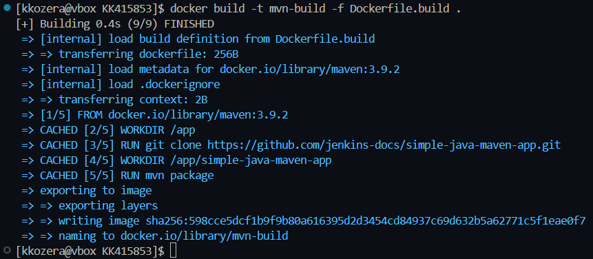

# Zajęcia 1

Na początku zainstalowałem klienta Git za pomocą:

```bash
sudo dnf install git
```

następnie zweryfikowałem, czy operacja powiodła się pomyślnie za pomocą:

```bash
git --version
```
 


kolejnym krokiem było stworzenie personal access token i sklonowanie repozytorium przedmiotowego. W tym celu należało otworzyć profil github -> settings -> developer settings -> personal access tokens i utworzyć nowy token.

   

Następnie epozytorium zostało sklonowane za pomocą:

```bash
git clone https://github.com/InzynieriaOprogramowaniaAGH/MDO2025_INO.git
``` 


Później przystąpiłem do generowania utworzenia SSH, należało wygenerować 2 klucze inne niż RSA, w tym jeden zabezpieczony hasłem. Wybrałem klucze ed25519 oraz ecdsa i wygenerowałem je używając poleceń:
```bash
ssh-keygen -t ed25519 -C "kacperkozera13@gmail.com"
ssh-keygen -t ecdsa -C "kacperkozera13@gmail.com"
```

  
  

Żeby ssh-agent działał w tle należy go uruchomić za pomocą:
```bash
eval "$(ssh-agent -s)"
```


Następnie dodałem wygenerowany wcześniej klucz prywatny do ssh-agenta używając:
```bash 
ssh-add ~/.ssh/id_ed25519
```


Kolejnym krokiem było dodanie klucza publicznego do konta GitHub. W tym celu należy skopiować utworzony wcześniej klucz publiczny używając:
```bash
cat ~/.ssh/id_ed25519.pub 
```  
i dodać go do swojego konta otwierając zakładkę settings -> SSH and GPG keys -> New SSH key.


Ostatnim krokiem konfiguracji klucza ssh jest konfigruacja 2FA. W tym celu otwieramy swój profil GitHub -> settings -> Password and authentication -> Two-factor authentication i wybieramy metodę weryfikacji dwuetapowej.
  

Potem przechodzimy do pracy na sklonowanym uprzednio repozytorium. Na początku przełączamy się na gałąź main, a następnie na gałąź swojej grupy. Robimy to za pomocą:
```bash 
git checkout main
git checkout GCL01
```

  
  

Następnie tworzymy nową gałąź o nazwie "inicjały & nr indeksu", czyli w moim wypadku "KK415853" i się na nią przełączamy. Robimy to za pomocą:
```bash
git checkout -b KK415853
```
  

Później tworzymy nowy katalog, także o nazwie "inicjały & nr indeksu".
  

Następnie tworzymy git hooka, czyli skrypt weryfikujący, że każdy commit zaczyna się od "inicjały & nr indexu".
```bash
#!/bin/bash

commit_msg_file=$1
commit_msg=$(cat $commit_msg_file)

if [[ ! "$commit_msg" =~ ^KK415853 ]]; then
    echo "Wiadomosc commit musi zaczynac sie od 'KK415853'"
    exit 1
fi
exit 0    
```

Żeby skrypt uruchamiał się za każdym razem kiedy robiony jest commit należy umieścić go w katalogu .git/hooks i nadać mu odpowiednie uprawnienia.
  

Weryfikacja działania:
  

Na koniec tworzymy katalog Sprawozdanie1 oraz plik README.md


# Zajęcia 2

Na początku instalujemy Docker za pomocą:
```bash
sudo dnf -y install dnf-plugins-core
sudo dnf install docker
```

  


Następnie uruchamiamy usługę docker i sprawdzamy czy został poprawnie zainstalowany wywołując numer wersji
  

Kolejnym krokiem była rejestracja na DockerHub
  

Potem pobieramy przykładowe obrazy za pomocą:
```bash
docker pull hello-world && docker pull busybox && docker pull ubuntu && docker pull fedora && docker pull mysql
```
  

Następnie uruchamiamy kontener z obrazu busybox wraz z przykładowym argumentem:
```bash
docker run busybox echo "busybox container" 
```
  

Potem uruchamiamy ponownie kontener z obrazu busybox, ale tym razem interaktywnie za pomocą:
```bash
docker run -it busybox sh
```
następnie wywołujemy w nim numer wersji. Numer wersji możemy wywołać używając na przykład polecenia "busybox"
  

Kolejnym zadaniem było uruchomienie systemu w kontenerze i podłączenie się do niego interaktywnie, wybrałem ubuntu:
```bash
docker run -it ubuntu sh
``` 

następnie należało w nim zaprezentować PID1 i zaktualizować pakiety, czyli użyć poleceń:
```bash
ps
apt update
apt upgrade
```


Następnym krokiem było utworzenie pliku Dockerfile bazującego na wybranym systemie oraz sklonowanie repozytorium przedmiotowego:
```Dockerfile
FROM ubuntu:latest
RUN apt update && apt install -y git
WORKDIR /repository
RUN git clone https://github.com/InzynieriaOprogramowaniaAGH/MDO2025_INO.git
CMD ["bash"]
```

Żeby zbudować obraz na podstawie utworzonego pliku Dockerfile należy użyć polecenia 
```bash
docker build -t simple_image
```
  

Następnie uruchmiamy w trybie interaktywnym kontener z zbudowanego wcześniej obrazu i weryfikujemy czy repozytorium zostało poprawnie sklonowane.
  

Później sprawdzamy uruchomione kontenery używając:
```bash
docker ps -a
```
i czyścimy je za pomocą:
```bash
docker rm -f $(docker ps -aq)
```


Ostatnim krokiem było usunięcie wszystkich obrazów dockera, czyli użycie polecenia:
```bash
docker rmi $(docker images -a -q)
```

dodatkowo możemy zweryfikować czy obrazy zostały usunięte wywołując polecenie:
```bash
docker images
```
  

# Zajęcia 3

Na początku znalazłem repozytorium z prostą aplikacją java oraz z narzędziem budowania maven i je sklonowałem.


Następnie przeprowadziłem budowanie aplikacji za pomocą:
```bash
mvn package
```


oraz testowanie za pomocą:
```bash
mvn test
```


Kolejnym krokiem było powtórzenie powyższego procesu ale w kontenerze. W tym celu należało znaleść wystarczający kontener dla aplikacji, czyli w moim przypadku był to kontener maven w wersji 3.9.2. Następnie należało go uruchomić kontener w trybie interaktywnym używając:
```bash
docker run -it --rm maven:3.9.2 bash
```
oraz sklonować repozytorium z wybraną aplikacją i przeprowadzić jej budowanie oraz testowanie w takim sam sposób jak wcześniej.
  

Następne zadanie polegało na utworzeniu 2 plików Dockerfile. Pierwszy miał za zadanie automatyzacje budowania aplikacji,
```Dockerfile
FROM maven:3.9.2
WORKDIR /app
RUN git clone https://github.com/jenkins-docs/simple-java-maven-app.git
WORKDIR /app/simple-java-maven-app
RUN mvn clean package
```

a drugi jej tesotwanie. 
```Dockerfile
FROM mvn-build
WORKDIR /app/simple-java-maven-app
CMD ["mvn", "test"]
```

Potem należało wdrożyc kontenery. W tym celu trzeba było na początku zbudować obrazy z utworzonych plików Dockerfile, czyli użyć poleceń:
```bash
docker build -t mvn-build -f Dockerfile.build .
docker build -t mvn-test -f Dockerfile.test .
```
  


a następnie zweryfikować działanie uruchamiając kontener z utworzonych obrazów:
```bash
docker run -it mvn-test
```


Na końcu utworzyłem plik docker-compose który automatyzował wdrażanie kontenerów.
```yml
services:
  build:
    build:
      context: .
      dockerfile: Dockerfile.build
    image: mvn-build
    container_name: build-container

  test:
    build:
      context: .
      dockerfile: Dockerfile.test
    image: mvn-test
    container_name: test-container
    depends_on:
      - build
```

Następnie go uruchomiłem za pomocą:
```bash
docker compose up
```
  
  

# Zajęcia 4

Pierwszym zadaniem polegało na utworzeniu woluminów wejściowego i wyjściowego o dowolnych nazwach. Do stworzenia wolumuniów użyłem poleceń:
```bash
docker volume create volume_in
docker volume create volume_out
```


Następnym krokiem było podpięcie utworzonych woluminów do kontenera bazowego oraz upewnienie się, że zainstalowane są niezbędne wymagania. Wykonujemy to poprzez użycie:
```bash
docker run -it -v volume_in:/mnt/in -v volume_out:/mnt/out maven:3.9.2 bash
```


Potem należało sklonować repozytorium na wolumin wejściowy. Zdecydowałem się to zrobić poprzez użycie pomocniczego kontenera, w tym przypadku było to ubuntu. Podpiąłem do niego ten sam wolumin wejściowy, a następnie sklonowałem na niego repozytorium.   
  


Następnie uruchomiłem build aplikacji za pomocą:
```bash
mvn build
```

  

Kolejnym krokiem było skopiowanie powstałych plików na wolumen wyjściowy, czyli w moim przypadku utworzony katalog target
  

Następne zadanie polegało na uruchomieniu wewnątrz kontenera serwera iperf3, w tym celu pobrałem obraz iperf3 za pomocą:
```bash
docker pull networkstatic/iperf3
```
  

a następnie uruchomiłem kontener poleceniem
```bash
docker run -ut --rm --name=iperf3-server -p 5201:5201 netowrkstatic/iperf3 -s
```
  

Potem należało połączyć się z tym serwerem z drugiego kontenera, w tym celu sprawdziłem adres ip serwera używając polecenia:
```bash
docker inspect --format "{{ .NetworkSettings.IPAddress}}" iperf3-server
```

i uruchomiłem kontener klienta poleceniem:
```bash
docker run -it --rm networkstatic/iperf3 -c 172.17.0.2
```


wynik połączenia na serwerze:


Kolejnym krokiem było ponowienie połączenia, ale wykorzystując własną dedykowaną sieć mostkową. Na początku utworzyłem nową sieć używając:
```bash
docker network create -d bridge custom-network
```
  

Następnie w nowej sieci utworzyłem nowy kontener z serwerem iperf3:
```bash
docker run -it --rm -network custom-network --name=iperf3-server -p 5201:5201 netowrkstatic/iperf3 -s
```


oraz kontener z klientem:
```bash
docker run -it --rm --network custom-network networkstatic/iperf3 -c iperf3-server
```
  

wynik połączenia na serwerze:
  

Kolejnym krokiem było połączenie się z serwerem, ale spoza kontenera. Na początku połączyłem sie z hosta:


Następnie połączyłem się spoza hosta:
  

Wynik połączenia na serwerze:
  

Ostatnie zadanie polegało na instalacji skonteneryzowanej instancji Jenkinsa. Na początku należało utworzyć sieć jenkins za pomocą:
```bash
docker network create jenkins
```
  

oraz uruchomic kontener dind:
```bash
docker run --name jenkins-docker --rm --detach \
  --privileged --network jenkins --network-alias docker \
  --env DOCKER_TLS_CERTDIR=/certs \
  --volume jenkins-docker-certs:/certs/client \
  --volume jenkins-data:/var/jenkins_home \
  --publish 2376:2376 \
  docker:dind --storage-driver overlay2
```
  

Następnie należało stworzyć plik Dockerfile z następującą zawartością
```Dockerfile
FROM jenkins/jenkins:2.492.2-jdk17
USER root
RUN apt-get update && apt-get install -y lsb-release ca-certificates curl && \
    install -m 0755 -d /etc/apt/keyrings && \
    curl -fsSL https://download.docker.com/linux/debian/gpg -o /etc/apt/keyrings/docker.asc && \
    chmod a+r /etc/apt/keyrings/docker.asc && \
    echo "deb [arch=$(dpkg --print-architecture) signed-by=/etc/apt/keyrings/docker.asc] \
    https://download.docker.com/linux/debian $(. /etc/os-release && echo \"$VERSION_CODENAME\") stable" \
    | tee /etc/apt/sources.list.d/docker.list > /dev/null && \
    apt-get update && apt-get install -y docker-ce-cli && \
    apt-get clean && rm -rf /var/lib/apt/lists/*
USER jenkins
RUN jenkins-plugin-cli --plugins "blueocean docker-workflow"
```
oraz zbudować z niego obraz za pomocą:
```bash
docker build -t myjenkins-blueocean:2.492.2-1 .
```
  

Ostatnim krokiem było uruchomienie kontenera z uprzednio zbudowanego obrazu:
```bash
docker run --name jenkins-blueocean --restart=on-failure --detach \
  --network jenkins --env DOCKER_HOST=tcp://docker:2376 \
  --env DOCKER_CERT_PATH=/certs/client --env DOCKER_TLS_VERIFY=1 \
  --publish 8080:8080 --publish 50000:50000 \
  --volume jenkins-data:/var/jenkins_home \
  --volume jenkins-docker-certs:/certs/client:ro \
  myjenkins-blueocean:2.492.2-1
```
  

ekran logowana do Jenkins:
  
