# Zajęcia 5

Na początku zajęć uruchomiłem obraz dockera `docker:dind` za pomocą polecenia zalecanego w instrukcji instalacji Jenkinsa

```bash
docker run --name jenkins-docker --rm --detach \
  --privileged --network jenkins --network-alias docker \
  --env DOCKER_TLS_CERTDIR=/certs \
  --volume jenkins-docker-certs:/certs/client \
  --volume jenkins-data:/var/jenkins_home \
  --publish 2376:2376 \
  docker:dind --storage-driver overlay2
```
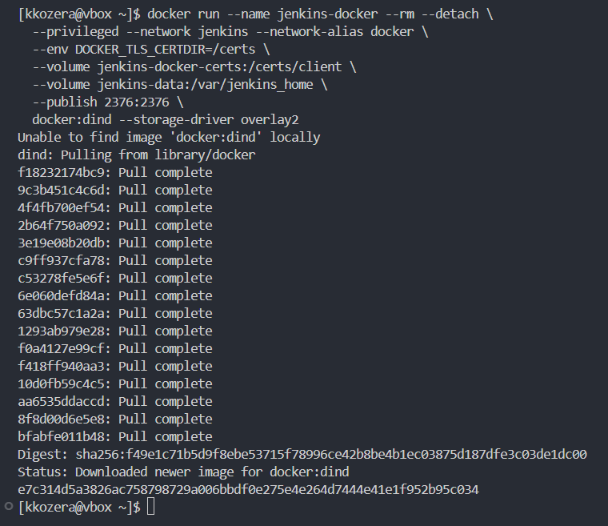

Następnie utworzyłem Dockerfile z niestandardowym obrazem Jenkinsa oraz go zbudowałem nadajac mu nazwę `myjenkins-blueocean:2.492.3-1`
```Dockerfile
FROM jenkins/jenkins:2.492.3-jdk21
USER root
RUN apt-get update && apt-get install -y lsb-release ca-certificates curl && \
    install -m 0755 -d /etc/apt/keyrings && \
    curl -fsSL https://download.docker.com/linux/debian/gpg -o /etc/apt/keyrings/docker.asc && \
    chmod a+r /etc/apt/keyrings/docker.asc && \
    echo "deb [arch=$(dpkg --print-architecture) signed-by=/etc/apt/keyrings/docker.asc] \
    https://download.docker.com/linux/debian $(. /etc/os-release && echo \"$VERSION_CODENAME\") stable" \
    | tee /etc/apt/sources.list.d/docker.list > /dev/null && \
    apt-get update && apt-get install -y docker-ce-cli && \
    apt-get clean && rm -rf /var/lib/apt/lists/*
USER jenkins
RUN jenkins-plugin-cli --plugins "blueocean docker-workflow json-path-api"
```
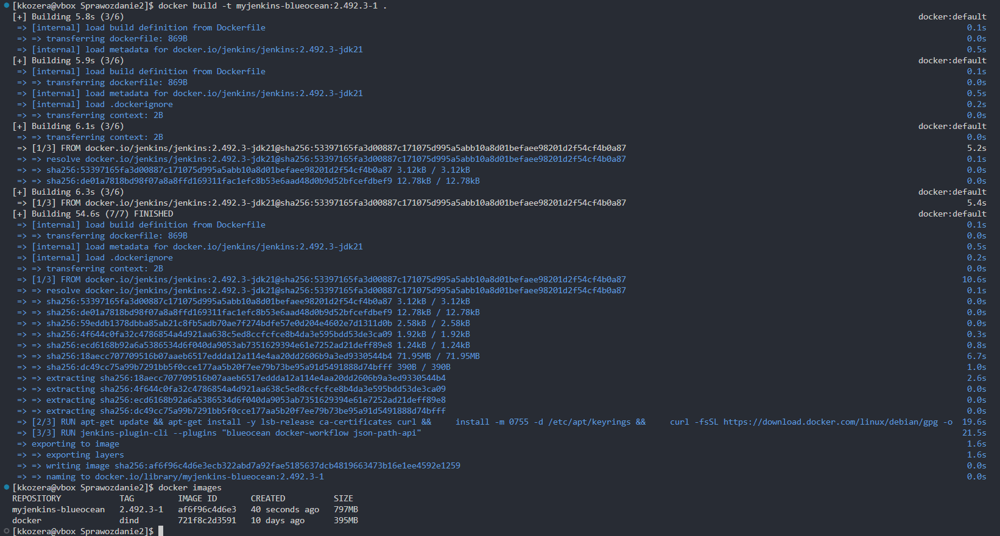

Kolejnym krokiem było uruchomienie kontenera na podstawie utworzonego wcześniej obrazu przy użyciu polecenia
```bash
docker run --name jenkins-blueocean --restart=on-failure --detach \
  --network jenkins --env DOCKER_HOST=tcp://docker:2376 \
  --env DOCKER_CERT_PATH=/certs/client --env DOCKER_TLS_VERIFY=1 \
  --publish 8080:8080 --publish 50000:50000 \
  --volume jenkins-data:/var/jenkins_home \
  --volume jenkins-docker-certs:/certs/client:ro \
  myjenkins-blueocean:2.492.3-1
```
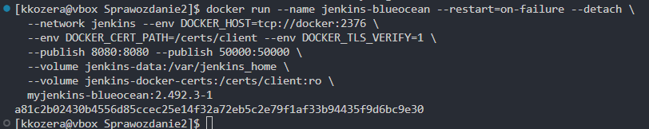

Ponieważ moja maszyna wirtalna działała w sieci typu NAT, nie można było bezpośrednio otworzyć portu 8080 w przeglądarce na systemie hosta (moim lokalnym komputerze). Aby umożliwić dostęp do Jenkinsa, skorzystałem z funkcji przekierowania portów w VS Code.

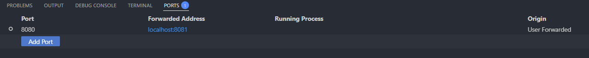

Następnie należało odblokować Jenkinsa poprzez użycie wygenerowanego hasła.

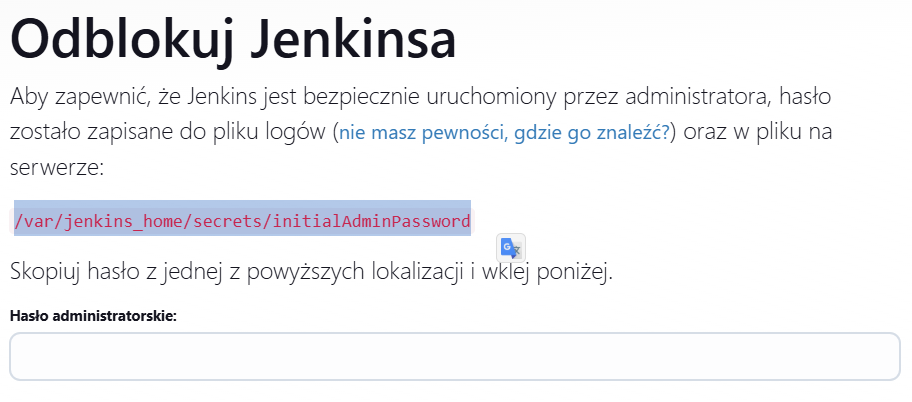

Aby odnaleźć wygenerowane hasło użyłem polecenia do wyświetlenia logów danego kontenera.
```bash
docker logs jenkins-blueocean
```
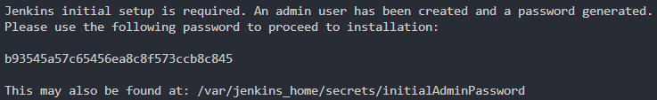

Po odblokowaniu jenkinsa zainstalowałem wymagane wtyczki oraz utworzyłem użytkownika.

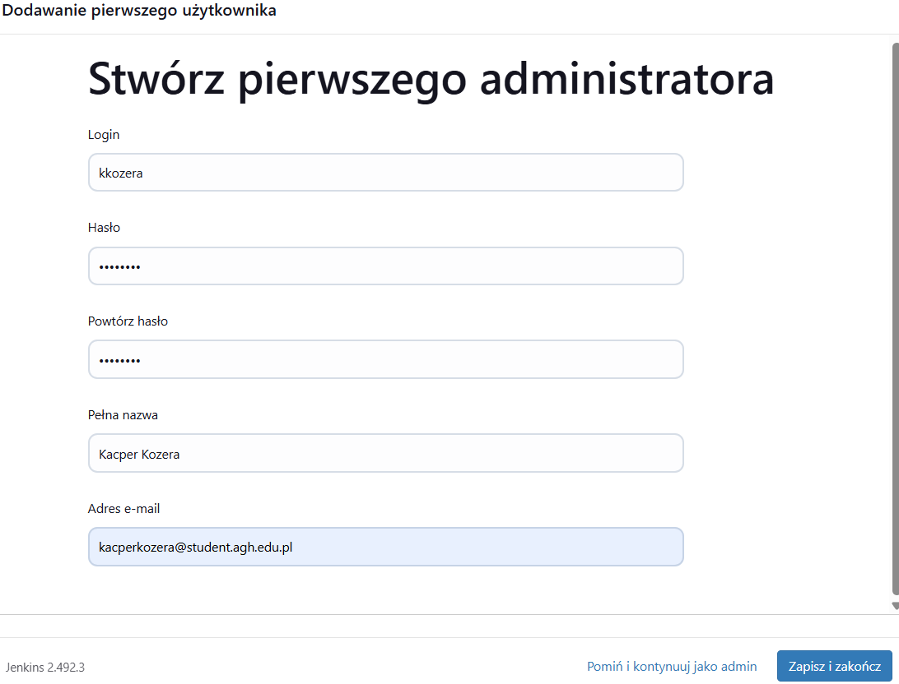

Po pomyślnej instalacji i konfiguracji przeszedłem do tworzenia pierwszych projektów. W tym celu utworzyłem nowy projekt, który w krokach budowania zawierał uruchomienie powłoki z poleceniem 
```bash
uname
```

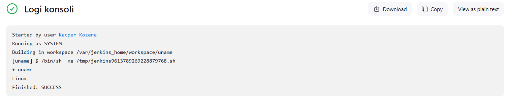

Następnie utworzyłem kolejny projekt, tym razem miał on za zadanie zwracać błąd, gdy godzina jest nieparzysta. W tym celu użyłem prostego skryptu.
```bash
#!/bin/bash
HOUR=$(date +%H)
if [ $((10#$HOUR % 2)) -ne 0 ]; then
  echo "Godzina jest nieparzysta."
  exit 1
else
  echo "Godzina jest parzysta."
fi
```

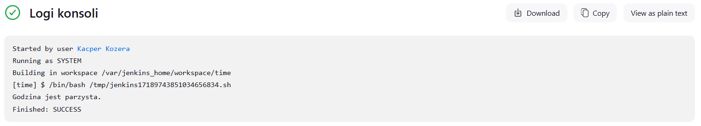

Ostatnim prokjektem było pobranie obrazu kontenera ubuntu. Podobnie jak poprzednio stworzyłem kolejny projekt, który tym razem uruchamiał polecenie
```bash
docker pull ubuntu
```

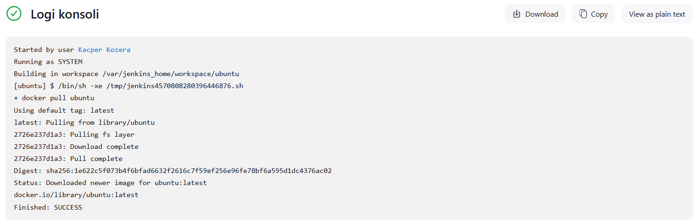

Kolejnym zadaniem było utworzenie obiektu typu pipeline, który miał klonować repo przedmiotowe, robić checkout do swojego pliku Dockerfile (na osobistej gałęzi) właściwego dla buildera wybranego w poprzednim sprawozdaniu oraz budować dany plik Dockerfile. W tym celu należało utworzyć nowy projekt typu pipeline i stworzyć odpowiedni skrypt.

```groovy
pipeline {
    agent any
    
    stages {
        stage('Clone') {    
            steps {
                git branch: 'KK415853', url: 'https://github.com/InzynieriaOprogramowaniaAGH/MDO2025_INO.git'
            }
        }
        
        stage('Build') {
            steps {
                dir ("INO/GCL01/KK415853/Sprawozdanie1") {
                    script {
                        docker.build('bldr', '-f Dockerfile.build .')
                    }
                }
            }
        }
    }
}
```

Pierwsze uruchomienie stworzonego pipelinu było znancznie dłuższe niż kolejne. Wynika to z cache'owania obrazu Dockera, czyli przy drugim uruchomieniu Docker wykrył, że pliki źródłowe oraz Dockerfile.build nie uległy zmianie, więc wykorzystał wcześniej zbudowane warstwy obrazu zapisane w cache'u.
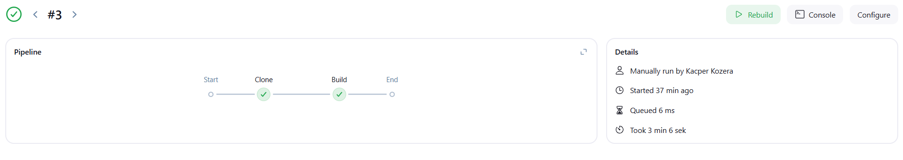
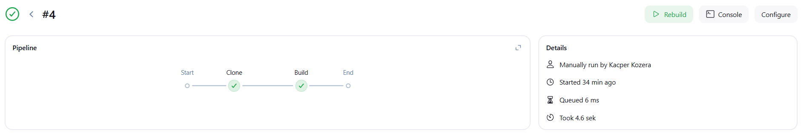

Diagram UML dla wybranego projektu

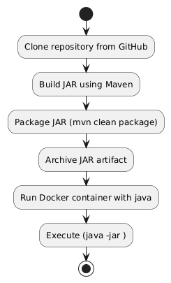


