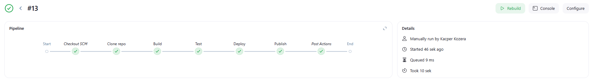

# Zajęcia 5

Na początku zajęć uruchomiłem obraz dockera `docker:dind` za pomocą polecenia zalecanego w instrukcji instalacji Jenkinsa

```bash
docker run --name jenkins-docker --rm --detach \
  --privileged --network jenkins --network-alias docker \
  --env DOCKER_TLS_CERTDIR=/certs \
  --volume jenkins-docker-certs:/certs/client \
  --volume jenkins-data:/var/jenkins_home \
  --publish 2376:2376 \
  docker:dind --storage-driver overlay2
```


Następnie utworzyłem Dockerfile z niestandardowym obrazem Jenkinsa oraz go zbudowałem nadajac mu nazwę `myjenkins-blueocean:2.492.3-1`
```Dockerfile
FROM jenkins/jenkins:2.492.3-jdk21
USER root
RUN apt-get update && apt-get install -y lsb-release ca-certificates curl && \
    install -m 0755 -d /etc/apt/keyrings && \
    curl -fsSL https://download.docker.com/linux/debian/gpg -o /etc/apt/keyrings/docker.asc && \
    chmod a+r /etc/apt/keyrings/docker.asc && \
    echo "deb [arch=$(dpkg --print-architecture) signed-by=/etc/apt/keyrings/docker.asc] \
    https://download.docker.com/linux/debian $(. /etc/os-release && echo \"$VERSION_CODENAME\") stable" \
    | tee /etc/apt/sources.list.d/docker.list > /dev/null && \
    apt-get update && apt-get install -y docker-ce-cli && \
    apt-get clean && rm -rf /var/lib/apt/lists/*
USER jenkins
RUN jenkins-plugin-cli --plugins "blueocean docker-workflow json-path-api"
```


Kolejnym krokiem było uruchomienie kontenera na podstawie utworzonego wcześniej obrazu przy użyciu polecenia
```bash
docker run --name jenkins-blueocean --restart=on-failure --detach \
  --network jenkins --env DOCKER_HOST=tcp://docker:2376 \
  --env DOCKER_CERT_PATH=/certs/client --env DOCKER_TLS_VERIFY=1 \
  --publish 8080:8080 --publish 50000:50000 \
  --volume jenkins-data:/var/jenkins_home \
  --volume jenkins-docker-certs:/certs/client:ro \
  myjenkins-blueocean:2.492.3-1
```


Ponieważ moja maszyna wirtalna działała w sieci typu NAT, nie można było bezpośrednio otworzyć portu 8080 w przeglądarce na systemie hosta (moim lokalnym komputerze). Aby umożliwić dostęp do Jenkinsa, skorzystałem z funkcji przekierowania portów w VS Code.


Następnie należało odblokować Jenkinsa poprzez użycie wygenerowanego hasła.


Aby odnaleźć wygenerowane hasło użyłem polecenia do wyświetlenia logów danego kontenera.
```bash
docker logs jenkins-blueocean
```


Po odblokowaniu jenkinsa zainstalowałem wymagane wtyczki oraz utworzyłem użytkownika.


Po pomyślnej instalacji i konfiguracji przeszedłem do tworzenia pierwszych projektów. W tym celu utworzyłem nowy projekt, który w krokach budowania zawierał uruchomienie powłoki z poleceniem 
```bash
uname
```


Następnie utworzyłem kolejny projekt, tym razem miał on za zadanie zwracać błąd, gdy godzina jest nieparzysta. W tym celu użyłem prostego skryptu.
```bash
#!/bin/bash
HOUR=$(date +%H)
if [ $((10#$HOUR % 2)) -ne 0 ]; then
  echo "Godzina jest nieparzysta."
  exit 1
else
  echo "Godzina jest parzysta."
fi
```


Ostatnim prokjektem było pobranie obrazu kontenera ubuntu. Podobnie jak poprzednio stworzyłem kolejny projekt, który tym razem uruchamiał polecenie
```bash
docker pull ubuntu
```


Kolejnym zadaniem było utworzenie obiektu typu pipeline, który miał klonować repo przedmiotowe, robić checkout do swojego pliku Dockerfile (na osobistej gałęzi) właściwego dla buildera wybranego w poprzednim sprawozdaniu oraz budować dany plik Dockerfile. W tym celu należało utworzyć nowy projekt typu pipeline i stworzyć odpowiedni skrypt.

```groovy
pipeline {
    agent any
    
    stages {
        stage('Clone') {    
            steps {
                git branch: 'KK415853', url: 'https://github.com/InzynieriaOprogramowaniaAGH/MDO2025_INO.git'
            }
        }
        
        stage('Build') {
            steps {
                dir ("INO/GCL01/KK415853/Sprawozdanie1") {
                    script {
                        docker.build('bldr', '-f Dockerfile.build .')
                    }
                }
            }
        }
    }
}
```

Pierwsze uruchomienie stworzonego pipelinu było znancznie dłuższe niż kolejne. Wynika to z cache'owania obrazu Dockera, czyli przy drugim uruchomieniu Docker wykrył, że pliki źródłowe oraz Dockerfile.build nie uległy zmianie, więc wykorzystał wcześniej zbudowane warstwy obrazu zapisane w cache'u.


Diagram UML dla wybranego projektu


Kolejnym krokiem było stworzenie kompletnego pipelinu dla wybranej aplikacji. Pipeline został zdefiniowany w Jenkinsie jako klasyczny Declarative Pipeline, operujący w środowisku Docker-in-Docker (DIND), gdzie Jenkins oraz kontenery budujące/testujące działają w osobnych, izolowanych środowiskach. Pipeline wykonuje pełny cykl CI/CD dla aplikacji Java opartej o Maven, realizując kroki: klonowanie repozytorium, budowa obrazów, testowanie, wdrażanie (deploy) oraz publikacja artefaktów (publish).

## Opis poszczególnych etapów pipeline'u Jenkins

### Clone repo

Pierwszym krokiem pipeline’u jest klonowanie zdalnego repozytorium z mojej gałęzi `KK415853`.

### Build 

W kolejnym etapie tworzony jest obraz Docker (`mvn-build`), bazujący na `Dockerfile.build`. Obraz ten pełni rolę kontenera typu *Builder*, który zawiera wszystkie wymagane zależności potrzebne do zbudowania aplikacji Java za pomocą narzędzia Maven. Użycie oddzielnego kontenera dla etapu budowania pozwala na lepsze zarządzanie zależnościami i umożliwia szybsze, czystsze buildy.

### Test

Etap ten odpowiada za budowę testowego obrazu Docker (`mvn-test`) z wykorzystaniem `Dockerfile.test`. Umożliwia uruchamianie testów w izolowanym środowisku, co zwiększa wiarygodność testów i zapobiega błędom wynikającym z zanieczyszczonego środowiska buildowego.

### Deploy

Etap `Deploy` uruchamia aplikację wewnątrz lekkiego kontenera runtime, opartego na obrazie `openjdk:17-slim`. Taki sposób wdrożenia oddziela środowisko uruchomieniowe od buildowego i testowego, co jest zgodne z zasadami najlepszych praktyk DevOps. Użycie minimalistycznego obrazu zwiększa bezpieczeństwo i zmniejsza powierzchnię ataku.

### Publish

W tym etapie tworzony jest wersjonowany artefakt – plik JAR – który zostaje zapisany w katalogu `publish` i dodany jako artefakt w Jenkinsie. Takie podejście pozwala na późniejsze wykorzystanie zbudowanego artefaktu niezależnie od obrazu Docker.

### Post: always

Na zakończenie pipeline'u, niezależnie od jego wyniku, wykonywane jest polecenie usuwające działający kontener aplikacji (`running-java-app`). Gwarantuje to, że nie pozostaną żadne niepotrzebne kontenery lub zajęte zasoby po wykonaniu procesu CI/CD, co zapewnia czystość środowiska oraz stabilność kolejnych uruchomień.


```
pipeline {
    agent any
    environment {
        MAVEN_OPTS = '-Dmaven.repo.local=.m2/repository'
        BUILD_IMAGE = 'mvn-build'
        TEST_IMAGE = 'mvn-test'
        RUNTIME_IMAGE = 'openjdk:17-slim'
        JAR_NAME = 'app2.jar'
        ARTIFACT_DIR = 'publish'
        DOCKERFILES_DIR = 'INO/GCL01/KK415853/Sprawozdanie2'
        PROJECT_DIR = 'INO/GCL01/KK415853/Sprawozdanie2/simple-java-maven-app'
    }
    stages {
        stage('Clone repo') {
            steps {
                git branch: 'KK415853', url: 'https://github.com/InzynieriaOprogramowaniaAGH/MDO2025_INO.git'
            }
        }
        stage('Build') {
            steps {
                sh "docker build -t ${BUILD_IMAGE} -f ${DOCKERFILES_DIR}/Dockerfile.build ${DOCKERFILES_DIR}"
            }
        }
        stage('Test') {
            steps {
                sh "docker build -t ${TEST_IMAGE} -f ${DOCKERFILES_DIR}/Dockerfile.test ${DOCKERFILES_DIR}"
            }
        }
        stage('Deploy') {
            steps {
                sh '''
                    docker rm -f running-java-app || true
                    docker run -d \
                        --name running-java-app \
                        -v "$PWD/${JAR_NAME}:/app/${JAR_NAME}" \
                        ${RUNTIME_IMAGE} \
                        java -jar /app/${JAR_NAME}
                '''
            }
        }
        stage('Publish') {
            steps {
                sh '''
                    mkdir -p ${ARTIFACT_DIR}
                    cp ${JAR_NAME} ${ARTIFACT_DIR}/myapp-1.0.0.jar
                '''
                archiveArtifacts artifacts: "${ARTIFACT_DIR}/*.jar"
            }
        }
    }
    post {
        always {
            sh 'docker rm -f running-java-app || true'
        }
    }
}
```



