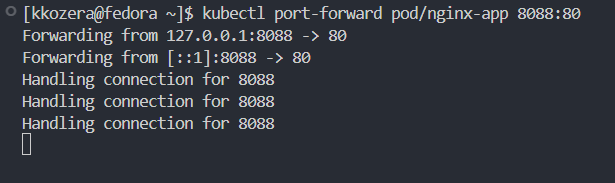

# Zajęcia 8

Na początku utworzyłem drugą maszynę wirtualną, ale z tym samym systemem operacyjnym, czyli Fedora 41. Podczas instalacji nadałem hostname `ansible-target` oraz utworzyłem użytkownika `ansible`

Na utworzonej maszynie zainstalowałem programy tar oraz sshd za pomocą
```bash
sudo dnf install tar sshd
```


Następnie na głównej maszynie zainstalowałem oprogramowanie ansible za pomocą
```bash
sudo dnf install ansible
```


Kolejnym krokiem była wymiana kluczy SSH między maszynami w celu umożliwienia logowania przez ssh bez podawania hasła


Następnie przystąpiłem do inwentaryzacji systemów uprzednio wprowadzając nazwy DNS dla maszyn wirtualnych. Plik /etc/hosts:


Potem utworzyłem `plik inventory.ini` w katalogu `ansible-quickstart`
```ini
[Orchestrators]
fedora

[Endpoints]
ansible-target ansible_user=ansible
```

oraz wysłałem żądanie ping za pomocą
```bash
ansible -i inventory.ini all -m ping
```


# Zajęcia 9
Na początku pobrałem plik odpowiedzi z zainstalowanego systemu fedora `/root/anaconda-ks.cfg`. Następnie dodałem do niego 2 linijki odpowiadające za informacje o repozytorieach fedory.

```
url --mirrorlist=http://mirrors.fedoraproject.org/mirrorlist?repo=fedora-41&arch=x86_64
repo --name=update --mirrorlist=http://mirrors.fedoraproject.org/mirrorlist?repo=updates-released-f41&arch=x86_64
```

zmieniłem także `clearpart --none` na `clearpart --all` w celu umożliwienia zakładania psutego dysku przez plik odpowiedzi oraz zmieniłem hostname na `hostname=fedora.kickstart`. Powstały plik zpushowałem na githuba.

Następnie przystąpiłem do instalacji nienadzorawnej. W menu GRUB dodałem parametr z lokalizacją zpushowanego na githuba wcześniej pliku `anaconda-ks.cfg`.


Proces instalacji rozpoczął się samodzielnie


Po instalacji zalogowałem się tymi samymi danymi co na głównej maszynie, co potwierdza poprawność instalacji


# Zajęcia 10
Na początku należało zainstalować minikube - implementację stosu k8s. Wybrałem pakiet RPM. W tym celu użyłem poleceń z dokumentacji minikube
```bash
curl -LO https://storage.googleapis.com/minikube/releases/latest/minikube-latest.x86_64.rpm
sudo rpm -Uvh minikube-latest.x86_64.rpm
```


Następnie uruchomiłem minikube oraz używając

```bash
minikube start
```


oraz dashboard w przeglądarce za pomocą
```bash
minikube dashboard
```


Koljenym krokiem była instalacja kubectl. Użyłem do tego poleceń z oficjalnej dokumentacji kubernetes.


Potem zapoznałem się z podstawowymi koncepcjami Kubernetesa:

Pod – najmniejsza jednostka w Kubernetesie, zawiera jeden lub więcej kontenerów.

Deployment – zarządza tworzeniem i aktualizacją podów; umożliwia skalowanie i utrzymanie dostępności.

Service – zapewnia stały dostęp do podów (np. przez wspólny adres IP).

Node – maszyna (fizyczna lub wirtualna), która uruchamia pody.

Namespace – logiczny podział klastra na odrębne przestrzenie.

---

Kolejnym krokiem było uruchomienie kontenera z wybraną aplikacją na stosie k8s. W moim przypadku była to aplikacja `nginx`. Na początku uruchomiłem kontener z aplikacją `nginx` za pomocą:
```bash
minikube kubectl -- run nginx-app --image=nginx --port=80 --labels app=nginx-app
```

Poprawność działania można zweryfikować przez dashboard


lub przez polecenie
```bash
kubectl get pods
```


Następnie użyłem polecenia
```bash
kubectl port-forward pod/nginx-app 8088:80
```
w celu przekierowania portów, aby uzyskać dostęp do aplikacji lokalnie przez przeglądarkę.




Kolejnym zadanie było utworzenie pliku wdrożenia
```yaml
apiVersion: apps/v1
kind: Deployment
metadata:
  name: nginx-deployment
  labels:
    app: nginx
spec:
  replicas: 4
  selector:
    matchLabels:
      app: nginx
  template:
    metadata:
      labels:
        app: nginx
    spec:
      containers:
        - name: nginx
          image: nginx
          ports:
            - containerPort: 80
```

następnie przeprowadziłem deployment z pliku za pomocą
```bash
kubectl apply -f nginx-deployment.yaml
```

rollout:


Jak widać w dashboardzie liczba replik wynosi 4, czyli zgodnie z plikiem wdrożenia


Ostatnim krokiem było wyeksponowanie wdrożenia jako serwis. W tym celu należało utworzyć nowy plik yaml
```yaml
apiVersion: v1
kind: Service
metadata:
  name: nginx-service
spec:
  selector:
    app: nginx
  ports:
    - protocol: TCP
      port: 80
      targetPort: 80
  type: ClusterIP
```

następnie uruchomienie go:
```bash
kubectl apply -f nginx-service.yaml
```

oraz przekierowałem port używając
```bash
kubectl port-forward service/nginx-service 8089:80
```


Wynik działania z lokalnej przeglądarki


# Zajęcia 11
Na początku należało przygotować 2 wersje wybranego programu, jedna poprawna, a druga z błędem. W tym celu przygotowałem i zbudowałem 2 obrazu Dockerfile
```Dockerfile
FROM nginx
RUN echo '<h1>Wersja 1</h1>' > /usr/share/nginx/html/index.html
```

```Dockerfile
FROM nginx
CMD ["false"]
```

Następnie zbudowałem powyższe obrazy oraz zpushowałem na własnie konto DockerHub za pomocą 
```bash
docker push kacper1130/nginx-dzialajacy
docker push kacper1130/nginx-bledny
```


Kolejno zmodyfikowałem plik wdrożeniowy z poprzednich laboratoriów, żeby działał na utworzonym obrazie. 

```yaml
apiVersion: apps/v1
kind: Deployment
metadata:
  name: nginx-deployment
  labels:
    app: nginx
spec:
  replicas: 8
  selector:
    matchLabels:
      app: nginx
  template:
    metadata:
      labels:
        app: nginx
    spec:
      containers:
        - name: nginx
          image: nginx-dzialajacy
          ports:
            - containerPort: 80
```

Potem żeby wdrożyc zmiany z pliku yaml użyłem:
```bash
kubectl apply -f nginx-deployment.yaml
```

8 replik:


1 replika:


0 replik:


4 repliki:


Następnym krokiem było zastosowanie nowej wersji obrazu, w tym celu utworzyłem nowy Dockerfile:
```Dockerfile
FROM nginx
RUN echo '<h1>Wersja 3, również działająca</h1>' > /usr/share/nginx/html/index.html
```

zbudowałem:


oraz zpushowałem na DockerHub:


Jak widać obraz został poprawnie zmieniony:


Następnie zmieniłem obraz na błędny:


Potem zidentyfikowałem historię wdrożenia używając
```bash
kubectl rollout history deployment/nginx-deployment
```


Kolejnym krokiem było napisanie skryptu weryfikującego czy wdrożenie "zdążyło" się wdrożyć (60 sekund)
```bash
#!/bin/bash

DEPLOYMENT_NAME="nginx-deployment"
NAMESPACE="default"

kubectl rollout status deployment/$DEPLOYMENT_NAME -n $NAMESPACE --timeout=60s
```

Ostatnim zadaniem było przygotowanie różnych wersji wdrożeń

Strategia Recreate polega na tym, że Kubernetes najpierw usuwa wszystkie istniejące pody, a dopiero potem tworzy nowe z aktualizowaną wersją obrazu. Przez to aplikacja jest w pewnym momencie całkowicie niedostępna. Jest to najprostszy sposób wdrażania zmian, ale wiąże się z przestojem w działaniu systemu.
```yaml
apiVersion: apps/v1
kind: Deployment
metadata:
  name: nginx-recreate
  labels:
    app: nginx
spec:
  replicas: 4
  strategy:
    type: Recreate
  selector:
    matchLabels:
      app: nginx
      version: recreate
  template:
    metadata:
      labels:
        app: nginx
        version: recreate
    spec:
      containers:
        - name: nginx
          image: kacper1130/nginx-dzialajacy
          ports:
            - containerPort: 80
```

Strategia Rolling Update umożliwia stopniową wymianę podów na nowe. Kubernetes tworzy nowe pody z nowym obrazem i stopniowo usuwa stare. Można ustawić parametry, takie jak maxUnavailable (ile podów może być niedostępnych) i maxSurge (ile dodatkowych podów może być tworzonych ponad docelową liczbę).
```yaml
apiVersion: apps/v1
kind: Deployment
metadata:
  name: nginx-rolling
  labels:
    app: nginx
spec:
  replicas: 4
  strategy:
    type: RollingUpdate
    rollingUpdate:
      maxUnavailable: 2
      maxSurge: 50%
  selector:
    matchLabels:
      app: nginx
      version: rolling
  template:
    metadata:
      labels:
        app: nginx
        version: rolling
    spec:
      containers:
        - name: nginx
          image: kacper1130/nginx-dzialajacy
          ports:
            - containerPort: 80
```
Strategia Canary polega na równoległym działaniu dwóch wersji aplikacji: stabilnej (stable) i nowej (canary). W pierwszym kroku wdrażana jest nowa wersja z mniejszą liczbą replik (np. 1), a ruch sieciowy jest kierowany zarówno do starej, jak i nowej wersji. Umożliwia to bezpieczne testowanie aktualizacji w rzeczywistym środowisku produkcyjnym.

canary (stable):
```yaml
apiVersion: apps/v1
kind: Deployment
metadata:
  name: nginx-stable
  labels:
    app: nginx
spec:
  replicas: 3
  selector:
    matchLabels:
      app: nginx
      version: stable
  template:
    metadata:
      labels:
        app: nginx
        version: stable
    spec:
      containers:
      - name: nginx
        image: kacper1130/nginx-dzialajacy
        ports:
        - containerPort: 80
```

canary:
```yaml
apiVersion: apps/v1
kind: Deployment
metadata:
  name: nginx-canary
  labels:
    app: nginx
spec:
  replicas: 1
  selector:
    matchLabels:
      app: nginx
      version: canary
  template:
    metadata:
      labels:
        app: nginx
        version: canary
    spec:
      containers:
      - name: nginx
        image: kacper1130/nginx-dzialajacy-wersja3
        ports:
        - containerPort: 80
```

canary-service:
```yaml
apiVersion: v1
kind: Service
metadata:
  name: nginx-service
spec:
  selector:
    app: nginx
  ports:
  - port: 80
    targetPort: 80
  type: ClusterIP
```

Na końcu wdrożyłem wszystkie deploymenty za pomocą
```bash
kubectl apply -f {nazwa-pliku}.yaml 
```


