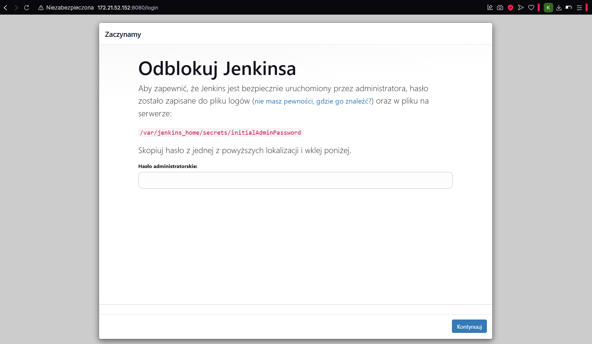

# Sprawozdanie 1

Krzysztof Kaletra IO


## Zajęcia 1

<!-- ### Zadania do wykonania -->
1. **Instalacja klienta Git**  
   Zainstalowałem Git
   Do instalacji użyłem komendy:
   ```bash
   sudo dnf install git
   ```
   
   Wersję git-a sprawdziłem używając komendy
   ```bash
   git --version
   ```
   Po ponownym uruchomieniu komendy instalacyjnej system sprawdził, że git jest już zainstalowany i zwrócił komunikat

   


2. **Sklonowanie repozytorium za pomocą HTTPS i tokenu dostępu**  
   W celu skopiowania repozytorium przy pomocy HTTPS skopiowałem z githuba link znajdujący sie w zakładce HTTPS, następnie wykorzystując go w komendzie git clone:
   
   ```bash
   git clone https://github.com/InzynieriaOprogramowaniaAGH/MDO2025_INO.git
   ````

   Przebieg klonowania:

   

   <!-- Tu coś trzeba jeszcze dodać -->

3. **Weryfikacja dostępu i klonowanie za pomocą SSH**  
   
   Dzięki kluczom SSH nie jest konieczne podawanie loginu oraz tokenu za kazdym razem gdy chemy skopiować repozytorium, na którym pracujemy. Aby wygenerować klucz SSH użyłem klucza ed25519 oraz ecdsa w komendach:
   ```bash
   ssh-keygen -t ed25519 -C "krzkaleta07@gmail.com"
   ssh-keygen -t ecdsa -C "krzkaleta07@gmail.com"
   ``` 
   Tworzenie klucza ecdsa:

   

   Przy tworzeniu klucza ed25519 ustawiłem również hasło, które będę podawać kiedy klucz będzie wykorzystywany. 

   Klucze generują się w dwóch wersjach: publicznej i prywatnej. Zostały one zapisane w folderze .ssh:

   

   Przy użyciu komendy cat wyświetliłem klucz publiczny:

   

   W celu poprawnej konfiguracji klucza SSH dodałem go do konta GitHub, dzięki czemu proces uwierzytelniania w przyszłości zostanie przyspieszony. W tym celu w ustawieniach konta w zakładce SSH keys dodałem klucz nadając mu tytuł devops oraz wklejąc skopiowany wcześniej klucz publiczny z folderu .ssh. 

   Aby teraz skopiować repozytorium wykorzystałem komendę: 
   
   ```bash
   git clone git@github.com:InzynieriaOprogramowaniaAGH/MDO2025_INO.git
   ```
   Dzięki temu git nie wymagał już ode mnie pełnego logowania do konta GitHub z wykorzystaniem tokena a jedynie hasło które ustaliłem podczas tworzenia klucza SSH.  

   W zakładce SSH keys klucz devops zmienił kolor na zielony i widnieje jako aktywowany:

   


7. **Przełączanie gałęzi**
   Aby przełączyć gałąź na main, a potem grupową użyłem polecenia git checkout:
   ```bash
   git checkout main
   git checkout GCL01
   ```

8. **Utworzenie nowej gałęzi**  
   Do utworzenia nowej gałęzi wykorzystałem ponownie git checkout, jednak z opcją -b, która tworzy nową gałąź:
   ```bash
   git checkout -b KK416030
   ```
   W celu wyświetlenia wszystkich gałęzi i zweryfikowania, że znajduję sie aktualnie na odpowiedniej użyłem polecenia: 
   
   

9. **Dodanie katalogu**  
   ```bash
   mkdir KK416030
   ```

10. **Git Hook - weryfikacja commit message**  
   Stworzyłem plik git hooka, który sprawdza czy wiadomość commita zaczyna sie od "inicjały & nr indeksu". W moim wypadku jest to "KK416030". 
   Plik `.git/hooks/commit-msg`:
      ```bash
      #!/bin/bash
      commit_msg=$(cat "$1")
      prefix="KK416030"

      if [[ "$commit_msg" != "$prefix"* ]]; then
      echo "BŁĄD: Commit message musi zaczynać się od '$prefix'"
      exit 1
      fi
      ```

      Aby plik mógł działać poprawnie musiałem nadać mu uprawnienia do uruchamiania przy pomocy chmod:
      ```bash
      chmod +x .git/hooks/commit-msg
      ```

      Plik githooka utworzyłem w prywatnym folderze KK416030 a następnie skopiowałem go do folderu .git/hooks mojego repozytorium. Poniżej przedstawiam strukture plików w folderze /.git/hooks oraz znajdujący się tam plik commit-msg: 

      


11. **Dodanie sprawozdania i zrzutów ekranu**  
   W celu weryfikacji poprawnego działania mojego githooka początkowo stworzyłem commit-message w niepoprawnej formie, co zwróciło błąd. Następnie użyłem poprawnej formy a commit został stworzony poprawnie:

    ```bash
    git add .
    git commit -m "KK416030: Dodano sprawozdanie"
    ```

   

   Podczas wykonywania komendy git push musiałem podać hasło do klucza ssh, a po jego wpisaniu wszytskie zmiany dodane przez komengdę git add zostały przesłane do zdalnego repozytorium:

   

12. **Wciąganie gałęzi**

   Aby wciągnąć swoją gałąź do gałęzi grupowej użyłem komendy git merge:

   

   Jednak w trakcie pushowania pojawił się błąd spowodowany brakiem uprawnień do modyfikacji chronionej gałęzi. Z komunikatu można odczytać, że aby można było wykonać połączenie gałęzi należy wykonać pull requesta:

   


## Zajęcia 2

1. **Zainstaluj Docker w systemie linuksowym**
   W celu instalacji i włączenia dockera na maszynie wirtualnej użyłem następujących komend:
   ```bash
   sudo dnf install docker-ce docker-ce-cli containerd.io docker-buildx-plugin docker-compose-plugin
   sudo systemctl enable --now docker
   ```
   Aby przetestować instalacje użyłem komendy:

    ```bash
   sudo docker run hello-world
   ```

   Wynik uruchomienia obrazu hello-world: 

   

2. **Pobierz obrazy hello-world, busybox, ubuntu, mysql**

   Dodałem użytkownika do grupy użytkowników docker, dzięki czemu nie muszę już przed poleceniami z docekrem dopisywać sudo:

   ```bash
   sudo usermod -aG docker $USER
   ```
   Pobrałem obrazy hello-world, busybox, ubuntu oraz mysql przy użyciu komend:

   ```bash
   docker pull hello-world
   docker pull busybox
   docker pull ubuntu
   docker pull fedora
   docker pull mysql
   ```
3. **Uruchom kontener z obrazu busybox**

   Chcąc uruchomić kontener interaktywnie użyłem komendy:

   ```bash
   docker run -it --rm busybox sh
   ```
   Opcja -it pozwoliła na interaktywne uruchomienei kontenera, co umożliwiło otworzenie wenętrznego terminala. Opcja --rm z kolei usunęła kontener po zakończeniu jego działania. Numer wersji busybox wyświwetliłem dzięki komendzie:

   ```bash
   busybox --help
   ```

   

4. **Uruchom "system w kontenerze"**
   Uruchomiłem kontener z obrazem ubuntu poprzez:

   ```bash
   docker run -it --rm ubuntu
   ```

   W uruchomionym kontenerze wywołałem ps w celu wyświetlenia wszystkich aktualnie uruchomionych procesów

   

   Aby odnaleźć procesy dockera na hoście wywołałem

   ```bash
   ps aux | grep docker
   ```

   

   Do zaktualizowania pakietów użyłem kolejno komend: 
   ```bash
   apt update
   apt upgrade -y
   ```

   

   Wyszedłem z kontenera dzięki poleceniu exit

5. **Stwórz własnoręcznie, zbuduj i uruchom prosty plik Dockerfile bazujący na wybranym systemie i sklonuj nasze repo**

   Stworzyłem plik Dockerfile:
   ```docker
   FROM ubuntu:latest
   LABEL maintainer="kaleta <krzkaleta07@gmail.com>"
   RUN apt update && apt install -y git
   WORKDIR /app
   RUN git clone https://github.com/InzynieriaOprogramowaniaAGH/MDO2025_INO.git
   CMD ["/bin/bash"] 
   ```

   Po napisaniu pliku Dockerfile stworzyłem obraz przy użyciu komendy

   ```bash
   docker build -t moj_kontener .
   ```

   

   Po uruchomieniu kontenera przy użyciu komendy

   ```bah
   docker run -it --rm moj_kontener
   ```

   Sprawdziłem przy użyciu komendy ls poprawnosć sklonowania repozytorium

   

6. **Pokaż uruchomione ( != "działające" ) kontenery, wyczyść je**

   Wyświetliłem wszystkie uruchomione kontenery używając polecenia

   ```bash
   docker ps -a
   ```
   

   Do usunięcia uruchomionych kontenerów użyłem polecenia: 

   ```bash
   docker rm $(docker ps -aq)
   ```
   

7. **Wyczyść obrazy**

   Usunąłem również obrazy używając komendy

   ```bash
   docker rmi $(docker images -q)
   ```

   


# Zajęcia 3
   
1. **Wybór oprogramowania**

      Do labolatoriów 3 wykorzytałem kod znajdujący się w repozytoirium: https://github.com/Lissy93/quick-example-of-testing-in-nodejs. Repozytorium to zawiera program w Node.JS, a do jego budowania i testowania wykorzystywane jest npm.

      W pierwszej kolejności sklonowałem i zbudowałem repozytoprium lokalnie na hoście

      ```bash
      git clone https://github.com/Lissy93/quick-example-of-testing-in-nodejs
      cd quick-example-of-testing-in-nodejs/
      npm install
      ```

      

      Podczas instalacji napotkałem ostrzeżenia dotyczące przestarzałych pakietów oraz potencjalnych podatności w zależnościach. Mimo tych ostrzeżeń instalacja przebiegła poprawnie, a wszystkie wymagane pakiety zostały dodane do projektu.

      Po instalcjii uruchomiłem testy używając polecenia

      ```bash
      npm test
      ```

      

2. **Przeprowadzenie buildu w kontenrze**

      Po udanym uruchomieniu testów pobrałem i uruchomiłem testy w kontenerze. Stworzyłem kontener poleceniem

      ```bash
      docker run -it --rm node bash
      ```

      Następnie wpisałem komendy analogicznie jak w przypadku pracy na hoście. Kontener node ma już domyślnie zainstalowanego gita, co nie wymagało odemnie żadnych dodatkowych instalacji.

      

      Wszystkie testy zostały zakończone powodzeniem

      

      W kolejnym kroku stworzyłem 2 pliki Dockerfile automatyzujące kroki powyżej. Aby tego dokonać stworzyłem plik Dockerfile.nodebld do pobierania repozytorium i jego buildowania oraz plik Dockerfile.nodetest do uruchomienia testów.

      Plik Dockerfile.nodebld

      ```Dockerfile
      FROM node

      RUN git clone https://github.com/Lissy93/quick-example-of-testing-in-nodejs.git
      WORKDIR /quick-example-of-testing-in-nodejs
      RUN npm install
      ```
      Plik Dockerfile.nodetest

      ```Dockerfile
      FROM builder
      RUN npm test
      ```

      Do utworzenia obrazu na podstawie tych plików użyłem kolejno: 

      ```bash
      docker build -t builder -f Dockerfile.nodebld .
      docker build -t tester -f Dockerfile.nodetest .
      ```
      Oba obrazy zbudowały się poprawnie, co świadczy o poprawnym wykonaniu wszystkich testów i poprawnym zbudowaniu programu

      


# Zajęcia 4

1. **Tworzenie woluminów i podłączanie ich do kontenera**

   Stworzyłem woluminy o nazwie W_input i W_output wykorzystując komendę 
   ```bash
      docker volume create W_input
      docker volume create W_output
   ```

   

   Uruchomiłem kontener bazowy o nazwie node_builder i podłączyłem do niego uprzednio stworzone wolumeny. Wolumeny te tworzą strukture /app/woluminy
   

   W kontenerze uruchomiłem apt update oraz apt install.

2. **Sklonowanie repozytorium na wolumin wejściowy**

   Na hoście odnalazłem lokalizację woluminu wejściowego używając polecenia 
   ```bash
      docker volume inspect W_input
   ```
   

   Następnie skopiowałem do tej lokalizacji sklonowane wcześniej lokalnie repozytorium, jednak przez brak uprawnień msuiałem użyć opcji sudo

   

   Po uruchomieniu kontenera i przejściu do foldera /app/input widoczny jest skopiowany folder 

   

   Skopiowałem projekt z folderu input do output, gdzie zainstalowałem zależności i przeprowadziłem testy:
   ```bash
   npm install
   npm test
   ```

   

   Do plików z folderu output w kontenerze mamy dostęp z hosta: 
   

   Metoda której użyłem jest jednak niepoprawna z koncepcją Dockera, ponieważ według niej woluminy powinny być używane jedynie poprzez ich montowanie do kontenera a nie przez edycje ich katalogów na hoście. Z powyższego wynikał błąd dostępu do katalogów jako zwykły użytkownik, a dostęp otrzymałem jedynie dzięki użyciu sudo. Zamiast tego można by użyć kontenera pomocniczego z gitem, który sklonował by repozytorium i następnie skopiował je do wolumenu. Wolumen ten został by potem użyty jako wolumen wejściowy przez kontener właściwy.

   Aby sklonować pliki na wolumin wejściowy w kontenerze, stworzyłem kontener i sklonowałem repozytorium do woluminu. Nastepnie skopiowałem je do foldera roboczego, gdzie uruchopmiłem npm install i npm test: 

   

   Po poprawnym uruchomieniu testów skopiowałem zbudowany projekt do woluminu wyjściowego:

   


3. **Eksponowanie portów**

   Stworzyłem kontener 
   ```bash
   docker run --rm -d --name iperf-server -p 5201:5201 networkstatic/iperf3 -s
   ```
   Dzięki opcji -p przekierowałem porty, a opcja -s na końcu pozwoliła na działanie kontenera jako serwer

   

   Następnie stworzyłem kontener klienta iperf3 (opcja -c), który połączył sie z serwerem. Efekt działającego połączenia oraz jego prędkości przedstawiłem na poniższym zrzucie ekranu: 

   

   Stworzyłem własną sieć używając 
   ```bash
   docker network create my_bridge
   ```

   Następnie uruchomiłem kontenery serwer i klienta, łącząc klienta z serwerem po nazwie hosta

   

   W kolejnym kroku połączyłem sie z serwerem z hosta:

   

   Połączyłem sie również spoza hosta, wykorzystując komende w powershellu:

   

   Sprawdziłem logi używając komendy:
   ```bash
   docker logs iperf-server
   ```

   

   **Porównanie prędkości**
      |                 |                |
      |-----------------|----------------|
      | Docker          | 25.0 Gbits/sec |
      | Docker w sieci  | 17.8 Gbits/sec |
      | Host            | 19.3 Gbits/sec |
      | Windows         | 8.67 Gbits/sec |


   Najwyższa prędnkość została uzyskana dla komunikacji między kontenerami na domyślnej sieci, jednak przy użyciu niestandardowej sieci widoczny jest spadek prędkości. Najniższa prędkość została uzyskana przy połaczeniu spoza hosta, co może być spowodowane ograniczeniami wirtualizacji przez Hyper-V

4. **Instalacja jenkins**

   W pierwszym kroku stworzyłem sieć jenkins:
   ```bash
   docker network create jenkins
   ```

   

   Następnie uruchomiłem komendę: 
   ```bash
   docker run --name jenkins-docker --rm --detach \
   --privileged --network jenkins --network-alias docker \
   --env DOCKER_TLS_CERTDIR=/certs \
   --volume jenkins-docker-certs:/certs/client \
   --volume jenkins-data:/var/jenkins_home \
   --publish 2376:2376 \
   docker:dind --storage-driver overlay2
   ```
   

   Użyłem pliku Dockerfile ze strony jenkins:
   ```docker
   FROM jenkins/jenkins:2.492.2-jdk17
   USER root
   RUN apt-get update && apt-get install -y lsb-release ca-certificates curl && \
      install -m 0755 -d /etc/apt/keyrings && \
      curl -fsSL https://download.docker.com/linux/debian/gpg -o /etc/apt/keyrings/docker.asc && \
      chmod a+r /etc/apt/keyrings/docker.asc && \
      echo "deb [arch=$(dpkg --print-architecture) signed-by=/etc/apt/keyrings/docker.asc] \
      https://download.docker.com/linux/debian $(. /etc/os-release && echo \"$VERSION_CODENAME\") stable" \
      | tee /etc/apt/sources.list.d/docker.list > /dev/null && \
      apt-get update && apt-get install -y docker-ce-cli && \
      apt-get clean && rm -rf /var/lib/apt/lists/*
   USER jenkins
   RUN jenkins-plugin-cli --plugins "blueocean docker-workflow"
   ```
   Następnie zbudowałem obraz na jegop podstawie:
    

   Uruchomiłem storzony obraz jako kontener używając komendy:
   ```bash
   docker run --name jenkins-blueocean --restart=on-failure --detach \
   --network jenkins --env DOCKER_HOST=tcp://docker:2376 \
   --env DOCKER_CERT_PATH=/certs/client --env DOCKER_TLS_VERIFY=1 \
   --publish 8080:8080 --publish 50000:50000 \
   --volume jenkins-data:/var/jenkins_home \
   --volume jenkins-docker-certs:/certs/client:ro \
   myjenkins-blueocean:2.492.2-1
   ```

   

   Ekran logowania: 

   

   Po uruchomieniu docker ps widoczne są dwa uruchomione kontenery:

   
