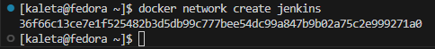
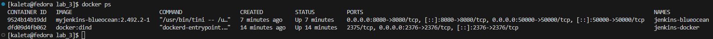
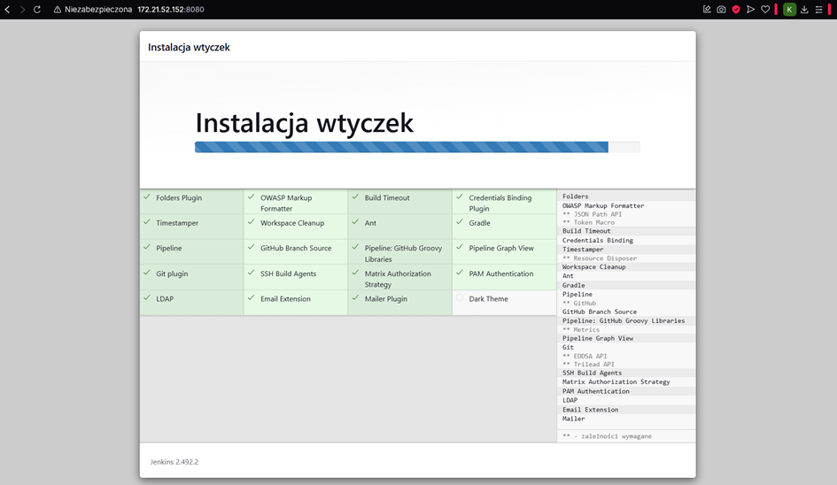

# Sprawozdanie 2

Krzysztof Kaletra IO


## Zajęcia 5


### 1. Utwórz instancję Jenkins


   W pierwszym kroku stworzyłem sieć jenkins:
   ```bash
   docker network create jenkins
   ```

   

   Następnie uruchomiłem komendę: 
   ```bash
   docker run --name jenkins-docker --rm --detach \
   --privileged --network jenkins --network-alias docker \
   --env DOCKER_TLS_CERTDIR=/certs \
   --volume jenkins-docker-certs:/certs/client \
   --volume jenkins-data:/var/jenkins_home \
   --publish 2376:2376 \
   docker:dind --storage-driver overlay2
   ```
   

Dzieki temu docker może działać w systemie docker in docker (dind)

   Użyłem pliku Dockerfile ze strony jenkins:
   ```docker
   FROM jenkins/jenkins:2.492.2-jdk17
   USER root
   RUN apt-get update && apt-get install -y lsb-release ca-certificates curl && \
      install -m 0755 -d /etc/apt/keyrings && \
      curl -fsSL https://download.docker.com/linux/debian/gpg -o /etc/apt/keyrings/docker.asc && \
      chmod a+r /etc/apt/keyrings/docker.asc && \
      echo "deb [arch=$(dpkg --print-architecture) signed-by=/etc/apt/keyrings/docker.asc] \
      https://download.docker.com/linux/debian $(. /etc/os-release && echo \"$VERSION_CODENAME\") stable" \
      | tee /etc/apt/sources.list.d/docker.list > /dev/null && \
      apt-get update && apt-get install -y docker-ce-cli && \
      apt-get clean && rm -rf /var/lib/apt/lists/*
   USER jenkins
   RUN jenkins-plugin-cli --plugins "blueocean docker-workflow"
   ```
   Następnie zbudowałem obraz na jegop podstawie:
    

   Uruchomiłem stworzony obraz jako kontener używając komendy:
   ```bash
   docker run --name jenkins-blueocean --restart=on-failure --detach \
   --network jenkins --env DOCKER_HOST=tcp://docker:2376 \
   --env DOCKER_CERT_PATH=/certs/client --env DOCKER_TLS_VERIFY=1 \
   --publish 8080:8080 --publish 50000:50000 \
   --volume jenkins-data:/var/jenkins_home \
   --volume jenkins-docker-certs:/certs/client:ro \
   myjenkins-blueocean:2.492.2-1
   ```

   

   Ekran logowania: 

   

   Po uruchomieniu docker ps widoczne są dwa uruchomione kontenery:

   

W kolejnym kroku skonfigurowałem konto:


Oraz zainstalowałem wtyczki:



### 2. Zadanie wstępne: uruchomienie

Aby sprawdzić poprawność instalacji uruchomiłem uname oraz sprawdziłem czy docker działa poprawnie:


Wszystkie operacje zakończyły się sukcesem, co świadczy o poprawnej instalacji Jenkinsa i środowiska dind:


Stworzyłem także projekt który zwracał błąd jeśli godzina jest nieparzysta 

```bash
HOUR=$(date +"%H")
if [ $((HOUR % 2)) -ne 0 ]; then
    echo "Godzina $HOUR jest nieparzysta"
    exit 1
else
    echo "Godzina $HOUR jest parzysta"
fi
```
Projekt działa poprawnie: 


### 3. Zadanie wstępne: obiekt typu pipeline

Stworzyłem nowy obiekt typu pipeline, który kopiuje repozytorium przedmiotu, przechodzi na moją gałąź, a następnie buduje obrazy z poprzednich zajęć.

```bash
pipeline {
    agent any

    stages {
        stage('Klonowanie repozytorium') {
            steps {
                git branch: 'KK416030', url: 'https://github.com/InzynieriaOprogramowaniaAGH/MDO2025_INO.git'
            }
        }

        stage('Budowanie Dockera') {
            steps {
                sh 'docker build -t moj-obraz-builder -f INO/GCL01/KK416030/sprawozdanie_1/Dockerfile.nodebld .'
            }
        }
    }

    post {
        success {
            echo 'Pipeline wykonany pomyślnie'
        }
        failure {
            echo 'Pipeline nieudany'
        }
    }
}
```

Pipeline uruchomiłem kilkukrotnie, obserwując znaczne różnice w szybkości wykonania - pierwsze uruchomienie zajęło ponad 5 minut:


Z kolei kolejne zajęło już 3 sekundy:


Różnice w czasach wykonania pipeline’u wynikają z kilku czynników.
Jednym z nich jest sposób aktualizacji kodu z repozytorium. Jenkins nie wykonywał pełnej operacji git clone, lecz ograniczał się do git fetch, co pozwalało na pobranie jedynie nowych zmian w repozytorium bez ponownego kopiowania wszystkich danych. Dzięki temu proces aktualizacji kodu był szybszy i mniej obciążający dla sieci.

Kolejnym źródłem optymalizacji było wykorzystanie mechanizmu cache w budowie obrazów Dockerowych. Podczas budowania obrazów, Docker rozpoznawał, że wiele warstw nie uległo zmianie w stosunku do poprzedniego procesu budowy, dlatego zamiast budować je ponownie, używał wcześniej zapisanych wyników (CACHED). Efekt ten jest widoczny w logach konsoli, gdzie wiele etapów budowy zostało pominiętych dzięki wykorzystaniu pamięci podręcznej, co znacząco przyspieszyło całość procesu.


### 4. Diagram UML


Opis diagramu:
- Clone — Klonowanie repozytorium z Git, z odpowiedniego brancha

- Build — Budowanie obrazu aplikacji

- Test — Budowanie i uruchamianie testów (local-node-ci-app-test)

- Condition — Sprawdzenie wyniku testów: jeśli FAILED -> koniec, jeśli PASSED -> idziemy dalej

- Deploy — Budowanie finalnego obrazu, wystawienie aplikacji (raporty z testów)

- Publish — Publikowanie artefaktów testowych (reports/coverage) jako wynik pipeline, dostępny do pobrania w Jenkinsie

### 5. Kompletny pipeline

1. Wybór projektu i zmiany
    W ramach zadania wybrałem projekt dostępny na GitHub:
    quick-example-of-testing-in-nodejs autorstwa Lissy93.

    Projekt jest prostą aplikacją Node.js, pokazującą przykład testowania kodu JavaScript.
    Repozytorium posiadało licencję MIT, co pozwalało na swobodne wykorzystanie kodu zgodnie z wymaganiami kursu.

    Dostosowania: Aby aplikacja mogła zostać poprawnie zbudowana w procesie CI, konieczne było dokonanie jednej zmiany w kodzie.
    W pliku package.json oryginalny wpis dotyczący paczki command-line-args zawierał niepoprawną wersję.
    Aby uniknąć błędów instalacji (npm install), podczas procesu budowania obrazu dodałem komendę:

    ```bash
    RUN sed -i 's/"command-line-args": "[^"]*"/"command-line-args": "1.0.0"/' package.json
    ```

    Dzięki temu wersja paczki została zmieniona na stabilną (1.0.0), co umożliwiło poprawne pobranie zależności.


2. Organizacja plików

    W moim repozytorium, na swojej gałęzi w folderze sprawozdanie_2 umieściłem wszystkie wymagane pliki:

    Dockerfile.build — budowanie aplikacji Node.js.

    Dockerfile.test — uruchamianie testów jednostkowych i pokrycia kodu.

    Dockerfile.deploy — przygotowanie kontenera serwującego wyniki testów.

    Jenkinsfile — definicja kompletnego pipeline’u CI/CD.


3. Opis pipeline'u
    Pipeline został zdefiniowany jako projekt typu Pipeline from SCM (automatyczne klonowanie repozytorium)

Jenkinsfile:

```bash
    pipeline {
        agent any

        environment {
            IMAGE_NAME = "local-node-ci-app"
            VERSION = "1.0.${BUILD_NUMBER}"
            DOCKER_NETWORK = "jenkins"
            DOCKERFILES_DIR = "INO/GCL01/KK416030/sprawozdanie_2"
        }

        stages {
            stage('Klonowanie repozytorium') {
                steps {
                    git branch: 'KK416030', url: 'https://github.com/InzynieriaOprogramowaniaAGH/MDO2025_INO.git'
                }
            }

            stage('Przygotowanie sieci Docker') {
                steps {
                    script {
                        sh "docker network ls | grep -w ${DOCKER_NETWORK} || docker network create ${DOCKER_NETWORK}"
                    }
                }
            }

            stage('Build') {
                steps {
                    script {
                        docker.build("${IMAGE_NAME}-build", "-f ${DOCKERFILES_DIR}/Dockerfile.build .")
                    }
                }
            }

            stage('Test') {
                steps {
                    script {
                        docker.build("${IMAGE_NAME}-test", "-f ${DOCKERFILES_DIR}/Dockerfile.test .")
                        sh """
                            docker run --name test-runner ${IMAGE_NAME}-test || true
                            docker cp test-runner:/app/reports ./reports
                            docker rm test-runner
                        """
                    }
                }
            }

            stage('Deploy') {
                steps {
                    script {
                        docker.build("${IMAGE_NAME}:${VERSION}", "-f ${DOCKERFILES_DIR}/Dockerfile.deploy .")
                    }
                }
            }

            stage('Website Test') {
                steps {
                    script {
                        sh """
                            docker rm -f website-test || true
                            docker run -d --rm --network ${DOCKER_NETWORK} --name website-test ${IMAGE_NAME}:${VERSION}
                            sleep 5
                            docker run --rm --network ${DOCKER_NETWORK} curlimages/curl:latest http://website-test:8000
                        """
                    }
                }
            }
            stage('Publish') {
                steps {
                    script {
                        sh 'mkdir -p artifacts'
                        sh 'cp -r reports/* artifacts/'
                        archiveArtifacts artifacts: 'artifacts/**'
                    }
                }
            }

        }

        post {
            always {
                echo "Sprzątanie kontenera testowego..."
                sh "docker rm -f website-test || true"
            }
        }
    }
```

Kolejne etapy procesu:

**Clone**
Pipeline klonuje repozytorium GitHub, branch KK416030

Repozytorium zawiera wszystkie potrzebne pliki Dockerfile

**Przygotowanie sieci Docker**

Ponieważ pipeline działa w trybie (DIND), konieczne jest zapewnienie komunikacji między kontenerami Jenkinsa i aplikacji
W tym celu pipeline sprawdza czy sieć już istnieje, jeśli nie to ją tworzy
Dzięki temu uruchamiane kontenery mogą komunikować się między sobą po nazwie, co umożliwia testy za pomocą curl

**Build**
Budowany jest obraz local-node-ci-app-build przy użyciu Dockerfile.build

```Dockerfile
    FROM node:10

    WORKDIR /app

    RUN git clone https://github.com/Lissy93/quick-example-of-testing-in-nodejs.git .

    RUN sed -i 's/"command-line-args": "[^"]*"/"command-line-args": "1.0.0"/' package.json

    RUN npm install

```

Podczas budowania wykonywany jest git clone aplikacji quick-example-of-testing-in-nodejs

Instalowane są zależności (npm install)

Naprawiana jest wersja paczki command-line-args

Obraz oparty jest na konkretnym tagu Node.js (node:10), wersja ta jest odpowiednia dla wybranego przezemnie nieco przestarzałego programu. Podczas normalnego pobierania zależności pobierana była najnowsza wersja command line args, w wyniku czego program nie działał. Aby naprawić to dokonuje z poziomu pliku Dockerfile zmiany w pobranym repozytorium, zmieniając pobieraną wersje zależności z najnowszej dostępnej na kompatybilną z programem, w tym wypadku wersję 1.0.0

**Test**

Budowany jest obraz local-node-ci-app-test przy użyciu Dockerfile.test

```dockerfile
    FROM local-node-ci-app-build

    WORKDIR /app

    RUN npm run cover
    RUN npm test

```

W kontenerze uruchamiane są:

npm run cover — generowanie raportu pokrycia kodu

npm test — wykonanie testów jednostkowych

Wyniki testów (raporty coverage) są kopiowane do katalogu reports

Testy są widoczne w konsoli Jenkins i umożliwiają analizę błędów w przypadku niepowodzenia

**Condition**

Jeśli testy zakończą się błędem (kod wyjścia ≠ 0), pipeline zostaje zatrzymany

Jeśli testy przejdą poprawnie, pipeline przechodzi dalej do etapu Deploy

**Deploy**

Budowany jest obraz deployowy local-node-ci-app:${VERSION} przy użyciu Dockerfile.deploy

```dockerfile
    FROM node:10

    WORKDIR /app

    COPY reports /app/reports

    RUN npm install -g http-server@0.12.3

    EXPOSE 8000

    CMD ["http-server", "reports/coverage/lcov-report", "-p", "8000"]

```

Kopiowany jest tylko katalog reports/ zawierający wyniki testów

Obraz uruchamia prosty serwer HTTP (http-server) na porcie 8000, serwujący raport pokrycia kodu (index.html)

**Website Test (Smoke Test)**

Pipeline uruchamia kontener deployowy i wykonuje sprawdzenie poprawności działania serwera HTTP poprzez zapytanie curl na adres http://website-test:8000 wewnątrz sieci Docker.

Jeśli odpowiedź HTTP jest prawidłowa pipeline kontynuuje

**Publish**

W ramach tego projektu CI/CD zdecydowałem się na publikację raportu z pokrycia kodu (coverage) jako artefaktu pipeline'u.
Wynika to z faktu, że projekt quick-example-of-testing-in-nodejs ma charakter demonstracyjno-testowy, głównym rezultatem nie jest aplikacja użytkowa, lecz wyniki testów jakościowych.
Dlatego najistotniejszym artefaktem jest zbiór raportów testowych, które pozwalają na analizę pokrycia kodu i jakości testów w kolejnych wersjach builda.
Raporty testowe reports/ są kopiowane do katalogu artifacts/

Pliki te są załączane jako artefakty w Jenkinsie, dostępne do pobrania po zakończeniu buildu, dzięki czemu użytkownik może pobrać ZIP-a z wynikami testów i przeanalizować raport pokrycia kodu

**Sprzątanie kontenerów po pipeline**

W celu zachowania czystości środowiska, po każdym wykonaniu pipelinu usuwane są tymczasowe kontenery (website-test, test-runner)
Sprzątanie odbywa się zawsze, dzięki czemu nawet w przypadku błędu lub przerwania builda środowisko nie zostaje zanieczyszczone zbędnymi kontenerami Dockera

Poprawnie działający pipeline:


Widoczne są stworzone artefakty:


Pobrane pliki załączyłem do sprawozdania pod nazwą archive (3).zip

### 6. DIND, DOoD

W ramach realizacji projektu wybrałem konfigurację opartą o Docker-in-Docker (DIND). Jenkins został uruchomiony jako kontener (jenkins-blueocean), natomiast demon Dockera (dockerd) działał w osobnym kontenerze (docker:dind). Komunikacja pomiędzy kontenerami została zapewniona poprzez sieć Docker.

Kontener docker:dind został uruchomiony z flagą --privileged, co jest wymagane, ponieważ dockerd wymaga dostępu do funkcji kernela systemu, których nie udostępnia zwykłe środowisko kontenera. Jenkins posiadał odpowiednie pluginy, umożliwiające komunikację z zewnętrznym demonem Dockera poprzez TCP.

Dzięki takiemu podejściu pipeline mógł wykonywać operacje docker build, docker run i docker push w pełni niezależnie od hosta, zapewniając izolację środowiska budowania.

Alternatywnym rozwiązaniem byłoby zastosowanie podejścia Docker-Outside-of-Docker (DOoD), polegającego na bezpośrednim udostępnieniu socketu hosta (/var/run/docker.sock) do kontenera Jenkinsa. W tej konfiguracji Jenkins korzystałby bezpośrednio z Dockera zainstalowanego na maszynie fizycznej.

Rozwiązanie DOoD jest prostsze do skonfigurowania - nie wymaga dodatkowego kontenera DIND ani uruchamiania kontenera z uprawnieniami --privileged. Jednak niesie wady: Jenkins zyskuje bezpośredni dostęp do Dockera hosta, co może stanowić zagrożenie bezpieczeństwa. Ponadto środowisko pipeline'u traci izolację i jego przenośność staje się zależna od konfiguracji maszyny hosta.

W ramach tego projektu zdecydowałem się na wykorzystanie Docker-in-Docker (DIND) jako rozwiązania bardziej bezpiecznego i przenośnego. Dzięki temu cały proces CI/CD odbywa się w odizolowanym środowisku, wewnątrz infrastruktury kontenerowej. Pipeline jest niezależny od konfiguracji systemu hosta, co umożliwia łatwe odtworzenie procesu na innych maszynach. Wybrane podejście zwiększa również bezpieczeństwo, eliminując ryzyko przypadkowych ingerencji w kontenery lub zasoby działające bezpośrednio na hoście.
