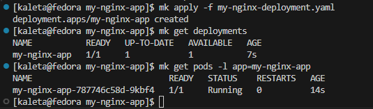
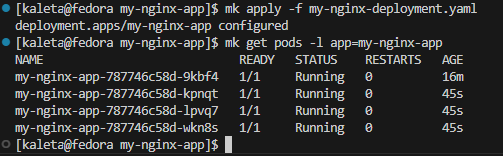

Sprawozdanie 
Krzysztof Kaleta
416030

# Automatyzacja i zdalne wykonywanie poleceń za pomocą Ansible
Stworzyłem nową maszynę wirtualną o nazwie ansible-target. Zastosowałem ten sam system, operacyjny co an głównej maszynie - Fedora. Upewniłem się o obecności programu tar i serwera OpenSSH przy użyciu komendy:

```bash
sudo dnf install tar sshd
```

Stworzyłem użytkownika ansible, co potwierdzam zalogowaniem na jego konto:


Ustaliłem nazwę komputera stosując hostnamectl:
```bash
sudo hostnamectl set-hostname ansible-target
```

Wykonałem równiez migawkę bieżącego stanu maszyny, aby móc do niego w łatwy sposób powrócić

Na głównej maszynie zainstalowałem oprogramowanie Ansible przy pomocy polecenia

```bash
sudo dnf install ansible
```


Wymieniłem klucze SSH przy pomocy polecenia:

```bash
ssh-copy-id ansible@ansible-target
```


Dzięki wymienieniu kluczy SSH logowanie zostało zautomatyzowane, i po wpisaniu 

```bash
ssh ansible@ansible-target
```

Logowanie przechodzi automatycznie bez konieczności wpisywania hasła


Stworzyłem plik inventory.ini:
```bash
[Orchestrators]
fedora ansible_user=kaleta

[Endpoints]
ansible-target ansible_user=ansible
```
I umieściłem go w folderze inventory

Ansible ping na konkretną maszynę działa poprawnie:


Działa też ping pliku inwentaryzacyjnego:


Playbook:

Wykonałem playbooka Ansible, którego celem było zarządzanie zdalnymi maszynami w środowisku testowym. Na początku wysłałem żądanie ping do wszystkich hostów, aby upewnić się, że są dostępne. 
Następnie skopiowałem plik inwentaryzacji na maszyny z grupy Endpoints. Po skopiowaniu pliku ponowiłem pingowanie w celu porównania stanu pośredniego

Dalsze kroki obejmowały aktualizację wszystkich pakietów systemowych na maszynach końcowych oraz restart kluczowych usług: sshd (demon SSH) i rngd (usługa generatora liczb losowych). Playbook został tak przygotowany, aby wykonać te operacje z użyciem uprawnień administratora (sudo)

Aby uniknąć podawania hasła przy każdej operacji wymagającej sudo, skonfigurowałem na maszynach końcowych możliwość wykonywania poleceń administracyjnych bez hasła. W tym celu, jako użytkownik root, utworzyłem plik /etc/sudoers.d/ansible i dodałem do niego wpis:

```bash
ansible ALL=(ALL) NOPASSWD: ALL 
```
Dzięki temu użytkownik ansible, używany przez Ansible do łączenia się z maszynami, miał pełne uprawnienia administracyjne bez potrzeby interakcji


Wynik playbooka:


W ostatnim etapie testów celowo wyłączyłem usługę SSH na maszynie ansible-target, co uniemożliwiło Ansible nawiązanie połączenia z tym hostem:

```bash
sudo systemctl stop sshd
```
W wyniku tego playbook oznaczył maszynę jako UNREACHABLE, a wszystkie przypisane do niej zadania zostały pominięte. Operacje na drugim hoście (fedora) przebiegły bez zakłóceń
Test ten potwierdził, że brak dostępu przez SSH skutecznie blokuje wykonanie zadań w Ansible i jest poprawnie obsługiwany jako błąd połączenia


 Zarządzenie atefaktami za pomocą Ansible

 Ze względu na to, że w poprzednim zadaniu nie do końca poprawnie zrealizowałem pipeline Jenkinsa (artefakt nie był klasycznym kontenerem ani plikiem binarnym), musiałem dostosować rozwiązanie w tym etapie zgodnie z wytycznymi prowadzącego
 W moim przypadku artefaktem była strona HTML generowana przez testy pokrycia kodu (lcov-report), dlatego zdecydowałem się na opublikowanie tego raportu za pomocą kontenera nginx, którego uruchamiam zdalnie przy użyciu Ansible

Stworzyłem rolę Ansible za pomocą komendy:

```bash
ansible-galaxy init html_report
```
W pliku html_report/tasks/main.yml umieściłem playbook, który:

1. Instaluje Dockera oraz curl na zdalnej maszynie z Fedorą
2. Uruchamia usługę Docker i ustawia ją jako startującą automatycznie
3. Kopiuje wygenerowany raport (lcov-report) do katalogu /srv/report/ na zdalnej maszynie
4. Uruchamia kontener nginx:alpine, który mapuje port 8888 na 80 oraz montuje katalog /srv/report jako katalog publiczny NGINX
5. Sprawdza, czy strona raportu działa (czyli czy dostępny jest plik index.html) — jeśli tak, wyświetla jego pierwsze 500 znaków
6. Na końcu kontener jest zatrzymywany i usuwany, aby nie pozostawał aktywny po wykonaniu testu


Plik main.yml:
```yml
---
- name: Zainstaluj Docker i curl (tylko na Fedorze)
  dnf:
    name:
      - docker
      - curl
    state: present
    update_cache: yes

- name: Włącz i uruchom usługę Docker
  service:
    name: docker
    state: started
    enabled: yes

- name: Skopiuj cały raport HTML (lcov-report) na maszynę zdalną
  copy:
    src: lcov-report/
    dest: /srv/report/
    mode: '0755'


- name: Uruchom kontener NGINX serwujący raport
  docker_container:
    name: html-server
    image: nginx:alpine
    state: started
    ports:
      - "8888:80"
    volumes:
      - /srv/report:/usr/share/nginx/html
    restart_policy: unless-stopped

- name: Sprawdź, czy raport działa (HTTP 200)
  uri:
    url: http://localhost:8888/index.html
    status_code: 200
    return_content: yes
  register: html_response

- name: Wyświetl fragment zawartości raportu
  debug:
    msg: "{{ html_response.content[:500] }}"

- name: Usuń kontener po sprawdzeniu
  docker_container:
    name: html-server
    state: absent
    force_kill: true
```

Całość uruchomiłem za pomocą komendy:
```bash
ansible-playbook -i inventory.ini playbook.yml
```


Struktura katalogów:


Plik playbook.yml

Plik playbook.yml to główny plik wykonywalny Ansible, który uruchamia zadania zdefiniowane w danej roli. To właśnie ten plik przekazuję do komendy ansible-playbook, aby rozpocząć cały proces automatyzacji


W moim przypadku playbook.yml:
- określa, że zadania mają być wykonane na grupie hostów Endpoints (zgodnie z inventory.ini)
- ustawia, że działania wymagają uprawnień administratora (become: true)
- uruchamia rolę html_report, w której znajduje się faktyczna logika wykonania zadań (tasks/main.yml)

```yaml
- name: Deploy HTML report in a container
  hosts: Endpoints
  become: true

  roles:
    - html_report
```

Cały proces zakończył się sukcesem — raport HTML został poprawnie uruchomiony w kontenerze NGINX i był dostępny pod adresem http://localhost:8888/index.html na maszynie zdalnej


# Pliki odpowiedzi dla wdrożeń nienadzorowanych

Aby pobrać plik konfiguracyjny z zainstalowanego już systemu można użyć polecenia:

```bash
sudo cat /root/anaconda-ks.cfg
```
Wynik: 


Wynik ten w następnym kroku zapisałem do pliku, używając następnie przy instalacji systemu dodatkowej linii, która pobierała z githuba zacommitowany wcześniej plik anaconda-ks.cfg:

```bash
inst.ks=https://raw.githubusercontent.com/InzynieriaOprogramowaniaAGH/MDO2025_INO/refs/heads/KK416030/INO/GCL01/KK416030/sprawozdanie_3/anaconda-ks.cfg
```
Plik ten zosatł zmodyfikowany względem oryginalnego o 2 linie:
```clearpart --all --initlabel``` w celu wyczyszczenia partycji przed instalacją, 
Oraz ```reboot``` na końcu pliku w celu automatycznego ponownego uruchomienia systemu po instalacji.

W ramach zadania utworzyłem także nienadzorowane źródło instalacji systemu Fedora, które nie tylko instaluje system operacyjny, ale też po uruchomieniu od razu hostuje wygenerowany wcześniej artefakt - raport pokrycia testowego w postaci strony HTML, uruchamiany w kontenerze nginx

Pobrany z ```/root/anaconda-ks.cfg``` plik odpowiedzi został zmodyfikowany i wrzucony do repozytorium kierunkowego GitHub pod nazwą ```anaconda-ks.cfg``` 
Podczas uruchamiania instalatora podałem jego adres w parametrze:
```bash
inst.ks=https://raw.githubusercontent.com/InzynieriaOprogramowaniaAGH/MDO2025_INO/refs/heads/KK416030/INO/GCL01/KK416030/sprawozdanie_3/anaconda-ks-2.cfg
```
Plik ten zawiera rozszerzoną sekcję %packages, która instaluje:
- docker
- curl
- unzip

oraz rozbudowaną sekcję %post, której zadaniem jest:

- pobranie artefaktu z GitHuba (w postaci pliku .zip),
- rozpakowanie go,
- skopiowanie raportu HTML do katalogu /srv/report,
- ustawienie uprawnień i kontekstu SELinux, dzięki czemu pliki będą dostępne z kontenera,
- utworzenie i aktywacja usługi systemd, która uruchamia kontener nginx z serwowanym raportem.

Plik anaconda-ks-2.cfg:

```bash
# Generated by Anaconda 41.35
# Generated by pykickstart v3.58
#version=DEVEL

keyboard --vckeymap=pl --xlayouts='pl'
lang pl_PL.UTF-8
timezone Europe/Warsaw --utc

rootpw --iscrypted --allow-ssh $y$j9T$0BSruj//SiUG3IsrLZxhAm6u$bcoBHKVd0cSAq1gvcCAZZqj0X5X0axUbdk4vfU7Ua91
user --groups=wheel --name=kaleta --password=root --plaintext --gecos="kaleta"

firstboot --enable

ignoredisk --only-use=sda
clearpart --all --initlabel
autopart

%packages
@^custom-environment
docker
curl
unzip
%end

%post --log=/root/post-install.log

systemctl enable docker

mkdir -p /srv/report

curl -L "https://github.com/InzynieriaOprogramowaniaAGH/MDO2025_INO/raw/refs/heads/KK416030/INO/GCL01/KK416030/sprawozdanie_2/archive%20(3).zip" -o /root/report.zip

dnf install -y unzip

unzip /root/report.zip -d /root/extracted

cp -r /root/extracted/archive/artifacts/coverage/lcov-report/* /srv/report/

chmod -R a+r /srv/report
chmod -R a+X /srv/report

chcon -Rt svirt_sandbox_file_t /srv/report

cat <<EOF > /etc/systemd/system/html-report.service
[Unit]
Description=Serwer raportu HTML (nginx w Dockerze)
Requires=docker.service
After=docker.service

[Service]
Restart=always
ExecStart=/usr/bin/docker run --rm --name html-server -p 8888:80 -v /srv/report:/usr/share/nginx/html:ro nginx:alpine
ExecStop=/usr/bin/docker stop html-server

[Install]
WantedBy=multi-user.target
EOF

systemctl enable html-report.service

%end


reboot
```

Pobrany artefakt .zip zawiera katalog lcov-report, który zawiera plik index.html oraz wszystkie potrzebne style i skrypty JS
Po rozpakowaniu, pliki są kopiowane do /srv/report, a katalog ten jest montowany w kontenerze nginx

Aby umożliwić dostęp nginxowi (wewnątrz kontenera Docker), dodałem w %post:
```bash
chmod -R a+r /srv/report
chmod -R a+X /srv/report
chcon -Rt svirt_sandbox_file_t /srv/report
```
Dzięki temu uniknąłem błędów 403 Forbidden, które występowały przy domyślnych uprawnieniach i polityce SELinux

Utworzona została także usługa systemd /etc/systemd/system/html-report.service o treści:

```ini
[Unit]
Description=Serwer raportu HTML (nginx w Dockerze)
Requires=docker.service
After=docker.service

[Service]
Restart=always
ExecStart=/usr/bin/docker run --rm --name html-server -p 8888:80 -v /srv/report:/usr/share/nginx/html:ro nginx:alpine
ExecStop=/usr/bin/docker stop html-server

[Install]
WantedBy=multi-user.target
```
Usługa ta została włączona przy pomocy systemctl enable, dzięki czemu uruchamia się automatycznie przy każdym starcie systemu


Po zakończeniu instalacji i restarcie, system automatycznie:

- uruchomił usługę Docker
- uruchomił kontener nginx
- wystawił serwis na porcie 8888

Poniżej wynik działania polecenia docker ps, pokazujący aktywny kontener:


Oraz wynik curl http://localhost:8888/index.html, który potwierdza poprawną serwowaną zawartość raportu HTML:


Dzięki odpowiednio zmodyfikowanemu plikowi kickstart, zrealizowałem pełną automatyzację:

- instalacji systemu operacyjnego Fedora,
- konfiguracji użytkownika i systemu,
- pobrania i wdrożenia artefaktu,
- oraz jego uruchomienia w kontenerze po starcie systemu.

Takie podejście znacząco skraca czas potrzebny na uruchamianie środowiska testowego i doskonale nadaje się do automatycznych wdrożeń

# Wdrażanie na zarządzalne kontenery: Kubernetes

W pierwszym kroku zainstalowałem Minikuba. Zrobiłem to pobierając binarke i wykorzystując komendy:

```bash
curl -LO https://storage.googleapis.com/minikube/releases/latest/minikube-linux-amd64
sudo install minikube-linux-amd64 /usr/local/bin/minikube
rm minikube-linux-amd64 
```
Następnie sprawdziłem instalacje: 


Dla wygody ustawiłem alias dla minikube kubectl:

```bash
echo "alias mk='minikube kubectl --'" >> ~/.bashrc
source ~/.bashrc
```

Uruchomienie Kubernetesa w kontenerze (przez sterownik Docker dla Minikube) zapewnia izolację od systemu hosta. Komponenty klastra działają w dedykowanym środowisku.
Minikube jest zaprojektowany do działania lokalnego i nie wymaga nadmiernych uprawnień systemowych do podstawowego funkcjonowania (poza tymi wymaganymi przez sterownik, np. Docker)

Minikube dostarcza własną, kompatybilną wersję kubectl. Użycie minikube kubectl -- (czyli w moim wypadku aliasu mk) zapewnia, że komunikujemy się z klastrem Minikube, a nie z innym potencjalnie skonfigurowanym klastrem Kubernetes


Uruchomiłem Minikube używając sterownika Docker:


Zweryfikowałem też status klastra:


Zgodnie z oficjalną dokumentacją Minikube, minimalne wymagania to 2 CPU, 2GB pamięci RAM i 20GB wolnego miejsca na dysku.

W moim przypadku przypisana pamięć ram to 8GB

Po uruchomieniu ``` minikube dahbord ``` i przejściu na stronę wyświetloną w terminalu otrzymałem manu kubernetesa:

Wydruk konsoli:


Widok w przeglądarce:


Koncepcje funkcji wprowadzonych przez Kubernetes:

- Pod: Najmniejsza, podstawowa jednostka wdrażalna w Kubernetes. Reprezentuje pojedynczą instancję działającego procesu w klastrze. Pod może zawierać jeden lub więcej kontenerów (np. Docker), które współdzielą zasoby sieciowe i pamięci masowej

- Deployment: Obiekt wyższego poziomu, który zarządza replikowanymi aplikacjami. Opisuje pożądany stan dla Twojej aplikacji, a Deployment Controller zmienia stan aktualny na stan pożądany w kontrolowany sposób. Pozwala na łatwe aktualizacje (rolling updates), wycofywanie zmian (rollbacks) i skalowanie liczby Podów

- Service: Abstrakcyjny sposób na wystawienie aplikacji działającej na zbiorze Podów jako usługi sieciowej. Service dostarcza stały adres IP i port, przez który można uzyskać dostęp do Podów (które mogą się zmieniać dynamicznie)

Na potrzeby zadania zdecydowałem sie na wykorzystanie prostej strony internetowej w nginx

Stworzyłem więc prostą stronę:

```html
<!DOCTYPE html>
<html>
    <head>
        <title>Witaj w Nginx na K8s!</title>
    </head>
    
    <body>
        <h1>Ta strona jest serwowana przez kontener Nginx uruchomiony w Minikube</h1>
    </body>
</html>
```

Oraz plik Dockerfile uruchamiający tą stronę używając kontenera nginx:

```dockerfile
FROM nginx:alpine
COPY index.html /usr/share/nginx/html/index.html
EXPOSE 80
```
Bo zbudowaniu i uruchomieniu kontenera lokalnie sprawdziłem jego działanie poleceniem curl:


Minikube uruchamia Dockera wewnątrz swojego kontenera lub VM. Z tego powodu aby Kubernetes mógł użyć mojego lokalnie zbudowanego obrazu, musiałem go załadować do środowiska Docker Minikube

```bash
 mk run my-nginx-app --image=my-custom-nginx:latest --port=80 --labels app=my-nginx-app --image-pull-policy=Never
 ```

Ze względu na problem, polegający na tym że Kubernetes próbował pobrać obraz z internetu zamiast użyć lokalnego musiałem wykorzystać parametr ```--image-pull-policy=Never```


Pod pojawił sie równiez w dashbordzie:


Przekierowałem porty:


Oraz wyświetliłem stronę w przeglądarce wykorzystując zakładkę ```PORTS``` w VS Code:


Aby czytelneij pracować z Deploymentem postanowiłem usunąć dotychczas działającego poda:


Stworzyłem plik my-nginx-deployment.yaml:

```yaml
apiVersion: apps/v1
kind: Deployment
metadata:
  name: my-nginx-app
  labels:
    app: my-nginx-app 
spec:
  replicas: 1 
  selector:
    matchLabels:
      app: my-nginx-app 
  template: 
    metadata:
      labels:
        app: my-nginx-app 
    spec:
      containers:
      - name: nginx-container 
        image: my-custom-nginx:latest 
        ports:
        - containerPort: 80 
        imagePullPolicy: Never 
```

Zastosowałem ten plik aby stworzyć Deployment i sprawdziłem czy zarówno Deployment jak i Pod zostały stworzone:



Widok Dashbord:


Zmeiniłem liczbę podów w pliku konfiguracyjnym w linii ```replicas``` na 4 i po zapisaniu pliku uruchomiłem:



Widok Dashboard:


Sprawdziłem też status rolloutu:


Przekierowałem też porty z deploymentu:


Zadziałało to poprawnie:


# Wdrażanie na zarządzalne kontenery: Kubernetes (2)

Zbudowałem obraz w wersji v2 i załadowałem do minikuba:


Rozpocząłem od wdrożenia bazowej wersji aplikacji (v1.0) z jedną repliką. Zaktualizowałem plik my-nginx-deployment.yaml, ustawiając image na my-custom-nginx:v1.0 oraz spec.replicas na 1. Następnie wdrożyłem zmiany poleceniem my-nginx-deployment.yaml. Sprawdziłem status podów i deploymentu:


Zmieniłem liczbę podów na 8:


A następnie na kolejno 1 i 0:


Ustawienei liczby replik na 0 spowodowało usunięcie wszystkich podów powiązanych z deploymentem
Po zmianie liczby replik z 0 na 4 utworzyły się 4 pody:


Widok w dashboardzie:


Zastsosowałem zmiany przy użyciu komendy ```apply```


Po zmianie wersji obrazu na v2.0 w pliku .yaml i zastosowaniu konfiguracji, Kubernetes rozpoczął proces aktualizacji zasobu Deployment
W ramach tzw. rolling update zaczął stopniowo tworzyć nowe pody z nową wersją obrazu, jednocześnie usuwając stare. Nowe pody początkowo pojawiły się w stanie Pending, następnie przeszły do ContainerCreating, a po uruchomieniu osiągnęły stan Running 
W tym samym czasie stare pody przechodziły przez stan Terminating, a po zakończeniu działania zmieniały status na Completed 
Dzięki temu mechanizmowi aplikacja była cały czas dostępna, a aktualizacja odbyła się bez przestoju. Cały proces był na bieżąco widoczny dzięki użyciu komendy 

```bash
mk get pods -w
```
która pozwala obserwować zmiany na żywo.

Podobny efekt zaobserwowałem przy powrocie do poprzedniej wersji:


Po wdrożeniu Deploymentu z błędnym obrazem, Kubernetes rozpoczął standardowy proces aktualizacji, czyli próbę zastąpienia starych podów nowymi
Początkowo widać było, że nowe pody pojawiają się w stanie Pending, co oznaczało oczekiwanie na przydział zasobów. Następnie przeszły do etapu ContainerCreating, gdzie próbowały pobrać i uruchomić kontener na podstawie wskazanego obrazu. Jednak z powodu błędu, kontenery nie mogły się poprawnie uruchomić i wpadały w stan Error, a następnie CrashLoopBackOff
Ten ostatni oznacza, że Kubernetes próbuje je uruchamiać ponownie w zapętlonym cyklu z coraz dłuższymi przerwami, ponieważ kontener startuje i natychmiast się wyłącza
Istotne jest to, że starsze, działające pody nie zostały usunięte – Kubernetes wstrzymał aktualizację, aby nie dopuścić do przerwy w działaniu aplikacji. Dzięki temu mechanizmowi aplikacja pozostaje dostępna mimo błędu w nowej wersji obrazu

Dockerfil.error:

```Dockerfile
FROM nginx:alpine
CMD ["false"]
```


Widok w Dashboardzie:


Dzięki poleceniu

```bash
mk describe pod my-nginx-app-778c77dccc-4pxwn
```
Otrzymałem dostęp do logów poda: 


Sprawdziłem historię wdrożenia:
```bash
mk rollout history deployment my-nginx-app
```


W kolejnym kroku wykorzystując rollback powróciłem do ostatniej działającej wersji programu:


Widok Dahboardu:


Dzięki opcji ```--revision``` odczytałem więcej oinformacji na temat konkretnych rewizji:


Napisałem skrypt `check_rollout.sh` sprawdzający czy czy wdrożenie zdążyło się wdrożyć w 60s:

```bash
#!/bin/bash
DEPLOYMENT_NAME="my-nginx-app"
TIMEOUT_SECONDS=60

echo "Sprawdzanie statusu wdrożenia $DEPLOYMENT_NAME..."
if mk rollout status deployment/$DEPLOYMENT_NAME --timeout=${TIMEOUT_SECONDS}s; then
  echo "Wdrożenie $DEPLOYMENT_NAME zakończone sukcesem."
  exit 0
else
  echo "Wdrożenie $DEPLOYMENT_NAME nie zakończyło się w ciągu $TIMEOUT_SECONDS sekund lub wystąpił błąd."
  exit 1
fi
```


Następnie dokonałem dwóch zmian w pliku `my-nginx-deployment.yaml`, przez dodanie linii: 
```yaml
strategy:
    type: Recreate 
```

Oraz zmiane obrazu na v2.0


Wszystkie stare pody są najpierw terminowane (Terminating), a dopiero potem tworzone są nowe. Powoduje to przestój w działaniu aplikacji


Skonfigurowałem strategię RollingUpdate z niestandardowymi parametrami. W `my-nginx-deployment.yaml` ustawiłem `spec.strategy.type: RollingUpdate` oraz `spec.strategy.rollingUpdate` z `maxUnavailable: 2` i `maxSurge: 2` (przy 4 replikach). Zmieniłem obraz na `my-custom-nginx:v1.0`
Po zastosowaniu, obserwowałem (mk get pods -w), jak Kubernetes stopniowo wymienia pody. Dzięki `maxSurge: 2`, mogły istnieć jednocześnie do 6 podów (4 docelowe + 2 nadmiarowe). `maxUnavailable: 2` gwarantowało, że co najmniej 2 pody (4-2) będą dostępne podczas aktualizacji. Ta strategia zapewnia ciągłość działania aplikacji


Stworzyłem 3 pliki: 

```yaml
# deployment-stable.yaml
apiVersion: apps/v1
kind: Deployment
metadata:
  name: my-nginx-stable
spec:
  replicas: 3 
  selector:
    matchLabels:
      app: my-nginx-app 
      version: stable
  template:
    metadata:
      labels:
        app: my-nginx-app 
        version: stable   
    spec:
      containers:
      - name: nginx-container
        image: my-custom-nginx:v1.0 
        ports:
        - containerPort: 80
        imagePullPolicy: Never
```

```yaml
# deployment-canary.yaml
apiVersion: apps/v1
kind: Deployment
metadata:
  name: my-nginx-canary
spec:
  replicas: 1 
  selector:
    matchLabels:
      app: my-nginx-app 
      version: canary
  template:
    metadata:
      labels:
        app: my-nginx-app 
        version: canary   
    spec:
      containers:
      - name: nginx-container
        image: my-custom-nginx:v2.0 
        ports:
        - containerPort: 80
        imagePullPolicy: Never
```

```yaml
# service-canary.yaml
apiVersion: v1
kind: Service
metadata:
  name: my-nginx-service
spec:
  selector:
    app: my-nginx-app 
  ports:
    - protocol: TCP
      port: 80
      targetPort: 80
  type: NodePort
```

Usunąłem poprzedni deployment komendą:

```bash
mk delete deployment my-nginx-app
```


Widok Dashboard:


Przekierowałem porty:


Strona działa poprawnie:


Zaimplementowałem uproszczone wdrożenie kanarkowe (Canary Deployment). Stworzyłem dwa osobne Deploymenty: `my-nginx-stable` (używający obrazu `my-custom-nginx:v1.0` z 3 replikami) oraz `my-nginx-canary` (używający nowszego obrazu `my-custom-nginx:v2.0` z 1 repliką)
Oba Deploymenty miały wspólną etykietę `app: my-nginx-app`, ale różniły się etykietą version (stable i canary). Następnie utworzyłem Serwis (`my-nginx-service`) typu NodePort, który selekcjonował pody na podstawie wspólnej etykiety `app: my-nginx-app`
Dzięki temu, większość ruchu (ok. 75%) była kierowana do stabilnej wersji, a mniejsza część (ok. 25%) do wersji kanarkowej
Po udanych testach wersji kanarkowej, można by zwiększyć liczbę replik w `deployment-canary.yaml` i zmniejszyć w d`eployment-stable.yaml`, aż cała produkcja przejdzie na nową wersję


Opis różnic między strategiami:

Recreate: Najprostsza. Wszystkie stare pody są zatrzymywane, a potem wszystkie nowe są uruchamiane.
  Zalety: Prosta do zrozumienia i implementacji.
  Wady: Powoduje przestój w działaniu aplikacji podczas aktualizacji. Nie nadaje się do krytycznych aplikacji

RollingUpdate: Domyślna. Pody są wymieniane stopniowo.
  Zalety: Zapewnia ciągłość działania aplikacji (brak przestoju, jeśli poprawnie skonfigurowana). Pozwala na kontrolowanie tempa aktualizacji
  Wady: Stare i nowe wersje aplikacji działają jednocześnie przez pewien czas, co może być problemem, jeśli nie są kompatybilne (np. zmiany w bazie danych). Wolniejsza niż Recreate

Canary Deployment: Nowa wersja jest wdrażana dla małej podgrupy użytkowników/ruch. Jeśli działa poprawnie, stopniowo zwiększa się jej udział
  Zalety: Minimalizuje ryzyko. Pozwala na testowanie nowej wersji na produkcji z ograniczonym wpływem. Umożliwia szybki rollback przez skierowanie całego ruchu z powrotem na stabilną wersję
  Wady: Bardziej skomplikowana w konfiguracji, wymaga dobrego monitoringu