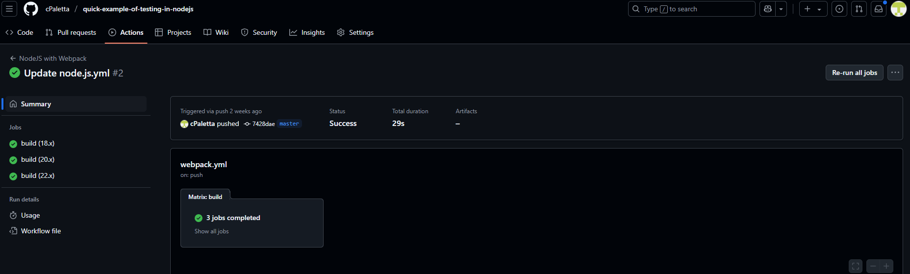
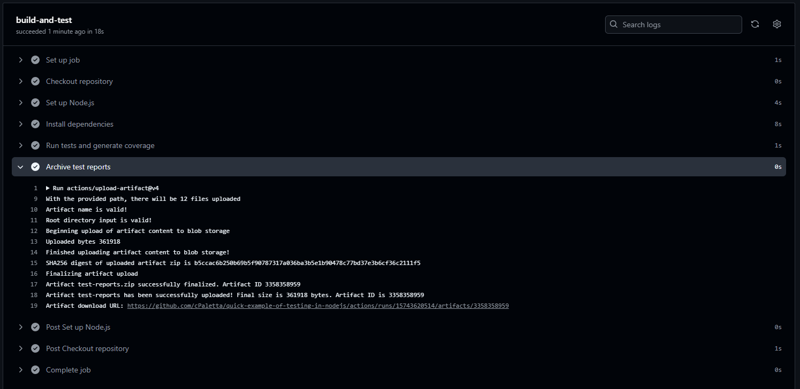
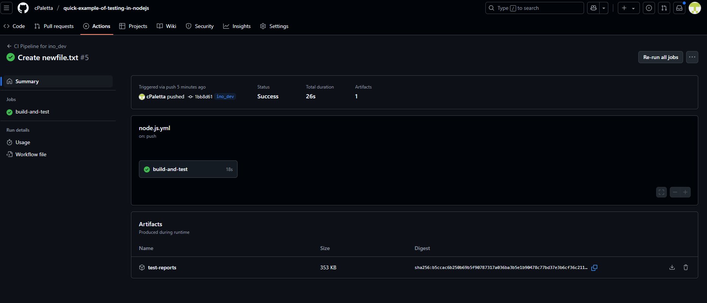

Sprawozdanie 
Krzysztof Kaleta
416030

# Analiza cennika

Darmowy Plan (Free Plan): Dla publicznych repozytoriów, GitHub Actions są całkowicie darmowe. Dla repozytoriów prywatnych, darmowy plan oferuje 2000 minut miesięcznie

Minuty: Czas wykonania jest naliczany za każdą minutę pracy runnera. Systemy operacyjne mają różne mnożniki (Linux - 1x, Windows - 2x, macOS - 10x). Wybór ubuntu-latest jest najbardziej ekonomiczny

Storage: Darmowy plan obejmuje 500 MB przestrzeni na artefakty i logi

Dla celów tego ćwiczenia, realizowanego na publicznym forku, darmowy plan był w pełni wystarczający i nie generował żadnych kosztów

# Implementacja pipeline'u w Github Actions

W katalogu .github/workflows/ utworzyłem plik node.js.yml, który definiuje cały proces CI. Poniżej znajduje się szczegółowa analiza jego struktury i poszczególnych kroków, wraz z odniesieniem do poprzedniego rozwiązania opartego na Jenkinsie

Zgodnie z poleceniem, praca została wykonana na forku repozytorium Lissy93/quick-example-of-testing-in-nodejs. W moim forku utworzona została dedykowana gałąź ino_dev, która stała się podstawą do wyzwalania akcji

Cały plik:

```yaml
name: CI Pipeline for ino_dev

on:
  push:
    branches:
      - ino_dev

jobs:
  build-and-test:
    runs-on: ubuntu-latest

    steps:
      - name: Checkout repository
        uses: actions/checkout@v4


      - name: Set up Node.js
        uses: actions/setup-node@v4
        with:
          node-version: '10' 

      - name: Install dependencies
        run: npm install


      - name: Run tests and generate coverage
        run: npm run test 

      - name: Archive test reports
        uses: actions/upload-artifact@v4
        with:
          name: test-reports 
          path: reports/ 
```

# Poszczególne elementy

```yaml
    on:
    push:
        branches:
        - ino_dev
```

Element definiujący wyzwalacz (trigger). Zgodnie z wymaganiami zadania, akcja jest uruchamiana przez zdarzenie push. Dodatkowo, za pomocą filtra branches ograniczono działanie akcji wyłącznie do gałęzi ino_dev. Dzięki temu zmiany w innych gałęziach (np. master) nie spowodują niepotrzebnego uruchomienia tego pipeline'u

```yaml
jobs:
  build-and-test:
    runs-on: ubuntu-latest
```

Workflow składa się z jednego lub więcej jobsa. W moim przypadku jest jedno zadanie o nazwie build-and-test
Dyrektywa `runs-on: ubuntu-lates` określa, na jakim środowisku zadanie zostanie uruchomione. GitHub udostępnia zarządzane maszyny wirtualne (runnery) z różnymi systemami operacyjnymi

Każde zadanie składa się z sekwencji kroków (steps), które są wykonywane po kolei

```yaml
- name: Install dependencies
  run: npm install
```
Ten krok instaluje wszystkie zależności zdefiniowane w pliku package.json

```yaml
- name: Run tests and generate coverage
  run: npm run test
```
Wykonuje skrypt test zdefiniowany w package.json


```yaml
- name: Archive test reports
  uses: actions/upload-artifact@v4
  with:
    name: test-reports
    path: reports/
```
`uses: actions/upload-artifact@v4:` Oficjalna akcja do przesyłania plików jako artefaktów workflow
`name: test-reports:` Nazwa, pod jaką artefakt będzie widoczny w interfejsie GitHub
`path: reports/:` Ścieżka do katalogu, który ma zostać spakowany i załączony

Po wypchnięciu pliku oraz dowolnej innej zmiany do gałęzi ino_dev, pipeline został automatycznie uruchomiony. Jego status można było śledzić na żywo w zakładce "Actions" w repozytorium GitHub



Po zacommitowaniu na odpowiednim branchu Github Actions uruchomiło się samodzielnie


Po rozwinięciu zakładki Archive test reports widoczny jest link do pobrania artefaktów:




Są one też widoczne w sekcji artefakty:


