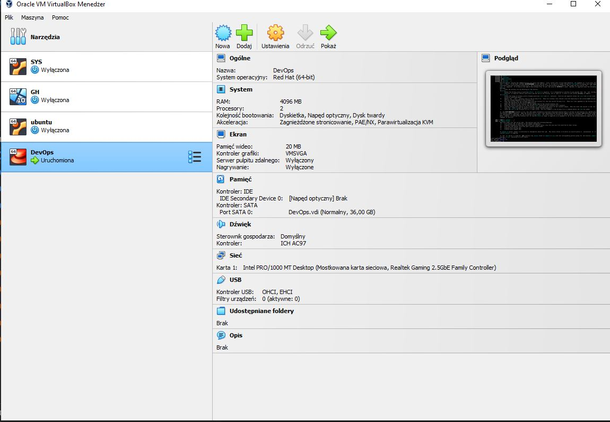
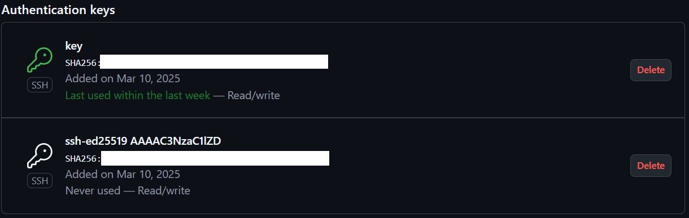
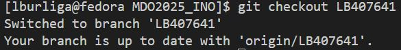
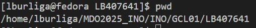

Sprawozdanie nr 1

Na zainstalowanej maszynie wirtualnej Fedora zainstalowano klienta Git i obsługę kluczy SSH



```bash
sudo dnf install git
```

Sklonowano repozytorium przedmiotowe:

```bash
git clone https://github.com/InzynieriaOprogramowaniaAGH/MDO2025_INO.git
```

Utworzono dwa klucze SSH przy pomocy komendy i skonfigurowano je jako metodę dostępu do githuba:
```bash
ssh-keygen -t ed25519 -C "2013burl01@gmail.com"
```



Rozpoczęto pracę na gałęzi main/GCL01/LB407641:



Utworzono katalog w grupie GCL01:
```bash
mkdir LB407641
```


Stworzono Git hooka, który weryfikuje commit message (commit ma rozpoczynać się od inicjałów oraz numeru indeksu):

```bash
commit_message=$(cat "$1")

case "$commit_message" in
  "$prefix"*) 
    echo "commit poprawny"
    exit 0 ;;
  *) 
    echo "commit nie zaczyna sie od $prefix"
    exit 1 ;;
esac
```

