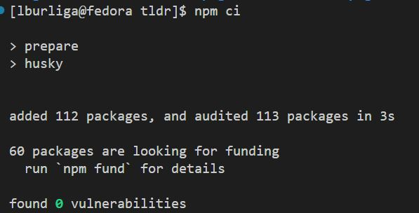
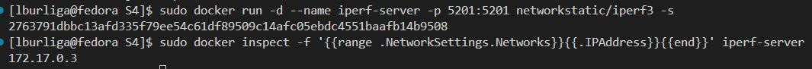

# Sprawozdanie nr 1

Na zainstalowanej maszynie wirtualnej Fedora zainstalowano klienta Git i obsługę kluczy SSH


```bash
sudo dnf install git
```

Sklonowano repozytorium przedmiotowe:

```bash
git clone https://github.com/InzynieriaOprogramowaniaAGH/MDO2025_INO.git
```

Utworzono dwa klucze SSH przy pomocy komendy i skonfigurowano je jako metodę dostępu do githuba:
```bash
ssh-keygen -t ed25519 -C "2013burl01@gmail.com"
```


Rozpoczęto pracę na gałęzi main/GCL01/LB407641:


Utworzono katalog w grupie GCL01:
```bash
mkdir LB407641
```


Stworzono Git hooka, który weryfikuje commit message (commit ma rozpoczynać się od inicjałów oraz numeru indeksu):

```bash
commit_message=$(cat "$1")

case "$commit_message" in
  "$prefix"*) 
    echo "commit poprawny"
    exit 0 ;;
  *) 
    echo "commit nie zaczyna sie od $prefix"
    exit 1 ;;
esac
```

# Zajęcia 2
Zainstalowano Docker na Fedorze

```bash
sudo dnf -y install dnf-plugins-core
```

Pobrano obrazy `hello-world`, `busybox`, `ubuntu`, `fedora`, `mysql`

Skorzystano z pomocy LLM (ChatGPT), by pokazać daty pobrań kontenerów. Treść zapytania: 

``Jak pokazać kiedy obrazy zostały pobrane?``


Wykorzystano komendę:
```bash
docker ps -a --format "table {{.ID}}\t{{.Image}}\t{{.CreatedAt}}"
```

Otrzymano wynik:


PID1 w kontenerze


Zaktualizowano pakiety:

```bash
dnf update -y
```


Stworzono Dockerfile bazujący na ubuntu:

```bash
FROM ubuntu:22.04

ENV DEBIAN_FRONTEND=noninteractive

RUN apt update && apt install -y git && apt clean

RUN git clone https://github.com/InzynieriaOprogramowaniaAGH/MDO2025_INO.git /repo

WORKDIR /repo
```

Zbudowano i uruchomiono obraz:


Sprawdzono czy udało się pobrać repo:


Pokazanie uruchomionych kontenerów:

```bash
sudo docker ps -a --format "table {{.Image}}\t{{.Status}}"
```


Wyczyszczono kontenery:

```bash
sudo docker rm $(sudo docker ps -aq)
```


Wyczyszczono obrazy:

```bash
sudo docker rmi $(sudo docker images -q)
```


# Sprawozdanie 3

Pobrano repo `tldr`. Projekt ma na celu zapewnienie prostszego i przystępniejszego manuala niż linuksowy. Jest na licencji MIT oraz zawiera testy jednostkowe (npm).


Pobrano wymagane zależności:

```bash
npm ci
```



Uruchomiono testy jednostkowe:

```bash
npm test
```


Docker build:


Uruchomienie dockera:


Te same czynności w dockerze:


Instalowanie zależności


Plik Dockerfile (wszystkie kroki do builda):

```bash
FROM node:18

WORKDIR /app
RUN apt update && apt install -y make git

RUN git clone https://github.com/tldr-pages/tldr.git .
RUN npm install
RUN npm markdown
```

Plik Dockerfile.test:

```bash
FROM node:18

WORKDIR /app
COPY --from=build /app /app

RUN npm test
```

# Sprawozdanie 4

Stworzono woluminy - wejściowy/wyjściowy:

```bash
docker volume create input_volume
docker volume create output_volume
```


oraz kontener bazowy:

```bash
docker run -it --name base_container -v input_volume:\input -v output_volume:\output ubuntu:22.04
```


instalacja wymaganych zależności:

```bash
apt update && apt install -y build-essential
```


klonowanie repo spoza kontrolera na wolumin wejściowy:


# .....

# Eksponowanie portu (iperf3)

```bash
sudo docker run -it --rm --name iperf-server-2 -p 5201:5201 networkstatic/iperf3 -s
```




Połączono się spoza kontenera:


Stworzono sieć:

```bash
docker network create --driver bridge custom_net
```


Uruchomiono serwer i klient w tej samej sieci:

