# Sprawozdanie 1
## Lab 01

1. Zainstalowałem `git` przy pomocy komendy `dnf install git`
2. Sklonowałem repozytorium poleceniem `git clone https://github.com/InzynieriaOprogramowaniaAGH/MDO2025_INO.git`
3. Skonfigurowałem `SSH` z pomocą [poradnika na GitHub](https://docs.github.com/en/authentication/connecting-to-github-with-ssh/generating-a-new-ssh-key-and-adding-it-to-the-ssh-agent)
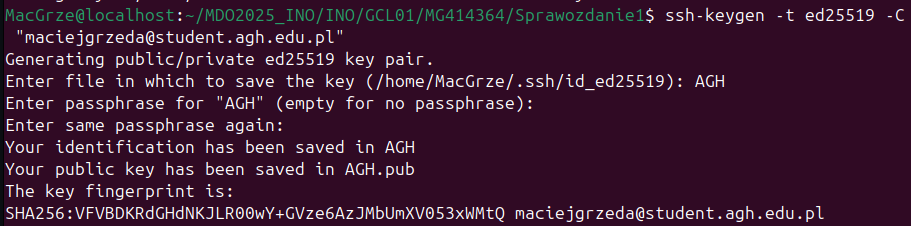\
Oraz dodałem klucz do GitHub'a\
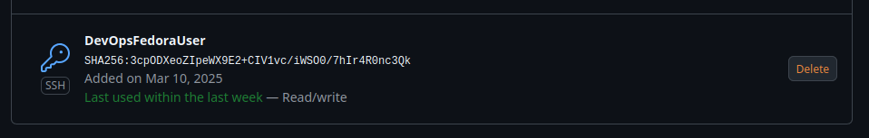\
Na koniec pobrałem repozytorium jeszcze raz, tym razem przy pomocy ssh:\
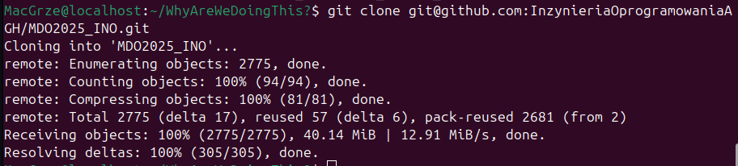
4. Przełączyłem się na gałąź main i na gałąź grupy\
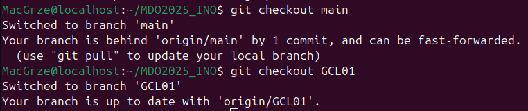
5. Stworzyłem `branch` o poprawnej nazwie wcześniej, więc jest to\
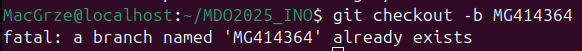
6. Praca na gałęzi
- utworzyłem katalog\
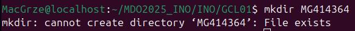
- Napisałem githook'a i wrzuciłem go do odpowiedniego folderu
```bash
#!/bin/bash

if ! grep -q "^MG414364" "$1"; then
	echo "Bad commit!"
	exit 1
fi

exit 0
```
- Dodałem katalog oraz plik ze sprawozdaniem\
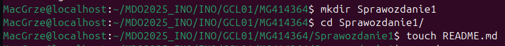
- Dodałem commit\
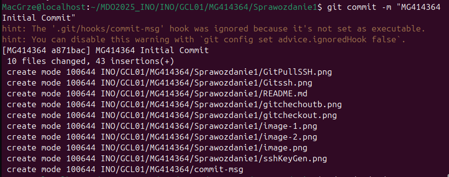\
*(błąd naprawiłem instrukcją `chmod +x commit-msg`)*
- Wypchnąłem zmiany na mój branch\
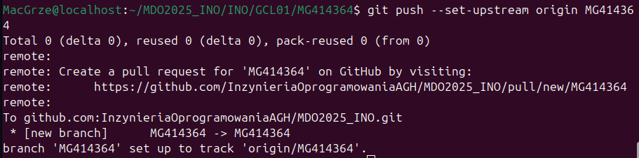
- Zaktualizowałem zmiany w sprawozdaniu
- Wciągnąłem swoją gałąź do gałęzi grupowej\
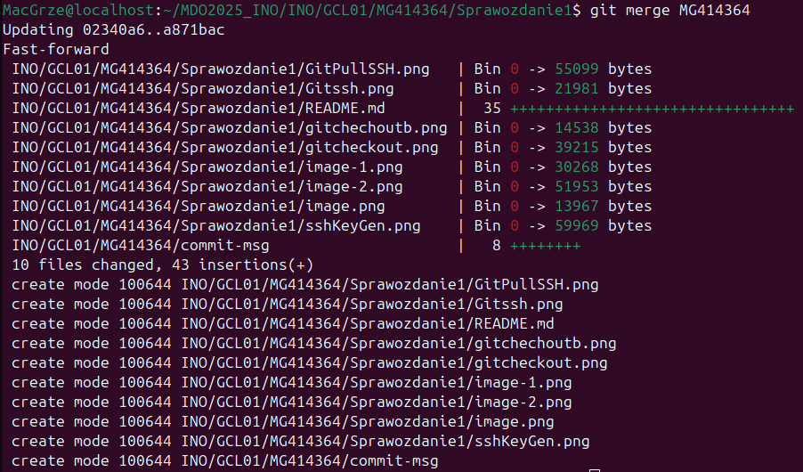

## Lab 02
1. Zainstalowałem docker: `dnf install docker`
2. Konto na Docker miałem już stworzone po zajęciach z BazDanych rok temu.
3. Poprałem wszystkie wymagane obrazy (jeden przykład)
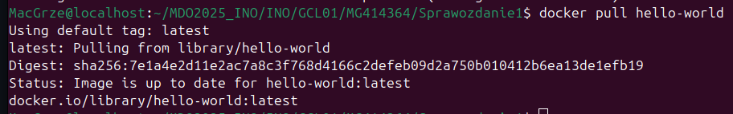
4. Uruchomiłem `BusyBox` i pobrałem wersję\
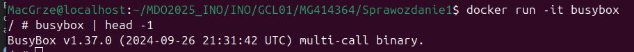
5. Uruchomiłem Ubutnu w Docker\
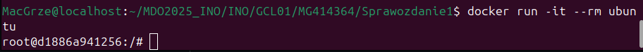
- PID1 w kontenerze\
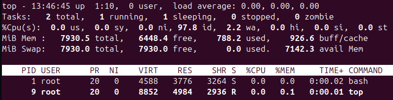
- PID1 na hoście\
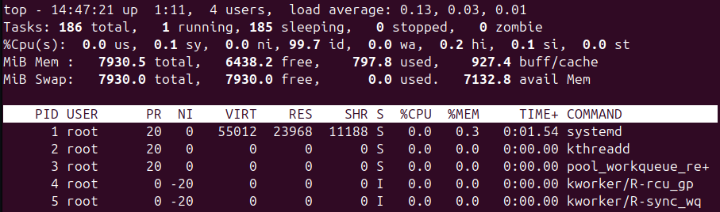
- Zaktualizowałem pakiety\
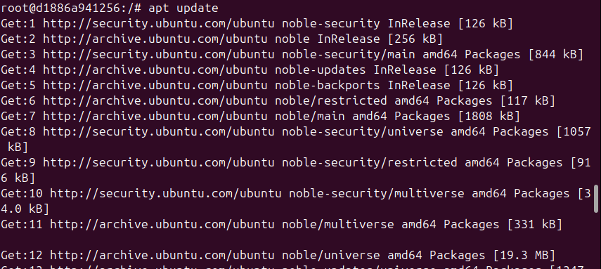
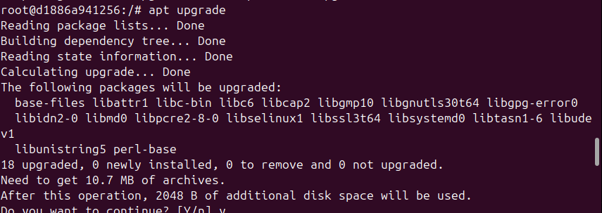
- Wyszedłem\
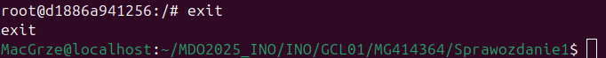
6. Stworzyłem plik Dockerfile i uzupełniłem go:
```Docker
# syntax=docker/dockerfile:1
FROM ubuntu:24.04
RUN apt update -y && apt upgrade -y
RUN apt install git -y
RUN git clone https://github.com/InzynieriaOprogramowaniaAGH/MDO2025_INO.git
```
- Uruchomiłem nowy docker Ubuntu i zweryfikowałem poprawność działania\
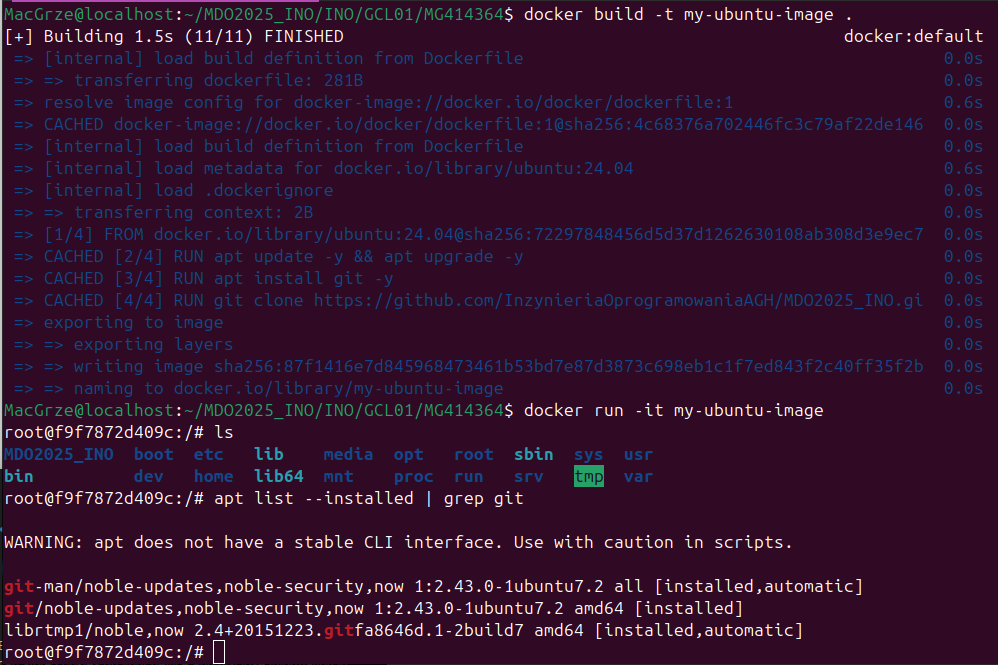
7. Uruchomione kontenery\
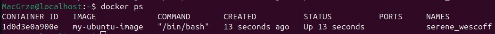\
8 i 9. Wylistowałem i wyczyściłem uruchomione wcześniej obrazy
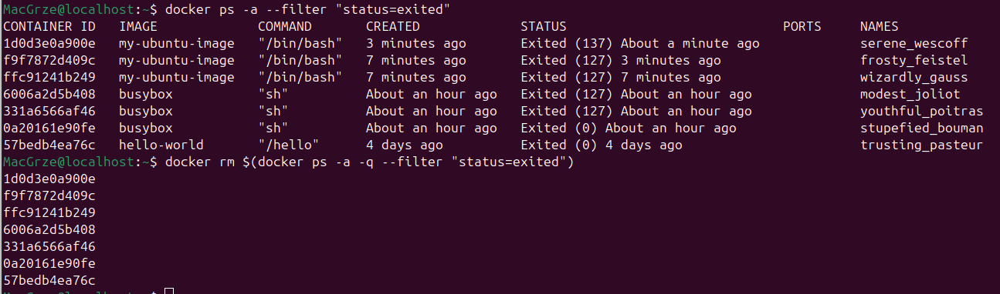

## Lab 03
1. Wybrałem repozytorium irssi, jako, że inne repozytoria, albo miały problem z kompilatorem na fedorze ([movfuscator](https://github.com/xoreaxeaxeax/movfuscator)), albo budowały się znacznie za długo jak na maszynę wirtualną ([json](https://github.com/nlohmann/json)).
2. Sklonowałem repozytorium lokalnie przy pomocy `git clone https://github.com/irssi/irssi`, oraz zbudowałem przy pomocy `meson Build`\
\
Następnie doinstalowałem potrzebne biblioteki\

3. Uruchomiłem testy\


### Praca na Docker
1. Wykonałem powyższe kroki ponowie, tym razem na Docker\
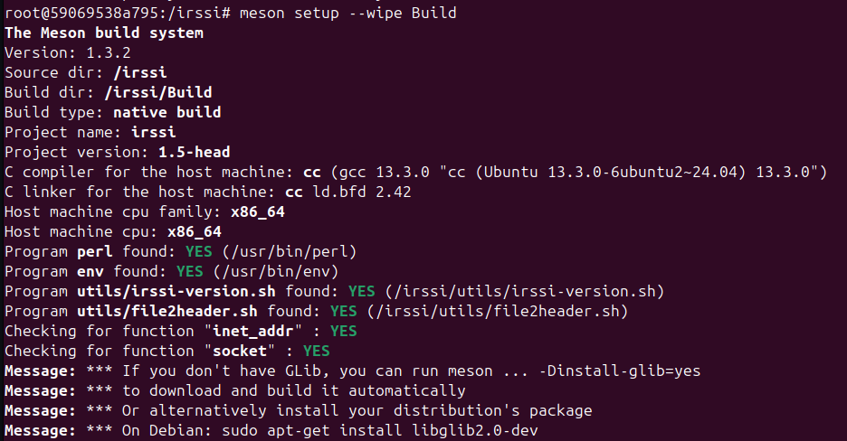\
oraz testy\
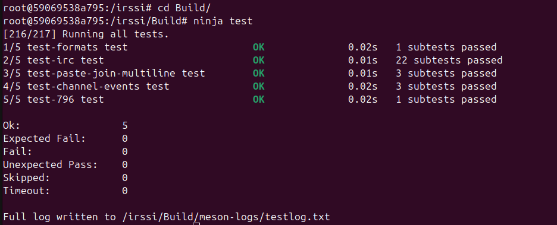
2. Utworzyłem 2 pliki Dockerfile automatyzujące powyższy krok:
build:
```dockerfile
FROM ubuntu:24.04

RUN apt update
RUN apt -y install libotr5 libotr5-dev libssl-dev libgcrypt20 libgcrypt20-dev cmake git perl libncurses6 libncurses-dev libutf8proc3 libutf8proc-dev libglib2.0-0 libglib2.0-dev libtinfo6 terminfo meson

RUN git clone https://github.com/irssi/irssi
WORKDIR /irssi
RUN meson Build
```
test:
```dockerfile
FROM irssibld

WORKDIR /irssi/Build
RUN ninja test
```
3. Działanie kontenerów\
\
test:\

\
Obraz to tylko *szablon*, tego, co doker ma odpalić. Sam docker to faktycznie pracująca "maszyna".

## Lab 04

1. Stworzyłem odpowiednie woluminy
```shell
docker volume create vol_in
docker volume create vol_out
```
2. Plik do budowania kontenera (to samo, co poprzednio, tylko bez git'a i clone
```dockerfile
FROM ubuntu:24.04

RUN apt update
RUN apt -y install libotr5 libotr5-dev libssl-dev libgcrypt20 libgcrypt20-dev cmake perl libncurses6 libncurses-dev libutf8proc3 libutf8proc-dev libglib2.0-0 libglib2.0-dev libtinfo6 terminfo meson

RUN git clone https://github.com/irssi/irssi
WORKDIR /irssi
RUN meson Build
```

Uruchomiłem kontener z podłączonym woluminem
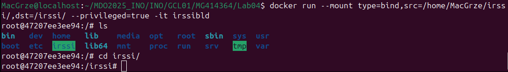\
Użyłem flagi `privileged=true`, aby dać kontenerowi pełny dostep do plików hosta, w tym do plików z repo *irssi*. "Bardzo bezpieczne i standardowe działanie". Innym (znacznie lepszym) poejściem jest na przykład skorzystanie z pomocniczego dockera z Git'em.

3. Zbudowałem irssi (przy pomocy `meson setup --wipe`, bo było już zbudowane wcześniej, więc trzeba było przebudować)\
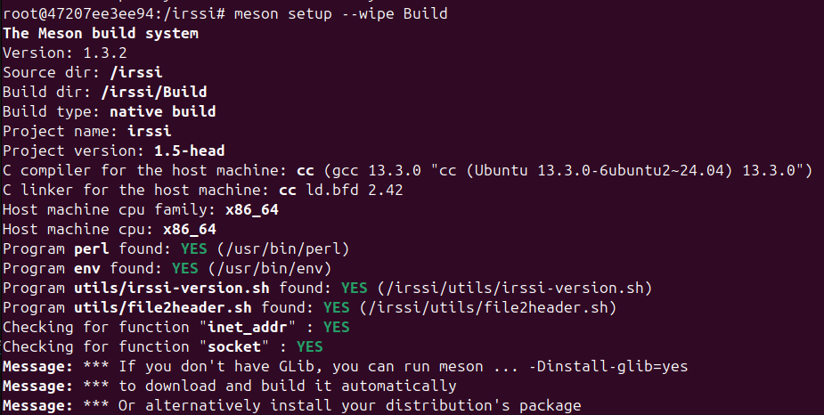

4. Upewniłem się, że pliki zapisane są lokalnie\
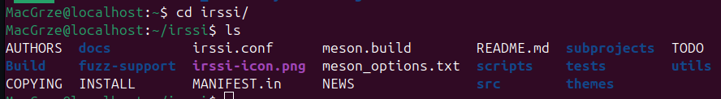

5. Uruchomiłem docker, tym razem korzystając z git'a
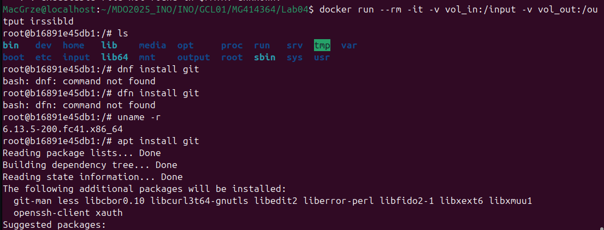\
oraz zbudowałem *irssi*\
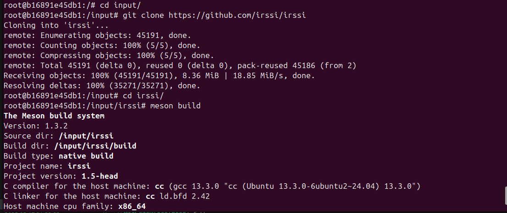

Kontener pomocniczy vs. --privileged: Kontenery pomocnicze są bardziej izolowane, podczas gdy flaga uprawnień jest prostsza a użyciu i mniej bezpieczna.

### Dyskusja
*Ja*: Dockerfile z `RUN --mount`: Pozwala na integrację z procesem budowania obrazu, ale wymaga starannego zarządzania zależnościami i warstwami.\
*Również ja*: Zgadzam się w 100%.

### Korzystanie z `iperf3`
1. Uruchomiłem docker\
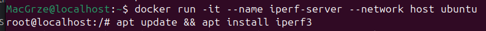\
oraz server iperf3\
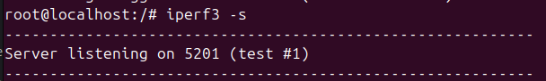

2. Połączyłem się z jako klient do utworzonego serwera `iperf3`
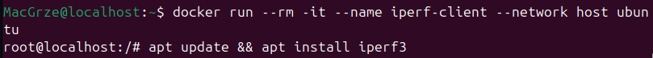\
oraz iperf3\
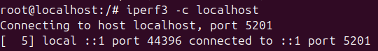\
Na koniec zbadałem ruch\
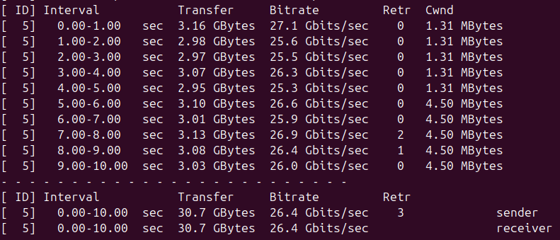

3. Stworzyłem sieć mostkową (o nazwie `donut`)
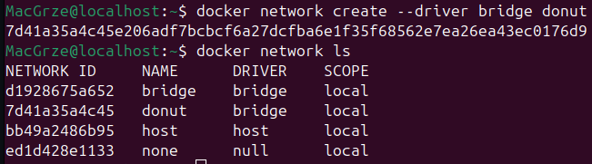\
Połączyłem się z drugiego dockera:\
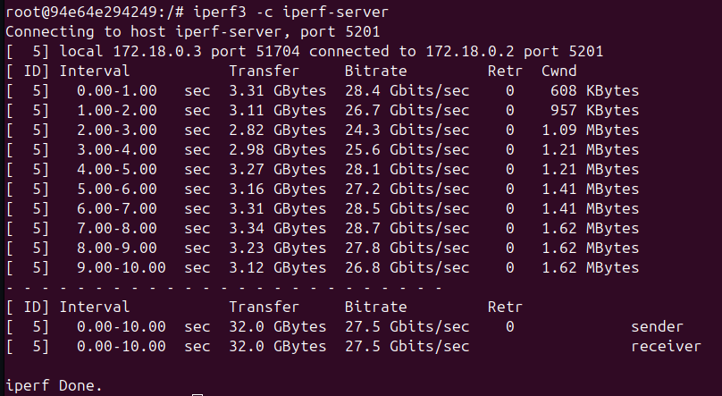\
Oraz z hosta:\
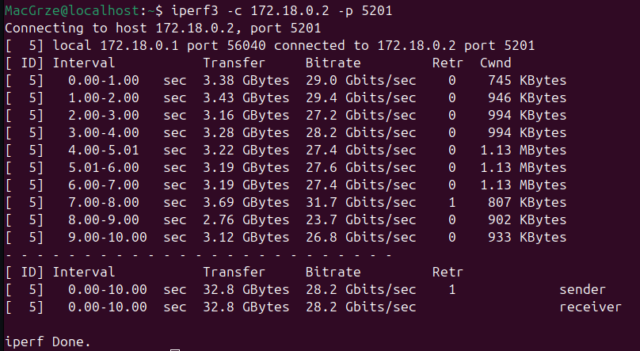\

W obu przypadkach prędkości są conajmniej satysfakcjonujące i nie ma z nimi problemu.


### Jenkins
1. Stworzyłem sieć *Jenkins*\
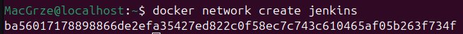

Uruchomiłem `dind`
```shell
docker run \
  --name jenkins-docker \
  --rm \
  --privileged \
  --network jenkins \
  --network-alias docker \
  --env DOCKER_TLS_CERTDIR=/certs \
  --volume jenkins-docker-certs:/certs/client \
  --volume jenkins-data:/var/jenkins_home \
  --publish 2376:2376 \
  docker:dind \
  --storage-driver overlay2
```
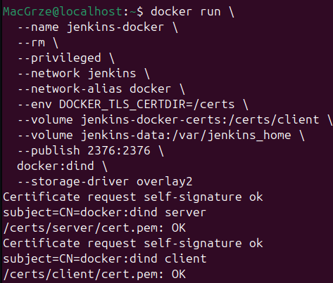

2. Uruchomiłem `jenkins`
```shell
docker run --name jenkins     -p 8080:8080 -p 50000:50000     --network jenkins          --network-alias docker     --link dind:docker     -e DOCKER_HOST=tcp://docker:2375     -d jenkins/jenkins:lts
```
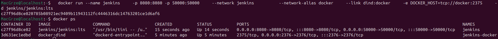

3. Ekran logowania do Jenkins'a:
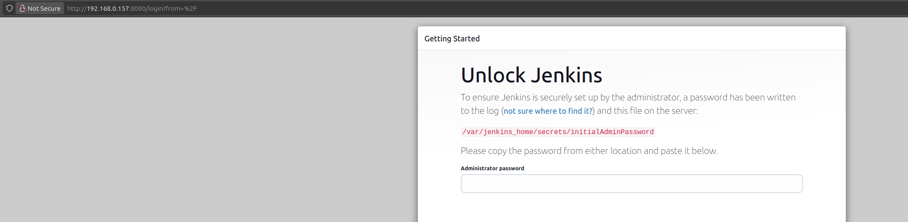\
Po zalogowaniu:\
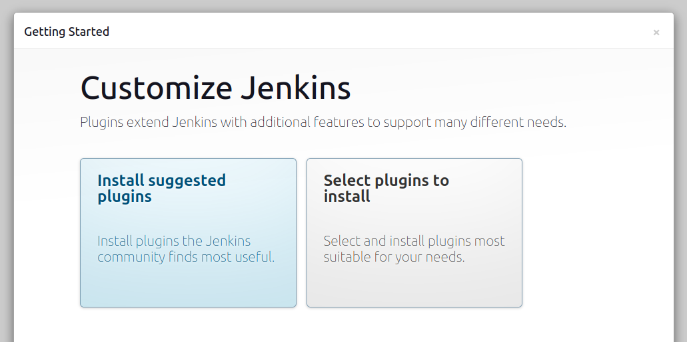

Historia komend:
```shell
    1  ls
    2  logout
    3  git clone git@github.com:InzynieriaOprogramowaniaAGH/MDO2025_INO.git
    4  ls
    5  ls -al ~/.ssh
    6  ssh-keygen -t ed25519 -C "gmaciejg525@gmail.com"
    7  eval "$(ssh-agent -s)"
    8  ls -al ~/.ssh/
    9  ls -al /home/MacGrze/.ssh
   10  ls -al /home/MacGrze/.ssh/
   11  ls -al /home/MacGrze/.ssh/known_hosts 
   12  ls -al
   13  mv GitMaci* ~/.ssh/
   14  sudo mv GitMaci* ~/.ssh/
   15  ls -al
   16  ls
   17  mv 
   18  mv --help
   19  mv GitGmaci ~/.ssh/
   20  ls
   21  mv GitGmaci.pub ~/.ssh/
   22  ls -al .ssh/
   23  ssh-add ~/.ssh/GitGmaci
   24  cat ~/.ssh/GitGmaci
   25  cat ~/.ssh/GitGmaci.pub 
   26  git clone git@github.com:InzynieriaOprogramowaniaAGH/MDO2025_INO.git
   27  ls
   28  cd MDO2025_INO/
   29  git checkout main
   30  git checkout GCL01 
   31  ls
   32  git checkout MG414364
   33  git branch MG414364
   34  git status
   35  git checkout MG414364 
   36  git status
   37  git branch
   38  ls
   39  cd INO/
   40  ls
   41  cd GCL01/
   42  ls
   43  mkdir MG414364
   44  ls
   45  cd MG414364/
   46  cd ../../../
   47  ls
   48  ls -al
   49  cd .git/
   50  ls
   51  cd hooks/
   52  ls
   53  cat commit-msg.sample 
   54  ls
   55  cat pre-commit.sample 
   56  touch commit-check
   57  rm commit-check 
   58  cd ../../
   59  ls
   60  cd INO/
   61  cd GCL01/
   62  cd MG414364/
   63  ls
   64  touch commit-msg
   65  nano commit-msg 
   66  cp commit-msg ../../../.git/hooks/
   67  cd 
   68  cd MDO2025_INO/
   69  ls
   70  cd INO/
   71  cd ..
   72  cd .git/
   73  ls
   74  cd hooks/
   75  ls
   76  dnf get docker
   77  dnf install docker
   78  docker pull hello-world
   79  docker run hello-world
   80  ls
   81  docker pull hello-world
   82  sudo docker pull hello-world
   83  docker pull hello-world
   84  docker run hello-world
   85  sudo usermod -aG docker $USER
   86  docker pull hello-world
   87  docker run -rm hello-world
   88  docker run -r hello-world
   89  docker run hello-world
   90  docker run --rm hello-world
   91  docker run -rm -it hello-world
   92  docker run --rm -it hello-world
   93  docker pull busybox
   94  docker run --rm -it busybox
   95  it
   96  docker pull ubuntu
   97  docker run -it --rm ubuntu
   98  docker ps -a
   99  top
  100  docker status
  101  docker state
  102  docker -ls
  103  docker ls
  104  dockerls
  105  docker --ls
  106  docker ps
  107  top
  108  dnf  update
  109  docker ps
  110  apt install git
  111  docker ps
  112  docker ps -a
  113  ls
  114  cd MDO2025_INO/
  115  ls
  116  branch
  117  git branch
  118  git pull
  119  ssh
  120  ls -al ~/.ssh
  121  eval "$(ssh-agent -s)"
  122  git pull
  123  ssh-add ~/.ssh/GitGmaci
  124  git pull
  125  git branch
  126  ls
  127  cd INO/
  128  cd GCL01/
  129  cd MG414364/
  130  ls
  131  mkdir Sprawozdanie1
  132  cd Sprawozdanie1/
  133  touch README.md
  134  scp -h
  135  man scp
  136  snf install git
  137  dnf install git
  138  ssh-keygen -t ed25519 -C "maciejgrzeda@student.agh.edu.pl"
  139  ls -al ~/.ssh
  140  ls -al ~/
  141  ls -al
  142  mv AGH* ~/.ssh/
  143  ls -al
  144  ls -al ~/.ssh
  145  cd .
  146  cd ~
  147  ls
  148  mkdir WhyAreWeDoingThis?
  149  cd WhyAreWeDoingThis\?/
  150  git pull git@github.com:InzynieriaOprogramowaniaAGH/MDO2025_INO.git
  151  git clone git@github.com:InzynieriaOprogramowaniaAGH/MDO2025_INO.git
  152  git branch
  153  cd ..
  154  ls
  155  cd MDO2025_INO/
  156  ls
  157  git branch
  158  git checkout main
  159  git checkout GCL0
  160  git checkout GCL01
  161  git checkout main
  162  git checkout GCL01
  163  git checkout -b MG414364
  164  cd INO/
  165  cd GCL01/
  166  ls
  167  mkdir MG414364
  168  cd MG414364/
  169  ls
  170  cat commit-msg 
  171  git branch
  172  git checkout MG41
  173  git checkout MG414364 
  174  ls
  175  git status
  176  git add .
  177  git status
  178  cd ..
  179  git status
  180  cd MG414364/
  181  git push
  182  git push --set-upstream origin MG414364
  183  cd Sprawozdanie1/
  184  nano README.md 
  185  git checkout GCL04
  186  git merge MG414364 
  187  git checkout Mg
  188  git checkout MG414364 
  189  git push
  190  git status
  191  git add .
  192  git commit -m "MG414364 Initial Commit"
  193  git config --global user.email gmaciejg525@gmail.com
  194  git config --global user.name AndyFilter
  195  git commit -m "MG414364 Initial Commit"
  196  cd ../../../
  197  cd ../
  198  ls -al
  199  cd .git/
  200  ls
  201  cd hooks/
  202  chmox +x commit-msg
  203  chmod +x commit-msg
  204  cat commit-msg
  205  cd ../../../
  206  ls
  207  cd MDO2025_INO/
  208  cd INO/
  209  cd GCL01/
  210  cd MG414364/
  211  cd Sprawozdanie1/
  212  ls
  213  git status
  214  git push
  215  git checkout GCL01
  216  git merge MG414364 
  217  git status
  218  git checkout MG414364 
  219  git status
  220  docker pull hello-world
  221  docker run busybox
  222  docker run busybox -t
  223  docker run busybox -i
  224  docker run -i busybox
  225  docker run -it busybox
  226  docker status
  227  docker state
  228  docker --help
  229  docker ps
  230  docker run -it --rm ubuntu
  231  docker build --no-cache -t ubuntu .
  232  cd ..
  233  docker build --no-cache -t ubuntu .
  234  docker build --no-cache -t ubuntu CockerFile
  235  docker build --no-cache -t ubuntu .
  236  docker build --no-cache -t my-image:my-tag .
  237  touch Dockerfile
  238  docker build --no-cache -t my-image:my-tag .
  239  nano Dockerfile 
  240  docker build --no-cache -t my-image:my-tag .
  241  nano Dockerfile 
  242  docker build --no-cache -t my-image:my-tag .
  243  nano Dockerfile 
  244  docker build --no-cache -t my-image:my-tag .
  245  nano Dockerfile 
  246  docker build --no-cache -t my-image:my-tag .
  247  nano Dockerfile 
  248  docker build --no-cache -t my-image:my-tag .
  249  ls
  250  docker run my-image
  251  docker run -it my-image
  252  docker ps -a
  253  docker build -t my-ubuntu-image .
  254  nano Dockerfile 
  255  docker build -t my-ubuntu-image .
  256  docker run -it my-ubuntu-image
  257  docker build -t my-ubuntu-image .
  258  docker run -it my-ubuntu-image
  259  ls
  260  cp Dockerfile Sprawozdanie1/
  261  cat Dockerfile 
  262  shutdown
  263  sudo shutdown
  264  top
  265  docker ps -a
  266  docker ps
  267  docker stop my-ubuntu-image
  268  docker stop serene_wescoff
  269  docker ps -a --filter "status=exited"
  270  docker rm $(docker ps -a -q --filter "status=exited")
  271  cd 
  272  cd MDO2025_INO/
  273  docker rm
  274  docker rm my-image
  275  docker rm --help
  276  docker
  277  ls
  278  cd INO/
  279  cd GCL01/
  280  cd MG414364/
  281  ls
  282  cat Dockerfile 
  283  dit status
  284  git staus
  285  git status
  286  git add .
  287  git staus
  288  git status
  289  git commit -m "MG414364 Added Lab02"
  290  git push
  291  eval "$(ssh-agent -s)"
  292  git push
  293  cd ..
  294  git status
  295  git push
  296  ssh git@github.com
  297  ssh-add ~/.ssh/GitGmaci
  298  git push
  299  cd 
  300  cd MDO2025_INO/
  301  cd 
  302  cd MDO2025_INO/
  303  cd INO/
  304  cd GCL01/
  305  cd MG414364/
  306  ls
  307  cd Sprawozdanie1/
  308  cd ..
  309  cp Dockerfile Sprawozdanie1/
  310  ls
  311  cd Sprawozdanie1/
  312  ls
  313  git status
  314  git add .
  315  git status
  316  git commit -m "Moved Dockerfile to directory Sprawozdanie1"
  317  git status
  318  ls
  319  cd ../../../../
  320  ls
  321  cd ../
  322  makedir lab03
  323  m\kdir lab03
  324  mkdir lab03
  325  cd lab03/
  326  git clone https://github.com/irssi/irssi.git
  327  cd irssi/
  328  meson 
  329  meson Build
  330  dnf install meson
  331  sudo dnf install meson
  332  meson Build
  333  mason
  334  mason Build
  335  meson Build
  336  cat /home/MacGrze/lab03/irssi/Build/meson-logs/meson-log.txt
  337  meson Build
  338  cd Build/
  339  ls
  340  ./irssi/
  341  cd irssi/
  342  ls
  343  cd ..
  344  ls
  345  cd Build/
  346  ls
  347  cd irssi/
  348  ls
  349  cd src/
  350  ls
  351  cd ../../
  352  ls
  353  cd ..
  354  meson tests
  355  meson test
  356  cd ..
  357  ls
  358  cd irssi/
  359  ls
  360  cd t
  361  cd tests/
  362  ls
  363  cd irc/
  364  ls
  365  cd ..
  366  ./meson-build
  367  ls
  368  cd ..
  369  ls
  370  meson test
  371  ninja test
  372  make test
  373  cd Build/
  374  make test
  375  ls
  376  cd ..
  377  ls
  378  cd tests/
  379  ls
  380  cd ..
  381  meson Build
  382  meson setup --wipe
  383  meson Build
  384  meson setup --wipe .
  385  meson Build
  386  meson setup --reconfigure 
  387  meson setup --reconfigure  .
  388  meson setup --reconfigure .
  389  ls
  390  cd ..
  391  ls
  392  rm -rf irssi/
  393  git clone https://github.com/irssi/irssi.git
  394  cd irssi/
  395  meson Build
  396  cd ..
  397  rm -rf irssi/
  398  git clone https://github.com/irssi/irssi.git
  399  cd irssi/
  400  meson Build
  401  find irssi
  402  find irssi .
  403  find . irssi
  404  ls
  405  meson Build
  406  cd ..
  407  rm -rf irssi/
  408  git clone https://github.com/irssi/irssi.git
  409  cd irssi/
  410  meson Build
  411  ninja -C Build && sudo ninja -C Build install
  412  ninja -C Build
  413  find . irssi
  414  find irssi
  415  ninja test
  416  cd Build/
  417  ninja test
  418  ls
  419  cd ../../../
  420  cd MDO2025_INO/
  421  cd INO/
  422  cd GCL01/
  423  cd MG414364/
  424  sl
  425  ls
  426  cd Lab03/
  427  ls
  428  touch Dockerfile
  429  docker build -t irssibld 
  430  docker build -t irssibld Dockerfile.irssbld
  431  docker build -t irssibld ./Dockerfile.irssbld
  432  docker build -t irssibld -f Dockerfile.irssbld
  433  docker build -t irssibld -f Dockerfile.irssbld .
  434  docker build -t irssibld -f Dockerfile.irssibld .
  435  docker run --interactive -rm irssibld
  436  docker run --interactive --rm irssibld
  437  docker purge
  438  docker ps
  439  docker run --interactive --rm irssibld
  440  docker ps
  441  docker run --rm irssibld
  442  docker run --it --rm irssibld
  443  docker run -i --rm irssibld
  444  docker run --rm -it irssibld:latest
  445  docker build -t irssitest -f Dockerfile.irssitest .
  446  docker run --rm -it irssitest
  447  ls
  448  nano Dockerfile.irssi
  449  nano Dockerfile.irssibld 
  450  git status
  451  cd ..
  452  git status
  453  git add .
  454  git status
  455  git commit -m "MG414364 Lab03 build and test Dockers added"
  456  git status
  457  git push
  458  ocker volume 
  459  docker
  460  docker volume 
  461  exit
  462  docker volume create
  463  docker volume ls
  464  docker volume rm 6c0b43846ca707c32ac85b7dc80dfb6557fe4e078f182ba5a09883aea0e260e7 
  465  docker volume create vol_in
  466  docker volume create vol_out
  467  docker run irssibld --mount type=bind,src=/2025/,dst=/2025/
  468  ls
  469  pwd
  470  docker run irssibld --mount type=bind,src=/home/MacGrze/MDO2025_INO/,dst=/MDO2025_INO/
  471  docker run irssibld --mount type=bind,src=/home/MacGrze/MDO2025_INO/,dst=/MDO2025_INO/ -it
  472  docker run --mount type=bind,src=/home/MacGrze/MDO2025_INO/,dst=/MDO2025_INO/ -it irssibld
  473  ls
  474  git pull https://github.com/irssi/irssi.git
  475  git pull https://github.com/irssi/irssi
  476  git clone https://github.com/irssi/irssi
  477  ls
  478  docker run --mount type=bind,src=/home/MacGrze/irssi/,dst=/irssi/ -it irssibld
  479  chmod 755 irssi/
  480  docker run --mount type=bind,src=/home/MacGrze/irssi/,dst=/irssi/ -it irssibld
  481  chmod 777 irssi/
  482  ls -l irssi/
  483  ls irssi/
  484  docker run --mount type=bind,src=/home/MacGrze/irssi/,dst=/irssi/ -it irssibld
  485  docker volume ls
  486  docker run --mount type=bind,src=/home/MacGrze/irssi/,dst=/irssi2/ -it irssibld
  487  docker run --mount=type=bind,src=/home/MacGrze/irssi/,dst=/irssi2/ -it irssibld
  488  docker run --mount=type=cache,from=/home/MacGrze/irssi/,dst=/irssi2/ -it irssibld
  489  docker run --mount=type=cache,source=/home/MacGrze/irssi/,dst=/irssi2/ -it irssibld
  490  docker run --mount=type=cache,source=/home/MacGrze/irssi/,target=/irssi2/ -it irssibld
  491  docker run --mount type=bind,src=/home/MacGrze/irssi/,dst=/irssi2/ -it irssibld
  492  docker run --mount type=bind,src=/home/MacGrze/irssi/,dst=/irssi2/ --privileged=true -it irssibld
  493  ls
  494  history
  495  docker volume ls
  496  docker run --mount type=bind,src=/home/MacGrze/irssi/,dst=/irssi2/ --privileged=true -it irssibld
  497  ls
  498  cd irssi/
  499  ls
  500  docker run --rm -it irssitest
  501  ls
  502  cd ..
  503  ls
  504  cd lab03/
  505  ls
  506  git clone git@github.com:xoreaxeaxeax/movfuscator.git
  507  ls
  508  git clone https://github.com/xoreaxeaxeax/movfuscator.git
  509  ls
  510  cd movfuscator/
  511  ls
  512  ./build.sh 
  513  ls
  514  ./check.sh 
  515  nano build
  516  nano build.sh 
  517  cd ..
  518  rm -rf movfuscator/
  520  git clone https://github.com/nlohmann/json.git
  521  cd json/
  522  ls
  523  mkdir build
  524  cd build/
  525  cmake .. -DJSON_BuildTests=On
  526  cmake --build .
  527  docker run --rm --it 
  528  cd ..
  529  ls
  530  ls -a
  531  ls -l
  532  cd .
  533  cd ..
  534  ls
  535  cd MDO2025_INO/
  536  cd INO/GCL01/MG414364/
  537  ls
  538  cd Lab03/
  539  ls
  540  docker run --rm --it irssibld
  541  docker run --rm -it irssibld
  542  docker run --rm -it --progress=plain irssitest
  543  docker run --rm -it -progress=plain irssitest
  544  docker build --no-cache --progress=plain -t irssitest -f Dockerfile.irssitest .
  545  docker build -t irssibld -f Dockerfile.irssibld .
  546  docker volume ls
  547  cd ../Lab04
  548  ls
  549  docker run --rm -it irssibld
  550  docker build --no-cache --progress=plain -t irssibld -f Dockerfile.irssibld .
  551  docker build -t irssibld -f Dockerfile.irssibld .
  552  docker run --rm -it irssibld
  553  docker run --mount type=bind,src=/home/MacGrze/irssi/,dst=/irssi/ --privileged=true -it irssibld
  554  docker run -it --name git_builder -v in_vol:/input-v out_vol:/output
  555  docker run -it --name git_builder \ -v in_vol:/input -v out_vol:/output
  556  docker run -it --name git_builder \ -v in_vol:/input \ -v out_vol:/output
  557  docker run -it --name git_builder -v in_vol:/input-v out_vol:/output
  558  docker run -it --name git_builder -v in_vol:/input -v out_vol:/output
  559  docker run --rm -it --name git_builder -v in_vol:/input -v out_vol:/output
  560  docker run --rm -it git_builder -v in_vol:/input -v out_vol:/output
  561  docker run --rm -it irssibld -v in_vol:/input -v out_vol:/output
  562  docker volume ls
  563  docker run --rm -it irssibld -v vol_in:/input -v vol_out:/output
  564  docker run --rm -it --name irssibld -v vol_in:/input -v vol_out:/output
  565  docker run --rm -it irssibld -v vol_in:/input -v vol_out:/output
  566  docker run --rm -it irssibld \ -v vol_in:/input \ -v vol_out:/output
  567  docker run --rm -it -v vol_in:/input -v vol_out:/output irssibld
  568  ls
  569  cd irssi/
  570  ls
  571  docker run --rm -it ubuntu
  572  docker run --rm -it alpine/socat
  573  docker run --rm -it ubuntu
  574  docker run --rm -it --name iperf-client --network host ubuntu
  575  docker run --rm -it --name iperf-client --network donut
  576  docker run --rm -it --name iperf-client --network donut ubuntu
  577* docker run --name jenkins     -p 8080:8080 -p 50000:50000     --link      -e DOCKER_HOST=tcp://docker:2375     -d jenkins/jenkins:lts
  578  docker run --name jenkins     -p 8080:8080 -p 50000:50000     --link jenkins-docker:docker     -e DOCKER_HOST=tcp://docker:2375     -d jenkins/jenkins:lts
  579* docker run --name jenkins     -p 8080:8080 -p 50000:50000     --link jenkins-docker:docker     -e DOCKER_HOST=tcp://docker:2375     -d jenkins/jenkins:lts
  580    docker run --name jenkins     -p 8080:8080 -p 50000:50000     --network jenkins   	--network-alias docker     --link dind:docker     -e DOCKER_HOST=tcp://docker:2375     -d jenkins/jenkins:lts
  581  docker ps
  582  docker logs jenkins
  583  docker ps -a
```