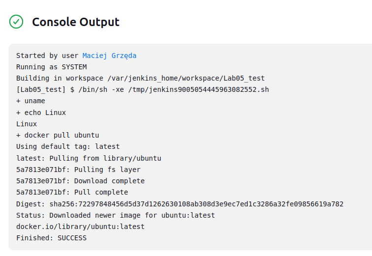
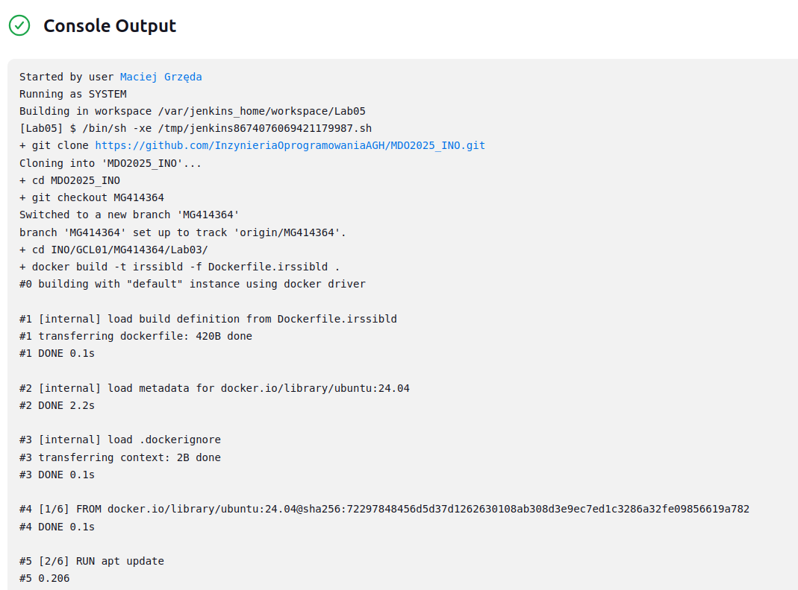
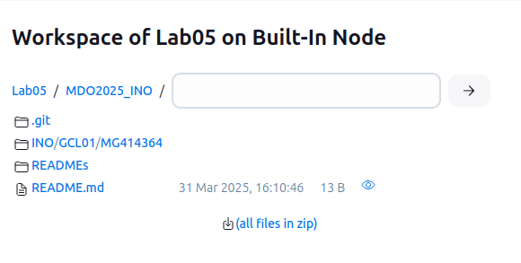

# Lab 05
Uruchomiłem docker `dind` z instrukcji [Jenskins](https://www.jenkins.io/doc/book/installing/docker/):

```shell
docker run   --name jenkins-docker  --detach --rm   --privileged   --network jenkins   --network-alias docker   --env DOCKER_TLS_CERTDIR=/certs   --volume jenkins-docker-certs:/certs/client   --volume jenkins-data:/var/jenkins_home   --publish 2376:2376   docker:dind   --storage-driver overlay2
```

```shell
docker run \                                                           
  --name jenkins-blueocean \
  --restart=on-failure \
  --detach \
  --network jenkins \
  --env DOCKER_HOST=tcp://docker:2376 \
  --env DOCKER_CERT_PATH=/certs/client \
  --env DOCKER_TLS_VERIFY=1 \
  --publish 8080:8080 \
  --publish 50000:50000 \
  --volume jenkins-data:/var/jenkins_home \
  --volume jenkins-docker-certs:/certs/client:ro \
  myjenkins-blueocean:2.492.2-1
```

Dockerfile jenkins'a
```dockerfile
FROM jenkins/jenkins:2.492.2-jdk17
USER root
RUN apt-get update && apt-get install -y lsb-release ca-certificates curl && \
    install -m 0755 -d /etc/apt/keyrings && \
    curl -fsSL https://download.docker.com/linux/debian/gpg -o /etc/apt/keyrings/docker.asc && \
    chmod a+r /etc/apt/keyrings/docker.asc && \
    echo "deb [arch=$(dpkg --print-architecture) signed-by=/etc/apt/keyrings/docker.asc] \
    https://download.docker.com/linux/debian $(. /etc/os-release && echo \"$VERSION_CODENAME\") stable" \
    | tee /etc/apt/sources.list.d/docker.list > /dev/null && \
    apt-get update && apt-get install -y docker-ce-cli && \
    apt-get clean && rm -rf /var/lib/apt/lists/*
USER jenkins
RUN jenkins-plugin-cli --plugins "blueocean docker-workflow"
```

Uruchomiłem `docker pull ubuntu` przez Jenkins aby sprawdzić czy Jenkins pracuje w trybie Online\


Konfiguracja Projektu Jenkinsa
```shell
git clone https://github.com/InzynieriaOprogramowaniaAGH/MDO2025_INO.git
cd MDO2025_INO
git checkout MG414364
cd INO/GCL01/MG414364/Lab03/
docker build -t irssibld -f Dockerfile.irssibld .
```


Uruchomienie dockera z Jenkina\


Pliki pobrane przez Jenkinsa:\
