# Sprawozdanie 2
## Tworzenie Pipeline w Jenkins dla RustScan

- **Przygotowanie środowiska**:\
stworzenie sieci:\


## Diagramy UML
### Diagram aktywności CI/CD
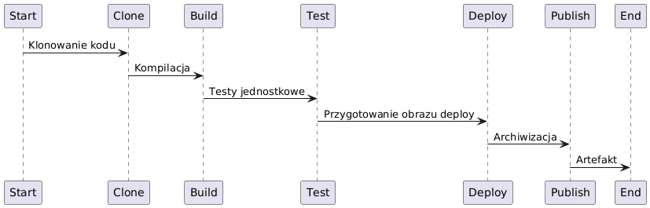

### 1. Docker, Jenkins i DinD
Na potrzeby pipeline'u zostały skonfigurowane dwa kluczowe komponenty:
- **Jenkins Dockerfile**:
```dockerfile
FROM jenkins/jenkins:2.492.2-jdk17
USER root
RUN apt-get update && apt-get install -y lsb-release ca-certificates curl && \
    install -m 0755 -d /etc/apt/keyrings && \
    curl -fsSL https://download.docker.com/linux/debian/gpg -o /etc/apt/keyrings/docker.asc && \
    chmod a+r /etc/apt/keyrings/docker.asc && \
    echo "deb [arch=$(dpkg --print-architecture) signed-by=/etc/apt/keyrings/docker.asc] \
    https://download.docker.com/linux/debian $(. /etc/os-release && echo \"$VERSION_CODENAME\") stable" \
    | tee /etc/apt/sources.list.d/docker.list > /dev/null && \
    apt-get update && apt-get install -y docker-ce-cli && \
    apt-get clean && rm -rf /var/lib/apt/lists/*
USER jenkins
RUN jenkins-plugin-cli --plugins "blueocean docker-workflow"
```

> Aby wszystko działało poprawnie trzeba również wyłączyć *SELinux*: `sudo setenforce 0`

- **Host Jenkins z BlueOcean**: Uruchomiono obraz Jenkins.
```shell
docker run \                                                           
  --name jenkins-blueocean \
  --restart=on-failure \
  --detach \
  --network jenkins \
  --env DOCKER_HOST=tcp://docker:2376 \
  --env DOCKER_CERT_PATH=/certs/client \
  --env DOCKER_TLS_VERIFY=1 \
  --publish 8080:8080 \
  --publish 50000:50000 \
  --volume jenkins-data:/var/jenkins_home \
  --volume /home/MacGrze/MDO2025_INO/INO/GCL01/MG414364/RustScan-Pipeline:/var/jenkins_home/workspace
  --volume jenkins-docker-certs:/certs/client:ro \
  myjenkins-blueocean:2.492.2-1
```
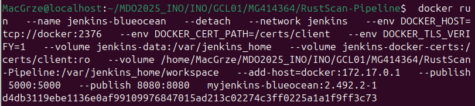
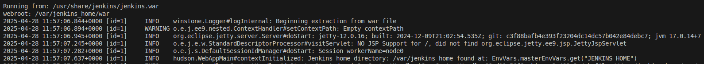

- **DinD (Docker-in-Docker)**: Odpowiadający za możliwość budowy obrazów w środowisku kontrolowanym przez Jenkinsa.
```shell
docker run --name jenkins-docker --detach --rm --privileged \
    --network jenkins \
    --network-alias docker \
    --env DOCKER_TLS_CERTDIR=/certs \
    --volume jenkins-docker-certs:/certs/client \
    --volume jenkins-data:/var/jenkins_home \
    --publish 2376:2376 \
    docker:dind --storage-driver overlay2
```
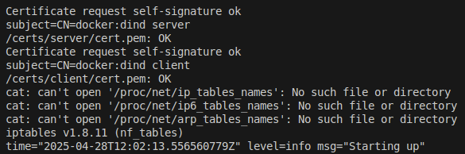

Skonfigurowałem Jenkins\

Wszystko śmiga


> *DinD został skonfigurowany jako osobny kontener ze względu na wymóg izolacji budowy obrazów Docker oraz ochronę hosta.*

### 2. Konfiguracja Jenkinsa
1. Po uruchomieniu Jenkinsa z uwzględnieniem wtyczek, przeprowadzono wstępną konfigurację:
    - Ustanowienie połączenia z DinD poprzez zmienne środowiskowe (`DOCKER_HOST`, `DOCKER_CERT_PATH` itp.).
    - Instalacja dodatkowych wtyczek wymaganych do pracy z pipeline Docker (np. `Docker Pipeline`).

2. W ramach testowej konfiguracji utworzone zostały dwa proste projekty:
    1. Projekt wyświetlający wynik `uname`.
    
    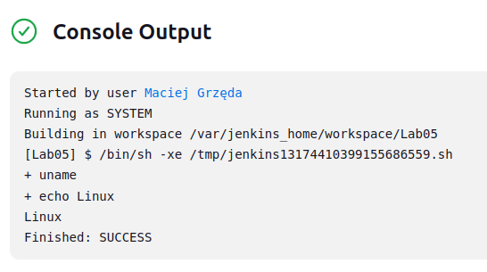 
    
    2. Projekt pobierający nasze repozytorium i budujący wybrany dockerfile (ubuntu), aby sprawdzić połączenie z internetem.
    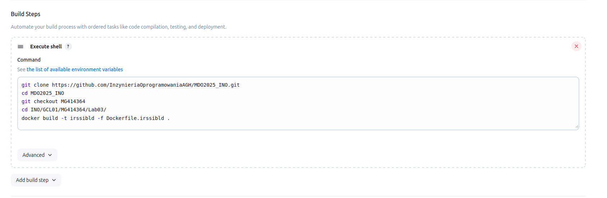
    ```shell
    git clone https://github.com/InzynieriaOprogramowaniaAGH/MDO2025_INO.git
    cd MDO2025_INO
    git checkout MG414364
    cd INO/GCL01/MG414364/
    docker build -t my-ubuntu-image .
    ```
    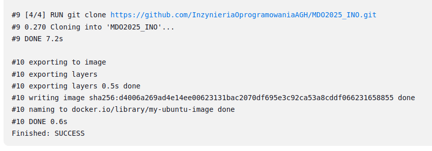


### 3. Dockerfile dla kontenerów
W projekcie zaimplementowano wielostopniowe podejście do budowy i testowania RustScan. Przygotowano trzy osobne pliki Dockerfile wykorzystywane przez pipeline:
- **Builder**: Obraz budujący projekt z wykorzystaniem `cargo` (taki `cmake` dla rust'a).
``` dockerfile
    FROM rust:bullseye AS builder
    WORKDIR /app
    RUN git clone https://github.com/bee-san/RustScan.git .
    RUN cargo build --release
```
- **Tester**: Obraz oparty na `builder` służący wyłącznie do testów.
``` dockerfile
    ARG IMAGE_NAME
    ARG VERSION
    FROM ${IMAGE_NAME}-builder:${VERSION} AS tester
    WORKDIR /app
    RUN cargo test --release
```
> Wyniki testu zapisywane są do pliku (*RustScan_test.log*). Fragment:
```shell
#5 [2/2] RUN cargo test --tests --release
#5 0.497     Finished `release` profile [optimized] target(s) in 0.27s
#5 0.505      Running unittests src/lib.rs (target/release/deps/rustscan-7f83e15873e5592d)
#5 0.507 
#5 0.507 running 50 tests
#5 0.508 test address::tests::parse_addresses_with_address_exclusions ... ok
#5 0.508 test address::tests::parse_addresses_with_cidr_exclusions ... ok
#5 0.508 test address::tests::parse_correct_addresses ... ok
```
- **Deploy**: Obraz uruchamiający gotową aplikację na bazie `debian:bullseye-slim`.
``` dockerfile
    ARG IMAGE_NAME
    ARG VERSION
    FROM ${IMAGE_NAME}-builder:${VERSION} AS deploybase

    FROM debian:bullseye-slim
    COPY --from=deploybase /app/target/release/rustscan /usr/local/bin/
    ENTRYPOINT ["rustscan"]
```
> *Oddzielny obraz `deploy` pozwala na ograniczenie rozmiaru obrazu finalnego, eliminując zbędne zależności wykorzystane jedynie podczas budowy. Ostatecznym artefaktem jest plik binarny, jako że aplikacja powinna działać na każdym systemie linux po zbudowaniu, więc nie ma sensu wrzucać jej do kolejnego kontenera.*

Wszystkie pliki *Dockerfile* przetestowane zostały "na sucho":


## Pipeline w Jenkins
Pipeline został zaimplementowany w postaci pliku `Jenkinsfile`. Skrypt został podzielony na etapy odpowiadające krytycznej ścieżce CI/CD. Poniżej przedstawiono każdy z etapów:
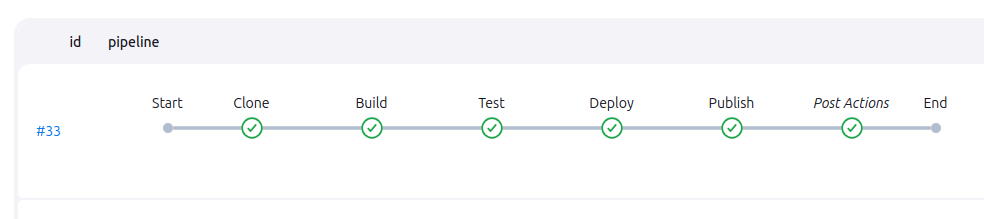
### 1. Etap `Clone`
W pierwszym etapie pipeline klonuje repozytorium RustScan z oficjalnego GitHub-a:
```json
stage('Clone') {
    steps {
        git 'https://github.com/bee-san/RustScan.git'
    }
}
```
Użycie **git** z poziomu Jenkins pozwala na automatyczne dostosowanie do środowiska pipeline, oraz zapewnia korzystanie z najnowszej wersji kodu.
### 2. Etap `Build`
Kompilacja projektu odbywa się na podstawie `Dockerfile` w obrazie `rust:bullseye`. Wynikiem tego etapu jest obraz `builder`.
```json
stage('Build') {
    steps {
        script {
            docker.build("${IMAGE_NAME}-builder:${VERSION}", "-f Dockerfile.rustscanbld .")
        }
    }
}
```
### 3. Etap `Test`
Bazując na obrazie `builder`, stworzony został obraz `tester`, uruchamiający testy dostępne w repozytorium RustScan:
```json
stage('Test') {
    steps {
        script {
            docker.build("${IMAGE_NAME}-tester:${VERSION}", 
                "--build-arg IMAGE_NAME=${IMAGE_NAME} --build-arg VERSION=${VERSION} -f Dockerfile.rustscantest .")
        }
    }
}
```
### 4. Etap `Deploy`
Ten etap tworzy obraz `deploy` zawierający tylko finalną wersję binarną aplikacji.
```json
stage('Deploy') {
    steps {
        script {
            docker.build("${IMAGE_NAME}:${VERSION}", 
                "--build-arg IMAGE_NAME=${IMAGE_NAME} " +
                "--build-arg VERSION=${VERSION} " +
                "-f Dockerfile.rustscandeploy .")
            
            // Smoke test
            sh "docker run --rm ${IMAGE_NAME}:${VERSION} --help"
        }
    }
}
```

### 5. Etap `Publish`
Finalnie aplikacja w formie binarnej zostaje zaarchiwizowana w Jenkins jako artefakt:
```json
stage('Publish') {
    steps {
        script {
            sh """
                docker create --name extract ${IMAGE_NAME}-builder:${VERSION}
                docker cp extract:/app/target/release/rustscan ./rustscan-${VERSION}
                docker rm -f extract
            """
            archiveArtifacts artifacts: "rustscan-${VERSION}", onlyIfSuccessful: true
        }
    }
}
```

Ogólna konfiguracja Pipeline:\
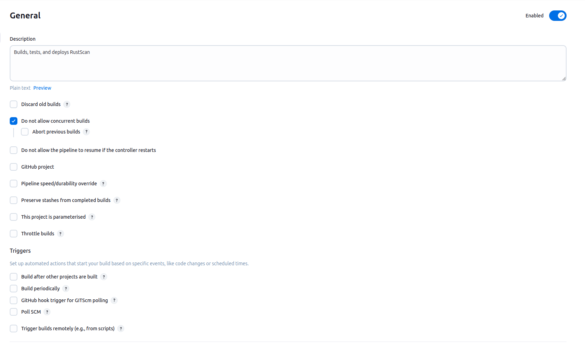

### Szczegóły
- Wersjonowanie polega na dopisywaniu numeru budowy do końca artefaktu. (np. _rustscan<b>-12</b>_)
- Wszysto się zgadza z wcześniej zaplanowanym diagramem UML.
- Pipeline nie bazujne na cache'u, innymi słowy usuwa poprzednie iteracje budowy, przed przystąpieniem do nowej.


Po *kilku* próbach udało się prawidłowo uruchomić pipeline:\
*(każda próba trwa ok. 4 min, i tworzy ~1.5GB plików. Tzw. CI/CE - Continuous Integration and Continuous Errors)* \
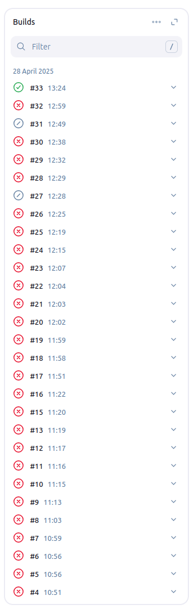

## Rezultat
Wynikiem całego pipeline był jeden artefakt (plik binarny):\
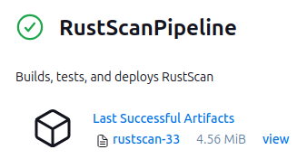

Po pobraniu i uruchomieniu pliku na maszynie host, widać, że wszystko działa, jak powinno.\
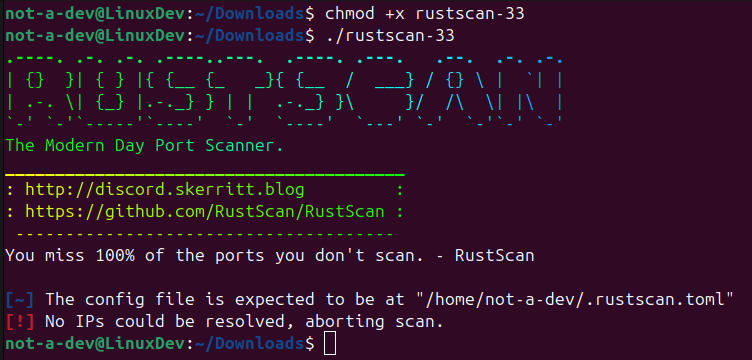


## Załączniki:
Cały plik Jenkinsfile:
```dockerfile
pipeline {
    agent any
    options {
        disableConcurrentBuilds()
        timeout(time: 30, unit: 'MINUTES')
    }
    environment {
        IMAGE_NAME = "rustscan"
        VERSION = "${env.BUILD_ID}"
    }
    stages {
        stage('Clone') {
            steps {
                git 'https://github.com/bee-san/RustScan.git'
            }
        }
        stage('Build') {
            steps {
                script {
                    docker.build("${IMAGE_NAME}-builder:${VERSION}", "-f Dockerfile.rustscanbld .")
                }
            }
        }
        stage('Test') {
            steps {
                script {
                    docker.build("${IMAGE_NAME}-tester:${VERSION}", 
                        "--build-arg IMAGE_NAME=${IMAGE_NAME} --build-arg VERSION=${VERSION} -f Dockerfile.rustscantest .")
                }
            }
        }
        stage('Deploy') {
            steps {
                script {
                    docker.build("${IMAGE_NAME}:${VERSION}", 
                        "--build-arg IMAGE_NAME=${IMAGE_NAME} " +
                        "--build-arg VERSION=${VERSION} " +
                        "-f Dockerfile.rustscandeploy .")
                    
                    // Smoke test
                    sh "docker run --rm ${IMAGE_NAME}:${VERSION} --help"
                }
            }
        }
        stage('Publish') {
            steps {
                script {
                    // Kopiuj plik binarny z kontenera buildowego
                    sh """
                        docker create --name extract ${IMAGE_NAME}-builder:${VERSION}
                        docker cp extract:/app/target/release/rustscan ./rustscan-${VERSION}
                        docker rm -f extract
                    """
                    
                    archiveArtifacts artifacts: "rustscan-${VERSION}", onlyIfSuccessful: true
                }
            }
        }
    }
    post {
        always {
            sh 'docker system prune -af'
            archiveArtifacts artifacts: '**/logs/*.log', allowEmptyArchive: true
        }
    }
}
```

- Historia terminala:
```shell
  585  docker network create jenkins
  586  docker run   --name jenkins-docker   --rm   --privileged   --network jenkins   --network-alias docker   --env DOCKER_TLS_CERTDIR=/certs   --volume jenkins-docker-certs:/certs/client   --volume jenkins-data:/var/jenkins_home   --publish 2376:2376   docker:dind   --storage-driver overlay2
  587  '
  588  pwd
  589  ls
  590  ls -a
  591  cd .ssh/
  592  ls
  593  ssh-add ~/.ssh/GitKey
  594  eval "$(ssh-agent -s)"
  595  ssh-add ~/.ssh/GitKey
  596  cat GitKey.pub 
  597  cd ..
  598  cd MDO2025_INO/
  599  git pull
  600  git status
  601  git add .
  602  git status
  603  git commit -m "Added lab 03 and 04"
  604  git status
  605  git commit -m "Added lab 03 and 04"
  606  git commit -m "MG414364 Added lab 03 and 04"
  607  git upadte
  608  git pull
  609  git status
  610  git push
  611  docker run   --name jenkins-docker   --rm   --privileged   --network jenkins   --network-alias docker   --env DOCKER_TLS_CERTDIR=/certs   --volume jenkins-docker-certs:/certs/client   --volume jenkins-data:/var/jenkins_home   --publish 2376:2376   docker:dind   --storage-driver overlay2
  612  git push
  613  docker run --rm -it ubuntu
  614  docker run --rm -it alpine/socat
  615  docker run --rm -it ubuntu
  616  docker run --rm -it --name iperf-client --network host ubuntu
  617  docker run --rm -it --name iperf-client --network donut
  618  docker run --rm -it --name iperf-client --network donut ubuntu
  619  docker run --name jenkins     -p 8080:8080 -p 50000:50000     --link      -e DOCKER_HOST=tcp://docker:2375     -d jenkins/jenkins:lts
  620  docker run --name jenkins     -p 8080:8080 -p 50000:50000     --link jenkins-docker:docker     -e DOCKER_HOST=tcp://docker:2375     -d jenkins/jenkins:lts
  621  docker run --name jenkins     -p 8080:8080 -p 50000:50000     --link jenkins-docker:docker     -e DOCKER_HOST=tcp://docker:2375     -d jenkins/jenkins:lts
  622    docker run --name jenkins     -p 8080:8080 -p 50000:50000     --network jenkins   	--network-alias docker     --link dind:docker     -e DOCKER_HOST=tcp://docker:2375     -d jenkins/jenkins:lts
  623  docker ps
  624  docker logs jenkins
  625  docker ps -a
  626  history
  627  cd MDO2025_INO/
  628  cd INO/
  629  cd GCL01/MG414364/
  630  ls
  631  git pull
  632  sudo systemctl start sshd.service
  633  git pull
  634  eval "$(ssh-agent -s)"
  635  git pull
  636  ssh -T git@github.com
  637  ssh-keygen -t ed25519 -C "gmaciejg525@gmail.com"
  638  eval "$(ssh-agent -s)"
  639  ls
  640  mv GitKey* .ssh
  641  mv GitKey* .ssh/
  642  mv GitKey* /.ssh
  643  mv GitKey* ~/.ssh/
  644  git pull
  645    docker run --name jenkins     -p 8080:8080 -p 50000:50000     --network jenkins   	--network-alias docker     --link dind:docker     -e DOCKER_HOST=tcp://docker:2375     -d jenkins/jenkins:lts
  646  ls
  647  mkdir Lab05
  648  cd Lab05
  649  nano Dockerfile
  650  docker build -t myjenkins-blueocean:2.492.2-1 .
  651  docker run   --name jenkins-blueocean   --restart=on-failure   --detach   --network jenkins   --env DOCKER_HOST=tcp://docker:2376   --env DOCKER_CERT_PATH=/certs/client   --env DOCKER_TLS_VERIFY=1   --publish 8080:8080   --publish 50000:50000   --volume jenkins-data:/var/jenkins_home   --volume jenkins-docker-certs:/certs/client:ro   myjenkins-blueocean:2.492.2-1
  652  docker pull ubuntu
  653  git status
  654  git add .
  655  git staus
  656  git status
  657  git add .
  658  git status
  659  cd ..
  660  git add .
  661  git status
  662  git commit -m "MG414364 Added basic Lab05"
  663  git status
  664  git push
  665  eval "$(ssh-agent -s)"
  666  git push
  667  iperf3 -c localhost -p 5201
  668  docker inspect -f '{{range.NetworkSettings.Networks}}{{.IPAddress}}{{end}}' iperf-server
  669  iperf3 -c donut -p 5201
  670  iperf3 -c iperf-server -p 5201
  671  iperf3 -c 172.18.0.2 -p 5201
  672  top
  673  ls
  674  mkdir rust_docker
  675  cd rust_docker/
  676  ls
  677  docker run --rm -it rust
  678  shutdown
  679  ls
  680  cd rust_docker/
  681  ls
  682  cd ..
  683  cd MDO2025_INO/
  684  ls -l
  685  cd ../rust_docker/
  686  ls -l
  687  cd ../MDO2025_INO/INO/GCL01/MG414364/
  688  ls
  689  mkdir RustScan
  690  cd Lab04
  691  ls
  692  cd ../RustScan/
  693  df -h
  694  docker build -t rustscanbld -f Dockerfile.rustscanbld .
  695  docker build -t rustscantest -f Dockerfile.rustscantest .
  696  docker build -t rustscanbld -f Dockerfile.rustscanbld .
  697  docker build -t rustscantest -f Dockerfile.rustscantest .
  698  docker build -t --no-cache rustscantest -f Dockerfile.rustscantest . > RustScan_test.log
  699  docker build --no-cache -t rustscantest -f Dockerfile.rustscantest . > RustScan_test.log
  700  docker build --no-cache --progress=plain -t rustscantest -f Dockerfile.rustscantest . &> RustScan_test.log
  701  docker build -t rustscandeploy -f Dockerfile.rustscandeploy .
  702  cd ..
  703  cd RustScan-Pipeline/
  704  ls
  705  docker build --no-cache --progress=plain -t rustscantest -f Dockerfile.rustscantest . &> RustScan_test.log
  706  git status
  707  cd ..
  708  git status
  709  git push
  710  eval "$(ssh-agent -s)"
  711  git push
  712  ssh -vT git@github.com
  713  cd ~/.ssh/
  714  ls
  715  cat GitGmaci.pub 
  716  ssh-add ~/.ssh/GitGmaci
  717  cd ../
  718  cd MDO2025_INO/
  719  git status
  720  ssh -vT git@github.com
  721  git status
  722  git puhs
  723  git push
  724  cd ~/.ssh/
  725  ls
  726  cat GitGmaci.pub 
  727  ssh -vT git@github.com
  728  cd ../
  729  cd MDO2025_INO/
  730  git staus
  731  git status
  732  git push
  733  cat %JENKINS_HOME%/users/users
  734  cd INO/GCL01/MG414364/
  735  ls
  736  cd RustScan-Pipeline/
  737  ls
  738  docker build -t rustscandeploy -f Dockerfile.rustscandeploy .
  739  ls
  740  docker build -t rustscandeploy -f Dockerfile.rustscandeploy .
  741  find Jenkinsfile
  742  ;s
  743  ls
  744  cd rust_docker/
  745  ls
  746  cd ..
  747  ls
  748  cd MacGrze/
  749  ls
  750  cd MDO2025_INO/
  751  cd INO/GCL01/MG414364/
  752  ls
  753  cd RustScan-Pipeline/
  754  touch Jenkinsfile
  755  docker run   --name jenkins-blueocean   --detach   --network jenkins   --env DOCKER_HOST=tcp://docker:2376   --env DOCKER_CERT_PATH=/certs/client   --env DOCKER_TLS_VERIFY=1   --volume jenkins-data:/var/jenkins_home   --volume jenkins-docker-certs:/certs/client:ro   --volume ~/MDO2025_INO/INO/GCL01/MG414364/RustScan-Pipeline:/var/jenkins_home/workspace \
  756    --publish 8080:8080   --publish 50000:50000   myjenkins-blueocean:2.492.2-1
  757  docker run   --name jenkins-blueocean   --detach   --network jenkins   --env DOCKER_HOST=tcp://docker:2376   --env DOCKER_CERT_PATH=/certs/client   --env DOCKER_TLS_VERIFY=1   --volume jenkins-data:/var/jenkins_home   --volume jenkins-docker-certs:/certs/client:ro   --volume ~/MDO2025_INO/INO/GCL01/MG414364/RustScan-Pipeline:/var/jenkins_home/workspace   --publish 8080:8080   --publish 50000:50000   myjenkins-blueocean:2.492.2-1
  758  docker rename jenkins-blueocean jenkins-old
  759  docker run   --name jenkins-blueocean   --detach   --network jenkins   --env DOCKER_HOST=tcp://docker:2376   --env DOCKER_CERT_PATH=/certs/client   --env DOCKER_TLS_VERIFY=1   --volume jenkins-data:/var/jenkins_home   --volume jenkins-docker-certs:/certs/client:ro   --volume ~/MDO2025_INO/INO/GCL01/MG414364/RustScan-Pipeline:/var/jenkins_home/workspace   --add-host=docker:172.17.0.1   --publish 8080:8080   --publish 50000:50000   myjenkins-blueocean:2.492.2-1
  760  history
  761  ls
  762  cd ..
  763  docker exec -it --user root jenkins-blueocean chown -R jenkins:jenkins /var/jenkins_home/workspace
  764  docker run   --name jenkins-blueocean   --user root   --detach   --network jenkins   --env DOCKER_HOST=tcp://docker:2376   --env DOCKER_CERT_PATH=/certs/client   --env DOCKER_TLS_VERIFY=1   --volume jenkins-data:/var/jenkins_home   --volume jenkins-docker-certs:/certs/client:ro   --volume /home/MacGrze/MDO2025_INO/INO/GCL01/MG414364/RustScan-Pipeline:/var/jenkins_home/workspace   --publish 8080:8080   myjenkins-blueocean:2.492.2-1
  765  docker run   --name jenkins-blueocean   --detach   --network jenkins   --env DOCKER_HOST=tcp://docker:2376   --env DOCKER_CERT_PATH=/certs/client   --env DOCKER_TLS_VERIFY=1   --volume jenkins-data:/var/jenkins_home   --volume jenkins-docker-certs:/certs/client:ro   --volume /home/MacGrze/MDO2025_INO/INO/GCL01/MG414364/RustScan-Pipeline:/var/jenkins_home/workspace   --publish 8080:8080   myjenkins-blueocean:2.492.2-1
  766  cd RustScan-Pipeline/RustScanPipeline/
  767  ls
  768  pwd
  769  chmod 775 .
  770  sudo chmod 775 .
  771  chown -R jenkins:jenkins /home/MacGrze/MDO2025_INO/INO/GCL01/MG414364/RustScan-Pipeline
  772  usrs
  773  usr
  774  whoami
  775  docker run   --name jenkins-blueocean   --detach   --network jenkins   --env DOCKER_HOST=tcp://docker:2376   --env DOCKER_CERT_PATH=/certs/client   --env DOCKER_TLS_VERIFY=1   --volume jenkins-data:/var/jenkins_home   --volume jenkins-docker-certs:/certs/client:ro   --volume /home/MacGrze/MDO2025_INO/INO/GCL01/MG414364/RustScan-Pipeline:/var/jenkins_home/workspace   --publish 8080:8080   myjenkins-blueocean:2.492.2-1
  776  sudo usermod -aG wheel MacGrze
  777  sudo -v
  778  logout
  779  ls
  780  cd MDO2025_INO/
  781  cd INO/
  782  cd GCL01/MG414364/
  783  ls
  784  cd RustScan-Pipeline/
  785  ls
  786  cd ..
  787  ls
  788  cd Lab05
  789  ls
  790  cd ..
  791  cd Lab04
  792  ls
  793  cd ..
  794  find Jenkinsfile
  795  find Jenkinsfile ~/
  796  find -h
  797  find --help
  798  pwd
  799  Found unhandled hudson.remoting.ProxyException exception:
  800  java.nio.file.AccessDeniedException: /var/jenkins_home/workspace/RustScanPipeline@tmp
  801  	java.base/sun.nio.fs.UnixException.translateToIOException(Unknown Source)
  802  	java.base/sun.nio.fs.UnixException.rethrowAsIOException(Unknown Source)
  803  	java.base/sun.nio.fs.UnixFileSystemProvider.createDirectory(Unknown Source)
  804  	java.base/java.nio.file.Files.createDirectory(Unknown Source)
  805  	java.base/java.nio.file.Files.createAndCheckIsDirectory(Unknown Source)
  806  ls -ld /var/jenkins_home/workspace
  807  ls -l
  808  sudo chmod -R 777  RustScan-Pipeline/
  809  ls -l
  810  sudo chown jenkins:jenkins RustScan-Pipeline/
  811   logout
  812  sudo -v
  813  sudo ls
  814  docker run   --name jenkins-blueocean   --detach   --network jenkins   --env DOCKER_HOST=tcp://docker:2376   --env DOCKER_CERT_PATH=/certs/client   --env DOCKER_TLS_VERIFY=1   --volume jenkins-data:/var/jenkins_home   --volume jenkins-docker-certs:/certs/client:ro   --volume /home/MacGrze/MDO2025_INO/INO/GCL01/MG414364/RustScan-Pipeline:/var/jenkins_home/workspace   --publish 8080:8080   myjenkins-blueocean:2.492.2-1
  815  chmod -R 755 /home/MacGrze/MDO2025_INO/INO/GCL01/MG414364/RustScan-Pipeline
  816  sudo chmod -R 755 /home/MacGrze/MDO2025_INO/INO/GCL01/MG414364/RustScan-Pipeline
  817  docker run   --name jenkins-blueocean   --detach   --network jenkins   --env DOCKER_HOST=tcp://docker:2376   --env DOCKER_CERT_PATH=/certs/client   --env DOCKER_TLS_VERIFY=1   --volume jenkins-data:/var/jenkins_home   --volume jenkins-docker-certs:/certs/client:ro   --volume /home/MacGrze/MDO2025_INO/INO/GCL01/MG414364/RustScan-Pipeline:/var/jenkins_home/workspace   --publish 8080:8080   myjenkins-blueocean:2.492.2-1
  818  docker run   --name jenkins-blueocean   --detach   --network jenkins   --env DOCKER_HOST=tcp://docker:2376   --env DOCKER_CERT_PATH=/certs/client   --env DOCKER_TLS_VERIFY=1   --volume jenkins-data:/var/jenkins_home   --volume jenkins-docker-certs:/certs/client:ro   --volume /home/MacGrze/MDO2025_INO/INO/GCL01/MG414364/RustScan-Pipeline:/var/jenkins_home/workspace   --add-host=docker:172.17.0.1   --publish 5000:5000   --publish 8080:8080   myjenkins-blueocean:2.492.2-1
  819  docker ps | grep jenkins-docker
  820  docker run   --name jenkins-docker   --detach   --privileged   --network jenkins   --network-alias docker   --add-host=docker:172.17.0.1   --env DOCKER_TLS_CERTDIR=/certs   --volume jenkins-docker-certs:/certs/client   --volume jenkins-data:/var/jenkins_home   --publish 2376:2376   docker:dind   --storage-driver overlay2
  821  history
  ```