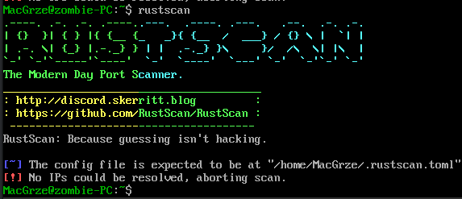
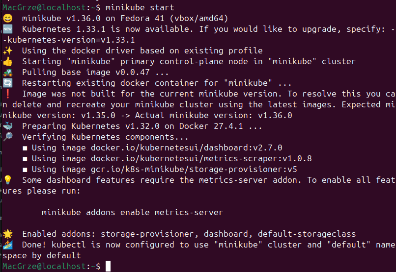
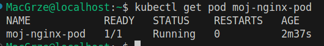
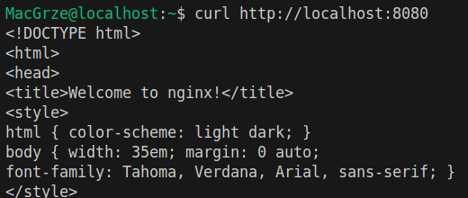
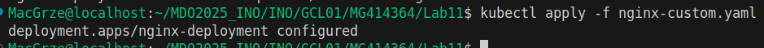
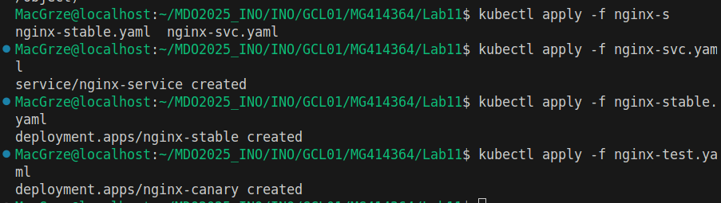

# Sprawozdanie 3
###### Maciej Grzęda
## Lab 08: Automatyzacja i zdalne wykonywanie poleceń za pomocą Ansible

### Cel laboratorium

Celem tego laboratorium było zapoznanie się z narzędziem Ansible oraz jego wykorzystaniem do automatyzacji zadań administracyjnych, konfiguracji systemów i wdrażania aplikacji na zdalnych maszynach.

### 1. Instalacja zarządcy Ansible

##### 1.1. Utworzenie drugiej maszyny wirtualnej (`ansible-target`)
- Utworzyłem maszynę wirtualną Ansible:\


- Stworzyłem użytkownika *ansible* oraz hostname `ansible-target` (obie czynności podczas instalacji)\


- Zainstalowałem `tar`, oraz `openssh`\


- Wykonałem *Snapshot* maszyny:\


##### 1.2. Instalacja Ansible na głównej maszynie wirtualnej
- Bez problemowo zainstalowałem Ansible przy pomocy `sudo dnf install ansible`:\


##### 1.3. Wymiana kluczy SSH
- Wymieniłem klucze ssh, podobnie, jak podczas pierwszych zajęć (oraz `ssh-copy-id`) i połączyłem się z drugą maszyną wirtualną:\


### 2. Inwentaryzacja

##### 2.1. Ustalenie nazw komputerów i konfiguracja DNS
- Aby bez problemowo łączyć się z maszyną "ansible-target", dodałem ją do `/etc/hosts`:\


##### 2.2. Weryfikacja łączności
- Zweryfikowałem łączność między maszynami po nazwach (`ping ansible-target`).\


##### 2.3. Stworzenie pliku inwentaryzacji
- Utworzyłem plik inwentaryzacji `inventory.ini`:
    ```ini
    [Orchestrators]
    kontroler ansible_host=localhost ansible_connection=local
    
    [Endpoints]
    ansible-target ansible_host=ansible-target ansible_user=ansible
    ```

##### 2.4. Wysłanie żądania `ping` do wszystkich maszyn za pomocą modułu `ping` Ansible
*   Użyłem polecenia `ansible all -m ping -i inventory.ini` i wysłałem ping:\


#### 3. Zdalne wywoływanie procedur (Playbook)

*   Stworzyłem plik playbooka (`playbook.yaml`).
    ```yaml
    - name: Podstawowa konfiguracja i testy
      hosts: all # Lub bardziej szczegółowo np. Endpoints, Orchestrators
      become: yes # Jeśli operacje wymagają sudo
      tasks:
        - name: Ping wszystkich hostów
          ansible.builtin.ping:

        - name: Kopiuj plik inwentaryzacji na maszyny Endpoints
          ansible.builtin.copy:
            src: inventory.ini
            dest: /home/ansible/inventory_copied.ini 
          when: inventory_hostname in groups['Endpoints']

        - name: Zaktualizuj pakiety w systemie (Debian/Ubuntu) # Wolę na wszelki wypadek nie aktualizować fedory...
          ansible.builtin.apt:
            update_cache: yes
            upgrade: dist
          when: ansible_os_family == "Debian"

        - name: Zrestartuj usługę sshd
          ansible.builtin.service:
            name: sshd
            state: restarted

        - name: Zrestartuj usługę rngd
          ansible.builtin.service:
            name: rngd # Nazwa usługi rngd
            state: restarted
          ignore_errors: yes
      ```

#### 3.1-4 Odpaliłem ansible-playbook przy pomocy `ansible-playbook -i inventory.ini playbook.yaml -K` (argument `-K`, aby przekazać hasło):
\
Wszystkie czynności się udały!
Skopiowany plik inwentaryzacji:\


##### 3.5. Przeprowadziłem operacje względem maszyny z wyłączonym serwerem SSH
- Wyłączyłem `openssh` przy pomocy `systemctl stop sshd` i jeszcze raz odpaliłem _playbook_:\
\
    Tym razem widać, że połowa czynności (te na _ansible-target_) się nie wykonały.

##### 4.1. W moim przypadku artefakt jest plikiem binarnym:
- Zainicjalizowałem środowisko `ansible-galaxy` przy pomocy `ansible-galaxy init deploy_rustscan_app`:\


- Następnie dodałem plik `main.yml` do folderu "tasks":
    ```yml
    - name: Stwórz Dockerfile do zbudowania obrazu dla rustscan
      ansible.builtin.copy:
        dest: "/tmp/Dockerfile.rustscan"
        content: |
          FROM {{ base_docker_image }}
          #RUN apk add --no-cache libgcc
          COPY rustscan /usr/local/bin/rustscan
          RUN chmod +x /usr/local/bin/rustscan
          ENTRYPOINT ["/usr/local/bin/rustscan"]
      vars:
        base_docker_image: "ubuntu:latest"
    
    - name: Zbuduj obraz Docker dla rustscan za pomocą polecenia shell
      ansible.builtin.shell: |
        set -e
        cd /tmp
        docker build --pull --no-cache -f Dockerfile.rustscan -t rustscan_app:latest .
      args:
        executable: /bin/bash
      changed_when: true
      become: yes
    
    - name: Uruchom kontener rustscan
      community.docker.docker_container:
        name: rustscan_instance
        image: rustscan_app:latest
        command: "-a 127.0.0.1"
        state: started
        detach: false 
        auto_remove: false 
      register: rustscan_log_output
    
    - name: Wyświetl logi rustscan
      ansible.builtin.debug:
        msg: "Docker logs: {{rustscan_log_output.container.Output | trim | regex_replace('\\x1B\\[[0-?]*[ -/]*[@-~]', '') }}"
    ```
  *Były problemy z użyciem `docker_image`, więc byłem zmuszony zbudować docker przy pomocy `shell`'a*


- Plik binarny z `rustscan` umieściłem w folderze `files` i jest kopiowany przez docker:
    ```dockerfile
    COPY rustscan /usr/local/bin/rustscan
    ```
- Na koniec stworzyłem główny plik `deploy_app_playbook.yaml`:
    ```yaml
    - name: Wdrożenie aplikacji RustScan na Endpoints
      hosts: Endpoints
      become: no
      vars:
        rustscan_binary_path: "files/rustscan"
        rustscan_arguments: "-a 127.0.0.1" # Domyślne argumenty
        base_docker_image_for_rustscan: "ubuntu:latest"
    
      roles:
        - deploy_rustscan_app
    ```

Uruchomiłem _playbook_ przy pomocy `ansible-playbook -i inventory.ini deploy_app_playbook.yaml -K`:\

> Jak widać, wszystko zakończyło się poprawnie (pomijając to, że output jest źle formatowany).

---

## Laboratorium 09: Pliki odpowiedzi dla wdrożeń nienadzorowanych

### Cel laboratorium

Celem tego laboratorium było przygotowanie i wykorzystanie pliku odpowiedzi (Kickstart) do automatycznej, nienadzorowanej instalacji systemu operacyjnego Fedora. Dodatkowo, celem było skonfigurowanie systemu tak, aby po instalacji automatycznie uruchamiał zdefiniowane oprogramowanie.

#### 1.1. Stworzyłem VM z Fedorą
- Skopiowałem odpowiedni plik `anaconda-ks.cfg`, bazujący na poprzedniej instalacji fedory.
    ```yml
    # Generated by Anaconda 41.35
    # Generated by pykickstart v3.58
    #version=DEVEL
    
    # Keyboard layouts
    keyboard --vckeymap=uk --xlayouts='gb','pl'
    # System language
    lang en_GB.UTF-8
    
    # Network information
    network  --bootproto=dhcp --device=enp0s3 --ipv6=auto --activate
    
    %packages
    @^server-product-environment
    
    %end
    
    # Run the Setup Agent on first boot
    firstboot --enable
    
    # Generated using Blivet version 3.11.0
    ignoredisk --only-use=sda
    autopart
    # Partition clearing information
    clearpart --none --initlabel
    
    # System timezone
    timezone Europe/Warsaw --utc
    
    # Root password
    rootpw --iscrypted --allow-ssh $y$j9T$1jvGVsUVnlZQQrQ7uupaQY3t$QIZJaSdzk2vtRvmgOdHg/GNlYVlbDJiAY0DehjapnB0MacGrze@localhost
    ```

##### 1.2. Modyfikacja pliku odpowiedzi
- Dodałem hostname (Zombie-PC), użytkownika (MacGrze), plik do pobrania (RustScan), akcję (odpakowanie .tar.xz):
    ```yml
    # Generated by Anaconda 41.35
    # Generated by pykickstart v3.58
    #version=DEVEL
    
    # Force text mode
    text
    
    # Keyboard layouts
    keyboard --vckeymap=uk --xlayouts='gb','pl'
    # System language
    lang en_GB.UTF-8
    
    # Network information
    network  --bootproto=dhcp --device=enp0s3 --ipv6=auto --activate
    network  --hostname=zombie-PC
    
    %packages
    @^server-product-environment
    
    %end
    
    # Run the Setup Agent on first boot
    firstboot --enable
    
    # Generated using Blivet version 3.11.0
    ignoredisk --only-use=sda
    autopart
    # Partition clearing information
    clearpart --none --initlabel
    
    # System timezone
    timezone Europe/Warsaw --utc
    
    # Root password
    rootpw --iscrypted --allow-ssh $y$j9T$1jvGVsUVnlZQQrQ7uupaQY3t$QIZJaSdzk2vtRvmgOdHg/GNlYVlbDJiAY0DehjapnB0
    user --groups=wheel --name=MacGrze --password=123 --plaintext --gecos="Maciej Grzeda"
    
    # Download, extract, and install RustScan (simplified)
    %post --interpreter=/bin/bash
    # Install necessary tools
    dnf install -y wget tar xz
    
    # Define the download URL and the name of the archive
    RUSTSCAN_DOWNLOAD_URL="https://github.com/bee-san/RustScan/releases/download/2.3.0/rustscan-2.3.0-x86_64-linux.tar.xz"
    ARCHIVE_NAME="rustscan-2.3.0-x86_64-linux.tar.xz"
    TEMP_ARCHIVE_PATH="/tmp/${ARCHIVE_NAME}"
    EXTRACTED_BINARY_NAME="rustscan"
    
    # Download RustScan to /tmp
    echo "Downloading RustScan..."
    wget -O "${TEMP_ARCHIVE_PATH}" "${RUSTSCAN_DOWNLOAD_URL}"
    
    echo "Extracting RustScan..."
    tar -xvf "${TEMP_ARCHIVE_PATH}" -C /tmp
    
    echo "Moving RustScan binary to /usr/local/bin..."
    mv "/tmp/${EXTRACTED_BINARY_NAME}" "/usr/local/bin/${EXTRACTED_BINARY_NAME}"
    
    echo "Setting execute permissions..."
    chmod +x "/usr/local/bin/${EXTRACTED_BINARY_NAME}"
    
    # Clean up the downloaded archive
    echo "Cleaning up..."
    rm -f "${TEMP_ARCHIVE_PATH}"
    
    echo "RustScan installation complete."
    %end
    ```
> W środowisku produkcyjnym nie należy umieszczać haseł jako *plain text*, ale na potrzeby tego laboratorium, wieże w dobro ludzkie, i że nikt mnie nie zhakuje (wszędzie mam hasło 123).

### 1.3 Instalacja Fedory
- Aby skorzystać z pliku odpowiedzi, musiałem wrzucić go do internetu, więc wybrałem stronę "pastebin.com".
    Link może już być martwy: https://pastebin.com/raw/UCyJXV9d
- Przy boot'cie uruchomiłem GRUB i zmodyfikowałem instrukcje:\


- Po chwili zostałem przywitany takim ekranem:\

- następnie przez taki:\

- po krótkiej chwili przez taki:\

- na koniec instalacji przez taki:\

- Następnie musiałem *usunąć płytkę z napędu*:\

- wybrać system:\

- oraz upewnić się, że zainstalowany program działa:\


## Laboratorium 10: Wdrażanie na zarządzalne kontenery: Kubernetes
### Cel laboratorium
Celem tego laboratorium było zapoznanie się z podstawami systemu Kubernetes, w tym instalacja lokalnego klastra za pomocą Minikube, uruchomienie i zarządzanie kontenerami (Podami) oraz wdrożeniami (Deployments). Dodatkowo, celem było przygotowanie aplikacji w postaci obrazu Docker i jej uruchomienie w klastrze Kubernetes, a także zapoznanie się z podstawowymi koncepcjami takimi jak serwisy i przekierowanie portów.
### 1. Instalacja klastra Kubernetes z Minikube
##### 1.1. Instalacja Minikube i `kubectl`
- Przeprowadziłem instalację Minikube, postępując zgodnie z oficjalną [dokumentacją](https://minikube.sigs.k8s.io/docs/start/?arch=%2Flinux%2Fx86-64%2Fstable%2Fbinary+download).\


- Zainstalowałem lub skonfigurowałem narzędzie `kubectl` do współpracy z Minikube (np. przez alias `minikubectl` lub bezpośrednią instalację `kubectl` i ustawienie kontekstu).\


##### 1.2. Uruchomienie klastra Minikube
- Uruchomiłem lokalny klaster Kubernetes za pomocą polecenia `minikube start`.


(*Nie było żadnych problemów sprzętowych, VM ma przydzielone 8GB ram, i 4 rdzenie, a VMBox działa na Linux (Ubuntu)*)

##### 1.3. Uruchomienie i dostęp do Dashboardu Kubernetes
- Uruchomiłem Dashboard Kubernetes za pomocą polecenia `minikube dashboard` (przez terminal w VisualStudio (dla automatycznego przekiorowania portów)).


- Zaraz po tym, otworzyła mi się przeglądarka z Kubernetesem.


### 2. Analiza i przygotowanie kontenera z aplikacją
##### 2.1. Przygotowanie obrazu Docker dla aplikacji
- Jako że moja aplikacja ani nie pracuje w kontenerze, ani nie wyprowadza interfejsu dostępnego przez sieć, to przygotowałem deployment zawierający nginx.
    ```yaml
    apiVersion: apps/v1
    kind: Deployment
    metadata:
      name: nginx-deployment
    spec:
      selector:
        matchLabels:
          app: nginx
      replicas: 2 # tells deployment to run 2 pods matching the template
      template:
        metadata:
          labels:
            app: nginx
        spec:
          containers:
          - name: nginx
            image: nginx:1.27.5
            ports:
            - containerPort: 80
    ```
- Uruchomiłem ten deployment.\


- Upewniłem się, że moja aplikacja poprawnie działa jako kontener.\


- Sprawdziłem też, czy sam `nginx` działa poprawnie:\

- Otworzyła mi się taka strona w przeglądarce:\


### 3. Uruchamianie aplikacji w klastrze Kubernetes
##### 3.1. Uruchomienie kontenera jako Pod w Kubernetes
- Uruchomiłem kontener z moją aplikacją w pod'zie Minikube, używając polecenia `kubectl run`.
    \
    Widok z interfejsu online:
    \
    Widow przez `kubectl`:\
    

##### 3.2. Wyprowadzenie portu i testowanie dostępności aplikacji
- Wyprowadziłem port Poda na lokalny port maszyny hosta, używając polecenia `kubectl port-forward`.\
    

- Przetestowałem komunikację z wyeksponowaną funkcjonalnością aplikacji.\


### 4. Przekształcenie wdrożenia manualnego w plik wdrożenia (Deployment)
##### 4.1. Zapisanie wdrożenia jako plik YML (Deployment)
- Utworzyłem plik manifestu YAML dla Deploymentu mojej aplikacji (lub przykładowej aplikacji np. nginx).
    ```yaml
    apiVersion: apps/v1
    kind: Deployment
    metadata:
      name: nginx-deployment
    spec:
      selector:
        matchLabels:
          app: nginx
      replicas: 2
      template:
        metadata:
          labels:
            app: nginx
        spec:
          containers:
          - name: nginx
            image: nginx:1.27.5
            ports:
            - containerPort: 80 
    ```

##### 4.2. Próbne wdrożenie przykładowego Deploymentu
- Przeprowadziłem próbne wdrożenie przykładowego Deploymentu z pliku YAML za pomocą `kubectl apply`.\
    

- Zweryfikowałem stan wdrożenia.\
    

##### 4.3. Skalowanie Deploymentu
- Zmodyfikowałem plik YAML Deploymentu, aby zwiększyć liczbę replik do 4.\
    

- Zastosowałem zmiany za pomocą `kubectl apply`.\
    

- Zbadałem stan rolloutu za pomocą `kubectl rollout status>`.\
    \
    

##### 4.4. Wyeksponowanie Deploymentu jako Serwis i przekierowanie portu
- Wyeksponowałem Deployment jako Serwis Kubernetes.\
    

- Przekierowałem port do utworzonego Serwisu.\


- Przetestowałem komunikację z aplikacją poprzez Serwis.\


---

## Laboratorium 11: Wdrażanie na zarządzalne kontenery: Kubernetes (2)

### Cel laboratorium
Celem laboratorium było zapoznanie się z zaawansowanymi technikami wdrażania aplikacji w Kubernetes, w tym wersjonowaniem obrazów, kontrolą wdrożeń, strategiami aktualizacji oraz tworzeniem skryptów monitorujących proces wdrażania.

---

### 1. Przygotowanie nowego obrazu

#### 1.1. Rejestracja nowych wersji obrazu
- Przygotowałem dwie działające wersje obrazu `nginx` (1.25.4 i najnowszą) oraz jedną wersję wadliwą, gdyż mój pipeline nie wymagał użycia dockera, a buduje się jakieś 6 min za każdym razem
    - Wersja oryginalna:
        ```yaml
        apiVersion: apps/v1
        kind: Deployment
        metadata:
          name: nginx-deployment
        spec:
          selector:
            matchLabels:
              app: nginx
          replicas: 4
          template:
            metadata:
              labels:
                app: nginx
            spec:
              containers:
              - name: nginx
                image: nginx
                ports:
                - containerPort: 80
        ```
    - Wersja zmodyfikowana (wersja 1.25.4):
      ```yaml
      apiVersion: apps/v1
      kind: Deployment
      metadata:
        name: nginx-deployment
        labels:
          app: nginx
      spec:
        replicas: 4
        selector:
          matchLabels:
            app: nginx
        template:
          metadata:
            labels:
              app: nginx
          spec:
            containers:
            - name: nginx
              image: nginx:1.25.3
              ports:
              - containerPort: 80
              resources:  # Zmiana przydziału zasobów
                requests:
                  cpu: "100m"
                  memory: "128Mi"
                limits:
                  cpu: "200m"
                  memory: "256Mi"
      ```
    - Wersja zwracająca błąd (`false`)
        ```yaml
        apiVersion: apps/v1
        kind: Deployment
        metadata:
          name: nginx-deployment
          labels:
            app: nginx
        spec:
          replicas: 4
          selector:
            matchLabels:
              app: nginx
          template:
            metadata:
              labels:
                app: nginx
            spec:
              containers:
              - name: nginx
                image: nginx:1.25.3
                command: ["/bin/false"] # Powoduje błąd
                ports:
                - containerPort: 80
        ```
---

### 2. Zmiany w deploymencie

#### 2.1. Skalowanie liczby replik
- Modyfikowałem plik `nginx.yaml` zmieniając liczbę replik:
    ```yaml
    replicas: 8  # Zwiększenie do 8 replik
    ```
- Zastosowałem zmiany:\

- Sprawdzenie stanu:\
\
    *8 podów, plus jeden z poprzedniego laboratorium, w zrzutach ekranu już go usunąłem*
- Analogicznie zmniejszałem liczbę replik:
    - Do 1 repliki: `replicas: 1`\
        
    - Do 0 replik: `replicas: 0`\
        
    - Ponowne przeskalowanie do 4 replik: `replicas: 4`\
        

#### 2.2. Aktualizacja wersji obrazu
- Zmieniłem konfigurację deployment'u na `nginx-custom.yaml`:
    ```yaml
    containers:
      - name: nginx
        image: nginx:1.25.3  # Nowa wersja
    ```
- Zastosowałem aktualizację:\


- Sprawdziłem statusu wdrożenia:\


#### 2.3. Wdrożenie wadliwej wersji obrazu
- Zmieniłem konfigurację deployment'u na `nginx-fail.yaml`:
    ```yaml
    containers:
      - name: nginx
        image: nginx:1.25.3
        command: ["/bin/false"]  # This will cause the container to fail immediately
    ```
- Dokonałem aktualizacji:\


- Sprawdziłem status wdrożenia:\
\
*Jak widać, aktualizacja się nie powiodła*

- Przez interfejs użytkownika widać jeszcze to:\


#### 2.4. Przywracanie poprzedniej wersji
- Wyświetliłem historje wdrożeń:\


- Przywróciłem stablilną wersję:\


- Sprawdziłem przywróconą wersję:\
\
Interfejs przeglądarkowy również potwierdza przywrócenie działania:\


---

### 3. Kontrola wdrożenia

#### 3.1. Analiza historii wdrożeń
- Znalazłem problematyczną rewizje szukacjąc we wszystkich dostępnych `/bin/false`:
    ```bash
    kubectl rollout history deployment/nginx-deployment --revision=7
    ```
    

#### 3.2. Skrypt weryfikujący wdrożenie
- Utworzyłem skrypt `CheckTiming.sh` sprawdzający, czy wdrożenie zakończy się w ciągu 60 sekund:
    ```bash
    #!/bin/bash
    # Skrypt weryfikujący czy wdrożenie zakończyło się w 60 sekund
    DEPLOYMENT_NAME="nginx-deployment"
    NAMESPACE="default"
    TIMEOUT=60
    
    echo "### Weryfikacja wdrożenia $DEPLOYMENT_NAME w $TIMEOUT sekund ###"
    
    start_time=$(date +%s)
    end_time=$((start_time + TIMEOUT))
    
    # Sprawdzanie statusu wdrożenia w pętli
    while [ $(date +%s) -lt $end_time ]; do
        status=$(kubectl rollout status deployment/$DEPLOYMENT_NAME -n $NAMESPACE --timeout=5s 2>&1)
        
        if echo "$status" | grep -q "successfully rolled out"; then
            echo "Wdrożenie zakończone sukcesem!"
            exit 0
        fi
        
        sleep 5
    done
    
    # Jeśli przekroczono czas
    echo "Wdrożenie nie zakończyło się w wymaganym czasie ($TIMEOUT sekund)"
    echo "Obecny status:"
    kubectl get deployment/$DEPLOYMENT_NAME -n $NAMESPACE -o wide
    echo "Stan podów:"
    kubectl get pods -n $NAMESPACE -l app=nginx
    exit 1
    ```
- Test skryptu dla udanego wdrożenia:
    ```bash
    ./verify_deployment.sh
    ```
    
- Test skryptu dla przekroczonego czasu (symulacja przez wdrożenie wadliwej wersji z `/bin/false`):\


---

### 4. Strategie wdrożenia

#### 4.1. Strategia Recreate
- Dodałem strategie `Recreate` do `nginx-custom.yaml`:
    ```yaml
      spec:
        strategy:
          type: Recreate
    ```
- Zastosowałem zmiany i wypisałem pody:\
    

#### 4.2. Strategia Rolling Update z parametrami
- Zmodyfikowałem `nginx-custom.yaml`:
    ```yaml
    strategy:
      type: RollingUpdate
      rollingUpdate:
        maxUnavailable: 2  # Maksymalnie 2 niedostępne pody
        maxSurge: 30%      # Maksymalnie 30% dodatkowych podów
    ```
- Przeprowadzenie aktualizacji i monitorowanie:\


#### 4.3. Wdrożenie Canary
- Utworzenie głównego wdrożenia (4 repliki, wersja stabilna):
    ```yaml
    apiVersion: apps/v1
    kind: Deployment
    metadata:
      name: nginx-stable
    spec:
      replicas: 4
      selector:
        matchLabels:
          app: nginx
          track: stable
      template:
        metadata:
          labels:
            app: nginx
            track: stable
        spec:
          containers:
          - name: nginx
            image: nginx:1.28.0
            ports:
            - containerPort: 80
    ```

- Utworzenie wdrożenia canary (1 replika, wersja testowa):
    ```yaml
    apiVersion: apps/v1
    kind: Deployment
    metadata:
      name: nginx-canary
    spec:
      replicas: 1
      selector:
        matchLabels:
          app: nginx
          track: canary
      template:
        metadata:
          labels:
            app: nginx
            track: canary
        spec:
          containers:
          - name: nginx
            image: nginx:1.28.0  # Nowa wersja do testów
            ports:
            - containerPort: 80
    ```

- Utworzenie serwisu kierującego ruch do obu wdrożeń (po etykietach `app: nginx`):
    ```yaml
    apiVersion: v1
    kind: Service
    metadata:
      name: nginx-service
    spec:
      selector:
        app: nginx   # Wybiera pody z obu deploymentów (stable i canary)
      ports:
        - protocol: TCP
          port: 80
          targetPort: 80
    ```

- Uruchomiłem serwis oraz oba deployment'y:\


- Weryfikacja działania:
    - Do serwisu przypisane jest 5 podów, 4 *stable* oraz 1 *canary*:\
    

- Przetestowałem ruch do różnych wersji:
    - Dodałem przekierowanie portów:\
    
    - Okazało się, że przekierowanie portu pozwala na korzystanie tylko z jednego pod'a.\
  
    - Zamknąłem przekierowanie porów i stworzyłem `minikube tunnel`:\
    
    - Znalazłem IP serwisu:\
    
    - Ponowiłem próbę przez `minikube tunnel`:\
    \
    Tym razem widać, że czasami otrzymuje odpowiedź z wersji stable (1.25.3), a rzadziej z wersji testowej (1.28.0).


- Takie podejście pozwala testować nową wersję aplikacji na ograniczonej liczbie użytkowników, co może okazać się przydatne w przypadku problemów.


### Podsumowanie strategii
#### Recreate:
- Mechanizm: Najpierw kończy wszystkie istniejące pody, dopiero potem tworzy nowe.
- Efekt: Krótki przestój (downtime) podczas aktualizacji.
- Zastosowanie: Dla aplikacji, które nie wymagają ciągłej dostępności.
-Obserwacja: Podczas aktualizacji wszystkie pody znikają na chwilę z listy kubectl get pods.

#### Rolling Update:
- Mechanizm: Stopniowa zamiana pod'ów w kontrolowany sposób
- Parametry:
    - maxUnavailable=2: Maksymalnie 2 pody mogą być niedostępne podczas aktualizacji.
    - maxSurge=30%: Może powstać do 30% więcej pod'ów niż docelowa liczba.
- Efekt: Zero przestojów, ciągła dostępność usługi.
- Obserwacja: Widoczne jednoczesne istnienie pod'ów ze starej i nowej wersji oraz większe zużycie zasobów.

#### Canary Deployment:
- Mechanizm: Równoległe uruchomienie starej i nowej wersji aplikacji.
- Efekt: Część ruchu trafia do nowej wersji (np. 10-20%), reszta do stabilnej.
- Zastosowanie: Bezpieczne testowanie nowych wersji w rzeczywistym środowisku.
- Obserwacja: W serwisie widać różne wersje aplikacji obsługujące żądania.


---

## history

```bash
  662  ssh ansible@ansible-target
  663  hostname
  664  ssh ansible@192.168.0.94
  665  ssh ansible@ansible-target
  666  ping ansible-target
  667  sudo nano /etc/hosts
  668  ping ansible-target
  669  ssh ansible@ansible-target
  670  cd MDO2025_INO/INO/GCL01/MG414364/
  671  ls
  672  mkdir Lab08
  673  cd Lab0
  674  cd Lab08
  675  ls
  676  touch inventory.ini
  677  nano inventory.ini 
  678  ansible-inventory  -i inventory.ini --list
  679  ansible myhosts -m ping -i inventory.ini 
  680  ssh ansible@ansible-target
  681  ssh-keygen
  682  ssh-copy-id ansible-ansible-target
  683  ssh-copy-id ansible@ansible-target
  684  ansible myhosts -m ping -i inventory.ini 
  685  ssh ansible@ansible-target 
  686  ansible myhosts -m ping -i inventory.ini 
  687  nano inventory.ini 
  688  ansible myhosts -m ping -i inventory.ini 
  689  nano inventory.ini 
  690  ansible orchestrators -m ping -i inventory.ini 
  691  ansible Orchestrators -m ping -i inventory.ini 
  692  nano inventory.ini 
  693  ansible Orchestrators -m ping -i inventory.ini 
  694  ssh-copy-id MacGrze@127.0.0.1
  695  ansible Orchestrators -m ping -i inventory.ini 
  696  ansible-playbook Orchestrators -m ping -i inventory.ini 
  697  touch playbook.yaml
  698  nano playbook.yaml 
  699  ansible-playbook -i inventory.ini playbook.yaml 
  700  sudo nano /etc/hosts
  701  systemd-resolved
  702  cd MDO2025_INO/INO/GCL01/MG414364/
  703  ls
  704  ls -l
  705  chmod 777 -R RustScan-Pipeline/
  706  sudo chmod 777 -R RustScan-Pipeline/
  707  ls
  708  ls -l
  709  sudo chown jenkins:jenkins RustScan-Pipeline/
  710  sudo chown -R jenkins:jenkins RustScan-Pipeline/
  711  <pre>chown: invalid user: ‘jenkins:jenkins’</pre>
  712  getent passwd jenkins
  713  getent group jenkins
  714  sudo groupadd jenkins
  715  sudo useradd -m -g jenkins jenkins
  716  sudo chown -R jenkins:jenkins RustScan-Pipeline/
  717  ls -al
  718  sudo chown -R 1000:1000 RustScan-Pipeline/
  719  ls -al
  720  id -u
  721  cd RustScan-Pipeline/
  722  ls
  723  ls -al
  724  cd ..
  725  ls -al
  726  docker exec jenkins-blueocean id -u jenkins
  727  docker exec jenkins-blueocean id -g jenkins
  728  sudo setenforce 0
  729  ls -ld /home/MacGrze/MDO2025_INO/INO/GCL01/MG414364/RustScan-Pipeline
  730  nano ~/.bash_history
  731  sudo dnf install ansible
  732  ls
  733  docker run   --name jenkins-blueocean   --detach   --network jenkins   --env DOCKER_HOST=tcp://docker:2376   --env DOCKER_CERT_PATH=/certs/client   --env DOCKER_TLS_VERIFY=1   --volume jenkins-data:/var/jenkins_home   --volume jenkins-docker-certs:/certs/client:ro   --volume /home/MacGrze/MDO2025_INO/INO/GCL01/MG414364/RustScan-Pipeline:/var/jenkins_home/workspace   --publish 8080:8080   myjenkins-blueocean:2.492.2-1
  734  docker run   --name jenkins-docker   --detach   --privileged   --network jenkins   --network-alias docker   --add-host=docker:172.17.0.1   --env DOCKER_TLS_CERTDIR=/certs   --volume jenkins-docker-certs:/certs/client   --volume jenkins-data:/var/jenkins_home   --publish 2376:2376   docker:dind   --storage-driver overlay2
  735  history
  736  ls
  737  cd MDO2025_INO/INO/GCL01/MG414364/
  738  ls
  739  cd RustScan-Pipeline/
  740  ls
  741  cd ..
  742  ls
  743  cd Lab05
  744  ls
  745  nano Dockerfile 
  746  docker run   --name jenkins-blueocean   --detach   --network jenkins   --env DOCKER_HOST=tcp://docker:2376   --env DOCKER_CERT_PATH=/certs/client   --env DOCKER_TLS_VERIFY=1   --volume jenkins-data:/var/jenkins_home   --volume jenkins-docker-certs:/certs/client:ro   --volume /home/MacGrze/MDO2025_INO/INO/GCL01/MG414364/RustScan-Pipeline:/var/jenkins_home/workspace   --add-host=docker:172.17.0.1   --publish 5000:5000   --publish 8080:8080   myjenkins-blueocean:2.492.2-1
  747  hostname
  748  docker run   --name jenkins-blueocean   --detach   --network jenkins   --env DOCKER_HOST=tcp://docker:2376   --env DOCKER_CERT_PATH=/certs/client   --env DOCKER_TLS_VERIFY=1   --volume jenkins-data:/var/jenkins_home   --volume jenkins-docker-certs:/certs/client:ro   --volume /home/MacGrze/MDO2025_INO/INO/GCL01/MG414364/RustScan-Pipeline:/var/jenkins_home/workspace   --add-host=docker:172.17.0.1   --publish 5000:5000   --publish 8080:8080   myjenkins-blueocean:2.492.2-1
  749  docker run   --name jenkins-blueocean   --detach   --network jenkins   --env DOCKER_HOST=tcp://docker:2376   --env DOCKER_CERT_PATH=/certs/client   --env DOCKER_TLS_VERIFY=1   --volume jenkins-data:/var/jenkins_home   --volume jenkins-docker-certs:/certs/client:ro   --volume /home/MacGrze/MDO2025_INO/INO/GCL01/MG414364/RustScan-Pipeline:/var/jenkins_home/workspace   --publish 8080:8080   myjenkins-blueocean:2.492.2-1
  750  ,docker run \
  751  --name jenkins-blueocean \
  752  --restart=on-failure \
  753  --detach \
  754  --network jenkins \
  755  --env DOCKER_HOST=tcp://docker:2376 \
  756  --env DOCKER_CERT_PATH=/certs/client \
  757  --env DOCKER_TLS_VERIFY=1 \
  758  --publish 8080:8080 \
  759  --publish 50000:50000 \
  760  --volume jenkins-data:/var/jenkins_home \
  761  --volume /home/MacGrze/MDO2025_INO/INO/GCL01/MG414364/RustScan-Pipeline:/var/jenkins_home/workspace
  762  --volume jenkins-docker-certs:/certs/client:ro \
  763  myjenkins-blueocean:2.492.2-1
  764  docker run --name jenkins-blueocean --restart=on-failure --detach --network jenkins --env DOCKER_HOST=tcp://docker:2376 --env DOCKER_CERT_PATH=/certs/client --env DOCKER_TLS_VERIFY=1 --publish 8080:8080 --publish 50000:50000 --volume jenkins-data:/var/jenkins_home --volume /home/MacGrze/MDO2025_INO/INO/GCL01/MG414364/RustScan-Pipeline:/var/jenkins_home/workspace
  765  --volume jenkins-docker-certs:/certs/client:ro myjenkins-blueocean:2.492.2-1
  766  docker run --name jenkins-blueocean --restart=on-failure --detach --network jenkins --env DOCKER_HOST=tcp://docker:2376 --env DOCKER_CERT_PATH=/certs/client --env DOCKER_TLS_VERIFY=1 --publish 8080:8080 --publish 50000:50000 --volume jenkins-data:/var/jenkins_home --volume /home/MacGrze/MDO2025_INO/INO/GCL01/MG414364/RustScan-Pipeline:/var/jenkins_home/workspace --volume jenkins-docker-certs:/certs/client:ro myjenkins-blueocean:2.492.2-1
  767  docker run --name jenkins-docker --detach --rm --privileged --network jenkins --network-alias docker --env DOCKER_TLS_CERTDIR=/certs --volume jenkins-docker-certs:/certs/client --volume jenkins-data:/var/jenkins_home --publish 2376:2376 docker:dind --storage-driver overlay2
  768  docker run --name jenkins-blueocean --restart=on-failure --detach --network jenkins --env DOCKER_HOST=tcp://docker:2376 --env DOCKER_CERT_PATH=/certs/client --env DOCKER_TLS_VERIFY=1 --publish 8080:8080 --publish 50000:50000 --volume jenkins-data:/var/jenkins_home --volume /home/MacGrze/MDO2025_INO/INO/GCL01/MG414364/RustScan-Pipeline:/var/jenkins_home/workspace --volume jenkins-docker-certs:/certs/client:ro myjenkins-blueocean:2.492.2-1
  769  docker run --name jenkins-blueocean --restart=on-failure --detach --network jenkins --env DOCKER_HOST=tcp://docker:2376 --env DOCKER_CERT_PATH=/certs/client --env DOCKER_TLS_VERIFY=1 --publish 8080:8080 --publish 50000:50000 --volume jenkins-data:/var/jenkins_home --volume /home/MacGrze/MDO2025_INO/INO/GCL01/MG414364/RustScan-Pipeline:/var/jenkins_home/workspace --volume jenkins-docker-certs:/certs/client:ro jenkins-blueocean:2.492.2-1
  770  docker run --name jenkins-blueocean --restart=on-failure --detach --network jenkins --env DOCKER_HOST=tcp://docker:2376 --env DOCKER_CERT_PATH=/certs/client --env DOCKER_TLS_VERIFY=1 --publish 8080:8080 --publish 50000:50000 --volume jenkins-data:/var/jenkins_home --volume /home/MacGrze/MDO2025_INO/INO/GCL01/MG414364/RustScan-Pipeline:/var/jenkins_home/workspace --volume jenkins-docker-certs:/certs/client:ro jenkins-blueocean
  771  docker build -t myjenkins-blueocean:2.492.2-1 .
  772  docker run \                                                           
  773    --name jenkins-blueocean   --restart=on-failure   --detach   --network jenkins   --env DOCKER_HOST=tcp://docker:2376   --env DOCKER_CERT_PATH=/certs/client   --env DOCKER_TLS_VERIFY=1   --publish 8080:8080   --publish 50000:50000   --volume jenkins-data:/var/jenkins_home   --volume /home/MacGrze/MDO2025_INO/INO/GCL01/MG414364/RustScan-Pipeline:/var/jenkins_home/workspace
  774    --volume jenkins-docker-certs:/certs/client:ro   myjenkins-blueocean:2.492.2-1
  775  docker run \                                                           
  776    --name jenkins-blueocean   --restart=on-failure   --detach   --network jenkins   --env DOCKER_HOST=tcp://docker:2376   --env DOCKER_CERT_PATH=/certs/client   --env DOCKER_TLS_VERIFY=1   --publish 8080:8080   --publish 50000:50000   --volume jenkins-data:/var/jenkins_home   --volume /home/MacGrze/MDO2025_INO/INO/GCL01/MG414364/RustScan-Pipeline:/var/jenkins_home/workspace
  777    --volume jenkins-docker-certs:/certs/client:ro q
  778  docker run   --name jenkins-blueocean   --detach   --network jenkins   --env DOCKER_HOST=tcp://docker:2376   --env DOCKER_CERT_PATH=/certs/client   --env DOCKER_TLS_VERIFY=1   --volume jenkins-data:/var/jenkins_home   --volume jenkins-docker-certs:/certs/client:ro   --volume /home/MacGrze/MDO2025_INO/INO/GCL01/MG414364/RustScan-Pipeline:/var/jenkins_home/workspace   --publish 8080:8080   myjenkins-blueocean:2.492.2-1
  779  docker run   --name jenkins-blueocean   --detach   --network jenkins   --env DOCKER_HOST=tcp://docker:2376   --env DOCKER_CERT_PATH=/certs/client   --env DOCKER_TLS_VERIFY=1   --volume jenkins-data:/var/jenkins_home   --volume jenkins-docker-certs:/certs/client:ro   --publish 8080:8080   myjenkins-blueocean:2.492.2-1
  780  docker run   --name jenkins-blueocean   --detach   --network jenkins   --env DOCKER_HOST=tcp://docker:2376   --env DOCKER_CERT_PATH=/certs/client   --env DOCKER_TLS_VERIFY=1   --volume jenkins-data:/var/jenkins_home   --volume jenkins-docker-certs:/certs/client:ro   --volume /home/MacGrze/MDO2025_INO/INO/GCL01/MG414364/RustScan-Pipeline:/var/jenkins_home/workspace   --add-host=docker:172.17.0.1   --publish 5000:5000   --publish 8080:8080   myjenkins-blueocean:2.492.2-1
  781  cd ..
  782  ls
  783  ls -l
  784  cd RustScan-Pipeline/
  785  ls
  786  ls -l
  787  cd ..
  788  cd RustScan-Pipeline/
  789  ls
  790  sudo chmod -R 777 /home/MacGrze/MDO2025_INO/INO/GCL01/MG414364/RustScan-Pipeline/RustScanPipeline
  791  docker ps | grep jenkins-docker
  792  sudo setenforce 0
  793   docker run   --name jenkins-blueocean   --detach   --network jenkins   --env DOCKER_HOST=tcp://docker:2376   --env DOCKER_CERT_PATH=/certs/client   --env DOCKER_TLS_VERIFY=1   --volume jenkins-data:/var/jenkins_home   --volume jenkins-docker-certs:/certs/client:ro   --volume /home/MacGrze/MDO2025_INO/INO/GCL01/MG414364/RustScan-Pipeline:/var/jenkins_home/workspace   --add-host=docker:172.17.0.1   --publish 5000:5000   --publish 8080:8080   myjenkins-blueocean:2.492.2-1
  794  git status
  795  git add .
  796  cd ..
  797  cd Sprawozdanie2
  798  ls
  799  git status
  800  git add .
  801  git status
  802  cd ..
  803  ls
  804  cd INO/
  805  ls
  806  cd GCL01/
  807  ls
  808  cd MG414364/
  809  ls
  810  git status
  811  git add Lab08/
  812  git add Sprawozdanie3/
  813  ls
  814  git status
  815  git commit -m "MG414364 Sprawozdanie 2"
  816  git status
  817  git push
  818  eval "$(ssh-agent -s)"
  819  git push
  820  cat ~/.ssh/GitKey.pub 
  821  ssh -T git@github.com
  822  cat ~/.ssh/GitGmaci.pub 
  823  ssh-add ~/.ssh/GitKey
  824  git push
  825  git status
  826  git add Sprawozdanie2/Readme.md 
  827  ls
  828  git status
  829  git commit -m "MG414364 Sprawozdanie 2 Fixes"
  830  git status
  831  git push
  832  cd MDO2025_INO/
  833  cd INO/
  834  cd GCL01/MG414364/
  835  ls
  836  ls -l
  837  chmod 755 anaconda-ks.cfg 
  838  sudo chmod 755 anaconda-ks.cfg 
  839  cat anaconda-ks.cfg 
  840  owmod
  841  ls -al
  842  chown MacGrze anaconda-ks.cfg 
  843  sudo chown MacGrze anaconda-ks.cfg 
  844  cat anaconda-ks.cfg 
  845  git status
  846  git add Lab09/
  847  ls
  848  git status
  849  ssh-add ~/.ssh/GitKey
  850  ssh-add ~/.ssh/GitKey.pub 
  851  eval "$(ssh-agent -s)"
  852  ssh-add ~/.ssh/GitKey.pub 
  853  ssh-add ~/.ssh/GitKey
  854  git staus
  855  git status
  856  git commit -m "MG414364 added Fedora kickstart"
  857  git status
  858  git push
  859  s
  860  ls
  861  git status
  862  cd MDO2025_INO/
  863  cd INO/GCL01/MG414364/
  864  ls
  865  git status 
  866  git add Lab09/
  867  git status 
  868  cd RustScan-Pipeline/
  869  cd RustScanPipeline
  870  ls
  871  git add rustscan-33
  872  cd ../..
  873  ls
  874  git staus
  875  git status 
  876  cd RustScan-Pipeline/
  877  cp RustScanPipeline/rustscan-33 .
  878  ls
  879  ./rustscan-33 
  880  git status 
  881  git add rustscan-33 
  882  git status 
  883  sseval "$(ssh-agent -s)"
  884  eval "$(ssh-agent -s)"
  885  ssh-add ~/.ssh/GitKey
  886  cd ..
  887  git status
  888  git commit -m "MG414364 Added %post section to the kickstart and the pipeline artifact"
  889  git push
  890  exit
  891  curl -LO https://github.com/kubernetes/minikube/releases/latest/download/minikube-linux-amd64
  892  sudo install minikube-linux-amd64 /usr/local/bin/minikube && rm minikube-linux-amd64
  893  minikube start 
  894  minikube dashboard
  895  minikube dashboard --url
  896  kubectl get po -A
  897  kubectl
  898     curl -LO "https://dl.k8s.io/release/$(curl -L -s https://dl.k8s.io/release/stable.txt)/bin/linux/amd64/kubectl"
  899  sudo install -o root -g root -m 0755 kubectl /usr/local/bin/kubectl
  900  kubectl version --client
  901  kubectl get po -A
  902  minikube kubectl -- get po -A
  903  minikube dashboard -url
  904  minikube dashboard --url
  905  ps
  906  ps auxft
  907  netstat -tunp | grep 41769
  908  cd MDO2025_INO/
  909  cd INO/GCL01/MG414364/
  910  ls
  911  mkdir Lb10
  912  rm -rf Lb10/
  913  mkdir Lab10
  914  ls
  915  cd Lab10/
  916  ls
  917  touch nginx.yaml
  918  nano nginx.yaml 
  919  kubectl getpods
  920  kubectl port-forward 
  921  exit
  922  sudo netstat -tumpa
  923  sudo netstat -tunpa
  924  minikube dashboard
  925  histopry
  926  history 
  927  minikube dashboard 
  928  minikube start 
  929  minikube dashboard 
  930  kubectl rollout history 
  931  kubectl rollout 
  932  cd MDO2025_INO/
  933  cd INO/GCL01/MG414364/
  934  ls
  935  cd Lab11
  936  ls
  937  kubectl apply -f nginx-fail.yaml 
  938  kubectl apply -f nginx-custom.yaml 
  939  kubectl rollout history 
  940  kubectl rollout history deployment 
  941  kubectl apply -f nginx-custom.yaml 
  942  kubectl rollout history deployment 
  943  kubectl pod nginx
  944  kubectl rollout history deployment 
  945  kubectl rollout history deployment/nginx-failing 
  946  kubectl rollout history deployment/nginx-fail
  947  kubectl rollout history deployment
  948  kubectl rollout status
  949  kubectl rollout status deployment 
  950  kubectl apply -f nginx.yaml \
  951  kubectl apply -f nginx.yaml
  952  kubectl rollout status 
  953  kubectl rollout status deployment 
  954  kubectl apply -f nginx.yaml
  955  kubectl rollout status deployment 
  956  kubectl rollout history deployment
  957  kubectl apply -f nginx.yaml
  958  kubectl rollout history deployment/nginx-
  959  kubectl rollout history deployment/nginx-deployment 
  960  kubectl rollout status deployment 
  961  kubectl rollout history deployment/nginx-deployment 
  962  kubectl rollout undo deployment/nginx-deployment 
  963  kubectl apply -f nginx-fail.yaml
  964  kubectl rollout history deployment/nginx-deployment 
  965  ./CheckTiming
  966  ls
  967  chmod +x CheckTiming.sh 
  968  ./CheckTiming
  969  ls -al
  970  ./CheckTiming
  971  ./CheckTiming.sh 
  972  cd MDO2025_INO/INO/GCL01/MG414364/Lab08/
  973    ansible all -m ping -i inventory.ini
  974  ls
  975  ansible-playbook -i inventory.ini playbook.yaml 
  976  ansible-playbook -i inventory.ini playbook.yaml -L
  977  ansible-playbook -i inventory.ini playbook.yaml -K
  978  dnf install rngd
  979  sudo dnf install rngd
  980  ansible-playbook -i inventory.ini playbook.yaml -K
  981  ansible-galaxy init deploy_rustscan_app
  982      ansible-galaxy collection install community.docker
  983      ansible-playbook -i inventory.ini deploy_app_playbook.yaml
  984      ansible-playbook -i inventory.ini deploy_app_playbook.yaml -K
  985          ansible-galaxy collection list community.docker
  986      ansible-playbook -i inventory.ini deploy_app_playbook.yaml -K -vvv
  987      ansible-playbook -i inventory.ini deploy_app_playbook.yaml -K
  988          ansible-galaxy collection list community.docker
  989          ls -l /home/user/.ansible/collections/ansible_collections/community/docker/plugins/modules/docker_container_logs.py
  990  ansible-galaxy collection install community.docker --force
  991  ls -l /home/user/.ansible/collections/ansible_collections/community/docker/plugins/modules/docker_container_log.py
  992  pwd
  993  ls -l /home/MacGrze/.ansible/collections/ansible_collections/community/docker/plugins/modules/docker_container_log.py
  994  ls -l /home/MacGrze/.ansible/collections/ansible_collections/community/docker/plugins/module/
  995  ls -l /home/MacGrze/.ansible/collections/ansible_collections/community/docker/plugins/module
  996  ls -l /home/MacGrze/.ansible/collections/ansible_collections/community/docker/plugins/modules/
  997  ls /home/MacGrze/.ansible/collections/ansible_collections/community/docker/plugins/modules/
  998          ansible-doc community.docker.docker_container_log
  999          ansible-doc community.docker.docker_container_logs
 1000      ansible-playbook -i inventory.ini deploy_app_playbook.yaml -K
 1001  cd MDO2025_INO/INO/GCL01/MG414364/Lab11
 1002  ls
 1003  kubectl apply -f nginx.yaml 
 1004  kubectl get pods 
 1005  kubectl apply -f nginx-custom.yaml 
 1006  kubectl rollout status deployment/nginx-deployment 
 1007  kubectl apply -f nginx-fail.yaml 
 1008  kubectl rollout status deployment/nginx-deployment 
 1009  kubectl apply -f nginx.yaml 
 1010  kubectl get pods 
 1011  kubectl apply -f nginx.yaml 
 1012  kubectl get pods 
 1013  kubectl apply -f nginx.yaml 
 1014  kubectl get pods 
 1015  kubectl apply -f nginx-custom.yaml 
 1016  kubectl apply -f nginx-fail.yaml 
 1017  kubectl rollout status deployment/nginx-deployment 
 1018  kubectl rollout history deployment/nginx-deployment
 1019  kubectl rollout undo deployment/nginx-deployment
 1020  kubectl rollout status deployment/nginx-deployment 
 1021  kubectl get deployment nginx-deployment -o yaml | grep image
 1022  kubectl rollout history deployment/nginx-deployment
 1023  kubectl rollout history deployment/nginx-deployment --revision=5
 1024  kubectl rollout history deployment/nginx-deployment --revision=1
 1025  kubectl rollout history deployment/nginx-deployment --revision=8
 1026  kubectl rollout history deployment/nginx-deployment --revision=7
 1027  kubectl apply -f nginx.yaml 
 1028  ./CheckTiming.sh 
 1029  kubectl apply -f nginx-fail.yaml 
 1030  ./CheckTiming.sh 
 1031  kubectl apply -f nginx.yaml
 1032      kubectl get pods -w
 1033  kubectl apply -f nginx-custom.yaml
 1034  kubectl get pods -w
 1035  kubectl apply -f nginx.yaml
 1036      kubectl get pods -w
 1037  kubectl get pods -w
 1038  kubectl apply -f nginx-custom.yaml
 1039  kubectl get pods -w
 1040  kubectl apply -f nginx.yaml
 1041  kubectl get pods -w
 1042  kubectl apply -f nginx-custom.yaml
 1043  kubectl get pods -w
 1044  kubectl apply -f nginx-svc.yaml 
 1045  kubectl apply -f nginx-stable.yaml 
 1046  kubectl apply -f nginx-test.yaml 
 1047  kubectl get svc nginx-service
 1048  kubectl apply -f nginx-test.yaml 
 1049  curl -I https://localhost:80
 1050  curl -I https://localhost:8080
 1051  curl -I http://localhost:8080
 1052  kubectl logs pods/nginx-canary-69c4f54f86-nczxl 
 1053  kubectl logs pods/nginx-canary-69c4f54f86-nczxl | grep "Wersja"
 1054  kubectl logs pods/nginx-stable-598589d95f-2pbsn 
 1055  kubectl logs pods/nginx-stable-598589d95f-2pbsn | grep "Wersja"
 1056  curl -s http://localhost:8080
 1057  curl -I http://localhost:8080
 1058  curl -I http://localhost:8080 | grep "nginx"
 1059  curl -I http://localhost:8080/version | grep "nginx"
 1060  curl -sI http://localhost:8080/version | grep "nginx"
 1061  kubectl describe svc nginx-service
 1062  kubectl get pods --show-labels
 1063  kubectl apply -f nginx-svc.yaml 
 1064  curl -sI http://localhost:8080/version | grep "nginx"
 1065  kubectl apply -f nginx-svc.yaml 
 1066  curl -sI http://localhost:8080/version | grep "nginx"
 1067  kubectl get endpoints nginx-service
 1068  for i in {1..10}; do curl -s http://localhost:8080; done
 1069  for i in {1..10}; do curl -Is http://localhost:8080; done
 1070  for i in {1..10}; do curl -Is http://localhost:8080 | grep "nginx"; done
 1071  for i in {1..100}; do curl -Is http://localhost:8080 | grep "nginx"; done
 1072  kubectl get pods -o wide
 1073  kubectl get service nginx-service -o yaml
 1074  curl 0Is http://10.244.0.119:80
 1075  curl -Is http://10.244.0.119:80
 1076  curl -Is http://10.244.0.118:80
 1077  kubectl get pods -o wide
 1078  kubectl get networkpolicies
 1079  kubectl logs nginx-stable-598589d95f-2pbsn
 1080  kubectl logs nginx-stable-598589d95f-67nfg
 1081  kubectl logs nginx-stable-598589d95f-lvf5t
 1082  kubectl logs nginx-stable-598589d95f-zrgj6
 1083  curl http://10.244.0.118:80
 1084  curl http://10.244.0.119:80
 1085  curl http://10.244.0.120:80
 1086  curl http://10.244.0.121:80
 1087  curl http://10.244.0.123:80
 1088  kubectl apply -f nginx-svc.yaml 
 1089  for i in {1..10}; do curl -Is http://localhost:8080 | grep "nginx"; done
 1090  kubectl get nodes
 1091  for i in {1..10}; do curl -Is http://localhost:8080 & | grep "nginx"; done
 1092  for i in {1..10}; do $(curl -Is http://localhost:8080 | grep "nginx")&; done
 1093  for i in {1..10}; do curl -Is http://localhost:8080 | grep "nginx" &; done
 1094  touch curl_svc.sh
 1095  chmox +x curl_svc.sh 
 1096  chmod +x curl_svc.sh 
 1097  ./curl_svc.sh 
 1098  curl -sI http://10.106.176.35
 1099  curl -sI http://10.106.176.35kubectl describe svc nginx-service
 1100  kubectl describe svc nginx-service
 1101  curl -sI http://10.101.193.107
 1102  for i in {1..10}; do curl -Is http://10.101.193.107 | grep "nginx"; done
 1103  history
```