# Sprawozdanie1

## Laboratorium 1
**1. Instalacja klienta Git:**

- Aby zainstalować klienta Git należy użyć polecenia `sudo dnf install git-all`

 
	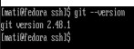

Powyższy zrzut ekranu przedstawia wynik uruchomienia polecenia `git --version`, w wyniku którego wyświetla się wersja zainstalowanego klienta Git. Stanowi to potwierdzenie poprawnego jego zainstalowania.

**2. Instalacja obsługi kluczy SSH**

- Aby włączyć obsługę kluczy SSH należy:
  - zainstalować pakiet OpenSSH przy użyciu polecenia `sudo dnf install openssh-server`
  - uruchomić usługę _**sshd**_ za pomocą polecenia `sudo systemctl enable sshd`, a następnie `sudo systemctl start sshd`

	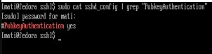

Powyższy zrzut ekranu pokazuje, że autentyfikacja za pomocą publicznego klucza SSH została poprawnie skonfigurowana.

**3. Sklonowanie repozytorium za pomocą HTTPS i personal access token**

- Aby sklonować repozytorium za pomocą HTTPS i PAT należy:
  - przejść do ustawień na swoim koncie GitHub, wybrać _**Developer settings**_, następnie _**Personal access tokens**_, wygenerować nowy token i go skopiować
  - w terminalu wpisać polecenie `git clone https://PAT@github.com/user/repo.git`, gdzie `PAT` to wygenerowany uprzednio token, a `user/repo.git` to ścieżka na GitHub do repozytorium, które chcemy sklonować
  - istnieje także możliwość zapamiętania tokena poprzez klient Git. W tym celu należy wpisać polecenie `git config --global credential.helper store`, a następnie sklonować repozytorium wpisując swój token. Po tym sklonowaniu token zostanie zapamiętany i nie będzie już potrzeby wpisywania go podczas klonowania, wystarczy wtedy polecenie `git clone https://github.com/user/repo.git`. Z racji że token jest w wyniku tego działania zapisywany w zwykłym pliku tekstowym bez zabezpieczeń, nie jest to optymalne rozwiązanie ze względów bezpieczeństwa.
 

 
	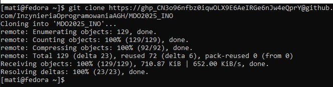

Powyższy zrzut ekranu pokazuje wykonanie polecenia `git clone` przy użyciu HTTPS oraz PAT.

**4. Ustanowienie połączenia między klientem Git a kontem GitHub za pomocą SSH**

- Aby ustanowić połączenie między klientem Git a kontem GitHub należy:
  - wygenerować swój klucz SSH za pomocą wybranego algorytmu szyfrującego, używając polecenia `ssh-keygen -t ed25519 -C "adres.email@domena.com"` 
  - następnie należy wyświetlić klucz publiczny za pomocą polecenia `cat ~/.ssh/id_ed25519.pub` i go skopiować
  - potem w ustawieniach konta GitHub należy wybrać opcję kluczy SSH i dodać skopiowany wcześniej klucz do swojego konta.
- Aby sklonować repozytorium za pomocą SSH należy:
  - na stronie repozytorium na GitHub skopiować jego adres SSH
  - wpisać w terminalu polecenie `git clone git@github.com:user/repo.git`, gdzie _**git@github.com/user/repo.git**_ to skopiowany adres repozytorium

 
	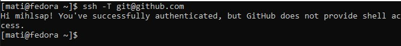

Powyższy zrzut ekranu pokazuje wynik wpisania komendy `ssh -T git@github.com` po poprawnym skonfigurowaniu połączenia SSH między klientem Git, a kontem na GitHub, w wyniku działania którego GitHub zostaje dodany do zaufanych hostów. 

**5. Przełączenie się na gałąź main oraz swojej grupy**

- Aby przełączyć się na gałąź main należy:
  - zmienić katalog w którym się znajdujemy w terminalu na katalog główny sklonowanego repozytorium
  - sprawdzić dostępne gałęzie za pomocą polecenia `git branch -a`
  - przełączyć się na gałąź _**main**_ za pomocą polecenia `git checkout main`, można także pobrać najnowsze zmiany w gałęzi za pomocą polecenia `git pull origin main`
- Aby przełączyć się na gałąź grupy należy:
  - wpisać polecenie `git checkout nazwa_grupy`, gdzie można także pobrać najnowsze zmiany w gałęzi za pomocą polecenia `git pull origin nazwa_grupy`

- Aby utworzyć swoją nową gałąź należy:
  - wpisać polecenie `git checkout -b IN123456`, gdzie _**IN123456**_ to inicjały oraz numer indeksu
  - wpisać polecenie `git branch`, aby upewnić się, czy gałąź została poprawnie utworzona i czy jesteśmy na nią przełączeni

 
	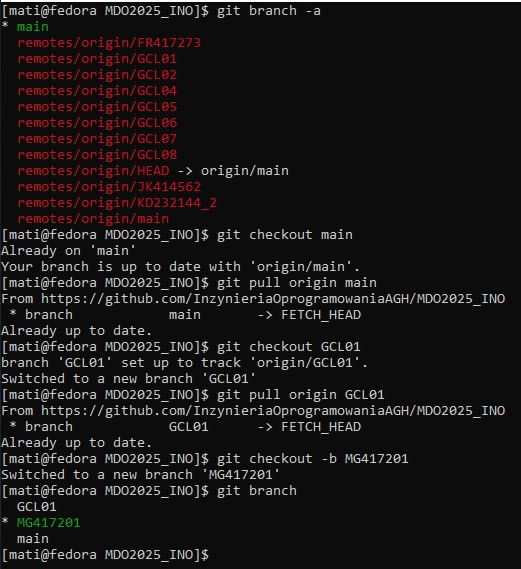

Powyższy zrzut ekranu obrazuje wykonanie wszystkich powyższych kroków z tego punktu.

**6. Utworzenie nowego katalogu w katalogu grupy**

- Aby utworzyć swój nowy katalog należy:
  - zmienić obecny katalog na katalog grupy za pomocą polecenia `cd`
  - utworzyć nowy katalog za pomocą polecenia `mkdir`, nazywając go także swoimi inicjałami i numerem indeksu

 
	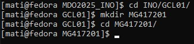

Powyższy zrzut ekranu obrazuje wykonanie powyższych kroków z tego punktu.

**7. Utworzenie Git hooka**

- Aby utworzyć Git hooka należy:
  - w swoim katalogu utworzyć plik _**commit-msg**_ i otworzyć go w edytorze tekstowym, np. nano
  - dodać treść Git hooka, który będzie sprawdzał, czy commit zaczyna się od inicjałów i numeru albumu

 
	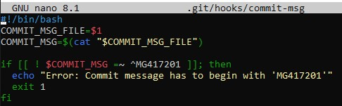

Powyższy zrzut ekranu zawiera treść Git hooka.

**8. Skopiowanie Git hooka do odpowiedniego katalogu**

- Aby Git hook uruchamiał się za każdym razem, gdy wywoływane jest polecenie _**commit**_ należy skopiować go do katalogu `.git/hooks`

 
	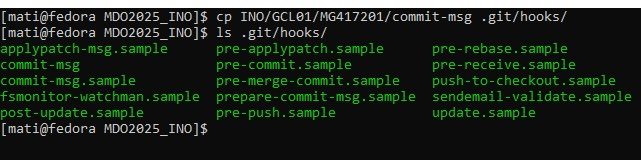

Powyższy zrzut ekranu obrazuje wykonanie powyższego podpunktu.

**9. Utworzenie sprawozdania i dodanie zrzutów ekranu jako inline**

- Aby utworzyć sprawozdanie w formacie markdown należy użyć polecenia `nano sprawozdanie.md`, a następnie je zapisać, w wyniku czego zostanie utworzony plik
- Aby dodać zrzut ekranu jako inline należy w sprawozdaniu:
  - napisać kod ``
  - można też użyć _**HTML**_, aby zrzuty ekranu były wyśrodkowane:
    `
`
      ``
    `
`

	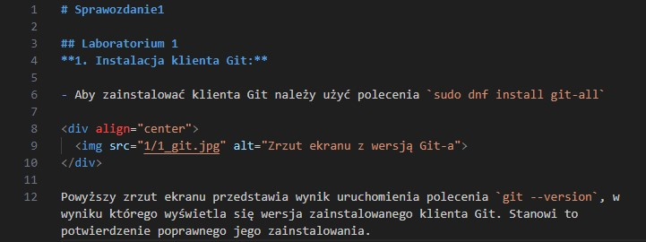

Powyższy zrzut ekranu zawiera fragment kodu sprawozdania, zawierający kod odpowiedzialny za dodanie zrzutów ekranu jako inline za pomocą _**HTML**_.

**10. Wysłanie zmian do zdalnego źródła**

- Aby wysłać zmiany do zdalnego źródła należy użyć poleceń:
  - `git add .`, które dodaje wszystkie zmiany w katalogu do obszaru staging 
  - `git commit -m "message"`, które zapisuje dodane zmiany lokalnie w historii repozytorium z podanym opisem
  - `git push origin branch`, wysyła zmiany do zdalnego repozytorium na wskazaną gałąź

  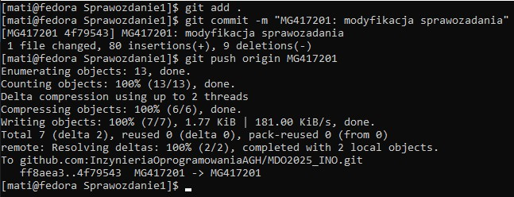

Powyższy zrzut ekranu obrazuje powyżej opisane polecenia.

**11. Wciągnięcie swojej gałęzi do gałęzi grupowej**

- Aby wciągnąć swoją gałąź do gałęzi grupowej należy użyć poleceń:
  - `git checkout group_branch`, które przełącza się na gałąź grupową
  - `git merge own_branch`, które scala zmiany z własnej gałęzi do gałęzi grupowej
  - `git push origin group_branch`, które wysyła zmiany w gałęzi grupowej do zdalnego repozytorium
  

  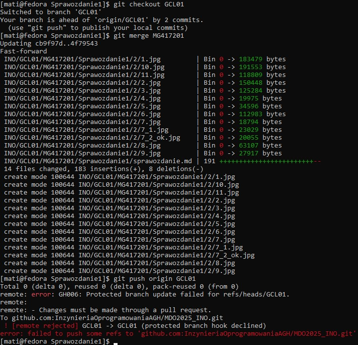

Powyższy zrzut ekranu obrazuje powyżej opisane polecenia, ponieważ gałąź grupowa jest chroniona, push został odrzucony.

***
## Laboratorium 2

**1. Instalacja Dockera w systemie linuskowym**

- Aby zainstalować Dockera należało użyć poleceń:
  - `sudo dnf install -y dnf-plugins-core`
  - `sudo dnf config-manager --add-repo https://download.docker.com/linux/fedora/docker-ce.repo`
  - `sudo dnf install -y docker-ce docker-ce-cli containerd.io docker-compose-plugin`
- Po pomyślnej instalacji Dockera należy go włączyć za pomocą polecenia `sudo systemctl enable --now docker`
- Można także sprawdzić, czy działa sprawdzając jego wersję za pomocą polecenia `sudo docker version`

  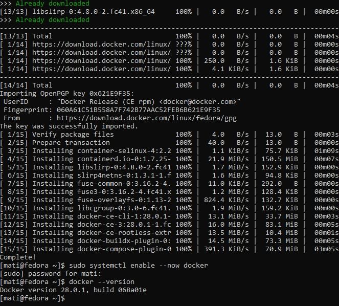

Powyższy zrzut ekranu przedstawia wykonanie powyższych poleceń.

**2. Pobranie obrazów**

- Aby pobrać obrazy _**hello-world**_, _**busybox**_, _**ubuntu**_ oraz _**mysql**_ należy użyć polecenia `docker pull` uzupełniając je o nazwę pobieranego obrazu
- Poleceniem `docker images` można sprawdzić, jakie obrazy zostały pobrane

  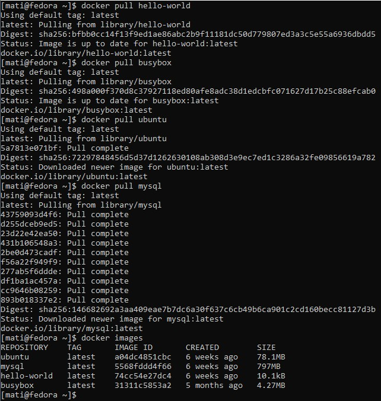

Powyższy zrzut ekranu obrazuje działanie wymienionych poleceń.

**3. Uruchomienie kontenera z obrzu _**busybox**_**

- Aby uruchomić kontener z obrazu _**busybox**_ należy użyć polecenia `docker run --rm busybox`, gdzie `--rm` odpowiada za wyłączenie kontenera po zakończeniu jego działania
- Aby uruchomić kontener interaktywnie należy użyć polecenia `docker run --rm -it busybox`, gdzie `-it` zapewnia jego interaktywne działanie. Aby wywołać numer wersji podczas jego działania należy użyć polecenia `busybox --help`

  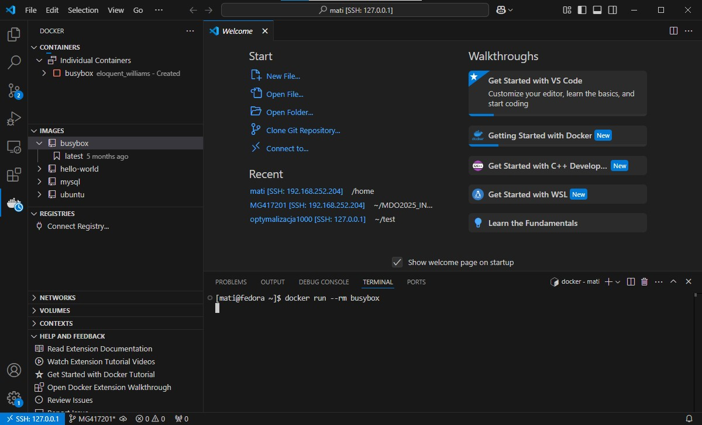

Powyższy zrzut ekranu obrazuje polecenie użyte do uruchomienia kontenera _**busybox**_ oraz efekt jego uruchomienia.

  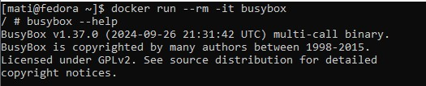

Powyższy zrzut ekranu obrazuje interaktywne uruchomienie kontenera _**busybox**_.

**4. Uruchomienie kontenera z obrazu _**ubuntu**_**

- Aby uruchomić kontener z obrazu ubuntu należy użyć polecenia `docker run --rm -it ubuntu`.
- Żeby zaprezentować _**PID1**_ w kontenerze należy wywołać w nim polecenie `ps aux`, natomiast aby wyświetlić procesy dockera na hoście należy użyć komendy `ps aux | grep docker`
- Aktualizacji pakietów dokonuje się za pomocą polecenia `apt update -y && apt upgrade -y`

  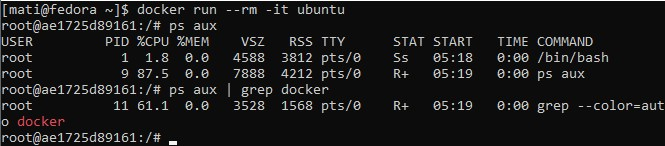

Na powyższym zrzucie ekranu zaprezentowany jest _**PID1**_ oraz procesy dockera na hoście.

  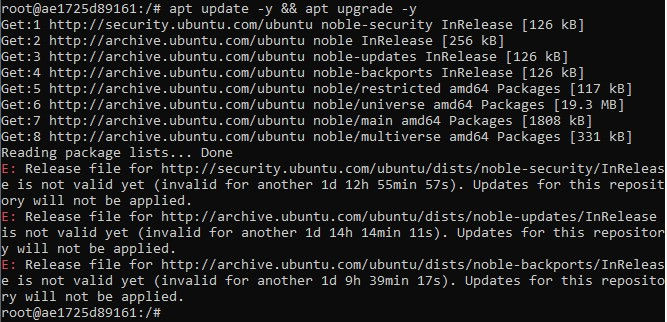

Powyższy zrzut ekranu obrazuje aktualizację pakietów.

**5. Stworzenie, zbudowanie i uruchomienie własnego _**Dockerfile**_**

- Aby stworzyć własny plik _**Dockerfile**_ bazujący na ubuntu i sklonować repozytorium przedmiotowe należało napisać poniższą treść:

  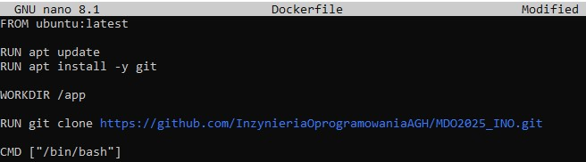

W pliku widocznym na powyższym zrzucie ekranu ukazany jest _**Dockerfile**_, który bazuje na ubuntu. Jest w nim przeprowadzana aktualizacja pakietów oraz instalacja klienta Git, jako katalog roboczy ustawiany jest katalog _**/app**_, a następnie klonowane jest repozytorium przedmiotowe i ustawia uruchomienie powłoki bash jako domyślne działanie po uruchomieniu kontenera.

- Aby zbudować własny obraz należy użyć polecenia `docker build -t name path`, gdzie name to nazwa tworzonego obrazu, a path to ścieżka, gdzie ma zostać utworzony obraz
- Aby go potem uruchomić w trybie interaktywnym należy wykorzystać komendę `docker run --rm -it name`
- Żeby sprawdzić, czy repozytorium zostało pobrane należy wypisać zawartość katalogu roboczego _**/app**_ za pomocą polecenia `ls /app/`

  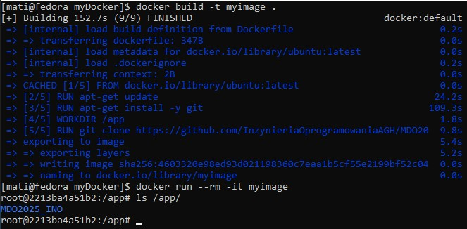

Na powyższym zrzucie ekranu widać wykonanie powyższych kroków.

**6. Wyświetlenie i wyczyszczenie uruchomionych kontenerów**

- Aby wyświetlić uruchomione kontenery należy użyć polecenia `docker ps -a`
- Aby je wyczyścić należy użyć polecenia `docker rm $(docker ps -aq)`

  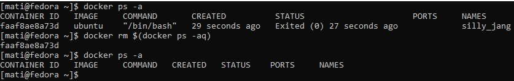

Powyższy zrzut ekranu obrazuje działanie poleceń wykorzystanych do wyświetlenia i wyczyszczenia uruchomionych kontenerów.

**7. Wyczyszczenie obrazów**

- Aby wyczyścić obrazy należy użyć polecenia `docker rmi $(docker images -q)`

  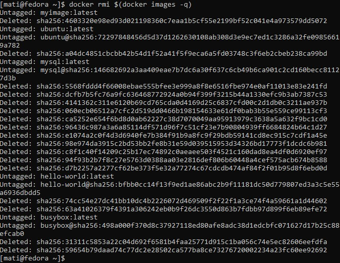

Na powyższym zrzucie ekranu zaprezentowane jest działanie polecenia użytego do wyczyszczenia obrazów.

**8. Dodanie pliku _**Dockerfile**_ do folderu _**Sprawozdanie1**_ w repozytorium**

- Aby dodać plik _**Dockerfile**_ do folderu _**Sprawozdanie1**_ w repozytorium należało skopiować go do tego folderu, a następnie wykonać polecenia `git add`, `git commit` oraz `git push`

  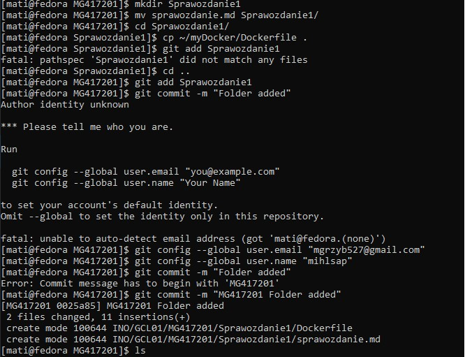

Powyższy zrzut ekranu przedstawia polecenia użyte w celu dodania pliku _**Dockerfile**_ do folderu _**Sprawozdanie1**_ w repozytorium.

***
## Laboratorium 3
**1. Wybór oprogramowania na zajęcia**

- W trakcie zajęć korzystaliśmy z _**irssi**_ oraz _**node-js-dummy-test**_, natomiast do samodzielnej pracy wybrałem oprogramowanie _**redis**_, będące bazą danych NoSQL.

**2. Instalacja oprogramowania**

- Aby zainstalować wymienione w poprzednim punkcie oprogramowanie należało sklonować je za pomocą polecenia `git clone`.

  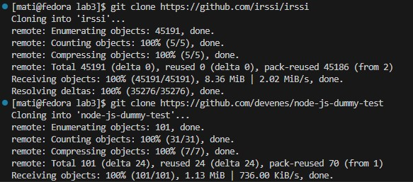

  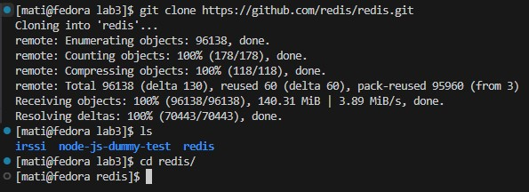

- Po sklonowaniu repozytoriów należało przeprowadzić build, zainstalować wszystkie potrzebne zależności oraz przeprowadzić testy:
  - Dla _**irssi**_ należało:
    - Zainstalować manualnie wszystkie brakujące zależności, a następnie użyć poleceń:
    - `meson Build`, aby przeprowadzić build
    

      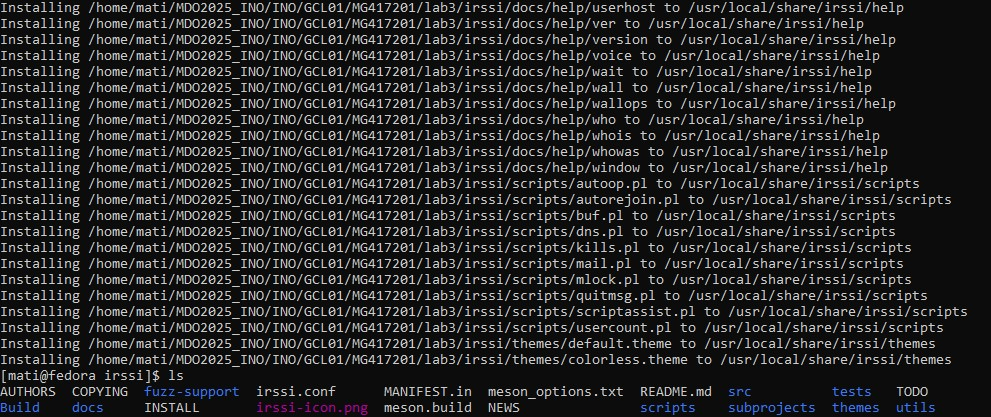
    

    - `ninja -C Build && sudo ninja -C Build install`

    - `ninja test`, aby przeprowadzić testy
    

      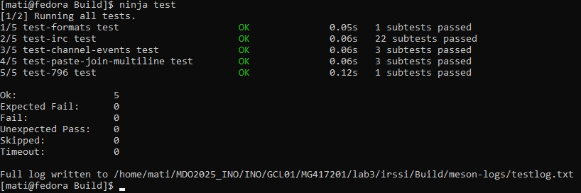
    

  - Dla _**node-js-dummy-test**_:
    - `npm install`, aby zainstalować wszystkie potrzebne zależności
    

      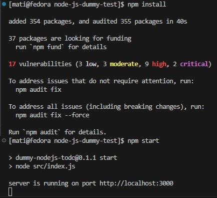
    

    - `npm start`, aby uruchomić program
    

      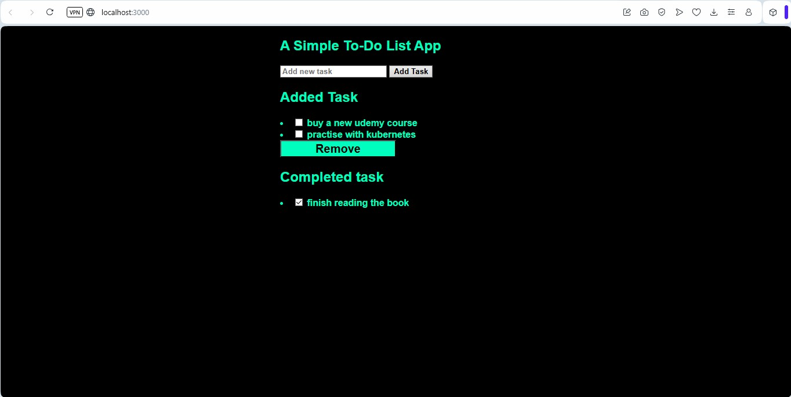
    

    - `npm test`, aby przeprowadzić testy
    

      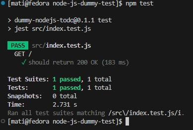
    

  - Dla _**redis**_:
    - `sudo dnf install gcc make jemalloc-devel tcl`, aby zainstalować potrzebne zależności
    - `make`, aby przeprowadzić build programu
    

      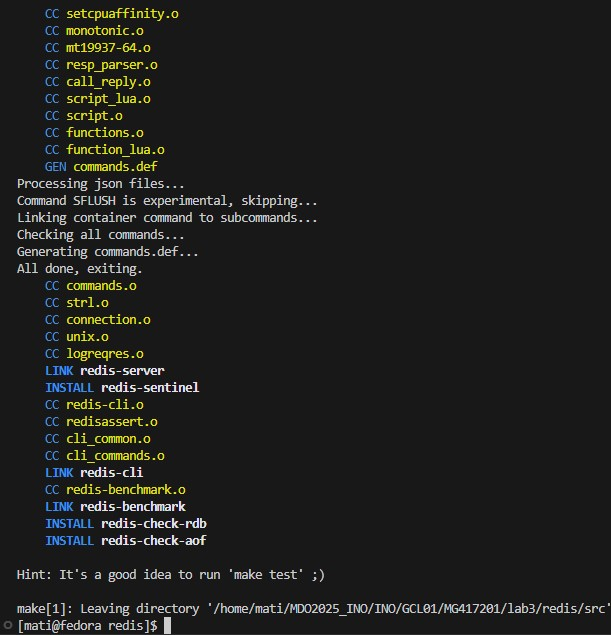
    

    - `make test`, aby przeprowadzić testy
    

      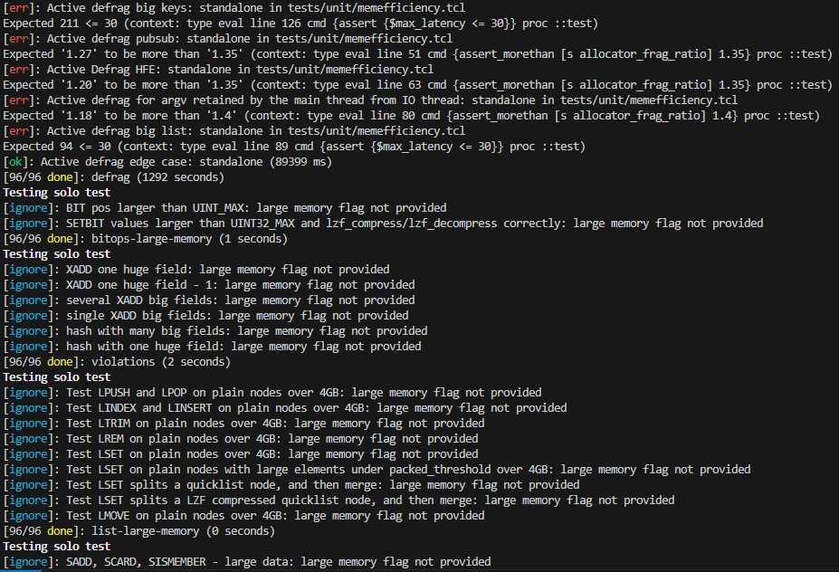
    

**3. Przeprowadzenie buildu w kontenerze**

***
## Laboratorium 4
